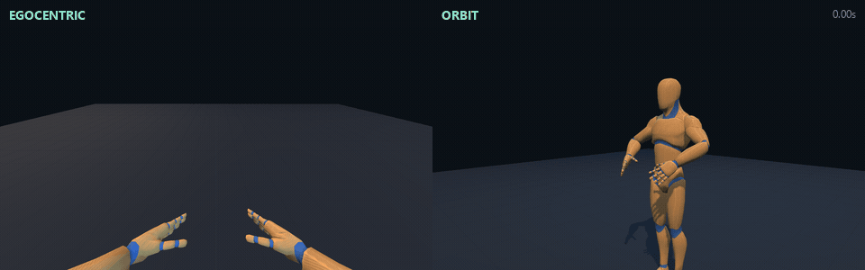
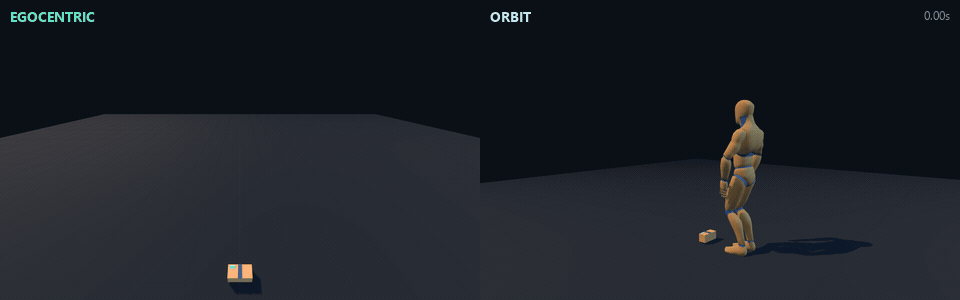
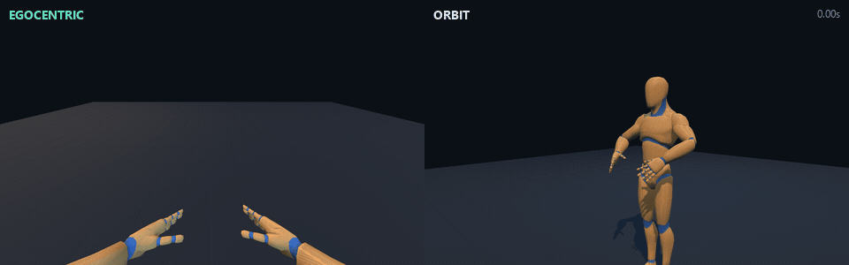
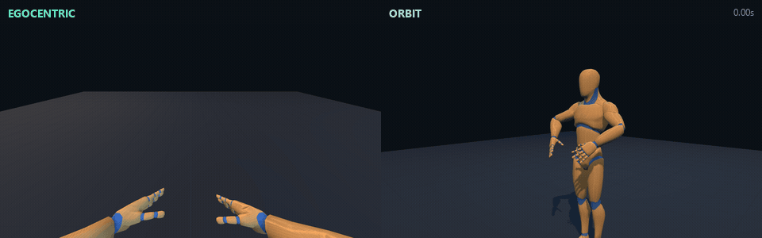
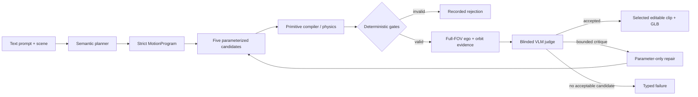

# Rigby

Rigby is an agentic, constraint-aware proof of concept for turning natural-language instructions into editable humanoid animation. It plans a typed motion program, expands it through deterministic smart primitives, compiles a full-body clip, rejects structurally or physically invalid candidates, and uses a calibrated visual-language-model (VLM) loop to choose the best remaining motion from egocentric and orbit evidence.

This revision is an end-to-end authoring system rather than a direct text-to-joint-rotation model. The language model selects semantics; audited local code owns trajectories, anatomy, contacts, limits, verification, playback, and GLB export.

> **Status:** research POC. Rigby has a useful procedural vocabulary and a fully inspectable generation loop, but it is not yet a general text-to-motion model and should return a typed failure for motions outside its implemented contracts.

## Launch after cloning

Install Python 3.12, [`uv`](https://docs.astral.sh/uv/), Node.js 20.19+, npm, and Google Chrome. From the repository root, run:

```powershell
Set-Location rigby-poc
Copy-Item .env.example .env  # Add OPENAI_API_KEY to this file
uv sync --extra dev --link-mode copy
Set-Location frontend
npm ci
npm run build
Set-Location ..
uv run rigby-poc
```

Open [http://127.0.0.1:8000](http://127.0.0.1:8000).

## Example results

Each recording below replays the same saved clip in the 94-degree egocentric camera used by the judge and in a diagnostic orbit camera. The GIFs are documentation artifacts; the original clips run at 30 FPS and remain editable in Motion Studio.

### Left hook

Prompt: `throw a left hook`


### Right jab

Prompt: `throw a right jab`



### Step over a hurdle

Prompt: `step over the hurdle with your right foot`



### Multi-phase hang-ten

Prompt: `Throw up a "hang-ten" sign with your right hand, there should be a swift motion up to the main position wherein the middle three fingers are as contracted as possible, the wrist should then shake rapidly back and forth a few times, before returning to default`



### Ordered fingertip counting

Prompt: `use your right thumb to one by one count each of the fingers on your right hand (while looking at it)`



The exact result IDs, prompts, durations, and GIF settings are preserved in [the demo manifest](rigby-poc/docs/media/demo-manifest.json).

## The pipeline



One click on **Generate 5 & choose** starts a persistent run whose events arrive in Motion Studio while the pipeline is working. A page reload reconnects to the same run. Planning, proposal generation, structural checks, evidence capture, VLM scores, repair, and final selection remain visible instead of being collapsed into a spinner.

### 1. Understand the instruction

The planner receives the prompt and a typed `SceneManifest`. Its output is a validated `MotionProgram`, not animation frames. The program identifies:

- intent, active hand or hands, objects, and optional ordered sub-actions;
- a phase graph made from a fixed `PrimitiveKind` vocabulary;
- task-space effector targets and body targets;
- hand shape, timing, trajectory, and bounded style parameters;
- deterministic assertions that define success.

The default lightweight OpenAI route uses `gpt-5.6-luna`; a repair or configured fallback can use `gpt-5.6-terra`. `provider: "offline"` invokes the deterministic parser and makes no model call. Local capability parsing remains authoritative when the model contradicts a clearly implemented action.

Motion-bearing verbs pass through an action-semantic layer before primitive expansion. This layer translates the observable meaning of an action, rather than merely extracting a pose or hand shape. For example, `wave hello` becomes an open-hand setup, three frontal side-to-side cycles with explicit direction reversals, and recovery. The same typed wave contract handles left, right, or both hands; size, speed, and repetition language; and concurrent prompts such as `walk forward while waving`. Beckoning uses the same reusable cyclic-action representation with a sagittal trajectory. Model output that collapses either action into a static palm is rejected during semantic validation.

Each interpreted action may also attach deterministic motion obligations to its program. The compiler measures these on the resulting trajectory - in the wave case, shoulder-relative excursion and reversal count - so candidate generation and repair cannot silently erase the defining motion. This is the extension point for future vocabulary: add a language recognizer, a typed phase template, and task-specific measurable obligations, while keeping joint rotations and physical truth out of the language model.

Dexterous language uses the same contract at digit scale. An ordered request such as `count each finger with your right thumb while looking at it` becomes a presented hand, typed thumb-to-index/middle/ring/little contacts, an open separation between every contact, concurrent gaze at the active hand, and recovery. The rig compiler uses calibrated articulated-finger poses, measures exact fingertip leaf-pivot distances and contact order, and verifies the head-mounted gaze angle. Incidental words such as `looking` therefore cannot replace the requested hand action with a head-only pose, while candidate generation and repair must preserve the contacted digits and their order.

### 2. Expand smart primitives

The planner selects meaning while the local primitive layer supplies executable structure. Current intent families are:

| Family | Implemented contract | Typical phases |
| --- | --- | --- |
| Gestures | One-handed hand shapes, presentation, holds, forearm-axis shake, and recovery | `present`, `hold`, `shake`, `recover` |
| Social actions | Greeting waves and beckoning with typed setup, trajectory plane, repetitions, active hands, measurable reversals, and recovery | `move`, `cycle`, `recover` |
| Dexterous actions | Ordered same-hand thumb/fingertip contacts, contact-release sequencing, concurrent hand gaze, and measured contact/gaze assertions | `move`, `recover` |
| Grasp | Reach and contact with the default block, articulated closure, lift, hold, and return | `reach`, `preshape`, `contact`, `close`, `lift`, `hold`, `recover` |
| Strikes | Hooks, jabs, crosses, and uppercuts with side, guard, load, impact path, follow-through, and recovery | `guard`, `load`, `strike`, `follow_through`, `recover` |
| Composite arms | One- or two-hand task-space paths, circular or oscillating cycles, per-effector orientation, and shared relational constraints | `move`, `cycle`, `recover` |
| Object interactions | Throw, catch, push, pull, roll, spin, place, drop, and handoff lifecycles against scene objects | `windup`, `release`, `flight`, `receive`, `absorb`, `move`, `recover` |
| Full body | Step, walk, run, turn, crouch, jump, kick, dance, climb, rotations, floor poses, plank/push-up-style poses, and obstacle-aware travel | `body`, `recover` |
| Sequences | Up to eight executable, non-nested steps with state continuity between them | child programs |

This is a procedural grammar, not evidence that every possible wording or combination is solved. New behavior belongs in a named primitive with explicit parameters and tests rather than in an unbounded prompt that writes rotations.

### 3. Compile motion

The compiler converts task-space phases to 30 FPS rest-relative local bone deltas:

- analytic two-link IK positions shoulders, elbows, wrists, hips, knees, and feet;
- all five digits are articulated independently for semantic hand shapes and contact;
- gait, support, obstacle, root, and recovery targets are composed on the full humanoid;
- object interaction state is propagated through sequences;
- MuJoCo supplies contact-driven pickup for the calibrated block proxy;
- the source humanoid is calibrated through a versioned rig profile rather than hard-coded source-bone assumptions.

Clip quaternions are XYZW local deltas relative to the GLB rest pose. Export composes `source_rest * clip_delta`. The application uses glTF `+Y` up and a rig forward axis of `+Z`; the MuJoCo proxy uses `+Z` up and `-Y` forward, with an explicit proper-rotation conversion in each direction.

### 4. Reject invalid candidates before vision

The deterministic layer is the authority for facts that can be measured. Depending on intent, it checks:

- finite transforms, joint ranges, per-frame discontinuity, angular velocity, acceleration, and jerk;
- arm/torso self-collision, wrist and forearm limits, hand visibility, and finger assertions;
- foot contact, support-foot sliding, ground penetration, root recovery, final balance, and obstacle clearance;
- requested cycle count, travel distance, body orientation, pose depth, support mode, and climb contacts;
- object lift, table separation, opposing digit contacts, slip, penetration, landing, ownership transfer, and teleport-sized steps;
- exact task-specific relationships such as strike paths or paired-forearm separation and phase ordering.

A failed metric is stored with the candidate and never becomes a visual pass. The VLM is reserved for qualities that are difficult to encode numerically: semantic readability, recognizable staging, anatomical naturalness, timing, and cross-view consistency.

### 5. Generate five meaningfully different candidates

Rigby applies named, bounded recipes to the same semantic program. Recipes vary task-relevant dimensions such as reach path, arm height/depth, lateral offset, elbow swivel, wrist orientation, torso participation, timing, trajectory amplitude, cycle count, object arc, or whole-body intensity.

Candidate diversity is checked using motion hashes and perceptual descriptors. Exact duplicates and candidates below every separation threshold are rejected or replenished before the visual batch is assembled. The five-way judge therefore receives actual motion alternatives rather than five seeds that compile to the same clip.

### 6. Capture complete visual evidence

Every rankable candidate is replayed at phase-aware times in two raw 1600×900 views:

- **Egocentric:** a 94-degree vertical field of view aligned with the calibrated rig-forward direction. The full canvas is preserved so raised or extended hands cannot be cropped out before judging.
- **Orbit:** a task-aware external view that exposes handedness, self-contact, foot support, obstacle clearance, and body/object relationships that may be ambiguous in first person.

Evidence manifests include the prompt, timestamps, camera contract, image hashes, and objective motion diagnostics. The judge receives blinded candidate identities and chronological contact sheets, not recipe names or hidden acceptance labels.

### 7. Judge, repair once, and stop safely

The calibrated VLM scores semantic match, recognizability, anatomy, temporal readability, egocentric visibility, cross-view consistency, and overall quality. The release threshold requires at least 4/5 on the core dimensions.

If no candidate passes, the judge may return one schema-constrained repair patch. Repairs can adjust bounded parameters such as staging, phase duration, easing, task-space offsets, wrist/forearm presentation, body scale, or object arc; they cannot change the intent, hand, phase order, primitive vocabulary, or safety limits. The normal product route allows at most two rounds and four judge/repair model calls. Exhaustion returns `no_acceptable_candidate` rather than selecting a known failure.

Human ratings are not part of current generation. The final frozen 10-pair calibration achieved 9/10 VLM-human agreement and 10/10 A/B order consistency; the 28-case corruption suite produced zero false accepts. A compact immutable record is checked into [the calibration evidence](rigby-poc/docs/evidence/frozen-judge-calibration.json). This validates the judge as an automated POC proxy, not as a substitute for broader user research.

### 8. Edit, inspect, replay, and export

The selected clip opens directly in Motion Studio. The UI provides synchronized egocentric/orbit playback, timeline scrubbing, prompt and phase inspection, metrics, parameter controls, provenance, result history, and GLB export. Parameter changes recompile through local code without another planning call.

## Configuration

| Variable | Purpose |
| --- | --- |
| `OPENAI_API_KEY` | Enables OpenAI planning, judging, and repair |
| `OPENAI_PLANNER_MODEL` | Semantic planning model; lightweight default is Luna |
| `OPENAI_REPAIR_MODEL` | Planner fallback/repair model |
| `OPENAI_JUDGE_MODEL` | Primary VLM judge |
| `OPENAI_JUDGE_FALLBACK_MODEL` | Used only for an uncertain or inconsistent visual decision |
| `OPENAI_JUDGE_REASONING_EFFORT` | Judge reasoning budget |
| `OPENAI_JUDGE_IMAGE_DETAIL` | Image input detail level |
| `OPENAI_JUDGE_MAX_IMAGE_DIMENSION_PX` | Downscaled model payload limit; raw evidence remains 1600×900 |
| `RIGBY_PLANNER_MODE` | `openai` or `offline` default route |
| `RIGBY_RESULTS_DIR` | Result and persistent pipeline-run directory |

## HTTP contracts

| Endpoint | Purpose |
| --- | --- |
| `GET /api/v1/health` | Version, provider readiness, and model routing without exposing secrets |
| `GET /api/v1/assets` | Asset provenance |
| `GET /api/v1/assets/rig-profile` | Canonical-to-source bone map and rig axes |
| `POST /api/v1/plan` | Prompt + scene + provider → strict `MotionProgram` |
| `POST /api/v1/compile` | Program + scene + overrides → verified `ClipResult` |
| `POST /api/v1/export` | Persisted result ID → animation GLB |
| `GET /api/v1/results` | Sequential result archive |
| `GET /api/v1/results/{id}` | Complete request, scene, program, clip, metrics, and provenance |
| `GET /api/v1/results/{id}/animation.glb` | Persisted GLB |
| `POST /api/v1/pipeline-runs` | Start an asynchronous best-of-five run |
| `GET /api/v1/pipeline-runs/{id}` | Poll its persistent event trace and terminal winner/failure |

The Pydantic contracts reject unknown fields. See [models.py](rigby-poc/src/rigby_poc/models.py) for the canonical schema rather than treating README examples as an alternate definition.

## Persistence and reproducibility

Each ordinary result is stored as:

```text
results/000001-prompt-slug/
├── request.json
├── scene.json
├── program.json
├── clip.json
├── metrics.json
├── provenance.json
└── animation.glb        # successful clips only
```

Each autonomous run adds `results/pipeline-runs/<run-id>/run.json` and an `artifacts/` tree containing candidate programs, evidence manifests, VLM judgments, repairs, and `flywheel-trace.json`. Writes are atomic so a reload observes either the previous complete record or the next complete record.

`results/`, `.env`, caches, and temporary captures are intentionally ignored by Git: they are large, machine-specific, and can contain model response metadata. The PR includes source, tests, compact calibration evidence, and curated demo media instead.

Every clip records the rig, source asset, compiler and physics versions, planner provider/model/call count, seed, physics model, and coordinate frames. Deterministic offline programs can be regenerated from the scene/program/seed; model-backed planning is inspectable but not assumed byte-for-byte reproducible.

## Verification

Run the local regression suite:

```powershell
Push-Location rigby-poc
uv run pytest -q
Push-Location frontend
npm test
npm run build
Pop-Location
```

The tests cover schema strictness, arbitrary-prompt capability routing, action sequences, gesture and strike anatomy, composite trajectories, paired-arm relationships, full-body support and obstacles, free-object contact, object interaction lifecycles, coordinate orientation, capture contracts, candidate diversity, bounded repair, judge calibration, persistent results, and GLB validity.

The higher-cost release audit uses existing public pipeline runs and the frozen calibration:

```powershell
uv run python -m evals.autonomous_goal_audit
```

That audit is intentionally not a clean-checkout unit test: it expects the local result archive and model-backed smoke evidence described in [the evaluation guide](rigby-poc/docs/evaluation.md).

## Regenerating the README GIFs

Start the server with the corresponding saved results available, then run:

```powershell
Push-Location rigby-poc
uv run python -m evals.render_demo_gif 006012-throw-a-left-hook docs/media/left-hook.gif
uv run python -m evals.render_demo_gif 006260-throw-a-right-jab docs/media/right-jab.gif
uv run python -m evals.render_demo_gif 006277-step-over-the-hurdle-with-your-right-foot docs/media/step-over-hurdle.gif
uv run python -m evals.render_demo_gif 005970-throw-up-a-hang-ten-sign-with-your-right-hand-th docs/media/hang-ten.gif
uv run python -m evals.render_demo_gif 006339-use-your-right-thumb-to-one-by-one-count-each-of docs/media/finger-count.gif
```

The renderer samples the whole clip at 8 FPS, reuses the production capture page, verifies every raw canvas is 1600×900, combines 480-pixel-wide ego/orbit panels, and encodes a 96-color looping GIF with FFmpeg.

## Repository map

```text
rigby-poc/
├── assets/                 calibrated humanoid GLB
├── config/                 rig profile and versioned quality thresholds
├── docs/                   research, evaluation, flywheel, evidence, and media
├── evals/                  capture, VLM flywheel, calibration, audits, and reports
├── frontend/               Vite + TypeScript + Three.js Motion Studio
├── src/rigby_poc/          planner, primitives, compiler, physics, judge, API, export
├── tests/                  deterministic backend regression suite
├── acceptance_criteria.yaml
├── pyproject.toml
└── uv.lock
```

## Design boundaries and known limitations

- Motion quality is procedural. It does not yet have a learned in-betweener for natural secondary motion or stylistic diversity.
- The shipped rig profile targets one humanoid asset. Retargeting contracts exist, but multiple production rigs have not been certified.
- The capability parser is broad but finite. Unseen sports, tools, acrobatics, multi-character contact, and fine dexterous manipulation may be unsupported or approximate.
- Deterministic gates are task-specific and must grow with every primitive; the VLM cannot make an unsupported physics claim true.
- MuJoCo proves the calibrated block pickup with contactable digit proxies. Other interaction families currently use typed kinematic/object-state contracts and should not be described as general-purpose dexterous simulation.
- The VLM judge is calibrated on a small corruption and preference set. Cost, model drift, and blind spots remain product risks.
- The current asynchronous API is single-machine POC infrastructure, not a distributed job system.

The next justified investment is not unrestricted generation. It is expanding versioned primitives, scene affordances, rig coverage, and held-out evaluation until failures can be cleanly separated into semantic, contact, retargeting, camera, and interpolation categories. A learned MotionBricks-style in-betweener becomes worthwhile only when interpolation/naturalness is the measured bottleneck and contact-rich egocentric data is available.

## Research and evaluation

The architectural rationale and staged investment gates are in [research-and-roadmap.md](rigby-poc/docs/research-and-roadmap.md). The current autonomous selection contract is in [vlm-flywheel.md](rigby-poc/docs/vlm-flywheel.md), and the release checks are in [evaluation.md](rigby-poc/docs/evaluation.md).

The design draws most directly from smart-primitive authoring, object-relative constraints, egocentric task-space data, executable motion verification, multi-sample self-consistency, and a render/judge/repair flywheel. The research synthesis explains what was adopted, what was deliberately deferred, and why Rigby keeps physical and structural truth outside the language model.
