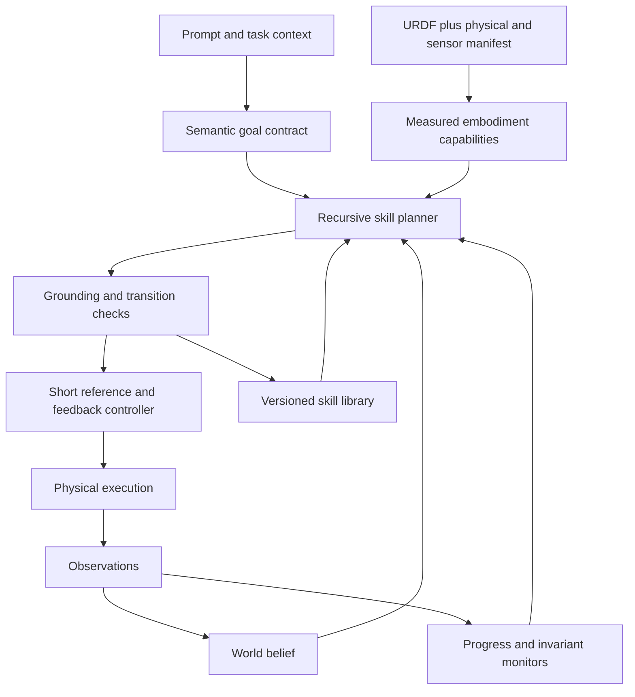

# Rigby: capability audit and research plan

**Review date:** 11 September 2026, America/Toronto.
**Code examined:** cfbe16e90544fc22b3acc9d95ce7b2d9cc6a24ba.
**Audience:** research collaborators; simulation-first research and demonstrations.
**Evidence:** implementation, tests, recorded artifacts, fresh offline simulations, and primary research sources.

## 1. Recommendation

Make Rigby's central research question:

> Can a shared semantic description of an action automatically produce executable, reusable skills for previously unseen robot structures, and can those skills compose reliably into long-horizon physical tasks?

This is a strong direction. The existing any-robot pipeline already separates body-independent meaning from measured geometry and body-specific motion. That separation is the most relevant foundation for the proposed research. However, **complete embodiment independence is a research objective, not a capability established by the current repository**.

The most defensible prospective contribution combines three things: a Talmy-inspired action representation with explicit physical meaning; automatic generation and validation of implementations for new morphologies; and recursive skills whose preconditions, transitions, observations, and recovery behavior remain meaningful across bodies. Each part needs an ablation. Naming linguistic categories, generating trajectories, and composing hierarchical skills already have substantial precedent.

Prioritize reliable fixed-world manipulation and compositional execution before training a universal low-level model. Then add mobile embodiments through an explicit controller interface. A learned tracker becomes valuable when controlled experiments show a gap that the current analytic controller cannot close efficiently.

The flagship demonstration should be **the same cleanup instruction in an unchanged physical scene, performed by three structurally different mobile manipulators, with the live skill tree, recovery behavior, and independent goal measurements visible**. Start with a small, measurable cleanup task. An open-ended “clean the room” demonstration should follow demonstrated component reliability.

## 2. What Rigby actually contains

The repository contains several related systems. Their capabilities should not be pooled into an implied single general-purpose robot.

| System | Implemented capability | What the evidence supports | Main boundary |
|---|---|---|---|
| Shared core | Typed contracts, hashing, artifact storage, jobs, motion compilation and controller interfaces | Useful infrastructure for reproducible execution and evidence | Infrastructure tests do not establish robot competence |
| Humanoid motion authoring | Semantic planning, procedural/IK motion, gestures, fingers, strikes, object interactions, short sequences, full-body animation, editable GLB/Motion Studio | Broad expressive motion vocabulary and an inspectable generation pipeline | Canonical humanoid assumptions; animation is not general physical locomotion |
| Humanoid candidate judging | Deterministic checks, candidate generation, full-field visual evidence, VLM selection and bounded repair | A developed evaluation harness | Later recorded calibration does not support trusting the VLM as a general success detector |
| Any-robot | URDF/MJCF ingestion, morphology measurement, semantic schemas, grounding, baking, simulation gates, exact retrieval and typed refusal | Strongest embodiment-transfer foundation; six generated fixed-base robots and third-party ingestion tests | Fixed-base scope; closed semantic inventory; incomplete contact reliability |
| General contact/world trials | Grasp scenes, contact validation, environment-specific execution and fitted scenes | Some physically simulated manipulation succeeds | World fitting changes object dimensions, mass and placement across robots |
| Gripper closed loop | Torque-driven arm/jaws, visual localization, sensed goals, event-driven control and optional VLM direction | Useful feedback-control prototype with recorded pick/place runs | Specialized two-finger arm assumptions and a declared sensor/scene contract |
| Humanoid v2 | Physical free-root humanoid, acceptance diagnostics, scene packs, skill-library/RAG and benchmark/study machinery | Measured button/drawer evidence and explicit failure cases | Many acceptance goals remain partial; study and benchmark fixtures are not completed research experiments |
| Superprimitives | Named grab/pinch/release schedules with contact ordering and observable-step verdicts | Useful beginnings of skill contracts | Flat humanoid-specific catalog; no arbitrary recursive skill execution |
| Demo/evidence tooling | Registry, browser galleries, provenance manifests, golden corpus, replay and capture checks | Strong material for making results inspectable | Historical media and current execution must remain separately identified |

Primary implementation entry points: [core][core], [humanoid][human], [any-robot][any], [v2 completion audit][v2audit], [superprimitive implementation][supercode], and [demo gallery][gallery].

### 2.1 What “generating new primitives” currently means

The any-robot inventory currently has **26 entries**. A body-independent program specifies relations and qualitative motion attributes. Rigby measures the robot, grounds the program into its workspace, generates candidates, runs simulation checks, and stores accepted records or typed failures.

This generates **new body-specific realizations of an existing semantic vocabulary**. It does not yet demonstrate unrestricted discovery of new semantic operators, new contact strategies, or new controller algorithms. Distinguish these in papers and demos:

1. **Instantiation:** new parameters or trajectories for a known operator on a new body. This exists.
2. **Composition:** a new reusable behavior assembled from known operators. Some flat composition exists; recursive contracts are proposed.
3. **Skill discovery:** a missing behavior acquired through search, optimization or learning and promoted into the library. This is a future research contribution.

The primary offline planner is rule based; the optional model planner is constrained by the inventory. Identical semantic hashes demonstrate representational invariance, but cannot alone demonstrate correct language interpretation. Add independently labeled paraphrases, semantic minimal pairs, negation and reference-frame tests. See [schema contracts][schema], [planner][planner], and [grounding tests][groundtests].

### 2.2 Where embodiment independence stops

The supported morphology classes are fixed-base arms, fixed-base bimanual robots and dexterous effectors. Floating-base bodies are explicitly outside the general certification contract. Importing a novel robot description is not the same as having a balance, propulsion or manipulation controller for it. See [morphology contract][contracts].

The generated zoo varies reach, joint count and end-effector structure, but remains a much narrower distribution than dogs with arms, wheeled bipeds or octopus-like bodies. Third-party tests add important real-model complications: mesh assets, folded rest poses, inner workspace boundaries, inertial defects and collision-hull exceptions. They establish ingestion and measurement behavior, not a cross-body manipulation success rate. See [external-model tests][exotic].

Two implementation details materially affect transfer claims:

- The binder permits region substitution by default. A missing requested region can be replaced by another certified region, and the bound program is updated. This is recorded, but a benchmark must distinguish successful execution of the requested meaning from execution of an accepted alternative. See [binder][binder].
- The world route calls a fitting function that adapts the environment to the robot. An unchanged environment name therefore does not establish an unchanged physical task. See [world fitting][fit] and [application route][app].

### 2.3 Superprimitives and sensing

The existing grab/pinch/release catalog contains valuable semantics: opposition matters; a loaded thumb should precede finger closure; a poke is not a pinch; unobservable conditions remain unverified. However, these are timed schedules over humanoid body parts. The humanoid sequence validator explicitly rejects nested sequences. The tests mostly construct contact-event fixtures. They validate logical interpretation of evidence, not the performance of a live sensor or a recursively learned grasp. See [superprimitive tests][supertests] and [sequence validator][models].

The gripper branch is a useful starting point for feedback-driven execution. Its current sensing path uses rendered visual evidence, fingertip forces, a range measurement and declared/calibrated scene information. The file's older “camera only” introductory text does not describe the current implementation. The model planner also explicitly describes a two-finger robot arm. Both facts matter when presenting these runs as embodiment independent or perception-only. See [sensor implementation][sensor] and [gripper planner][gripperplanner].

Collision policy also needs to accompany physical claims: the gripper solidity tests document exclusions for arm-link/block and self-collisions. A grasp can be physically simulated while the surrounding collision model remains simplified. Audit this before a manipulation-and-locomotion demo. The issue is direct state manipulation, artificial attachment or inappropriate collision exclusions; finite-effort position servos are not inherently invalid physics. See [solidity tests][solidity].

## 3. Fresh verification and strongest existing demonstrations

### 3.1 Checks performed during this review

| Check | Fresh result | Interpretation |
|---|---|---|
| Entire any-robot test suite | **299 passed**, no skips; 72 s | Broad contract/regression coverage, including externally sourced assets present on this host |
| Entire core test suite | **58 passed, 1 failed** | Hash subprocess test fails during Windows imports after replacing the environment with Linux assumptions; no digest mismatch observed |
| Selected humanoid suites | **99 passed, 1 skipped, 3 expected failures, 1 unexpected pass**; 435 s | Semantic, superprimitive, judging, calibration, gripper, physical acceptance and study/benchmark coverage; not the entire humanoid suite |
| Humanoid frontend | **36 passed** across 6 test files | UI logic tests |
| Fresh two-segment embodiment probe | **12/12 leaf bakes accepted; 5/6 composed motions accepted** | Exact requested semantics, no substitution, narrow fresh library |
| Fresh grasp sweep | **3/5 gripper-bearing bodies accepted** | One body-scaled deterministic case per body; not a statistical transfer benchmark |

The unexpected pass is especially easy to misread: it is the Windows-quarantined test asserting that a physically unsuccessful humanoid grasp is **not certified**. Its passing result confirms failure detection, not a successful grasp. The skipped drawer test is the opt-in three-repeat/five-variation robustness run; the basic physical drawer acceptance test passed. The three expected failures are existing closed-loop control issues.

Machine-readable results and raw JUnit outputs are indexed in [verification summary][verification]. No new paid model evaluation or hardware experiment was run. Archived VLM results below were inspected, not regenerated.

### 3.2 Same prompt, six bodies: strongest semantic experiment

The fresh probe used:

> reach out as far as you can and then come back

It ingested each zoo body, freshly baked the exact two requested segments, and ran the complete prompt path. All six produced the same role-normalized semantic hash, and every leaf certified. Five compositions completed with identical deterministic replays. The dual arm was rejected at compilation because the composed track exceeded the limit of left_joint_4.

| Body | Total DOF | Measured reach | Full composition | Reported tracking error | Motion duration |
|---|---:|---:|---|---:|---:|
| Compact arm | 6 | 0.385 m | Accepted | 6.83 mm | 30.51 s |
| Dual arm | 14 | 1.326 m | Joint-limit refusal | — | — |
| Arm with hand | 10 | 1.370 m | Accepted | 14.65 mm | 49.25 s |
| Jaw arm | 8 | 1.320 m | Accepted | 16.63 mm | 47.85 s |
| Long arm | 8 | 2.050 m | Accepted | 16.84 mm | 67.45 s |
| Tool arm | 5 | 1.180 m | Accepted | 12.72 mm | 52.44 s |

This is a useful result for the research direction: shared semantics and individually valid primitives do not ensure valid composition. Transition feasibility should be a first-class research target. The long durations also mean success must be reported with execution time; arbitrarily slow motion can obscure a controller's limitations.

This probe used a deliberately small, fresh exact-region library. It is not a re-evaluation of every historical baked library. Exact repeated simulation establishes reproducibility under that configuration, not robustness to perturbations. See [probe data][probe] and [reproduction script][probescript].

The [historical zoo manifest][zoomedia] has six clip rows for the same prompt and one semantic hash. Its aggregate robot count incorrectly says one because the builder counts unique hashes in both fields. The fresh probe independently recomputes the count. Correct the summary generator before using that number in a figure.

### 3.3 Manipulation: real progress, still narrow

The fresh sweep successfully held/lifted objects with the compact, jaw and long arms. The dual arm and multifinger hand failed the carried-object checks.

| Body | Block width | Measured lift | Grip force | Verdict |
|---|---:|---:|---:|---|
| Compact arm | 17.6 mm | 41.3 mm | 5.0 N | Accepted |
| Dual arm | 39.6 mm | 77.2 mm | 0 N | Dropped / not carried |
| Arm with hand | 30.7 mm | 27.0 mm | 0 N | Dropped / not carried |
| Jaw arm | 47.9 mm | 113.6 mm | 25.4 N | Accepted |
| Long arm | 72.6 mm | 173.3 mm | 35.5 N | Accepted |

Object masses vary too. These are reach/aperture/payload-normalized tasks, useful for development but unsuitable as evidence for “same environment, only the body changed.” Lift alone is not sufficient: the failed trials illustrate why sustained support, transport and final placement must be measured separately. Successful cases had reported maximum penetration below 0.6 mm. See [grasp measurements][graspdata] and [grasp sweep implementation][graspscript].

The humanoid v2 drawer test is among the strongest existing physical tests: measured travel of at least 0.22 m, bounded penetration, and no hidden direct object actuation/state writes. The repository also preserves historical button and drawer robustness evidence. Conversely, several “production” grasp/container/two-handed tests explicitly verify failure. Keep these as diagnostic evidence rather than presenting green tests as solved tasks. See [drawer test][drawer], [grasp failure test][human-grasp], and [v2 audit][v2audit].

### 3.4 VLM judging: the later calibration governs the claim

The August 9 frozen example records 9/10 pairwise agreements, but always selecting the base clip would also score 9/10 on those labels. Zero false accepts over 28 unary corruption cases has a one-sided 95% binomial upper bound of approximately 10.1%, assuming independent representative trials. It does not establish a false-accept rate below 5%. See [earlier calibration][earlyjudge].

The larger August 26 report scored 1,334 clips: 41 clean, 1,288 mutated, and 5 known bad. It accepted 34/41 clean clips and **881/1,288 mutated clips**. Balanced accuracy was 0.573 and Matthews correlation was +0.054. Severe-mutation rejection was only 78/184, or 42.4%. That report explicitly concludes that its grader is not a valid instrument on that corpus. See [later calibration][latejudge].

These runs differ in protocol/configuration, so this is not proof that an identical judge regressed. It is evidence against a broad claim of calibrated VLM reliability. The later experiment also confounds model limitations with evidence limitations: nine sampled frames can miss temporal jitter. A video/evidence-format ablation is necessary before deciding whether to change the model, observation format or both.

The strongest evaluation assets are consequently the tests that expose degenerate judges, recompute measurements after corruption, preserve paired evidence and reject unobservable success—not a headline VLM accuracy claim.

### 3.5 What to show collaborators first

| Purpose | Best current artifact or test | What to say |
|---|---|---|
| Explain semantic invariance | [Zoo gallery manifest][zoomedia], [fresh probe][probe], [grounding tests][groundtests] | One semantic reading becomes different measured trajectories across six fixed-base structures; current fresh composition succeeds on five |
| Show physically meaningful manipulation | [Fresh grasp sweep][graspdata], [contact tests][contacttests], [drawer acceptance][drawer] | State exactly which bodies/tasks pass and which contacts/objects are physically simulated |
| Explain superprimitive semantics | [Superprimitive tests][supertests] | Contact order, opposition and unknown observations already have useful semantics |
| Show the evaluation standard | [Degenerate-judge tests][degenerate], [corpus detection tests][detection], [mutation checks][mutation] | A judge must distinguish failures, beat trivial baselines, and use current evidence |
| Show feedback and recovery development | [Gripper milestone ledger][milestones], [demo gallery][gallery] | Recorded closed-loop manipulation; sensor policy and run version must be shown |
| Show expressive breadth | [Humanoid media manifest][humanmedia], [demo gallery][gallery] | Gestures, fingers and full-body animation are presentation strengths, separate from physical transfer |

The archived gripper milestones report 11/12 placements, while another camera demo generation reports 9/12. Their sensing/control versions differ. Do not combine them into one current benchmark. The recorded cabinet attempt is explicitly unsuccessful.

Quick visual entry points are the archived [compact-arm reach/return](C:/Users/hocke/GitHub/rigby/docs/results/media/any-robot-zoo-demos/zoo_compact_arm-reach-out-as-far-as-you-can-and-then-come-ba.gif), [long-arm reach/return](C:/Users/hocke/GitHub/rigby/docs/results/media/any-robot-zoo-demos/zoo_long_arm-reach-out-as-far-as-you-can-and-then-come-ba.gif), and [long-arm grasp](C:/Users/hocke/GitHub/rigby/docs/results/media/any-robot-zoo-demos/zoo_long_arm-pick-up-the-block.gif). These are historical media, not new recordings of this review's probes.

The local any-robot results directory contains 241 traces from development: 73 prompt, 16 contact-probe and 152 environment trials, with mixed successes, intentional refusals and fitted tasks. Their pooled acceptance count is not a valid benchmark statistic. Likewise, synthetic benchmark rows and synthetic human-rating fixtures test research infrastructure; they are not hundreds of completed policy evaluations or real participant judgments. The [results ledger][resultsledger] and [v2 completion audit][v2audit] help separate these categories.

## 4. Related work and the resulting novelty boundary

The literature review prioritizes original papers, author project pages, official code and documentation. Recent 2026 preprints are treated as reported findings, not independently reproduced results. NASA's semantic-frame PDF was blocked on direct retrieval; the indexed primary abstract and introduction were available. This is a targeted research review, not an exhaustive systematic-review claim.

### 4.1 Language, primitives, and hierarchical execution

| Primary work | Relevant precedent | Consequence for Rigby |
|---|---|---|
| [Talmy, How Language Structures Space (1983; collected 2000)](https://www.acsu.buffalo.edu/~talmy/talmyweb/Volume1/chap3.pdf) and [author overview](https://www.acsu.buffalo.edu/~talmy/talmyweb/Recent/overview.html) | Figure/Ground relations and schematic spatial meaning separate conceptual structure from particular geometry | Motivate a factorization, then test its computational benefit |
| [Gnjatović et al., Linguistic Encoding of Motion Events in Robotic System (2013)](https://www.researchgate.net/publication/251890929_LINGUISTIC_ENCODING_OF_MOTION_EVENTS_IN_ROBOTIC_SYSTEM) | Explicit Figure/Ground/Path/Motion treatment in human–robot dialogue | Applying Talmy's categories to robotics is not itself new |
| [Sheetz et al., Hierarchical Semantic Frames (2024)](https://ntrs.nasa.gov/citations/20240004454) | Hierarchies ground higher-level language commands in lower-level robot control primitives | Particularly close conceptual prior; Rigby needs automatic morphology grounding and stronger execution evidence |
| [Dai et al., Language Movement Primitives (2026)](https://arxiv.org/html/2602.02839v1) | A VLM decomposes tasks and parameterizes continuous DMP motions, with optional corrective feedback; real Panda tabletop experiments | Mandatory close baseline for language-to-generated-motion claims; unseen body structure is a key distinction to test |
| [Sutton, Precup and Singh, Options (1999)](https://www.sciencedirect.com/science/article/pii/S0004370299000521) | Temporally extended policies with initiation and termination | Use this established formal basis for superprimitives |
| [Garrett et al., PDDLStream (2018/2020)](https://arxiv.org/abs/1802.08705) | Symbolic planning coupled to geometric samplers | A tree proposal needs feasibility search, not just linguistic plausibility |
| [Liang et al., Code as Policies (2022/2023)](https://arxiv.org/abs/2209.07753) | Hierarchical code generation and reactive robot control | Recursive program generation alone is not the contribution |
| [Wang et al., Voyager (2023)](https://arxiv.org/abs/2305.16291) | Growing reusable executable skill library and iterative verification in Minecraft | Relevant library/curriculum pattern; physical contact and embodiment transfer remain different problems |
| [Rana et al., SayPlan (2023)](https://arxiv.org/abs/2307.06135) | Hierarchical scene graphs and feedback for large-environment planning | Use scene hierarchy for task context; avoid forcing the entire room into one flat prompt |
| [Huang et al., VoxPoser (2023)](https://arxiv.org/abs/2307.05973) and [ReKep (2024)](https://arxiv.org/abs/2409.01652) | Language/vision generates spatial value maps or keypoint constraints for motion optimization | Strong geometry/constraint baselines; ReKep already demonstrates different robot configurations |
| [Wang et al., InSight (June 2026)](https://arxiv.org/abs/2606.24884) | Identifies missing primitives, attempts acquisition, adds successful demonstrations, then composes skills | “Generate missing skills and grow the library” needs a more specific claim than autonomy alone |
| [Zhang et al., Harness VLA (September 2026 revision)](https://arxiv.org/abs/2607.08448) | Frozen contact-rich VLA skill composed with analytic primitives and memory of operating conditions | A useful practical comparator to learning every low-level behavior anew |

The literature supports a narrower, stronger prospective claim: **an explicit semantic contract can remain stable while the system automatically synthesizes different feasible physical implementations for unseen morphologies, and reuses their verified compositions.** Establish superiority through measured transfer, composition, coverage and authoring cost.

### 4.2 Cross-embodiment controllers and synthetic experience

| Primary work | Relevant precedent | Consequence for Rigby |
|---|---|---|
| [MetaMorph (2022)](https://arxiv.org/abs/2203.11931) and [AnyMorph (2022)](https://arxiv.org/abs/2206.12279) | Policies shared across varied morphologies, with different morphology representations | Universal morphology-aware control is an existing research field |
| [One Policy to Run Them All / URMA (2024)](https://arxiv.org/abs/2409.06366) | Shared multi-embodiment locomotion policy | Use as a locomotion reference, not proof of general manipulation |
| [Ai et al., Towards Embodiment Scaling Laws in Robot Locomotion (CoRL 2025)](https://proceedings.mlr.press/v305/ai25a.html) | Roughly a thousand generated humanoid/quadruped/hexapod morphologies, expert training and shared-policy distillation | Extremely close to synthetic per-body experience → general controller; investigate semantic supervision and data efficiency as the added value |
| [AnyBody (2025)](https://arxiv.org/abs/2505.14986) | Manipulation across morphology variations with interpolation, extrapolation and compositional tests | Useful external benchmark structure; distinguish unseen topology from changed link lengths |
| [Embedding Morphology into Transformers (2026)](https://arxiv.org/abs/2603.00182) | Joint attributes and topology-aware representations for cross-robot policies | Compare explicit morphology input against simple padded joint vectors |
| [Cross-Embodiment Interfaces / CEI (2026)](https://arxiv.org/abs/2601.09163) | Functional/geometric interfaces and transfer across multiple embodiments | Compare the semantic interface with geometric alignment, rather than only body-specific baselines |
| [DexGrasp-Zero (2026)](https://arxiv.org/abs/2603.16806) | Morphology-aware dexterous grasping with physical attributes and held-out hands | A stronger grasp-transfer comparator than repeating parallel-jaw cases |
| [Open X-Embodiment (2023/2024)](https://arxiv.org/abs/2310.08864) | Shared data and positive transfer across many robot datasets | Multi-robot training does not establish zero-shot novel-topology competence |
| [RoboGen (2023/2024)](https://arxiv.org/abs/2311.01455), [GenSim (2023/2024)](https://arxiv.org/abs/2310.01361), [Eureka (2023)](https://arxiv.org/abs/2310.12931) | Generated tasks, scenes, supervision or reward code for learning in simulation | Rigby should contribute structured semantic coverage and independent validation, not merely synthetic data generation |
| [MimicGen (2023)](https://arxiv.org/abs/2310.17596) | Large-scale demonstration synthesis from a smaller human seed set | Another data-generation baseline; record teacher inputs and intervention cost |
| [HAMSTER (2025)](https://arxiv.org/abs/2502.05485) | Coarse visual path guidance separated from a precise low-level policy | Supports separate semantic and control timescales without requiring one giant end-to-end model |

### 4.3 MotionBricks and SONIC: what transfers

Your understanding of the split is correct. **MotionBricks generates kinematic motion; SONIC supplies physical tracking in its humanoid deployment.** MotionBricks uses a large humanoid motion corpus, modular tokenization and autoregressive motion generation conditioned by primitive constraints. The paper reports approximately 350,000 training clips. In its robot section, motion is retargeted to Unitree G1 and tracked with SONIC. The paper also acknowledges limitations involving object dynamics, physical feasibility and extension beyond humanoid motion. See [MotionBricks paper](https://arxiv.org/html/2604.24833v1).

SONIC's project reports motion-tracking models from 1.2M to 42M parameters, more than 100M motion frames/700 hours, and substantial training compute. Its demonstrated training scale does not establish a small-data arbitrary-body recipe. See [SONIC paper](https://arxiv.org/abs/2511.07820) and [official project](https://nvlabs.github.io/GEAR-SONIC/).

The MotionBricks code preview includes synthetic training inputs for checking the pipeline. These are not evidence that its demonstrated controller or motion quality can be reproduced from a small synthetic dataset. Checkpoint/skeleton assumptions are still important. See [official code README](https://github.com/NVlabs/GR00T-WholeBodyControl/blob/main/motionbricks/README.md).

Rigby should borrow the architectural separation: semantics and short reference generation at a slower rate; feedback control at a faster rate. For exotic bodies, synthesize references from their own geometry, contact capabilities and dynamics. Retargeting a human motion distribution alone is a poor starting point for wheels or tentacles.

NVIDIA's newer [GRAIL pipeline](https://nvlabs.github.io/GRAIL/) also connects digital assets/video priors, retargeted humanoid interaction and SONIC tracking. It is relevant to the collaborators' ecosystem, but remains a humanoid route. Its existence reinforces the value of choosing a clearly non-humanoid transfer question.

### 4.4 Judging and long-horizon evaluation

| Primary work | Relevance |
|---|---|
| [MoVer (2025)](https://arxiv.org/abs/2502.13372) and [Self-Consistency for LLM-Based Motion Trajectory Generation and Verification (CVPR 2026)](https://openaccess.thecvf.com/content/CVPR2026/html/Ma_Self-Consistency_for_LLM-Based_Motion_Trajectory_Generation_and_Verification_CVPR_2026_paper.html) | Useful formal/multiview consistency ideas from graphics. Their motion-graphics results do not establish contact or balance verification |
| [RoboMonkey (2025)](https://arxiv.org/abs/2506.17811) and [CoVer (2026)](https://arxiv.org/abs/2602.12281) | Verifier-guided candidate selection and test-time scaling are established comparators |
| [FailBench (September 2026 preprint)](https://arxiv.org/abs/2609.03611) | Reports 2,197 robot attempts and substantial VLM failure-detection limitations, particularly contact-rich tasks; supports evaluating natural failures and success bias |
| [HumanoidBench (2024)](https://arxiv.org/abs/2403.10506) | Whole-body locomotion/manipulation stress tests; useful for the canonical humanoid branch |
| [CALVIN (2021/2022)](https://arxiv.org/abs/2112.03227) | Language-conditioned task chains; use chain-length evaluation rather than only isolated primitive success |
| [BEHAVIOR-1K](https://behavior.stanford.edu/) and [BDDL/object-state documentation](https://behavior.stanford.edu/getting_started/important_concepts.html) | Household tasks with explicit state predicates; useful for defining exactly what “clean” means |

## 5. Formalizing the proposed system

Everything in this section is a proposed design, not a statement of current implementation.

### 5.1 Separate semantics, embodiment, and execution

Represent an embodiment as:

**B = (kinematic graph, geometry, joint limits, inertial parameters, actuation, contact properties, sensors, uncertainty).**

URDF is an input to B. It provides a link/joint model and can contain inertial, collision and dynamics properties; it does not establish their accuracy, complete actuator behavior, sensing availability, or successful grasp/locomotion strategies. Extend ingestion with a declared and, where necessary, calibrated capability manifest. Suction, compliant fingers, rolling contact and active balance should be explicit capabilities. See [official URDF documentation](https://docs.ros.org/kinetic/api/urdf/html/index.html) and [physical-property guidance](https://docs.ros.org/en/humble/Tutorials/URDF/Adding-Physical-and-Collision-Properties-to-a-URDF-Model.html).

Use a semantic operator of the form:

**s = (Figure, Ground, motion/state, path relation, manner, cause, reference frame, contact mode, intended effect).**

Talmy supplies a motivation for several fields; contact modes and executable predicates are robotics extensions. For “put the block in the tray,” the Figure is the block, rather than permanently the robot's primary effector. Acquiring control of that Figure becomes a planning obligation.

A grounding function maps **G(s, B, belief) → constraints, controller options, evidence requirements**. It should emit provenance for each choice: measured reach, declared grip span, perceived object pose, assumed friction, or learned capability estimate. Unknown values remain unknown.

Keep qualitative language body-relative where appropriate: “a little,” “fully extended,” “around,” and “inside.” Preserve explicit user quantities such as “move five centimeters.” A metric-free intermediate representation should prevent invented metrics, not erase an explicitly requested distance.

There are four distinct generalization targets:

| Target | What stays shared | What may change |
|---|---|---|
| Semantic interface | Goal and relations | Entity bindings and sensed state |
| Geometric grounding | Operator meaning | Reach, approach, target sites, feasible paths |
| Dynamic control | Controller interface / possibly shared weights | Actuator outputs, contact schedule, support strategy |
| Task composition | Root goal and required effects | Skill choices, allocation to limbs, recovery and subtask ordering |

Do not demand an identical complete execution tree for every body. A wheeled robot and a legged robot should realize Navigate differently. Preserve the root task contract and required effects; compare exact semantic hashes only at a level where invariance is intended. A task that explicitly says “grasp” cannot be silently replaced by pushing, while “move into the tray” may permit either if all other constraints hold.



### 5.2 Define superprimitives as executable contracts

Use one representation for leaves and composite skills:

**Skill = (typed arguments, required capabilities, initiation set, invariants, effects, termination rule, controller or child program, timeout, recovery, validity context, evidence).**

An initiation set describes where a skill can start. Effects describe what successful completion establishes. Invariants must hold during execution. Termination distinguishes success, failure and uncertainty. A grasp's effect is sustained control of the object, not “fingers reached their closed angle.”

For example, Acquire(object) may require a reachable object and a compatible contact mechanism. An opposed-contact realization could contain Observe → Approach → Align → EstablishOpposition → Close → TestLift → VerifyHold. A different body could realize the same acquisition effect through a different supported mechanism. Do not label an unmodeled suction or wrapping behavior as available merely because its geometry looks suitable.

Composite node types should initially be small and explicit:

- **Sequence:** ordered children with verified transitions.
- **Selector:** ranked feasible alternatives satisfying the same required effects.
- **Parallel:** children with compatible resource and contact requirements.
- **RepeatUntil:** a predicate, progress condition, attempt/time budget and recovery.
- **Observe:** collect specified evidence and update belief.
- **Primitive:** execute a controller against a grounded contract.

Store reusable definitions as a directed acyclic graph, with bounded loops represented explicitly. Expand them into an execution tree for a particular task. This supports reuse without uncontrolled recursion. Track ownership of limbs, carried objects, support contacts and perception resources so two children do not issue incompatible commands.

### 5.3 Plan downward, validate upward, execute with feedback

The proposed workflow is:

1. Convert the prompt into explicit endpoint and invariant predicates.
2. Propose a high-level skill structure using the scene and available capabilities.
3. Expand missing skills until known leaves or a bounded acquisition problem is reached.
4. Ground leaves for the embodiment and current belief; reject impossible bindings.
5. Validate child transitions, then composite initiation/effect contracts, working upward.
6. Execute a short horizon, observe actual progress, and replan affected subtrees.
7. Promote reusable skills only after held-out validation within a recorded operating range.

This implements the user's top-down task tree plus bottom-up refinement idea. Parameters may change: approach direction, contact location, arm assignment, speed, path, grip force, or repetition count. Required success thresholds should be fixed by the task/evaluator. Lowering the threshold until a failed skill “passes” defeats the experiment.

If no current implementation works, produce a typed acquisition request: missing effect, admissible controller family, search bounds, available observations and independent acceptance test. Search with trajectory optimization, simulation trials or learning. Record both failed and successful attempts. A newly discovered implementation should be distinguishable from a new parameter instance or a renamed existing composition.

Promotion criteria should include independently measured effects, perturbation trials, bounded cost, explicit initiation conditions and absence of hidden evaluator access. Version the body model, environment assumptions, controller, sensor contract and evidence format. A certificate means “passed this defined validation regime,” not “correct in all environments.”

### 5.4 Composition requires its own physical checks

For consecutive skills A and B, successful termination of A must put the system in an admissible initiation state for B. A useful idealized obligation is:

**ReachableTerminalStates(A | context) ⊆ InitiationSet(B).**

In practice, estimate this relationship over a stated distribution and uncertainty set. Include position, velocity, active contacts, object ownership, support mode, belief quality and resource availability. If it does not hold, synthesize a transition or replan.

The fresh dual-arm failure is a concrete regression case: both leaves pass individually, yet their composition exceeds a joint limit. Add transitions sampled near joint limits and changes in speed, payload, contact and reference frame.

“Stitching” should therefore mean streaming compatible control references with boundary checks and feedback. Smooth geometric interpolation alone cannot preserve grasp stability, locomotion balance or scene validity. A transition may legitimately include a contact event; apply continuity requirements appropriate to its hybrid dynamics rather than blindly smoothing every discontinuity.

### 5.5 A concrete cleanup tree

For an initial demo, define “clean this area” as **all three designated loose objects inside their assigned trays, the marked floor patch clear, and the robot back in its start zone**. Require objects to remain stably placed for a dwell interval. Do not imply wiping, sorting all household materials or opening arbitrary containers.

```text
ClearArea(area, designated_objects, destinations)
  ObserveInventory
  RepeatUntil(all required objects stably placed; bounded attempts)
    SelectNextObject
    TransferObject(object, destination)
      NavigateToInteractionRegion
      ObserveAndGround
      AcquireObject
        SelectFeasibleAcquisition
        ExecuteAcquisition
        VerifySustainedControl
      TransportObject
        NavigateWhileMaintainingControl
        RecoverIfControlLost
      PlaceObject
        ApproachSupport
        Release
        VerifyStablePlacement
  VerifyAreaClear
  ReturnToStart
```

The object-transfer skill can be reused across the three objects and across embodiments. Parallelism can be introduced later when resource/support constraints permit it. First demonstrate robust sequential execution.

Even if each of 20 independent required steps succeeded with probability 0.95, an unrecovered chain would succeed only about 0.95^20 = 0.36 of the time. This is an illustration, not a prediction for Rigby; real failures are correlated. It explains why recovery and re-observation are central to long-horizon performance.

## 6. VLM conditionals and independent evaluation

Use VLMs for three separately evaluated functions: language/scene grounding, observable task-progress assessment, and perceptual preference among otherwise admissible candidates. These functions need different datasets and acceptance criteria.

A generated conditional should specify:

**predicate, relevant entities, sensor evidence, time window, decision rule, confidence/abstention policy, fallback action, provenance.**

For example, “object is in tray” may use a calibrated geometric containment estimate and temporal stability. A VLM can identify which object and tray are meant and assess visible ambiguity. “Object is securely held” requires sustained relative motion/contact evidence; a single image of closed jaws does not establish it.

The body manifest can determine whether a proposed observation is possible: available force sensors, camera visibility, joint encoders or tactile pads. It cannot determine arbitrary visual success thresholds from URDF alone. If evidence is absent, the result is unknown and the executor should re-observe, test the state or choose a different plan.

In simulation, maintain a privileged evaluator separate from the policy. It can inspect object pose, velocity, contacts, collisions and root stability to establish ground truth. The acting policy receives only its declared observation contract. On hardware, replace unavailable privileged quantities with independently validated measurement procedures and uncertainty reporting.

Before using VLM termination inside long tasks:

1. Freeze a balanced set of natural successes and failures, including dropped objects, occluded slips, wrong objects, near-complete tasks, collisions and unstable placement.
2. Separate train/development/test bodies, task instances and source trajectories. Mutations from one source clip must stay in one split.
3. Compare video, dense temporal sampling, sparse stills, global views, and localized crops plus global context. Preserve the uncropped record for audit.
4. Randomize presentation order and include always-accept, always-reject, always-first and always-base baselines.
5. Measure sensitivity, failure specificity, balanced accuracy, calibration and abstention, broken down by failure class and morphology. Record false-positive termination separately from aesthetic preference.
6. Evaluate the downstream policy with oracle termination, calibrated visual termination and no visual termination. This isolates perception failure from execution failure.

Suggested statistical targets are research design choices: zero false accepts in 60 independent representative failures gives a one-sided 95% upper bound near 4.9%; zero in 300 gives roughly 1.0%. Apply this per relevant stratum when making a stratum-specific claim. A small set of repeated frames or correlated mutations is not 300 independent failures. Pre-register intervals and use trajectory/body-level resampling where dependence exists.

The existing anti-degeneracy tests are a good starting point. Passing mocked VLM tests proves request formatting and decision handling; a frozen live-model study is still required to establish instrument quality.

## 7. A low-level model trained from generated primitives

### 7.1 Decide what the model predicts

Keep three research problems separate:

| Model role | Input/output | Main question |
|---|---|---|
| Reference generator | Semantic constraints and context → short kinematic/contact reference | Can it generate feasible, expressive motion efficiently? |
| Feedback tracker | Body/state/history/reference → actuator commands or bounded residuals | Can it maintain tracking and contact under disturbances? |
| Task planner | Goal/world belief/library → skills and parameters | Can it choose and revise a successful long-horizon strategy? |

An autoregressive tracker is a reasonable candidate, but autoregression alone does not confer stability, recovery or embodiment transfer. First establish an analytic baseline. The current any-robot controller already uses dynamics/effort-aware control. See [controller][controller]. For mobile bodies, introduce suitable wheel/leg contact control before declaring that a shared neural tracker exists.

Start with a residual policy:

**actuation = enforce_limits(analytic_control(B, state, reference) + residual_model(B, history, observations, reference)).**

The residual can be torque or another explicitly bounded actuator-space correction. Keep actuator semantics consistent and record update rates, latency, reference buffering and failure behavior. Decide rates from the simulator and target hardware, then measure them; do not reuse a generator's batch frames-per-second as a control-loop frequency.

A shared model should use variable-size body structure: joint/link tokens or a graph, normalized physical attributes, actuator limits, contact roles and short state histories. Avoid joint-name or humanoid-skeleton dependence. Compare it with a per-body small model and a simple padded-vector baseline before increasing architectural complexity.

### 7.2 Generate experience that actually teaches control

Reference joint trajectories alone do not provide the corrective actions needed after a slip, impact or delayed observation. Generate data from closed-loop physics rollouts:

- Sample body structures and physical parameters from an explicitly bounded family.
- Sample semantic operators and compositions with coverage over direction, reference frame, extent, contact mode and object role.
- Generate feasible references using IK, optimization, analytic control or per-body expert policies.
- Roll them out with changed initial states, payloads, friction, sensor noise, latency and disturbances.
- Save actual state/action/contact trajectories, reference tracking errors, success/failure labels and recovery attempts.
- Include skill transitions and near-failure states, not only clean leaf executions.

Freeze morphology holdouts before collecting data. No test-body expert rollouts belong in a claim of zero-shot unseen-body control. If a robot receives adaptation data, report its amount and training cost as a separate few-shot regime.

Train a first policy with imitation, then collect expert corrections on states encountered by the learned policy. This addresses distribution shift during execution; [DAgger](https://proceedings.mlr.press/v15/ross11a.html) provides the foundational precedent. Use residual RL or task-specific optimization if contact recovery remains weak, with acceptance measured independently from the generated training reward.

Run learning curves at increasing episode counts and body counts—e.g., 1k, 10k and 100k valid episodes as budgeted experimental points, not predicted sufficiency. Compare equal simulation steps, wall time, model size and authoring effort. Embodiment-scaling work already establishes the importance of morphology diversity; Rigby's distinctive experiment is whether semantic coverage and compositional data improve efficiency or unseen-task transfer.

### 7.3 Go/no-go for this branch

Proceed to a shared learned tracker if it materially improves disturbance recovery, speed, energy or success over analytic control within the same task and compute budget. Retain analytic control when it is already sufficient.

A small per-body tracker can validate the data-generation method early. It should be labeled automatic adaptation, not universal zero-shot control. Moving directly to a large autoregressive foundation model would introduce a major training project before the semantic contribution has been isolated.

## 8. Experiments that can establish the research claim

### 8.1 Pre-register the hypotheses

| Hypothesis | Controlled comparison | Main outcome |
|---|---|---|
| Semantic factorization improves transfer | Talmy-factored representation vs equally expressive generic geometric/typed action representation, same planner/model/controller budget | Held-out prompt composition and body-task success; semantic errors |
| Automatic grounding reduces body-specific work | Shared grounder vs manually authored body macros | Success/coverage and measured engineering time, parameters and code per new body |
| Recursive skills improve long-horizon execution | Flat sequence vs reusable hierarchy vs hierarchy with recovery, same leaves | Full-chain success versus length; repair cost and reuse |
| Semantic synthetic data helps control | Same-size datasets sampled uniformly vs semantic coverage/transitions, same model/teacher | Held-out morphology/task tracking and contact success |
| Visual verification improves actual outcomes | No verifier vs current verifier vs calibrated verifier; oracle as diagnostic ceiling | True task success, false termination, latency and model cost |

If a generic representation performs equally well, report that result. The semantic compiler may still be useful engineering, but the experiment would not support a special performance advantage from Talmy's factorization.

### 8.2 Fixed-world and capability-normalized tracks

Maintain two distinct benchmarks:

**Fixed-world transfer:** freeze prompt, object geometry/mass/material, placements, obstacles, goal predicates, physics settings, time budget and seed. Change the robot and its declared body-dependent sensor mounting. Compute a canonical world hash excluding the robot and verify that it is identical. Disable world fitting and semantic region substitution.

**Capability-normalized curriculum:** deliberately scale tasks to measured reach, aperture and payload. This is useful for training and diagnosing primitives. Label it clearly and never combine its outcomes with the fixed-world score.

Choose some fixed-world tasks feasible for all selected bodies, plus a separate set containing deliberately incompatible body/task combinations. Establish feasibility with independent engineering analysis or an expert controller/optimization reference where possible. Do not define feasible as “Rigby succeeded.”

Report both unconditional success and success conditioned on independently established feasibility. Also report coverage, unnecessary refusal, correct refusal and accepted-but-failed execution. Otherwise a system that refuses difficult tasks can look artificially reliable.

### 8.3 Holdouts and sample structure

Start with the six zoo bodies and third-party arms, then add structurally distinct families. Split along:

- **Morphology interpolation:** new dimensions, masses and joint limits within a familiar structure.
- **Topology extrapolation:** new branching, limb counts, actuation arrangement or end-effector type.
- **Task composition:** known leaves in unseen orders, depths and object relations.
- **Environment:** unseen layouts, objects, clutter and disturbances.
- **Language:** independently written paraphrases and minimal semantic contrasts.

Add invariance tests for joint/link renaming, enumeration changes and global coordinate transforms. Test semantic behavior under physically meaningful scaling while retaining explicitly metric instructions. Include malformed descriptions and impossible tasks as admission/refusal tests, not successful manipulation episodes.

A practical pilot is 6–10 bodies, 6 task families and 20 paired seeds per feasible cell. Use the pilot to select a powered confirmatory design, freeze it, and run held-out trials without tuning on their failures. Three exotic showpieces alone demonstrate breadth visually but provide weak statistical evidence of an arbitrary-topology claim.

For repeated stochastic learning, include independent training seeds. For deterministic execution, vary meaningful initial conditions and disturbances. Pair methods on the same scenes and report confidence intervals at the task/body level, rather than treating each frame as an independent sample.

### 8.4 Metrics and baselines

Measure endpoint task success, continuous constraint violations, semantic fidelity, coverage, refusal quality, trajectory time, distance, energy, maximum penetration, dropped-object events, fall rate, recovery time, model latency/cost, and per-body manual authoring. Publish configuration hashes and both requested and executed semantic contracts.

Keep comparisons within supported domains. Use Language Movement Primitives, ReKep/VoxPoser and a direct-language waypoint method with the same low-level solver for manipulation. Use morphology-aware locomotion methods for locomotion. Use hand-authored options as a strong hierarchical baseline. A humanoid-trained MotionBricks model run unmodified on an octopus would be an invalid comparison.

Use common compute/candidate budgets for verifier comparisons. A five-candidate selection method must be compared with five-candidate alternatives, not only a single-shot baseline. Evaluate hard gates independently from the VLM score.

## 9. Demos and milestone gates

### 9.1 Demonstration ladder

| Stage | Demonstration | Scientific claim | Required evidence |
|---|---|---|---|
| A: existing foundation | Six-body reach/return with shared semantic program and body-specific trajectories | Semantic/kinematic transfer in the supported fixed-base family | Fix current composition failure; retain timing, failures and exact requested semantics |
| B: first research demo | Same objects and tray, fixed scene; jaw arm, multifinger or bimanual body, and rigid articulated multi-arm body | Automatic manipulation grounding across structure | Sustained acquisition, transport and stable release; all collisions and interventions logged |
| C: flagship exotic demo | Dog with an arm, wheeled biped, and rigid segmented octopus-like body retrieve objects and return them to a common station | Shared high-level task semantics across manipulation and locomotion | Fixed world, declared controller provenance, full uninterrupted trials and independent goal metrics |
| D: long-horizon demo | Same bodies clear 3, then 5, then 10 objects, with predefined disturbances | Reusable hierarchy plus recovery improves task completion | Chain-length curves, disturbance schedules, cached-skill reuse and termination accuracy |
| E: later extension | Transfer one additional body to hardware; eventually compliant or soft embodiments | Sim-to-real or broader mechanics | New sensing/dynamics validation; separate from rigid-body claims |

An octopus-like body should first be a finite rigid articulated mechanism with modeled contacts. A biologically realistic soft octopus introduces continuum mechanics, compliance and possibly fluid interaction beyond a standard rigid URDF workflow.

For the mobile demo, select a common feasible scene: low reachable objects, traversable routes and sufficient clearances. Freeze it before benchmarking. One robot may walk and another roll. Label whether each controller was hand authored, trained per body, automatically adapted, or shared zero-shot. The semantic transfer claim can be demonstrated before universal low-level control, provided this distinction is visible.

### 9.2 Recommended viewer

Show synchronized physical views of all bodies, with:

- The identical prompt and world hash.
- A shared root goal plus each body's active subtree.
- Generated leaf parameters and their measured origin.
- Current predicates, observed/unknown status, and selected recovery.
- Real simulation time, object/robot state metrics and any violations.
- Complete trial outcome and seed, including unsuccessful trials.

A compact montage can introduce the result, but the benchmark release should contain uninterrupted seed-indexed runs. Include one deliberately impossible request and one successful recovery to demonstrate that the system distinguishes feasibility, execution and observation.

### 9.3 Implementation order

These are dependency gates, not delivery promises.

| Priority | Work package | Completion gate |
|---|---|---|
| P0 | Reconcile current capability/evidence documentation; fix zoo robot-count summary; resolve Windows harness issue; record sensor and collision policies | Every headline links to a current or explicitly historical run; requested/bound semantics and resolved-world hash are available |
| P1 | Fix reach/return composition and multi-body grasp failures; add strict fixed-world evaluation | All six exact free-space compositions pass; fixed-world acquisition/transport/place results published per body with failure diagnostics |
| P2 | Introduce neutral recursive skill contracts, transition checks and feedback executor | Reusable TransferObject works on multiple bodies; injected slip/occlusion yields recovery or explicit failure, not false completion |
| P3 | Add mobile capability contracts and explicit wheel/leg contact controllers | Navigation, stationary manipulation and transport while holding pass separately before the combined task |
| P4 | Evaluate synthetic residual/tracking policies | Demonstrated gain over the analytic baseline on held-out bodies and disturbances at reported data/compute cost |
| P5 | Freeze benchmark, calibrate visual termination, run exotic cleanup study | Fixed-world and topology holdouts, controlled ablations, confidence intervals and full evidence release |

Suggested initial engineering targets—not current results—are at least 90% observed success on the common-feasible manipulation cells with 100 independent trials per reported cell, zero critical hidden-control/collision-policy violations, and explicitly reported confidence bounds. An observed 90/100 is not a 90% lower confidence bound. For long-horizon work, prioritize measured improvement over equal-budget flat execution before promising a particular cleanup success rate.

The first concrete development slice should be **a body-neutral TransferObject contract, implemented on the existing fixed-base bodies, in a fixed world, with reliable leaf transitions and recovery**. It connects the current semantic work to the recursive vision while exposing the contact and evaluation problems early.

### 9.4 Where to put the work

Keep shared task/skill contracts and evidence interfaces in the neutral core. Extend any-robot with morphology grounding, body capability adapters, transition validation and controller adapters. Reuse humanoid/gripper evidence and feedback ideas through those interfaces; remove hardcoded hand/arm assumptions from the shared path as it is extracted.

Preserve the humanoid authoring product as an expressive motion and evidence frontend. Do not make gesture breadth a prerequisite for exotic-body manipulation research. Likewise, use existing v2 benchmark/study infrastructure where it is real, while distinguishing executable fixtures from collected experiments.

The prospective paper should present: the semantic/physical contract, the automatic skill-generation and composition algorithm, a held-out morphology benchmark, and evidence that the factorization improves transfer or reduces authoring cost. A learned universal tracker can be a second contribution if its independent experiment succeeds.

## 10. Reproducibility and limitations

The repository was initially clean. This review adds documentation, a bounded reproduction script and result files under docs/research. It does not change product code or repair the discovered issues.

The complete any-robot and core suites and selected humanoid suites were run using the repository's existing virtual environment. The frontend used its installed dependencies. The fresh embodiment probe records platform, Python, MuJoCo, NumPy, commit and compiler fingerprint. Historical evidence was inspected across manifests, recording metadata, calibration reports and implementation. Historical video outcomes were not independently re-annotated.

The scope excludes a new paid VLM calibration, the complete humanoid test suite, opt-in long drawer robustness, hardware trials, exhaustive regeneration of baked libraries, and reproduction of external papers. Missing historical untracked artifact directories were not treated as verified current results.

Commands and file inventory are in [the reproduction notes][repro]. Raw results are preserved so the numerical claims can be checked. A future paper needs frozen dependencies, immutable experiment configs, independent annotations where appropriate, and a predeclared holdout protocol.

## Local evidence access

Local citations refer to the reviewed checkout. Start with the [reproduction notes][repro], [verification summary][verification], [fresh semantic probe][probe], [fresh grasp sweep][graspdata], and [demo gallery][gallery].

[core]: C:/Users/hocke/GitHub/rigby/core/src/rigby_core
[human]: C:/Users/hocke/GitHub/rigby/humanoid/README.md
[any]: C:/Users/hocke/GitHub/rigby/any-robot/README.md
[v2audit]: C:/Users/hocke/GitHub/rigby/humanoid/docs/v2/completion-audit.md
[supercode]: C:/Users/hocke/GitHub/rigby/humanoid/src/rigby_poc/super_primitives.py
[gallery]: C:/Users/hocke/GitHub/rigby/demos/index.html
[schema]: C:/Users/hocke/GitHub/rigby/any-robot/src/rigby_general/schema/program.py
[planner]: C:/Users/hocke/GitHub/rigby/any-robot/src/rigby_general/planner/schema_planner.py
[groundtests]: C:/Users/hocke/GitHub/rigby/any-robot/tests/test_general_grounding.py
[contracts]: C:/Users/hocke/GitHub/rigby/any-robot/src/rigby_general/contracts.py:511
[exotic]: C:/Users/hocke/GitHub/rigby/any-robot/tests/test_general_exotic.py
[binder]: C:/Users/hocke/GitHub/rigby/any-robot/src/rigby_general/binding/binder.py:110
[fit]: C:/Users/hocke/GitHub/rigby/any-robot/src/rigby_general/scenes/fit.py
[app]: C:/Users/hocke/GitHub/rigby/any-robot/src/rigby_general/app.py:246
[supertests]: C:/Users/hocke/GitHub/rigby/humanoid/tests/test_super_primitives.py
[models]: C:/Users/hocke/GitHub/rigby/humanoid/src/rigby_poc/models.py:837
[sensor]: C:/Users/hocke/GitHub/rigby/humanoid/src/rigby_poc/gripper/sensing/gripper_camera.py:480
[gripperplanner]: C:/Users/hocke/GitHub/rigby/humanoid/src/rigby_poc/gripper/decision/planner.py
[solidity]: C:/Users/hocke/GitHub/rigby/humanoid/tests/test_gripper_solidity.py
[verification]: C:/Users/hocke/GitHub/rigby/docs/research/verification-summary.json
[probe]: C:/Users/hocke/GitHub/rigby/docs/research/embodiment-probe.json
[probescript]: C:/Users/hocke/GitHub/rigby/docs/research/review_snapshot.py
[zoomedia]: C:/Users/hocke/GitHub/rigby/docs/results/media/any-robot-zoo-demos/demo-manifest.json
[graspdata]: C:/Users/hocke/GitHub/rigby/docs/research/grasp-report.json
[graspscript]: C:/Users/hocke/GitHub/rigby/any-robot/scripts/grasp_report.py
[drawer]: C:/Users/hocke/GitHub/rigby/humanoid/tests/test_v2_production_drawer_acceptance.py
[human-grasp]: C:/Users/hocke/GitHub/rigby/humanoid/tests/test_v2_production_grasp_place.py
[earlyjudge]: C:/Users/hocke/GitHub/rigby/humanoid/docs/evidence/frozen-judge-calibration.json
[latejudge]: C:/Users/hocke/GitHub/rigby/humanoid/docs/evidence/10f-calibration-report.md
[contacttests]: C:/Users/hocke/GitHub/rigby/any-robot/tests/test_general_contact.py
[degenerate]: C:/Users/hocke/GitHub/rigby/humanoid/tests/test_calibration_rejects_degenerate_judges.py
[detection]: C:/Users/hocke/GitHub/rigby/humanoid/tests/test_detection_curve_on_the_corpus.py
[mutation]: C:/Users/hocke/GitHub/rigby/humanoid/tests/test_mutation_structural_gates.py
[milestones]: C:/Users/hocke/GitHub/rigby/humanoid/milestones/RESULTS.txt
[humanmedia]: C:/Users/hocke/GitHub/rigby/humanoid/docs/media/demo-manifest.json
[resultsledger]: C:/Users/hocke/GitHub/rigby/docs/results/RESULTS-MANIFEST.md
[controller]: C:/Users/hocke/GitHub/rigby/any-robot/src/rigby_general/gates/control.py
[repro]: C:/Users/hocke/GitHub/rigby/docs/research/README.md
