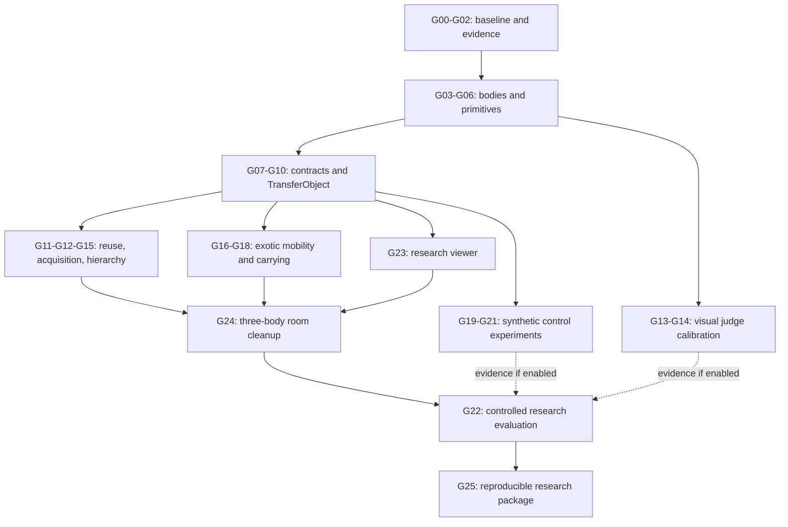

# Rigby: verifiable goals, pursuit order and prerequisites

The next implementation target is **a reusable, physically verified TransferObject skill across different bodies in an unchanged world**. The roadmap below turns every workstream in the [research plan](C:/Users/hocke/GitHub/rigby/docs/research/rigby-capability-review-and-research-plan.md) into an acceptance gate, then grows that capability into recursive cleanup, exotic locomotion and controlled research experiments.

**There is no user-supplied prerequisite for beginning the local baseline, replay, strict-world, morphology and existing-body work.** Later model evaluation, independent scientific validation, large runs and hardware have specific input requirements. Exact exotic assets are optional because procedural models can be built.

This document defines proposed goals. It does not claim that the new milestones or videos already exist, activate background work, or replace the repository's current acceptance contract. The [machine-readable catalog](C:/Users/hocke/GitHub/rigby/docs/research/rigby-verifiable-goals.json) contains the same 30 goals, dependencies, evidence requirements and input IDs.

## 1. What makes a goal complete

Every engineering goal needs executable verification and saved evidence. Every major embodied milestone additionally needs an uninterrupted replayable video and a short preview. An attractive video cannot substitute for the quantitative acceptance report.

Research goals have two outcomes: **assessment complete** and **hypothesis/capability supported**. An assessment can finish with a negative result. For example, a learned controller that does not improve over analytic control should remain an evaluated experiment, without being adopted or described as a gain. A failed experiment does not justify changing the held-out threshold.

All numeric targets below are proposed gates, not measured current performance. Freeze the task, distributions, tolerances, budgets and evaluation procedure in G02 before collecting scored results. A pilot may reveal that a proposed task is physically infeasible; any revision must be versioned before the new evaluation, with the original outcome retained. Retain stricter applicable existing requirements.

A dependency is a capability needed to pass the next goal. Useful preparation can proceed while a predecessor is incomplete. A complete end-to-end claim requires all of its applicable acceptance gates; unsupported optional learning or visual-judging branches need not block the analytic/sensor-based demonstration.

### Shared physical and statistical rules

- A task passes only if its root goal and all required invariants pass. A successful grasp phase does not make a failed placement successful.
- Preserve joint/actuator limits, collision/contact checks and declared observations. No object teleportation, hidden support, artificial attachment or privileged evaluator access may create a policy success.
- For rigid-object manipulation, freeze penetration/pose/force tolerances with the geometry and simulator configuration. Use existing stricter gates; document any new task-specific threshold before testing.
- Use one independent evaluator for task truth. Controller/VLM confidence cannot overwrite it. Simulator truth may label datasets; it is not automatically a permitted policy observation.
- Record feasible and infeasible cases separately. Report unconditional success, independently feasible-only success, coverage and refusal errors. Refusal is not a successful manipulation episode.
- Repeated deterministic replay verifies reproducibility. Statistical trials vary predeclared initial conditions, scene seeds or perturbations. Frames and related mutations are not independent trials.
- Report counts and confidence intervals. For example, 90/100 is an observed 90% success rate, not a 90% lower confidence bound.
- Hold out source episodes and body families before training/tuning. A body already examined during development cannot later be described as an unseen topology.
- Fix time, retry and candidate budgets across methods. Include slow execution, search cost, data volume and manual body-specific engineering in results.

## 2. Required evidence for major milestones

Every Dxx demo below is a future deliverable of the corresponding Gxx goal. Each bundle should contain:

| Artifact | Required content |
|---|---|
| Manifest | Goal/protocol version, code commit and any working-tree patch hash, dependency lock, simulator/version/platform, robot/assets, controller/model/prompt versions, world hash, seed and content checksums |
| Task contract | Exact requested meaning, grounded/executed meaning, success predicates, tolerances, initial conditions, observation contract, intervention/time/retry limits |
| Physical record | State and actions sufficient for fresh simulation replay, root/object motion, internal simulator state needed for reproducibility, forces/contacts, perturbations, observations and random state |
| Execution record | Skill definitions and active tree, state transitions, predicate evidence, resource ownership, retries, refusals and every intervention |
| Independent result | Per-trial metrics, gate failures, root outcome, known/unknown observations and aggregate report with denominators |
| Full video | Uninterrupted MP4 or WebM rendered from actual recorded physical states; full episode at real-time playback, simulation timestamps, global and task views, outcome and controller/observation labels |
| Preview | Short GIF or accelerated preview, explicitly labeled with its speed and linked to the complete episode |
| Reproduction | Exact tested command to re-run physics from the initial state, and a separate command to re-render the saved physical trace without calling a model |

**Re-rendering a recorded trajectory and re-running the physics are distinct checks.** Setting recorded state to render an archival frame is acceptable; it does not prove that a controller can regenerate that trajectory. Goal G01 implements and verifies both.

Successful and failed scored trials retain complete numeric records. Major benchmark/demo releases retain full-episode video for every scored trial, either pre-rendered or reproducibly generated on demand from the bundle; G24 explicitly requires its full video archive. Never retain only the best seed. If a request is refused before motion, show the initial state and reason, clearly labeled as a pre-execution refusal.

The existing renderer samples at most 90 frames. It can support a GIF preview, but G01 must ensure long-episode verification uses a real full-duration recording. This follows the current [renderer implementation](C:/Users/hocke/GitHub/rigby/any-robot/scripts/render_demo.py:40).

## 3. Recommended pursuit order

| Order | Goals | Exit milestone | Reason for this position |
|---|---|---|---|
| 1 | G00–G02 | Trustworthy baseline, replay bundle and fixed-world/evaluator contracts | All later claims rely on these measurements |
| 2 | G03, G05, G06; start G04 | Generated body capabilities, six-body motion and reliable contact families | Exposes geometry/control failures before adding hierarchy |
| 3 | G07–G10 | **Reusable closed-loop TransferObject** with replayable recoveries | First substantial research-relevant capability |
| 4 | G11, G12, G15 | Persistent skill reuse, bounded missing-skill acquisition and recursive 3/5/10-object tasks | Demonstrates the user's superprimitive idea on manageable physics |
| 5 | G16–G18 | Valid exotic bodies, independent locomotion, then carrying while moving | Separates navigation, grasp and their physical coupling |
| 6 | G23, G24 | **Same-room cleanup by dog, wheels and articulated tentacles** | The flagship uses established components and visible evidence |
| 7 | G22, G25 | Controlled ablations, supported claims and reproducible research package | Demonstrations become scientifically interpretable results |

Supporting tracks have an earlier preparation phase:

- **Semantics (G04):** start after body contracts exist. Canonical typed programs support engineering progress while independent language labels are obtained.
- **Visual verification (G13–G14):** collect natural failures as soon as G06/G09 produce them. Calibrate before relying on VLM-only termination. Failure to calibrate leaves sensor-based execution and the oracle diagnostic baseline available.
- **Synthetic control (G19–G21):** start a bounded data/policy pilot after G10. Scale only if it demonstrates value and available capacity. It is not a prerequisite for G24.
- **Viewer (G23):** basic replay arrives in G01; tree visualization can begin after G07/G10 and grow alongside execution.
- **Optional extensions:** G26 covers remaining humanoid/RAG/human-study acceptance; G27 hardware; G28 soft mechanics; G29 learned kinematic reference generation.

Workstreams may be pursued independently where dependencies allow. This ordering does not require delegation or additional agents.

## 4. Goal catalog

Minimum counts apply to the frozen enabled set defined for each goal. A body excluded by independent feasibility analysis remains in the coverage/refusal ledger. A body that merely fails Rigby's controller cannot be labeled physically impossible.

### G00 — Establish the executable baseline and protect existing capabilities

**Type:** engineering. **Depends on:** none. **Status:** planned.

1. Reproduce the review probes at a recorded commit, then fix the Windows hash-test environment issue without changing hashing semantics; core and any-robot suites pass with no new skips or weakened assertions.
2. Record the selected humanoid and frontend suites, existing expected failures, basic drawer acceptance, and gesture/finger export smoke checks. A green expected-failure test is never counted as task success.
3. Correct stale capability/sensor/collision descriptions and the zoo manifest robot count; map every active acceptance requirement to measured, deferred, failed or out-of-scope evidence.

**Required evidence:** baseline.json, JUnit reports, capability-claims.csv, acceptance-crosswalk.json; A preserved pre-change reference bundle for the two fresh probes.

**Demo:** An automated report/test bundle is sufficient; the next embodied milestone supplies the physical demonstration.

**External input:** None required to start within the local/procedural scope.

**If the gate fails:** Investigate regressions locally; preserve and name unresolved product failures instead of broadening exclusions.

### G01 — Make every major result replayable and visually inspectable

**Type:** engineering. **Depends on:** G00. **Status:** planned.

1. Create the evidence-bundle contract described below and a single runner that can simulate, verify, render, and re-render recorded trajectories offline.
2. Demonstrate one success, one runtime failure and one pre-execution refusal; tampering with a trace, model, world or outcome file is detected.
3. Re-run the six-body canonical prompt three times under pinned dependencies; compare deterministic state/action data while excluding run IDs and wall-clock metadata. Declare any required numerical tolerance before evaluation.
4. MP4/WebM contains the full episode at real-time playback with timestamps; GIFs are explicitly labeled summaries. Verify that the existing 90-frame render cap cannot silently replace a full-duration video.

**Required evidence:** Versioned evidence schema and replay CLI; Hash-validation and frame/time alignment checks.

**Demo:** D01: baseline success/failure replay, plus a six-body GIF preview and full-duration videos.

**External input:** None required to start within the local/procedural scope.

**If the gate fails:** Repair trace/state coverage or renderer timing; a plan animation is not accepted as execution evidence.

### G02 — Freeze task contracts, observation boundaries and benchmark protocol

**Type:** engineering. **Depends on:** G00, G01. **Status:** planned.

1. Implement separate strict fixed-world and capability-normalized modes. A mutation test proves strict mode rejects world fitting and undocumented semantic substitutions.
2. Hash resolved non-robot geometry, object dynamics, placements, lighting, goals, physics, start-zone rules and sensor policy; the fixed-world hash remains identical across robot swaps. Declared robot-mounted sensor transforms live in the body manifest.
3. Register root goals, dwell times, attempt/time budgets, perturbation distributions, feasibility rules, metrics and split policy before scored runs. Do not inspect existing sealed holdout identities.
4. Keep simulator ground truth in an independent evaluator. Access tests prove the acting policy cannot read privileged evaluator fields; fully observed planning is a separately labeled baseline.

**Required evidence:** benchmark-protocol.v1.json, world manifests, split hashes, observation-access tests; Crosswalk to existing acceptance_criteria.general.yaml; no existing requirement silently relaxed.

**Demo:** An automated report/test bundle is sufficient; the next embodied milestone supplies the physical demonstration.

**External input:** None required to start within the local/procedural scope.

**If the gate fails:** Resolve a world/goal/access mismatch before collecting transfer scores.

### G03 — Derive a body capability contract automatically

**Type:** engineering. **Depends on:** G02. **Status:** planned.

1. Ingest all six zoo bodies and at least three available valid third-party descriptions without robot-ID, joint-name or link-name branches in shared control code.
2. On an independently checked geometry fixture, derive sites within 1 mm, classify all declared effectors correctly, and identify capability/limit/inertia problems by typed error; separately retain existing sealed-label accuracy requirements.
3. Record geometry, actuation, contact and sensor assumptions with provenance and uncertainty. Unknown grip, suction, rolling or balance ability must not be inferred from appearance alone.
4. Joint/link renaming and ordering changes preserve capabilities and transform-equivalent motion; include at least 20 renamings/permutations per zoo body.

**Required evidence:** body-manifest.json per robot, morphology measurements, static scan, admission report; Robot/fixture contact feasibility map with independent mechanical reasoning.

**Demo:** D03: automated body inspection gallery showing inferred chains, effectors, workspace and named unsupported capabilities.

**External input:** None required to start within the local/procedural scope.

**If the gate fails:** Fix general inference or reject an invalid model explicitly; do not patch a benchmark robot by name.

### G04 — Verify semantic fidelity beyond identical hashes

**Type:** engineering. **Depends on:** G02, G03. **Status:** planned.

1. Freeze 60 shared semantic cases spanning the inventory, reference frames, qualitative extent/speed, repetition and object roles; corresponding requested semantic programs agree across applicable bodies.
2. Add at least 120 independently authored/reviewed language cases with paraphrases, minimal contrasts, negation, ambiguous deixis and explicit quantities. Canonical symbolic cases must be exact; language correctness target is at least 95%, with all prohibited substitutions rejected.
3. Preserve '5 cm' as an exact requested quantity while grounding 'a little' from context; verify two distinct body-relative distances without changing the semantic reading.
4. Publish errors and unsupported language coverage separately. If independent labels are unavailable, complete the engineering fixture but leave the research-language gate pending.

**Required evidence:** semantic-cases.json, labels/provenance, per-case expected/actual programs and confusion report.

**Demo:** D04: synchronized 'a little' versus 'as far as possible' versus '5 cm' on three bodies, with the semantic fields and measured distances visible.

**External input:** U3_independent_review (conditions and fallbacks below).

**If the gate fails:** Repair the representation/parser on development cases; freeze a new held-out test set if the old test set informed changes.

### G05 — Close the six-body free-space composition gap

**Type:** engineering. **Depends on:** G01, G03. **Status:** planned.

1. The exact reviewed reach/return prompt succeeds on all six bodies using freshly generated exact-region primitives, zero substitutions and unchanged limits; left_joint_4 no longer exceeds its range.
2. For each body, evaluate at least 20 predeclared start/pace variants with at least 19 successful feasible trials; invalid requests produce correct typed refusals and are counted separately.
3. Retain all current physical gates, report tracking and wall/execution time, and keep canonical durations no slower than the recorded baseline unless a documented physical requirement is independently justified.

**Required evidence:** Fresh primitive and composition traces for 6 canonical plus 120 variant trials; Joint-boundary regression and deterministic replay results.

**Demo:** D05: six synchronized bodies performing reach/return, plus the old and repaired dual-arm transition.

**External input:** None required to start within the local/procedural scope.

**If the gate fails:** Diagnose and repair transition/control feasibility; slowing until an arbitrary time budget disappears is not a pass.

### G06 — Make contact primitives physically useful across grippers

**Type:** engineering. **Depends on:** G02, G03, G05. **Status:** planned.

1. For every one of the five gripper-bearing zoo bodies, attempt approach, opposition/closure, lift, sustained hold, transport and release. Every enabled body must pass the canonical normalized grasp. Record remaining bodies as failed or independently demonstrated mechanically unsupported, with concrete diagnostics.
2. On a fixed fixture selected and frozen from the independent feasibility map, achieve at least 90/100 successful trials per enabled body. Completion requires at least three structural/effector configurations, including a bimanual or multifinger configuration, not three length variants of one gripper. An unsuccessful/refused body does not count toward this minimum.
3. Measure stable object support for at least 2 s, transport into the target region, and stable released placement for at least 2 s; freeze displacement, load and penetration tolerances before evaluation.
4. No hidden object state writes, welds, object actuators or arm/object collision exclusions may create a successful manipulation result. Invalid source-model collision hulls require documented model treatment.

**Required evidence:** Per-phase contact traces, full collision policy, object-pose/force curves, 100-trial reports per enabled body; Failure taxonomy for all five bodies, including multifinger and dual-arm failures.

**Demo:** D06: acquisition-to-release on all five attempted bodies, including failures; synchronized fixed-world comparison for the enabled set.

**External input:** None required to start within the local/procedural scope.

**If the gate fails:** A failed body stays visible and cannot be removed post hoc to raise success. Mechanical infeasibility is an outcome, not a successful enabled capability.

### G07 — Implement recursive superprimitive contracts

**Type:** engineering. **Depends on:** G02, G03. **Status:** planned.

1. Use one neutral typed contract for leaves and composites: arguments, requirements, initiation, invariants, effects, termination, timeout, recovery, resource ownership and validity context.
2. Execute Sequence, Selector, Observe, Primitive and bounded RepeatUntil at nesting depth at least 4; represent Parallel with explicit resource conflicts.
3. Reject cycles, unbounded retries, unknown predicates and incompatible resource ownership; test success, failure, unknown and interruption at each node.
4. Round-trip persisted definitions without changing meaning; no thumb/finger/arm names are required by the neutral contract.

**Required evidence:** Contract schema, nested example programs, serialization and failure-propagation tests.

**Demo:** An automated report/test bundle is sufficient; the next embodied milestone supplies the physical demonstration.

**External input:** None required to start within the local/procedural scope.

**If the gate fails:** Fix semantics and error propagation before adding more skills or relying on LLM-generated trees.

### G08 — Validate and repair transitions between certified skills

**Type:** engineering. **Depends on:** G05, G06, G07. **Status:** planned.

1. Check terminal/initiation compatibility for pose, velocity, contact mode, object ownership, belief freshness and limb/support resources.
2. On at least 100 frozen feasible boundary cases spanning every enabled body, achieve at least 95 successful composed executions; record transition cost.
3. Inject at least 40 incompatible boundaries and require every one to be rejected or repaired and re-verified before execution. Include the reviewed dual-arm failure.
4. Apply continuity requirements appropriate to the contact mode; confirm that a smooth path cannot bypass object-hold or support checks.

**Required evidence:** Transition corpus, feasibility/repair report and controller traces.

**Demo:** D08: before/after transition repair, including joint-limit approach, carry-to-place and a contact-mode change.

**External input:** None required to start within the local/procedural scope.

**If the gate fails:** Return a typed composition failure or insert a verified transition; leaf certificates alone cannot certify the parent.

### G09 — Generate observable conditionals and monitor progress honestly

**Type:** engineering. **Depends on:** G02, G03, G07. **Status:** planned.

1. Represent each conditional with entities, evidence sources, temporal window, decision rule, uncertainty/abstention and fallback.
2. Cover at least six predicates: reachable, opposition established, held, moving with robot, stably placed, area clear. Evaluate at least 20 independently labeled episodes per predicate using declared sensors.
3. On at least 60 cases with occlusion, stale frames or absent sensors, produce unknown/re-observe/failure rather than an unsupported success; no false success in this engineered negative set.
4. The same predicate contract binds to different sensor configurations without privileged evaluator leakage. Thresholds are set by task policy/calibration, not guessed from URDF text.

**Required evidence:** Predicate/evidence schemas, labeled episode set, access tests and false-success report.

**Demo:** D09: visible grasp, hidden slip and occluded placement, with sensor provenance and pass/fail/unknown overlays.

**External input:** None required to start within the local/procedural scope.

**If the gate fails:** Add an observation/test action or abstain; keep a fully observed oracle baseline separately labeled.

### G10 — Deliver the first reusable closed-loop TransferObject skill

**Type:** engineering. **Depends on:** G06, G08, G09. **Status:** planned.

1. Run one root skill definition through Acquire, VerifyHold, Transport, Release and VerifyPlacement on the frozen enabled bodies and identical physical scene.
2. At least 90/100 nominal successful episodes per body under a frozen 120 s default episode cap; report cap changes as protocol revisions before evaluation.
3. For each body, run 20 trials each of displaced object, induced slip and temporary occlusion; recover and finish at least 16/20 in each class, with no false completion across all trials.
4. Retry budgets are at most 3 per subgoal and execution is resumable from observed state; a recovery does not restart the environment or teleport an object.

**Required evidence:** Nominal/disturbance per-body reports, retry accounting and root/leaf state traces.

**Demo:** D10: three-body fixed-world transfer, plus uninterrupted slip and occlusion recoveries.

**External input:** None required to start within the local/procedural scope.

**If the gate fails:** Keep failures typed and visible; identify whether the limiting cause is semantics, perception, transition or control.

### G11 — Promote, retrieve and reuse skills with validity conditions

**Type:** engineering. **Depends on:** G07, G10. **Status:** planned.

1. Promote a candidate only after its independent validation set passes; store definition, body/controller/sensor context, cost and evidence hashes.
2. Execute the same TransferObject and at least two subskills from persisted storage on three new object/layout instances per enabled body without manual edits; log cache reuse.
3. Change geometry, controller, sensors, friction assumptions and evidence schema in separate tests; invalidate or revalidate every affected certificate.
4. Interrupt and restart at at least 10 safe boundaries; reconstruct state from observations and complete or stop explicitly. Do not treat retrieval similarity as proof of validity.

**Required evidence:** Versioned library, promotion decisions, retrieval traces, invalidation and restart tests.

**Demo:** D11: learn/validate once, reuse in a new layout, then invalidate and repair after a physical-context change.

**External input:** None required to start within the local/procedural scope.

**If the gate fails:** Retain the skill as an unverified candidate; neither retrieval nor a saved success video grants certification.

### G12 — Acquire missing motor skills within a bounded search budget

**Type:** research. **Depends on:** G08, G09, G11. **Status:** planned.

1. Freeze three acquisition problems in at least two body families before search; at least one requires new contact timing/trajectory/controller parameters rather than only a new sequence or rename.
2. Starting without a validated implementation, synthesize one through simulation/optimization and store its contract. Default ceiling: 200 attempts or 30 simulator-worker minutes per problem, whichever comes first.
3. Evaluate on 50 unseen perturbation trials per body/problem; success target is at least 40/50 with all hard gates satisfied and zero manual trajectory edits during acquisition.
4. Separate instantiation, composition and motor-skill discovery in the ledger. An unsupported discovery hypothesis is a valid reported research result, but does not meet the capability target.

**Required evidence:** Frozen missing-skill specifications, all search attempts, teacher/optimizer provenance, held-out outcomes.

**Demo:** D12: missing skill → failed attempts → acquired execution → reuse, with search budget and an uninterrupted final trial.

**External input:** None required to start within the local/procedural scope.

**If the gate fails:** Stop at the budget; publish the limiting capability and keep that skill unpromoted. Do not rebrand an existing motion as discovery.

### G13 — Build a calibration corpus from real execution outcomes

**Type:** engineering. **Depends on:** G01, G02, G06, G09. **Status:** planned.

1. Collect at least 600 independent source episodes: 300 successes and 300 natural failures, covering at least five enabled bodies and six task/failure families. Mutations are auxiliary and stay grouped with their source.
2. Reserve 120 success and 120 failure episodes for a sealed evaluation slice; retain at least two morphology identities or one distinct family outside calibration tuning.
3. Provide full video, sparse/dense sampled views and global-plus-local crops from the same episodes; hide labels, model verdicts and privileged telemetry from judging inputs.
4. Use independent simulator truth for measurable physical outcomes. Human reviewers resolve semantic/visual ambiguity and record unknown instead of forced labels.

**Required evidence:** Corpus manifest, split hashes, label provenance, duplication/leakage checks and evidence variants.

**Demo:** D13: labeled failure atlas with complete source-episode links, including near successes and occluded failures.

**External input:** U3_independent_review (conditions and fallbacks below).

**If the gate fails:** Expand missing strata or quarantine ambiguous labels; do not inflate n with frames or correlated mutations.

### G14 — Calibrate VLM judging before enabling autonomous termination

**Type:** research. **Depends on:** G09, G13. **Status:** planned.

1. Freeze model/version/prompt, decision threshold, abstention policy and evidence format before sealed evaluation; compare sparse frames, dense/video evidence, and global-plus-local views at matched call/candidate budgets.
2. Beat always-accept/reject/first/base baselines; proposed promotion targets are balanced accuracy at least 0.85, sensitivity at least 0.85 and decided-case coverage at least 0.80, with per-body/class results and confidence intervals.
3. For noncritical semantic termination, require one-sided 95% false-success upper bound at most 5% on the eligible decided failure population; keep unknowns separate and report all-trial metrics. Critical physical termination retains deterministic/sensor checks.
4. For any stronger per-failure-class claim, collect the required independent sample count; the pooled corpus cannot establish each rare-class rate. Complete oracle/no-VLM/calibrated-VLM downstream comparisons.

**Required evidence:** Frozen judge configuration, every raw response, cost ledger, confidence/coverage report and downstream outcome comparison.

**Demo:** D14: old versus calibrated decisions on the same hidden-slip/near-complete sequences, including abstentions and remaining errors.

**External input:** U1_model_access_budget, U3_independent_review (conditions and fallbacks below).

**If the gate fails:** Report the instrument as unsuitable and keep VLM-only termination disabled; simulation/control work continues using declared sensors and oracle baselines.

### G15 — Demonstrate recursive long-horizon manipulation before mobility

**Type:** engineering. **Depends on:** G10, G11. **Status:** planned.

1. Generate ClearWorkArea trees of depth at least 4 for 3, 5 and 10 objects, using shared subskills and per-object grounding rather than manually authored per-instance scripts.
2. On three frozen enabled bodies, run 50 paired nominal seeds for each chain length; proposed whole-task success targets are 90%, 80% and 60% for 3/5/10 objects respectively, with confidence intervals.
3. Run 30 paired disturbed seeds per body for 5 objects; hierarchy with recovery should improve full completion by at least 15 percentage points over the same leaves in a flat/no-recovery executor, under equal time and retry budgets.
4. Root success requires every designated object correctly/stably placed and the work area clear; no averaging successful children over an unfinished root task. Track planning calls and time saved by reuse.

**Required evidence:** All generated trees, subskill reuse counts, chain-length curves and paired outcomes.

**Demo:** D15: uninterrupted 3/5/10-object clearance videos with a live tree and a disturbance/recovery example.

**External input:** None required to start within the local/procedural scope.

**If the gate fails:** Publish chain-length failures and failure correlation; preserve the defined root goal while repairing the responsible subtree.

### G16 — Build and validate the three exotic mobile embodiments

**Type:** engineering. **Depends on:** G03, G10. **Status:** planned.

1. Provide dog-plus-arm, wheeled-biped and rigid segmented octopus-like models with physical/actuator/sensor manifests; these are development/showcase bodies, not automatically held-out research bodies.
2. Validate inertias, limits, collision geometry, support/contact roles and recoverable initial states. Body definitions may differ; shared task code contains no robot-ID special cases.
3. Freeze one common feasible world and goal set for the three bodies before policy tuning, supported by reach/support/traction analysis and a labeled expert feasibility baseline.
4. Record origin and redistribution terms of every asset; procedural models are the default if no preferred models are supplied. The shared task/world remains independent of which locomotion controller later succeeds.

**Required evidence:** Three versioned robot packages, integrity reports, feasibility map and asset provenance.

**Demo:** D16: physical inspection and contact/support tests for all three bodies, including any unsupported maneuvers.

**External input:** None required to start within the local/procedural scope.

**If the gate fails:** Repair the model or narrow its declared capability; exact external designs require U4, but procedural substitutes permit progress.

### G17 — Establish independent locomotion control

**Type:** engineering. **Depends on:** G02, G16. **Status:** planned.

1. For each body, execute travel, stop, turn and return on the common course in at least 100 frozen trials; at least 90 reach the goal and remain stable for 2 s.
2. Run 30 predetermined perturbation trials per body with at least 24 recoveries; include traction/support disturbances appropriate to the declared mechanics and report them separately.
3. Controller logs identify analytic, per-body trained, automatically adapted or shared policy provenance. No root teleportation, artificial support or hidden stabilizing wrench may count as success.
4. Publish fall, collision, energy, speed, controller latency and time-budget outcomes; locomotion control must work without the high-level language planner.

**Required evidence:** Locomotion benchmark report, actuation/support logs and controller provenance.

**Demo:** D17: synchronized walk/roll/crawl course plus uninterrupted perturbation recoveries.

**External input:** None required to start within the local/procedural scope.

**If the gate fails:** Use a bounded per-body controller development experiment; if it needs training beyond local capacity, defer to U2 without blocking completed fixed-base work.

### G18 — Combine locomotion with manipulation

**Type:** engineering. **Depends on:** G08, G09, G10, G17. **Status:** planned.

1. Execute approach object → stabilize → acquire → move while holding → place → return, with the same root contract on the three bodies.
2. Achieve at least 80/100 nominal full-task successes per body in the fixed world; verify object control during base motion and correct support-resource allocation.
3. Run 30 disturbances per body distributed over navigation, carrying and placement; at least 24 end in recovery and true completion, with all remaining trials explicitly failed.
4. Validate shared limbs/support contacts: a limb used to hold an object cannot simultaneously be assumed available for stance without a verified combined controller.

**Required evidence:** Loco-manipulation traces, resource schedules, support/contact invariants and outcome reports.

**Demo:** D18: uninterrupted retrieve-and-deliver on dog, wheels and articulated tentacles, with carrying perturbations.

**External input:** None required to start within the local/procedural scope.

**If the gate fails:** Identify and repair the coupling failure; passing navigation and grasp separately is insufficient.

### G19 — Generate a useful synthetic control dataset

**Type:** engineering. **Depends on:** G02, G08, G10. **Status:** planned.

1. Produce a 1,000-episode pilot from at least four development morphologies, six primitive/contact/transition families and recorded disturbance distributions; include at least 20% failure/recovery or near-boundary episodes.
2. Store actual state, action, reference, contacts, declared observations, body graph, dynamics, seed and independent outcomes. Demonstrate reconstruction of any sampled episode.
3. Freeze train/development/topology-test splits before generation; no holdout teacher trajectories enter training. Validate coverage and data integrity with a sampled replay audit.
4. Measure bytes/episode and simulation throughput before scaling. Default local disk ceiling is 10 GiB for research outputs until capacity is reassessed; 10k/100k points are conditional expansions, not required upfront.

**Required evidence:** Dataset schema, generation config, split hashes, coverage/data-quality report and throughput/storage measurements.

**Demo:** D19: dataset coverage reel with linked full traces and a side-by-side clean/disturbed/recovery episode.

**External input:** None required to start within the local/procedural scope.

**If the gate fails:** Improve teacher/coverage quality before increasing volume; a library of reference positions alone does not meet this dataset contract.

### G20 — Test a small per-body residual tracker

**Type:** research. **Depends on:** G19. **Status:** planned.

1. Install an isolated reproducible training environment and compare analytic control, a small per-body tracker, and a history-conditioned residual tracker under identical observations and references.
2. Run at least three training seeds and 100 held-out disturbance trials per selected body; include tracking, task success, latency and effort outcomes.
3. Adoption target: at least 10 percentage points more disturbed task success or at least 20% lower tracking error, with no material task-success regression and no critical false acceptance; report paired confidence intervals.
4. Collect corrections on states reached by the learned policy and compare this with clean-success-only imitation. Bound training by a measured pilot budget before continuing.

**Required evidence:** Training configs/logs/checkpoints, data budgets, learning curves and matched analytic-policy comparison.

**Demo:** D20: identical disturbance replay under analytic and learned controllers, including cases where learning loses.

**External input:** None required to start within the local/procedural scope.

**If the gate fails:** If the measured gain is absent, retain analytic control and record the negative result. U2 is needed only for expansion beyond available local capacity.

### G21 — Test a shared controller on unseen topology

**Type:** research. **Depends on:** G16, G17, G19, G20. **Status:** planned.

1. Expand the dataset to the stated mobile/manipulation scope with variable-size morphology inputs; compare graph/joint tokens, padded vectors and per-body policies.
2. Use at least three unseen topology families and multiple bodies per family; freeze models and data before revealing test identities. Evaluate at least 100 trials per reported task/body cell over three training seeds.
3. Report zero-shot results separately from 10-episode and 100-episode adaptation; zero-shot permits no test-body expert rollouts, finetuning or body-specific code.
4. Adoption target: at least 10 percentage points better zero-shot full-task success than the padded-vector baseline with a paired confidence interval excluding zero, while preserving physical gates and reported control latency.

**Required evidence:** Morphology split protocol, teacher/data leakage audit, checkpoints, scaling curves and per-body outcomes.

**Demo:** D21: first execution on a previously withheld topology, followed by explicitly labeled few-shot adaptation comparisons.

**External input:** U2_compute_scale, U3_independent_review (conditions and fallbacks below).

**If the gate fails:** Publish the generalization limit; do not call a per-body trained/adapted controller universal zero-shot control.

### G22 — Run the controlled research benchmark and ablations

**Type:** research. **Depends on:** G02, G04, G12, G15, G18. **Status:** planned.

1. Freeze candidate code, seeds, feasible/infeasible task map and independent labels before confirmatory evaluation; use a 6–10-body, 6-task-family, 20-seed pilot to choose and register the final sample design.
2. Measure all five hypotheses from the research plan: semantic factorization, body-authoring cost, hierarchy/recovery, synthetic control and visual verification. Conditional branches may be reported unsupported/not enabled; they may not disappear from the results table.
3. Compare equally expressive Talmy/generic representations, same leaves with flat/hierarchical execution, equal-budget language/constraint baselines, measured/manual body adapters, and applicable control/verifier variants.
4. Publish every per-cell outcome, unconditional and feasible-only success, refusal precision/recall, coverage, chain length, data/compute/manual labor and confidence intervals. Results are grouped by source episode/body; no frame-level pseudo-replication.

**Required evidence:** Preregistered protocol, executable benchmark, result tables and ablation plots; Claim matrix: supported, unsupported, underpowered or not tested.

**Demo:** D22: deterministic paired comparison reels linked to every complete benchmark episode, including negative ablations.

**External input:** U1_model_access_budget, U2_compute_scale, U3_independent_review (conditions and fallbacks below).

**If the gate fails:** Completion means a valid experiment and defensible claim matrix, not a guaranteed positive result. A failed hypothesis is not repaired by editing its held-out evaluator.

### G23 — Build the synchronized research/demo viewer and exports

**Type:** engineering. **Depends on:** G01, G07, G10. **Status:** planned.

1. Display physical views, root goal and active subtree, observed/unknown predicates, body/controller provenance, world hash, sim time, interventions and final outcome.
2. Load evidence bundles offline; scrubbing aligns video/state/tree within one video frame. Selecting any trial, including failure, opens its full episode and rerun command.
3. Export rigid per-link GLB and round-trip within the existing 1 mm requirement where that export capability is claimed; keep diagnostic video/trace available when an exporter is unsupported.
4. Preserve existing humanoid Motion Studio/gesture regressions; separate captured execution from editable planned animation in the UI.

**Required evidence:** Viewer checks, synchronization report, GLB round-trip report and bundled demo index.

**Demo:** D23: screen recording of opening, replaying, scrubbing and rerunning a success and failure bundle.

**External input:** None required to start within the local/procedural scope.

**If the gate fails:** Keep evidence usable through standalone videos and CLI while repairing UI/export; do not label missing GLB support as passed.

### G24 — Deliver the flagship same-room exotic cleanup demonstration

**Type:** engineering. **Depends on:** G15, G18, G23. **Status:** planned.

1. Use the identical instruction and world with three designated objects/trays on dog-plus-arm, wheeled-biped and articulated-octopus bodies; generate a depth-at-least-4 task tree with reused subskills.
2. Run 50 predetermined nominal seeds per body and achieve at least 40/50 full completions under a frozen default 10-minute simulation cap. No human action during an episode.
3. Run 30 predetermined disturbed seeds per body with at least 24 true full completions; count remaining failures and every retry/intervention.
4. Use only declared observations for the deployed policy; VLM-only termination is permitted only for the predicates/populations accepted in G14. Publish an oracle-assisted version separately if used. Goal includes stable placement, clear marked region and return to start.

**Required evidence:** 150 nominal and 90 disturbed full episodes, semantic/world hashes, trees, outcome distributions and observation/controller labels.

**Demo:** D24: synchronized uninterrupted three-body cleanup video, short GIF preview, and an offline gallery containing every trial.

**External input:** None required to start within the local/procedural scope.

**If the gate fails:** Publish the failed subgoal and evidence. Optional learned control is not required if analytic/per-body controllers meet the declared demo contract.

### G25 — Package a reproducible research release

**Type:** engineering. **Depends on:** G22, G24. **Status:** planned.

1. Produce a capability/claim table linking every statement to code, protocol, quantitative result and replayable media; identify negative and untested findings.
2. A fresh checkout reproduces a small smoke bundle and re-renders an archived full episode without API calls. Large models/data have checksums, acquisition instructions, provenance and license inventory.
3. Provide literature/baseline mapping, data/compute accounting, benchmark protocol, limitations and a clear separation of semantic transfer, per-body adaptation and universal control.
4. Prepare the manuscript/demo package locally. Public publication, repository push or collaborator messaging occurs only when requested.

**Required evidence:** Release manifest, reproduction transcript, draft manuscript, sources and claims ledger.

**Demo:** D25: final demo reel with captions linking each segment to its uninterrupted run and quantitative claim.

**External input:** U3_independent_review (conditions and fallbacks below).

**If the gate fails:** Release narrower supported claims if optional branches fail; incomplete evidence remains clearly marked.

### G26 — Close optional legacy humanoid, RAG and human-preference acceptance

**Type:** optional. **Depends on:** G00, G11, G14. **Status:** planned.

1. Map existing v2 benchmark, human-study, RAG A/B, export and physical-task requirements to real collected evidence rather than synthetic test fixtures; preserve their original acceptance thresholds.
2. Run the required human preference/calibration study with independent raters and actual records before claiming human agreement; measure retrieval benefit with a controlled no-retrieval baseline.
3. Re-run button/drawer robustness and other claimed physical tasks; unresolved grasp/container/bimanual cases remain failed rather than being absorbed into a suite pass rate.

**Required evidence:** Legacy acceptance ledger, real participant/benchmark records, RAG A/B report and physical-task diagnostics.

**Demo:** D26: updated humanoid capability reel with measured tasks, supported retrieval benefits and labeled unresolved failures.

**External input:** U1_model_access_budget, U3_independent_review (conditions and fallbacks below).

**If the gate fails:** This extends the existing product's acceptance program and does not block the core exotic-body research release.

### G27 — Transfer one additional embodiment to physical hardware

**Type:** optional. **Depends on:** G18, G25. **Status:** planned.

1. Obtain the actual robot/actuator/sensor specs, validated model, driver interface, workspace constraints and an on-site operator; calibrate physical parameters and observations.
2. Reproduce a bounded transfer task for at least 30 physical trials, with at least 24 true completions and independent placement/contact evidence; report sim/real discrepancies and interventions.
3. Demonstrate one bounded recovery and validate stopping behavior before attempting unattended long-horizon tasks; preserve limits and observation contracts.

**Required evidence:** Calibration data, hardware configs, operator/intervention log and sim/real comparison.

**Demo:** D27: uninterrupted real-robot trials and synchronized simulation/real comparisons.

**External input:** U5_hardware (conditions and fallbacks below).

**If the gate fails:** Hardware access and supervision are real prerequisites; simulation work remains independent.

### G28 — Explore compliant or soft embodiments as a separate mechanics extension

**Type:** optional. **Depends on:** G16, G24. **Status:** planned.

1. Define whether the target is compliant joints, a continuum body or fluid interaction, and select an appropriate physical model with measured/validated parameters.
2. Validate at least three deformation/contact responses against independent reference data before transferring skill contracts.
3. Execute one bounded acquisition/transport or locomotion task under declared observation/control limits, with separate success metrics and no claim that rigid URDF tests validate soft mechanics.

**Required evidence:** Mechanics-validation report, model parameters and task traces.

**Demo:** D28: deformation/contact validation plus uninterrupted soft/compliant task execution.

**External input:** U6_soft_mechanics (conditions and fallbacks below).

**If the gate fails:** Keep the rigid articulated octopus demo scoped to rigid mechanics until the new model is validated.

### G29 — Test a learned short-horizon reference generator

**Type:** optional. **Depends on:** G08, G19, G20. **Status:** planned.

1. Compare analytic/optimization reference generation with a small autoregressive generator using the same semantic constraints and a fixed feedback tracker.
2. On at least three body families and 100 held-out reference/task cases per body, record hard-constraint feasibility, semantic fidelity, generation latency and physical success.
3. Adoption target: at least 20% lower reference-generation latency or at least 10 percentage points greater coverage at equal physical success, with no critical feasibility regression; all references still pass validation.
4. Separate this model's data/compute and errors from the low-level tracker; human motion data are optional and must not become an undeclared embodiment prior.

**Required evidence:** Generator training configs, same-tracker comparisons and feasible-reference/physical-outcome report.

**Demo:** D29: identical constraints realized by analytic and learned references, with resulting physical execution and failure cases.

**External input:** U2_compute_scale (conditions and fallbacks below).

**If the gate fails:** Keep the analytic generator if the learned model adds no measured value. This is optional and does not block recursive skills or the flagship demo.

## 5. Coverage of the original research plan

| Original workstream | Goals that make it verifiable |
|---|---|
| Global capability truth and regression protection | G00, G01, G25; optional existing-product completion G26 |
| Talmy-inspired semantic representation, qualitative/metric language and morphology invariance | G03–G05, G22 |
| URDF plus physical/sensor capability contracts | G03, G09, G16 |
| Generated grounded primitives and physical contact | G05, G06, G12 |
| Recursive superprimitive definitions and resource ownership | G07, G08, G15, G18 |
| Top-down tree proposal, bottom-up grounding and transition validation | G07, G08, G10, G12, G15 |
| Repetition, recovery, resumption and cached reuse | G09–G12, G15 |
| Generated VLM conditionals and independent task truth | G02, G09, G13, G14 |
| MotionBricks/SONIC-style separation of references and tracking | G17, G19–G21; optional learned reference generator G29 |
| Synthetic state/action/contact data, on-policy corrections and scaling curves | G19–G21 |
| Fixed-world versus normalized evaluation, morphology/task/language holdouts | G02, G04, G06, G13, G21, G22 |
| Five research hypotheses and equal-budget literature baselines | G12, G14, G15, G20–G22 |
| Same-prompt exotic manipulation and locomotion | G16–G18, G24 |
| Recursive cleanup with measured terminal predicates | G15, G24 |
| Full video/GIF evidence, tree viewer and GLB export | G01, G23–G25 |
| Human validation, legacy RAG and remaining humanoid acceptance | G04, G13, G14, G22, G25; optional G26 |
| Hardware and genuinely soft/continuum embodiments | Optional G27, G28 |
| Publication positioning, limitations and reproducible release | G22, G25 |

The current [general acceptance file](C:/Users/hocke/GitHub/rigby/any-robot/acceptance_criteria.general.yaml) includes requirements beyond the existing partial audit, including latency, held-out performance and export. G00's crosswalk must keep those visible. This roadmap does not convert its deferred requirements into passes or redefine its existing release status.

## 6. Blockers and inputs

### What is available now

The reviewed checkout is writable and already runs MuJoCo. The previous review produced full any-robot/core tests, selected humanoid tests and fresh manipulation/motion probes. FFmpeg is on PATH; the existing renderer uses Pillow and MuJoCo. Missing imageio packages do not block that path.

The local machine reports an RTX 4060 Laptop GPU with 8,188 MiB memory, about 15.3 GiB RAM and approximately 65.7 GiB free on C:. PyTorch is not installed in the current environment. These are inventory observations, not evidence that a training stack or large experiment fits. A separate training environment and measured pilot can be prepared locally before deciding whether more compute is necessary.

The user does **not** need to supply API credentials, pretrained models, an exotic robot asset or hardware before G00–G03/G05 and the early contract/replay work can begin.

### Inputs that may be needed later

**U1_model_access_budget — Model endpoint and spending ceiling**

- **Needed for:** G14, G22, G26.
- **When it becomes a blocker:** Before new paid VLM/LLM evaluation or a model-dependent baseline run.
- **What to provide:** An approved existing model endpoint/account and a total/per-run spending ceiling; configure credentials through the project's secret mechanism, not in chat. If an already authorized setup exists, reuse it.
- **Progress without it:** Build prompts, evidence variants, mocks, labels and offline evaluation first. Use deterministic/sensor termination while VLM validation is pending.
- **Current status:** Not checked or assumed authorized for this plan; no new paid calls made.

**U2_compute_scale — Long-run compute and evidence storage**

- **Needed for:** G13, G15, G21, G22, G24, G29.
- **When it becomes a blocker:** After local pilots measure GPU-hours, simulation throughput and bytes per episode; before exceeding local capacity for large corpora, long-video archives or training, or running paid remote jobs.
- **What to provide:** A permitted compute destination, access if external, GPU-hour/cost ceiling and persistent storage/quota. Specify acceptable long-run use of the local laptop if relevant.
- **Progress without it:** Use existing CPU simulation, compressed numeric traces, streamed video and small local learning experiments; defer 10k/100k-scale training and complete the semantic/hierarchy demo independently.
- **Current status:** Local GPU reports 8,188 MiB; RAM 15.3 GiB; C: free space about 65.7 GiB at inspection. Torch is absent from the current virtual environment. No throughput or CUDA-training compatibility claim is made.

**U3_independent_review — Independent labels, holdout custody and scientific review**

- **Needed for:** G04, G13, G14, G21, G22, G25, G26.
- **When it becomes a blocker:** Before declaring language/judge calibration independent, claiming blind topology generalization, or collecting a real human study.
- **What to provide:** A reviewer who can label/adjudicate ambiguous cases and hold fresh test identities, or existing independently authored labels and a trusted evaluation procedure. Human-preference claims additionally need actual raters.
- **Progress without it:** Start with existing fixtures, simulator truth and generated holdouts labeled as internal. Keep scientific independence unclaimed until review occurs.
- **Current status:** Existing sealed manifests can be used through their intended evaluator after model freeze; this plan did not read their identities. Already inspected zoo bodies cannot be relabeled unseen.

**U4_exact_assets — Preferred proprietary or exact robot/environment assets**

- **Needed for:** G16.
- **When it becomes a blocker:** Only if the demo must use particular supplied designs rather than procedural models.
- **What to provide:** URDF/MJCF and meshes, actuator/sensor/physical parameters, desired embodiment details and applicable use/redistribution constraints.
- **Progress without it:** Procedurally create a dog-plus-arm, wheeled-biped and rigid articulated octopus-like body, and use a procedurally authored common room.
- **Current status:** No exact external asset is a prerequisite for starting the simulation path.

**U5_hardware — Physical robot access and on-site operation**

- **Needed for:** G27.
- **When it becomes a blocker:** Before hardware integration/execution.
- **What to provide:** The actual robot, driver/API details, network access, limits, calibrated sensors, controlled workspace, an on-site operator and the approved physical experiment scope.
- **Progress without it:** Complete simulation transfer and replayable evidence first.
- **Current status:** No hardware availability assumed.

**U6_soft_mechanics — A defined soft-body target and validation data**

- **Needed for:** G28.
- **When it becomes a blocker:** Before claiming realistic compliant/continuum/fluid behavior.
- **What to provide:** The intended mechanics and material/contact parameters, plus independent reference measurements or an accepted validation model.
- **Progress without it:** Use rigid segmented tentacles and describe them accurately.
- **Current status:** Optional extension; not a prerequisite for exotic rigid-body demos.

### Technical problems the project should resolve itself

These are implementation/research challenges, not information to ask the user to supply:

| Challenge | Owning goal | Bounded response |
|---|---|---|
| Dual-arm composed trajectory exceeds a joint limit | G05/G08 | Reproduce, inspect boundary state, repair and re-verify |
| Multifinger/dual-arm contact fails | G06 | Diagnose geometry, opposition, effort and object transport; keep mechanical infeasibility separate |
| Existing world fitting changes task difficulty | G02 | Add strict resolved-world validation and an independent normalized track |
| Sensor claims/collision assumptions have drifted | G00/G02/G09 | Extract a machine-checkable observation/contact contract |
| VLM cannot distinguish near successes and failures | G13/G14 | Run evidence-format/threshold tests; abstain or keep it out of termination |
| A skill tree is valid symbolically but physically incompatible | G08/G18 | Check transitions and support/resource obligations |
| Synthetic data teach only ideal behavior | G19/G20 | Include disturbed states, transitions and expert corrections |
| Learned policy adds no value | G20/G21/G29 | Complete the comparison and retain the simpler successful controller |
| Existing graphics/physics or training dependencies need setup | G01/G20 | Configure isolated dependencies; ask only if an actual access or capacity restriction is encountered |

### Defaults unless a project constraint overrides them

Use simulation first, procedural rigid exotic bodies, the existing local machine for bounded pilots, no newly purchased compute and no new paid model evaluation until the relevant account/budget is established. Keep prototype outputs local and preserve all failed-trial evidence. The initial storage allocation for new experimental outputs is 10 GiB; measure consumption before scaling and request additional capacity rather than deleting evidence automatically.

A deadline, target venue, preferred model family, exact robot appearance and acceptable overnight local run duration would help prioritize later work. They do not block the initial goals. Access to proprietary NVIDIA/Adobe datasets or MotionBricks/SONIC checkpoints is optional unless a particular direct reproduction is required.

## 7. First implementation batch

Pursue **G00 → G01 → G02 → G03 → G05** first. This yields a current baseline, tamper-evident replay, strict-world evaluation and a six-body composition demo. Then implement G06–G10 to produce TransferObject and its recovery videos.

The first batch uses existing assets and offline simulation and needs no user-supplied resource. Obtain model-budget, independent-review and capacity decisions while that engineering work proceeds, before their dependent evaluations begin.

## Sources and evidence

1. [Rigby capability review and research plan](C:/Users/hocke/GitHub/rigby/docs/research/rigby-capability-review-and-research-plan.md), including the original primary-source literature review.
2. [Fresh verification summary](C:/Users/hocke/GitHub/rigby/docs/research/verification-summary.json) and [reproduction notes](C:/Users/hocke/GitHub/rigby/docs/research/README.md).
3. [Existing general acceptance contract](C:/Users/hocke/GitHub/rigby/any-robot/acceptance_criteria.general.yaml).
4. [Existing simulated-trace renderer](C:/Users/hocke/GitHub/rigby/any-robot/scripts/render_demo.py).
5. [V2 completion audit](C:/Users/hocke/GitHub/rigby/humanoid/docs/v2/completion-audit.md) and [recorded VLM calibration](C:/Users/hocke/GitHub/rigby/humanoid/docs/evidence/10f-calibration-report.md).
6. Local read-only environment inventory during goal planning: GPU, RAM, free disk, FFmpeg availability and Python-package presence. No training benchmark, credential test or paid model call was performed.
