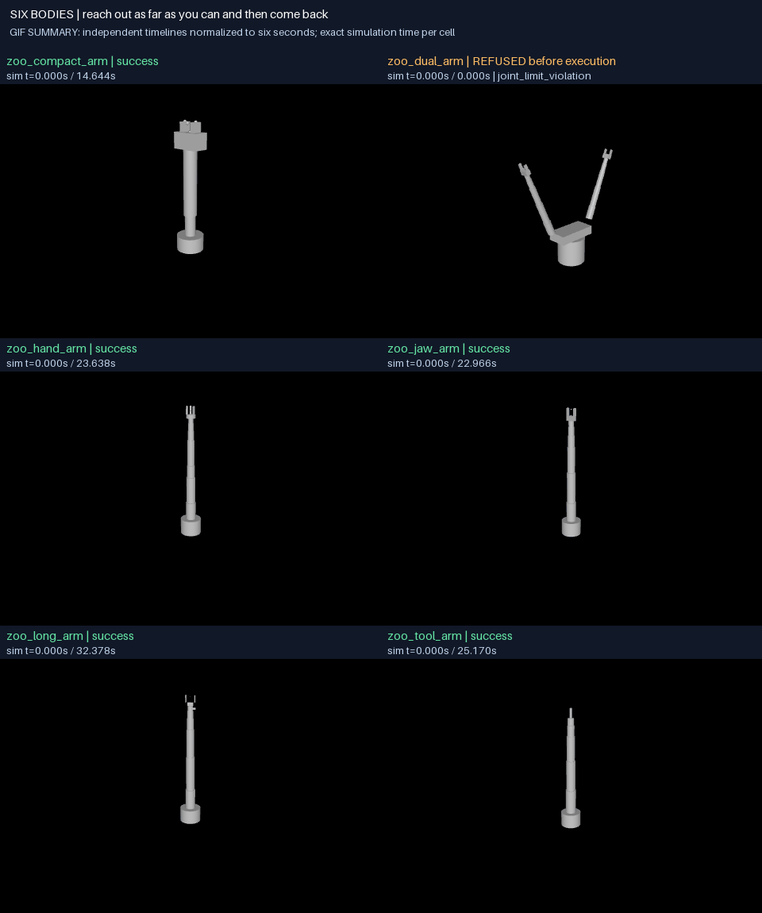

# G01: replayable physical evidence

G01 is locally achieved: the canonical six-body prompt has three deterministic
repetitions per body, full-duration physical-state videos, an explicit
pre-execution refusal, and a declared runtime failure. All seven packaged
episodes restore with their original manifest hashes. The compact arm's offline
replay is exact, and its independently rendered MP4 and endpoint PNGs are
byte-identical to the release.

This milestone establishes evidence infrastructure. Five bodies pass the
existing **free-space motion gates**; the dual arm refuses compilation. These
are not object-manipulation, locomotion, exotic-body, VLM-judging, or recursive
skill results. Three identical deterministic repetitions establish repeatability,
not robustness over disturbances or a population success rate.



The six-second GIF aligns independent episodes by normalized progress. Each
cell shows its actual simulation timestamp. The dual-arm cell is an unexecuted
refusal, with no interpolated or invented motion. Full real-time videos follow.

## Acceptance and evidence

| Frozen criterion | Verification |
|---|---|
| G01.A01: evidence contract and offline capture/verify/replay/render runner | `python -m rigby_general.evidence`; compiled model and complete integration state; archived source/lockfile; restored compact episode replayed and re-rendered offline. |
| G01.A02: success, runtime failure, pre-execution refusal; trace/model/world/outcome tampering detected | Five normal successes, one declared zero-actuator-gain failure, one joint-limit compilation refusal; four same-size bit flips detected against an external manifest digest. |
| G01.A03: three six-body repetitions, pinned dependencies, state/action equality excluding metadata, predeclared tolerance | Three nominal outcomes and physical hashes agree for each body; absolute and relative replay tolerances are both zero. Dual-arm agreement covers only its initial state and refusal because no execution occurred. |
| G01.A04: full real-time MP4 with timestamps; GIF summaries; no silent 90-frame cap | All 1,634 MP4 frames decoded and counted. Six executed episodes contain 177–390 frames each at 12 fps. A two-second refusal slate contains 24 frames. Schedule regression tests include a 30-second, 361-frame episode. |
| D01: visible baseline success/failure, six-body preview and full videos | GIF above; seven full videos below; separately sealed presentation bundles linked to physical manifests. |

Machine-readable evidence: [release index](g01-release/index.json),
[acceptance audit](g01-validation.json),
[audit runner](verify_g01_release.py), and
[preview provenance](g01-release/preview-manifest.json).

## Outcomes at the recorded source commit

Prompt, unchanged for every body: **“reach out as far as you can and then come back.”**
All requested semantic segments are retained without region substitution. Each
body freshly bakes the same two semantic leaf types against its own geometry;
the composed dual-arm trajectory then violates a joint limit.

| Body / case | Physical outcome | Physics duration | Full-video frames | Replay |
|---|---|---:|---:|---|
| [Compact arm](g01-release/zoo_compact_arm/media/episode.mp4) | Existing free-space gates pass | 14.644 s | 177 | 7,322 exact steps |
| [Dual arm](g01-release/zoo_dual_arm/media/episode.mp4) | Compilation refusal: `left_joint_4` limit | 0 s | 24, refusal slate | Initial state only |
| [Hand arm](g01-release/zoo_hand_arm/media/episode.mp4) | Existing free-space gates pass | 23.638 s | 285 | 11,819 exact steps |
| [Jaw arm](g01-release/zoo_jaw_arm/media/episode.mp4) | Existing free-space gates pass | 22.966 s | 277 | 11,483 exact steps |
| [Long arm](g01-release/zoo_long_arm/media/episode.mp4) | Existing free-space gates pass | 32.378 s | 390 | 16,189 exact steps |
| [Tool arm](g01-release/zoo_tool_arm/media/episode.mp4) | Existing free-space gates pass | 25.170 s | 304 | 12,585 exact steps |
| [Compact arm: actuation loss](g01-release/zoo_compact_arm-actuation-loss/media/episode.mp4) | Runtime effort/tracking gates fail | 14.644 s | 177 | 7,322 exact steps |

Every executed case replays with zero state/action error using both saved
commands and independently recomputed controller commands. The fault is an
explicit change to actuator gain in the saved model before simulation; it is
not a naturally occurring policy failure. All unsuccessful outcomes remain in
the release. The aggregate contains 133.440 seconds of simulated execution.

Physical source commit: `2770b0e5e4a631326947b8ac18520f7085c43132`.
Each source archive's package files were independently compared with that
commit and matched byte for byte. The capture's dirty flag includes untracked
results; the release records the package-file comparison and its hash rather
than interpreting that flag as an unspecified code patch. Subsequent packaging
and presentation provenance changes are separate from the captured physics.
All final videos were rendered from these final physical bundles, including
the exact dual-arm refusal reason.

Pinned capture runtime: Python 3.12.7, MuJoCo 3.11.0, NumPy 2.5.1, SciPy 1.18.0,
Pydantic 2.13.4, Pillow 12.1.1, Windows 11 build 26200 / AMD64. The physical
bundles include the complete workspace `uv.lock` and source snapshot. Replay
rejects a different recorded physics platform or numerical dependency version.
These results do not assert cross-platform bitwise equality.

## Evidence contract

The portable `rigby.evidence/1` bundle has a canonical JSON manifest containing
each payload's SHA-256 and byte length, plus a manifest seal. Verification checks
the complete inventory and rejects links, path traversal, ambiguous Windows
names, duplicate/case-alias paths, and missing or extra payloads. Publication is
atomic and refuses to replace an existing destination. A seal alone detects
accidental corruption; an externally retained manifest digest is required to
detect an attacker replacing and resealing the whole bundle.

| Payload | Meaning |
|---|---|
| `model.mjb`, `model.xml`, `robot.urdf`, `robot.json` | Compiled model including embedded assets, readable model, source robot and derived manifest. |
| `world.json`, `task.json` | World/physics scope, prompt, seed, requested and bound semantics, observation policy, gate thresholds and clock disclosure. |
| `execution.json`, `outcome.json` | Generated leaf records, active flat sequence, three nominal outcomes, result and typed failure/refusal. |
| `trace.npz` | Actual physics and reference clocks, complete integration state, positions, velocities, actions, unclamped demand, external inputs, sensor and contact records. |
| `reference.json`, `controller.json` | Inputs needed to recompute controller commands; null reference for a compilation refusal. |
| `repeats.json` | Three independently generated reference-data and pipeline-trace hashes, plus physical-content hashes and saved-control replay results with zero tolerance; metadata/run IDs excluded. One representative trace is retained because all three typed array hashes agree. |
| `source.json`, `source.zip`, `uv.lock` | Version/platform/source provenance and relevant source bytes; no credentials or sealed evaluation assets. Archived source is never executed automatically. |

Replay initializes the complete integration state once, reapplies external
inputs and commands, and integrates forward. It never resets intermediate
positions, velocities, actuator state, time, or solver warm-start state to make
agreement pass. The observer does not advance or recompute live physics, and
the unmodified pipeline's position/velocity/control/demand trace was compared
against the observed run. [MuJoCo's reproducibility documentation](https://mujoco.readthedocs.io/en/stable/computation/index.html#reproducibility)
explains why warm-start state and a matching runtime matter. Derived contacts
and sensors after `mj_step` are labeled as belonging to the preceding integration
interval; they are not presented as freshly sampled post-step observations.

ZIP transport preserves the original bundle. Restoration requires both the
archive hash and the original manifest hash, checks archive bytes before opening
ZIP, validates every entry, and publishes only after reconstructing the original
manifest. The seven archive and manifest hashes are in the release index.

Rendering uses recorded states and `mj_forward` for visual reconstruction, with
no physics integration. Each presentation bundle is separately sealed and links
to its source physical manifest and trace. A fixed global view and a task-site
view show the same state. Camera and lighting are presentation choices, not
acting-policy observations. The MP4 follows actual simulation time at 12 fps;
the last state is held for at most two frame periods beyond the physical
duration. GIFs are labeled summaries and are never substituted for full video.
Model plugins and external MuJoCo callbacks require additional state/provenance
support and are explicitly refused by this recorder.

## Reproduce from the repository root

Install the locked workspace with `uv sync --all-packages --all-extras --locked`.
Put `ffmpeg` and `ffprobe` on PATH. No model API calls or key are required. Use new
output directories: capture, restoration and rendering refuse to overwrite.

```text
uv run --package rigby-general python -m rigby_general.evidence suite --out any-robot/results/g01-fresh --render
uv run --package rigby-general python -m rigby_general.evidence release any-robot/results/g01-fresh --out any-robot/results/g01-fresh-release
```

Restore the committed compact-arm artifact and replay without the original
temporary capture directory:

```text
uv run --package rigby-general python -m rigby_general.evidence unpack docs/results/g01-release/zoo_compact_arm/physical.zip --out any-robot/results/g01-restored --archive-sha256 371024db2b11c1eb56efc6859030a2621badaeb09ee14bd45b2dd903acc72e61 --expected-sha256 de01412c61a9ce00b0c62179ae58dbcdc7f66887fc393cfccb1cbb8d317ec89b
uv run --package rigby-general python -m rigby_general.evidence replay any-robot/results/g01-restored --expected-sha256 de01412c61a9ce00b0c62179ae58dbcdc7f66887fc393cfccb1cbb8d317ec89b
uv run --package rigby-general python -m rigby_general.evidence render any-robot/results/g01-restored --out any-robot/results/g01-rerendered --expected-sha256 de01412c61a9ce00b0c62179ae58dbcdc7f66887fc393cfccb1cbb8d317ec89b
uv run --package rigby-general python docs/results/verify_g01_release.py --out any-robot/results/g01-rechecked.json --rerendered any-robot/results/g01-rerendered
```

The audit restores all seven archives in private temporary directories, checks
their presentation hashes and decoded frame counts, verifies repeat/semantic
records, replays the compact episode, tests the four payload mutations, and
optionally compares the independently rendered compact video and PNGs. The
optional byte comparison is meaningful on the recorded rendering/encoder stack;
other rendering stacks may produce different pixels despite valid physics.

## Validation and remaining limits

The checked JUnit union contains **308 distinct passing any-robot tests**, with
all 15 initial missing-public-asset skips resolved by the targeted follow-up.
Core has **179 distinct passing tests** and two Windows symlink-privilege skips.
One pre-existing Windows subprocess environment test,
`test_the_digest_is_stable_across_processes`, was deselected on this independent
branch; its fix and passing result belong to [G00 / PR 27](https://github.com/zanebeeai/rigby/pull/27).
No assertion was weakened. The archive follow-up also rechecked core neutrality.
The final regression run passed eight rendering schedule tests and a ninth
test that changes the second prompt run's reference and requires capture to
reject it. Each recording uses its corresponding independent prompt run.
The [audit JSON](g01-validation.json) gives source JUnit paths and avoids counting
reruns twice. Linux/macOS atomic publication and symlink coverage await CI.

**Discovered timing defect:** the existing certification loop advances its
reference clock at 240 Hz while each zoo model integrates at 0.002 seconds
(500 Hz). The compact reference's 30.509918 seconds therefore occupies 14.644
seconds of actual physics. All normal videos display `CLOCKS DIFFER`. Passing
the current tracking gate does not prove correct requested duration, velocity,
or acceleration semantics. G01 preserves and exposes this baseline; an explicit
clock fix and new motion evidence are required before G05 motion-fidelity claims.

The shared free-space world hash contains no manipulation objects. It is not
G02's fixed-world swap test. The baseline controller uses model parameters and
joint encoders, with no VLM or restricted-observation policy. Contact force
capture is tested on a separate physical fixture, but these arm demos do not
prove grasp, carry, release, balance or locomotion. The optional
[motion-extent diagnostic](g01-motion-extent.json) only confirms visible
displacement; it is not an additional acceptance threshold.

Next: G02 freezes the fixed-world and observation contracts before scored
embodiment comparisons. The timing defect becomes an early G05 prerequisite.
GitHub Actions billing currently prevents hosted CI jobs from starting; local
completion and PR integration are recorded separately, and no merge bypass is
used.
