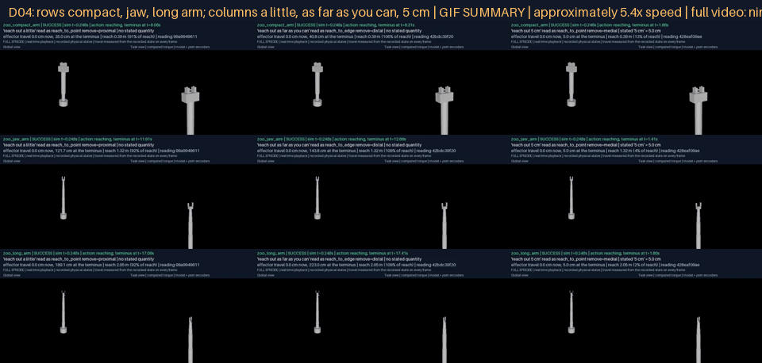

# G04 — Verify semantic fidelity beyond identical hashes

**Status:** engineering criteria A01, A03 and A04 verified; A02's language fixture complete at internal labels (114/120 exact, every prohibited substitution rejected) with the research-language gate pending on `U3_independent_review`; D04 delivered. Model: `gpt-4.1`, chosen as the cheapest candidate to read every canonical case exactly. Spend under the authorization: $2.5636 of the $18 soft cap over 957 paid calls. Verify with `python docs/results/verify_g04.py --replay`.

## What this goal asked

Sixty canonical cases spanning the inventory, frames, extents, speeds, repetition and object roles, whose requested programs agree across the bodies that afford them; at least 120 language cases with paraphrases, minimal contrasts, negation, ambiguous deixis and explicit quantities, exact on the canonical cases, at least 95% correct on language with every prohibited substitution rejected; a stated '5 cm' preserved as an exact quantity while 'a little' grounds from context, two distinct body-relative distances under one reading; errors and unsupported coverage published apart, the language gate left pending if independent labels are unavailable. D04: 'a little' against 'as far as possible' against '5 cm' on three bodies with the semantic fields and measured distances visible.

## What was built

**A stated quantity beside the metric-free program.** `MotionSchemaProgramV1` still has no place for a number, by construction. A distance the request states in so many words now travels beside it as a `RequestedQuantityV1` (the segment it belongs to, the text exactly as written, the value in metres, provenance `user_stated`) inside a `PlannedRequestV1`; the offline recognizer extracts it by pattern, and `run.answer` threads the map of stated distances through `bind` into `ground`. There, a segment with a stated distance is placed exactly that far from where the effector begins, along the bearing its qualitative reading would have taken; outside the measured reach it is refused typed (`quantity_beyond_reach`), and on a wave, a circle, a sweep or a surface departure it is refused typed rather than re-read as an amplitude (`quantity_unsupported`). A qualitative remove grounds as before, body-relatively, from the chain root. The trace carries `requested_quantities` and `planner`.

**The only module that issues a model call.** Before this goal no module did: every scored result through G10 came from `OfflineSchemaPlanner`, a recognizer over the closed class, and the `OpenAISchemaPlanner` its docstring named did not exist. `rigby_general/planner/model_planner.py` is that planner. It asks a model one question per request — which inventory entries, in what order, with what remove, manner, posture and stated quantities — inside a strict JSON schema whose enumerations are the inventory's own ids and whose remove vocabulary omits `coincident`, which no wording names. The reply is validated against the contract and the sealed inventory exactly as the offline reading is: an unknown entry is `invented_binding`, an unafforded one `unafforded_schema`, and a quantity the request never stated, or one whose number the model changed, is `prohibited_substitution`, a new typed code. The reading is body-neutral: the model never learns the body, one call serves every body, and the affordance check runs afterwards. Every reply is cached by the hash of model, system prompt, schema and request under the fixture (`cache/`, committed), every call is logged with its model, its token counts as the provider reported them, its purpose and its cost at the published rates recorded in the module, and a budget object is consulted before each paid call. Transports: OpenAI (strict structured output, the scored route), Gemini (free-plan JSON mode, fallback only, never used), and a mock that wraps the offline reading and counts tokens from characters for the dry run.

**The fixture.** `g04-semantics-v1`: 60 canonical cases spanning all 26 inventory entries, the four removes a request can name, both poles of every manner axis, repetition counts, sequences up to four segments, postures, and the object, sensor, axis, surface and secondary-effector roles; 120 language cases in eight families (paraphrase 30, minimal_contrast 20, negation 12, ambiguous_deixis 10, explicit_quantity 20, manner 12, sequence 8, unsupported 8). Every case carries the body-neutral reading a competent reader of the closed class would give it, or the typed refusals an unsupported request may draw, and a `prohibited` list of what the reading must not contain. Every label is `internal`: authored inside this repository by the pass that built the planner. The fixture, labels, inventory, system prompt and reply schema are registered by hash before any scored run.

## The cost gate, and three rounds

Before the first paid call the whole fixture was run through the mock transport to count tokens: 177 calls, about 702,841 prompt and 16,956 completion tokens at 3.5 characters per token. The protocol as run — every candidate reads the 60 canonical cases, the dearest candidate then reads the whole fixture — projected at $7.20 worst case ($10.81 with a 50% margin), under the soft cap, so the paid runs proceeded. Tokens on paid calls are the provider's own counts; cached-input discounts are ignored, so the recorded cost can only overstate the invoice.

The canonical cases are a specification of the closed class's conventions, and the catalog allows the parser to be repaired on development cases. Three selection rounds were run, each registered by hash and each retained whole with its calls and replies:

| Round | Registration | Candidates (canonical exact of 60, cost) | Selected |
|---|---|---|---|
| round-1 (first conventions) | `8f2291508c76` | `gpt-5-nano` 0/60 ($0.010); `gpt-4.1-nano` 2/60 ($0.017); `gpt-4o-mini` 1/60 ($0.027); `gpt-5-mini` 32/60 ($0.051) | none |
| round-2 (no `coincident` in the reading; unmarked remove is medial for every entry; verbs mark no manner; posture's selected pole normalised at count 0) | `82fc3a39ccf2` | `gpt-5-nano` 23/60 ($0.012); `gpt-4.1-nano` 17/60 ($0.021); `gpt-4o-mini` 3/60 ($0.034); `gpt-5-mini` 54/60 ($0.060); `gpt-5-mini@low` 57/60 ($0.075); `gpt-4.1` 56/60 ($0.420); `gpt-5@low` 59/60 ($0.383) | none |
| round-3 (reach_to_edge always distal; 'point with a finger' is a posture; places ('across the workspace') are not amplitudes; statives are never unsupported) | `c517454cd8f8` | `gpt-5-mini` 57/60 ($0.063); `gpt-5-mini@low` 59/60 ($0.076); `gpt-4.1` 60/60 ($0.447) | gpt-4.1 |

The prompt repairs between rounds were driven by canonical failures only; no language case was read by anyone tuning the instructions, so the language fixture is held out from the repairs. `gpt-4.1` was the cheapest candidate to read all 60 exactly and was registered as the fixture's model; the cheaper models' round-3 readings (`gpt-5-nano`, `gpt-4.1-nano`, `gpt-4o-mini` at 23, 17 and 3 of 60 in round 2) were not re-run after round 2's results showed them far from exact.

## Results

### A01 — canonical cases agree across applicable bodies

All 60 of 60 canonical readings by `gpt-4.1` are exact against the expected program (role-normalised hash and stated quantities). On every zoo body the reading either agrees with the body-neutral reading and the expected program, or is refused typed as `unafforded_schema` naming the entry the body lacks:

| Body | Applicable cases (agree) | Not afforded (refused typed, naming the entry) |
|---|---|---|
| zoo_compact_arm | 51 (51) | 9 |
| zoo_dual_arm | 52 (52) | 8 |
| zoo_hand_arm | 51 (51) | 9 |
| zoo_jaw_arm | 51 (51) | 9 |
| zoo_long_arm | 53 (53) | 7 |
| zoo_tool_arm | 44 (44) | 16 |

All 60/60 cases agree on every body; the offline recognizer agrees on 53/60 (its own reading is wrong on the rest, see A04). The entries no free-space body affords (`approach_to_contact`, `transport_object`, `press` without a contact scene; `draw_hither`, `push_thither` without a confirmed frame) are read correctly and refused typed on every body.

### A02 — language cases, at internal labels

`gpt-4.1` reads 114/120 language cases exactly (95.0%; target 95%) and rejects 27/27 prohibited substitutions (target all). The offline recognizer reads 90/120 and rejects 17/27. By family:

| Family | Cases | Model exact | Offline exact |
|---|---|---|---|
| paraphrase | 30 | 29 | 25 |
| minimal_contrast | 20 | 20 | 15 |
| negation | 12 | 11 | 3 |
| ambiguous_deixis | 10 | 8 | 5 |
| explicit_quantity | 20 | 19 | 17 |
| manner | 12 | 11 | 11 |
| sequence | 8 | 8 | 6 |
| unsupported | 8 | 8 | 8 |

**The research-language gate is pending.** The labels are internal, so the catalog's 'independently authored/reviewed' claim is withheld; `labels.json` records the provenance and the pending external input. The engineering result at internal labels is 114/120 exact, 27/27 prohibited substitutions rejected. What an independent reviewer would be asked to do is label or review the 120 language prompts blind to these readings; the fixture is registered so that a review can be scored against it without a re-run.

### A03 — '5 cm' exact, 'a little' from context

D04's nine sealed episodes, one prompt on three bodies (the compact arm at 0.39 m reach, the jaw arm at 1.32 m, the long arm at 2.05 m), read once each through the model planner (served from the committed cache) and grounded by each body's own reach:

| Prompt | Reading (one hash on every body) | Compact arm | Jaw arm | Long arm |
|---|---|---|---|---|
| 'reach out a little' | `reach_to_point` remove `proximal`, no quantity `99a9949611` | 35.0 cm (91% of reach) | 121.7 cm (92% of reach) | 189.1 cm (92% of reach) |
| 'reach out as far as you can' | `reach_to_edge` remove `distal`, no quantity `42bdc39f20` | 40.8 cm (106% of reach) | 143.8 cm (109% of reach) | 223.0 cm (109% of reach) |
| 'reach out 5 cm' | `reach_to_point` remove `medial`, stated '5 cm' `428eaf09ae` | 5.0 cm (13% of reach) | 5.0 cm (4% of reach) | 5.0 cm (2% of reach) |

Travel is the figure site's displacement from where it started at the terminus of the reach (the end of the grounded program's action phase, before the recovery retrace), measured from the recorded state. It can exceed the reach radius: the rest pose stands on the far side of the chain root from the reach point, so a reach to 84% of the radius moves the effector by more than the radius. 'A little' and 'as far as you can' are one reading each and come out as different metres on different bodies; '5 cm' is five centimetres on every body, within the four millimetres the test allows for tracking. The semantic reading of 'reach out 5 cm' is `reach_to_point` at the unmarked remove with the quantity beside it: the number changes the grounding, never the program.

Every explicit-quantity case was also grounded on the jaw arm: offline planner 17/20 accepted; model planner 17/20 accepted. The refusals are typed and listed in `unsupported.json`: a distance on a surface departure, an oscillation, or beyond the measured reach.

### A04 — errors and unsupported coverage, apart

`confusion.json` lists every wrong reading with what was expected and what was read, an entry confusion matrix and a count by error kind; `unsupported.json` lists every request the label reads as a motion and the planner refused, plus every stated quantity grounding refused. For `gpt-4.1`: 6 errors (remove:distal->medial 1, remove:medial->proximal 1, entry:move_away->push_thither 1, entry:move_toward->reach_to_point 1, manner:{'precision': -1}->{} 1, manner:{'speed': -1}->{'speed': -2} 1) and 0 unsupported readings. For the offline recognizer: 28 errors and 9 unsupported.

Model errors:

- L003 'put your hand out there' (paraphrase): remove:distal->medial
- L057 'reach out, not too far' (negation): remove:medial->proximal
- L066 'move it away' (ambiguous_deixis): entry:move_away->push_thither
- L072 'reach toward me' (ambiguous_deixis): entry:move_toward->reach_to_point
- L084 'reach out about 5 cm' (explicit_quantity): manner:{'precision': -1}->{}
- L094 'reach out really slowly' (manner): manner:{'speed': -1}->{'speed': -2}

## D04

Rows: compact arm, jaw arm, long arm. Columns: 'reach out a little', 'reach out as far as you can', 'reach out 5 cm'. Every clip is its sealed episode rendered from recorded physical states at real-time playback with the simulation clock, the reading's entry, remove and stated quantity, the effector's measured travel on every frame, the reach fraction and the reading's hash in the banner; a shorter clip holds its final state until the longest ends.

[nine-way-synchronized.mp4](g04-d04/nine-way-synchronized.mp4) · [frames map](g04-d04/nine-way-frames.json)

| Body | Prompt | Outcome | Travel at terminus | Clip |
|---|---|---|---|---|
| zoo_compact_arm | 'reach out a little' | success | 35.0 cm | [mp4](g04-d04/zoo_compact_arm/little/media/episode.mp4) · [gif](g04-d04/zoo_compact_arm/little/media/preview.gif) · [frames](g04-d04/zoo_compact_arm/little/media/frames.json) |
| zoo_compact_arm | 'reach out as far as you can' | success | 40.8 cm | [mp4](g04-d04/zoo_compact_arm/edge/media/episode.mp4) · [gif](g04-d04/zoo_compact_arm/edge/media/preview.gif) · [frames](g04-d04/zoo_compact_arm/edge/media/frames.json) |
| zoo_compact_arm | 'reach out 5 cm' | success | 5.0 cm | [mp4](g04-d04/zoo_compact_arm/five_cm/media/episode.mp4) · [gif](g04-d04/zoo_compact_arm/five_cm/media/preview.gif) · [frames](g04-d04/zoo_compact_arm/five_cm/media/frames.json) |
| zoo_jaw_arm | 'reach out a little' | success | 121.7 cm | [mp4](g04-d04/zoo_jaw_arm/little/media/episode.mp4) · [gif](g04-d04/zoo_jaw_arm/little/media/preview.gif) · [frames](g04-d04/zoo_jaw_arm/little/media/frames.json) |
| zoo_jaw_arm | 'reach out as far as you can' | success | 143.8 cm | [mp4](g04-d04/zoo_jaw_arm/edge/media/episode.mp4) · [gif](g04-d04/zoo_jaw_arm/edge/media/preview.gif) · [frames](g04-d04/zoo_jaw_arm/edge/media/frames.json) |
| zoo_jaw_arm | 'reach out 5 cm' | success | 5.0 cm | [mp4](g04-d04/zoo_jaw_arm/five_cm/media/episode.mp4) · [gif](g04-d04/zoo_jaw_arm/five_cm/media/preview.gif) · [frames](g04-d04/zoo_jaw_arm/five_cm/media/frames.json) |
| zoo_long_arm | 'reach out a little' | success | 189.1 cm | [mp4](g04-d04/zoo_long_arm/little/media/episode.mp4) · [gif](g04-d04/zoo_long_arm/little/media/preview.gif) · [frames](g04-d04/zoo_long_arm/little/media/frames.json) |
| zoo_long_arm | 'reach out as far as you can' | success | 223.0 cm | [mp4](g04-d04/zoo_long_arm/edge/media/episode.mp4) · [gif](g04-d04/zoo_long_arm/edge/media/preview.gif) · [frames](g04-d04/zoo_long_arm/edge/media/frames.json) |
| zoo_long_arm | 'reach out 5 cm' | success | 5.0 cm | [mp4](g04-d04/zoo_long_arm/five_cm/media/episode.mp4) · [gif](g04-d04/zoo_long_arm/five_cm/media/preview.gif) · [frames](g04-d04/zoo_long_arm/five_cm/media/frames.json) |

All ten MP4s are registered in `demos/registry`. The physical bundles are local (`any-robot/results/g04-d04`), replayable with `verify_g04.py --replay`.

## The spend, and the keys

957 paid calls, all OpenAI, $2.5636 at the rates recorded on 2026-09-13 (`gpt-5-nano` $0.05/$0.40 per M in/out, `gpt-4.1-nano` $0.10/$0.40 per M in/out, `gpt-4o-mini` $0.15/$0.60 per M in/out, `gpt-5-mini` $0.25/$2.00 per M in/out, `gpt-5-mini@low` $0.25/$2.00 per M in/out, `gpt-4.1` $2.00/$8.00 per M in/out, `gpt-5@low` $1.25/$10.00 per M in/out). Per round: round-1 $0.1061 over 240 calls; round-2 $1.0043 over 420 calls; round-3 $0.5855 over 180 calls; scoring $0.8678 over 117 calls; D04 0 paid calls (its three prompts were already cached). No call was made to Gemini. No key appears in any evidence file, cache entry, commit or this report; `verify_g04.py` scans for key-shaped strings. The ledger's authorization block carries the total.

## Findings

1. **The closed class needed its conventions written down.** Round 1's readings failed on unmarked remove (a model reads contact as `adjacent`, a hold as `coincident`, 'in front of you' as `proximal`) and on manner the verb implies rather than the words mark. These are conventions, not facts about the world, and the fixture is where they now live; the instructions state them and the cheap models still cannot follow them, so the canonical set discriminates.

2. **A cheap model reads the class badly.** `gpt-5-nano` at minimal reasoning put phrases like 'in front of you' in the quantities list and was refused as a prohibited substitution 13 times in round 1; `gpt-4o-mini` split single clauses into two or three segments. The validation refused every such reading typed; nothing invented reached the grounder.

3. **The offline recognizer is a strong baseline and a poor language reader.** It reads 53/60 canonical and 90/120 language cases, cannot read negation at all (17/27 prohibited substitutions rejected), and reads a number word as a repetition count ('five centimetres' as five times). Its errors are published beside the model's.

4. **'5 cm' on a wave is refused, not re-read.** A stated distance on an oscillating, circular, line or surface path would have to become an amplitude, a radius or a span; the grounder refuses it typed and the unsupported list carries it. Reading it silently as an amplitude is the substitution this layer exists to refuse.

## Tests

`any-robot/tests/test_general_planner_quantities.py`: 28 tests — the recognizer's quantity extraction, the metric-free program with the quantity beside it, five centimetres of travel on the jaw arm against a body-relative 'a little', typed refusals beyond reach and on an oscillation, the mock reading's agreement with the offline program, the reply schema's enumerations, prohibited substitutions (an invented and a relabelled distance), an invented entry, an unafforded entry after the reading, the firewall before any call, the cache serving a second reading for nothing with the log and budget charged once, the soft cap stopping before a call, a billing refusal stopping spending, the fallback recorded, an unknown model refused, and the model reading grounding through the same pipeline. No test makes a model call.

