# G05: the six-body free-space composition

The reviewed prompt, **"reach out as far as you can and then come back"**, now
executes on all six public zoo bodies from freshly baked exact-region leaves,
with zero region substitutions, unchanged limits and every physical gate
active, including a self-collision gate that had never fired on any body.
This report records what was wrong, the general repairs, the frozen
120-variant campaign with its pilot, the duration comparison and the D05
media. It makes no object-manipulation, locomotion, VLM or unseen-topology
claim; every body here is a development body.

Source commit: see `g05-validation.json` (`campaign_commit`). Verifier:
`python docs/results/verify_g05.py [--replay]` from the workspace environment.
No API or model calls were made anywhere in this work.

## Playback

Every clip below is rendered from recorded physical states, at real-time
playback with the simulation clock in the banner. The GIF is a labelled,
accelerated summary; the MP4 is the evidence. `frames.json` beside each MP4
maps every video frame to its recorded sample and simulation time.

### D05

| Six bodies, one prompt, one physics clock | Dual arm before and after the guard |
|---|---|
| 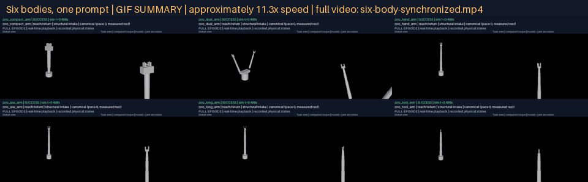 | 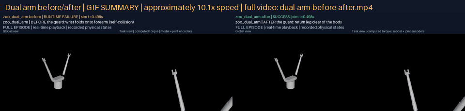 |
| [Full video](g05-d05/six-body-synchronized.mp4) | [Full video](g05-d05/dual-arm-before-after.mp4) |
| Each tile holds its final state until the longest episode ends | Left: pre-guard grounder, `RUNTIME FAILURE` (self-collision). Right: current grounder, `SUCCESS` |

Per-side dual-arm episodes: [before](g05-d05/dual-arm/before/media/episode.mp4)
([frames](g05-d05/dual-arm/before/media/frames.json)),
[after](g05-d05/dual-arm/after/media/episode.mp4)
([frames](g05-d05/dual-arm/after/media/frames.json)).

### Canonical trials, one per body

| Body | Summary | Full episode | Frame map |
|---|---|---|---|
| compact arm | 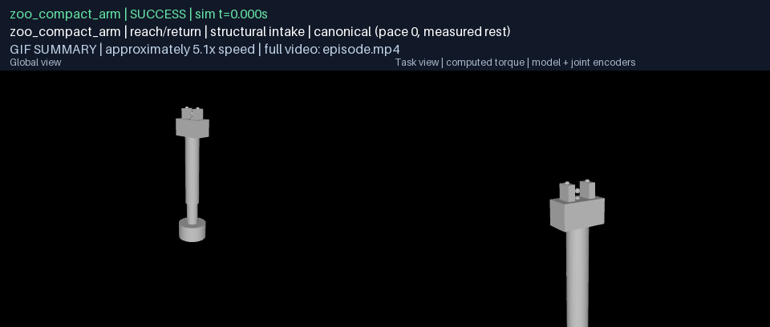 | [episode.mp4](g05-campaign/zoo_compact_arm/canonical/media/episode.mp4) | [frames.json](g05-campaign/zoo_compact_arm/canonical/media/frames.json) |
| dual arm | 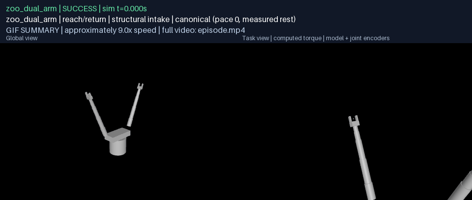 | [episode.mp4](g05-campaign/zoo_dual_arm/canonical/media/episode.mp4) | [frames.json](g05-campaign/zoo_dual_arm/canonical/media/frames.json) |
| hand arm | 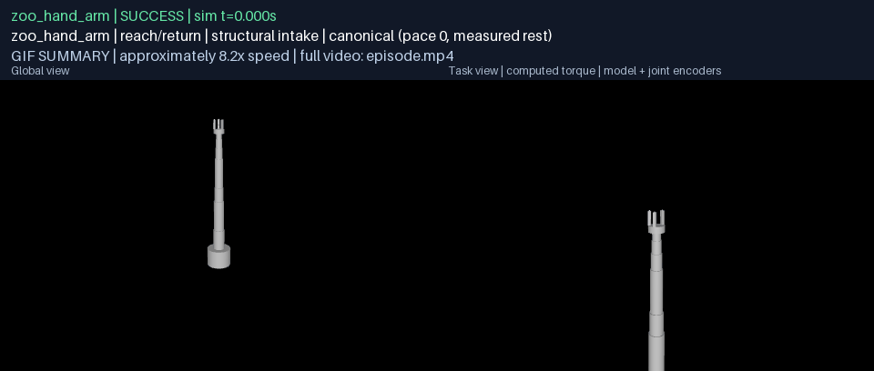 | [episode.mp4](g05-campaign/zoo_hand_arm/canonical/media/episode.mp4) | [frames.json](g05-campaign/zoo_hand_arm/canonical/media/frames.json) |
| jaw arm | 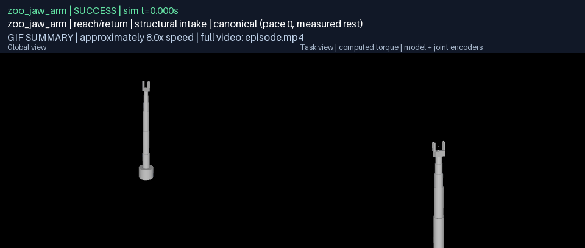 | [episode.mp4](g05-campaign/zoo_jaw_arm/canonical/media/episode.mp4) | [frames.json](g05-campaign/zoo_jaw_arm/canonical/media/frames.json) |
| long arm | 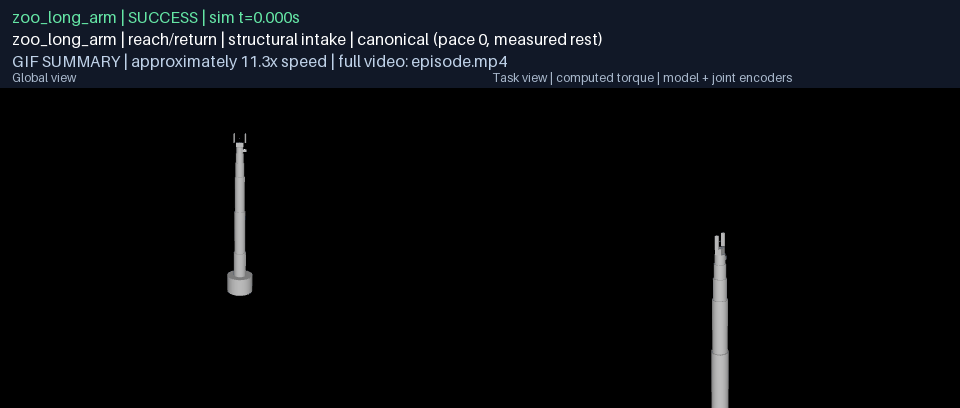 | [episode.mp4](g05-campaign/zoo_long_arm/canonical/media/episode.mp4) | [frames.json](g05-campaign/zoo_long_arm/canonical/media/frames.json) |
| tool arm | 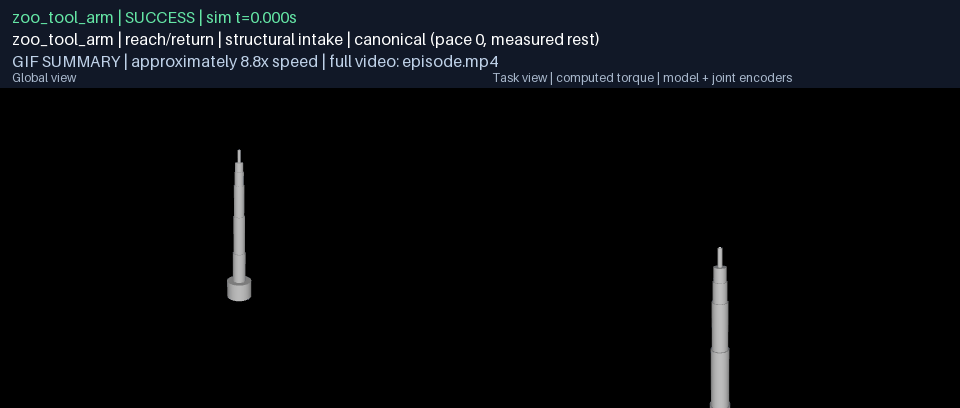 | [episode.mp4](g05-campaign/zoo_tool_arm/canonical/media/episode.mp4) | [frames.json](g05-campaign/zoo_tool_arm/canonical/media/frames.json) |

The 120 variant trials keep their full physical traces locally (untracked)
with SHA-256 digests in each `trials.json`; the roster and commit regenerate
any of them, and any bundle can be re-rendered without a model call with
`python -m rigby_general.evidence render <bundle> --out <dir>`.

### Refusals, one per invalid request

Every predeclared invalid request was refused before any motion; each clip is a two-second slate of the initial state, labelled `PRE EXECUTION REFUSAL` with the typed reason in the banner. None of these are counted as trials.

| Body | Invalid request | Typed refusal | Clip | Full slate | Frame map |
|---|---|---|---|---|---|
| zoo_compact_arm | start_beyond_limit | `unafforded_schema (start_state.joint_limit)` | 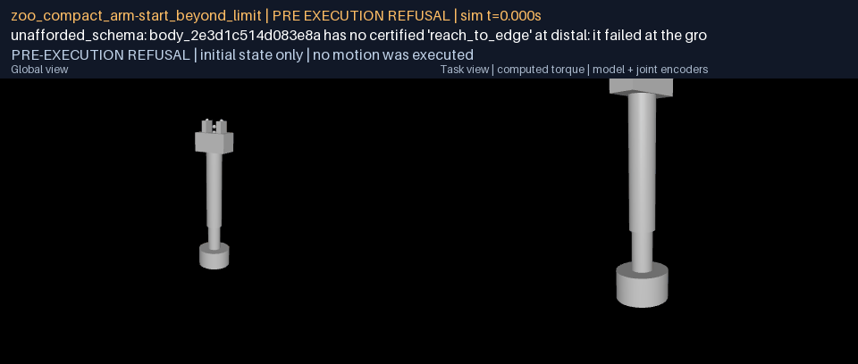 | [episode.mp4](g05-campaign/zoo_compact_arm/refusals/start_beyond_limit/media/episode.mp4) | [frames.json](g05-campaign/zoo_compact_arm/refusals/start_beyond_limit/media/frames.json) |
| zoo_compact_arm | unafforded_request | `unafforded_schema` | 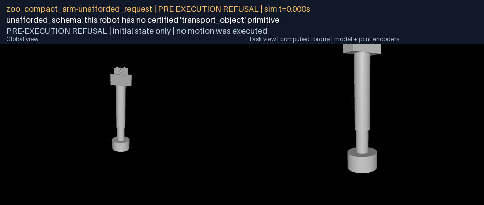 | [episode.mp4](g05-campaign/zoo_compact_arm/refusals/unafforded_request/media/episode.mp4) | [frames.json](g05-campaign/zoo_compact_arm/refusals/unafforded_request/media/frames.json) |
| zoo_compact_arm | start_self_collision | `unafforded_schema (start_state.self_collision)` | 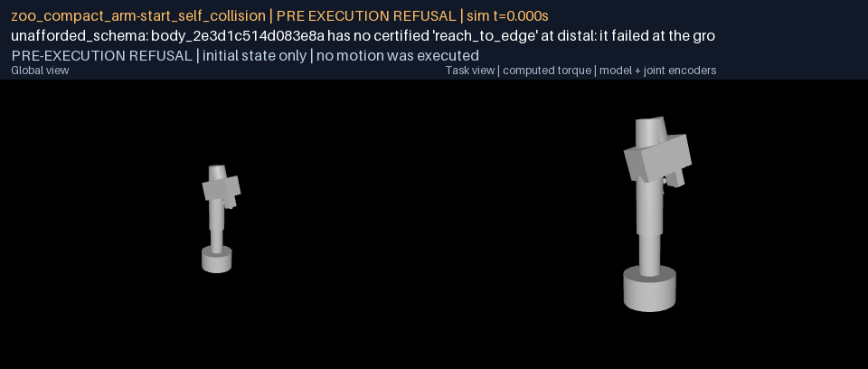 | [episode.mp4](g05-campaign/zoo_compact_arm/refusals/start_self_collision/media/episode.mp4) | [frames.json](g05-campaign/zoo_compact_arm/refusals/start_self_collision/media/frames.json) |
| zoo_dual_arm | start_beyond_limit | `unafforded_schema (start_state.joint_limit)` | 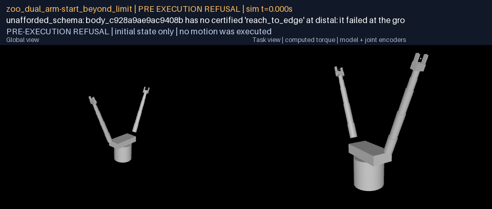 | [episode.mp4](g05-campaign/zoo_dual_arm/refusals/start_beyond_limit/media/episode.mp4) | [frames.json](g05-campaign/zoo_dual_arm/refusals/start_beyond_limit/media/frames.json) |
| zoo_dual_arm | unafforded_request | `unafforded_schema` | 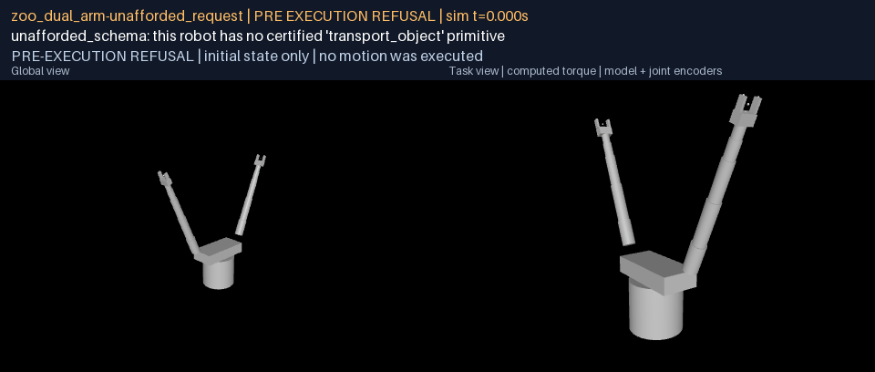 | [episode.mp4](g05-campaign/zoo_dual_arm/refusals/unafforded_request/media/episode.mp4) | [frames.json](g05-campaign/zoo_dual_arm/refusals/unafforded_request/media/frames.json) |
| zoo_dual_arm | start_self_collision | `unafforded_schema (start_state.self_collision)` | 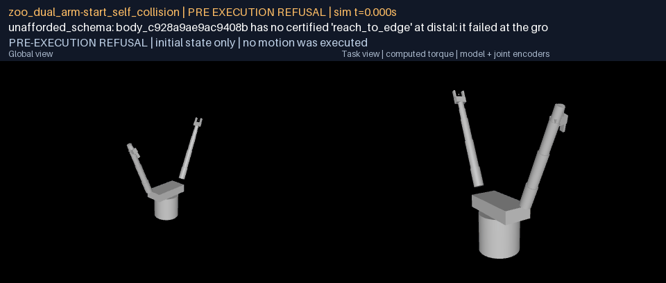 | [episode.mp4](g05-campaign/zoo_dual_arm/refusals/start_self_collision/media/episode.mp4) | [frames.json](g05-campaign/zoo_dual_arm/refusals/start_self_collision/media/frames.json) |
| zoo_hand_arm | start_beyond_limit | `unafforded_schema (start_state.joint_limit)` | 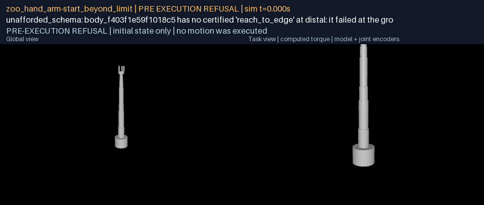 | [episode.mp4](g05-campaign/zoo_hand_arm/refusals/start_beyond_limit/media/episode.mp4) | [frames.json](g05-campaign/zoo_hand_arm/refusals/start_beyond_limit/media/frames.json) |
| zoo_hand_arm | unafforded_request | `unafforded_schema` | 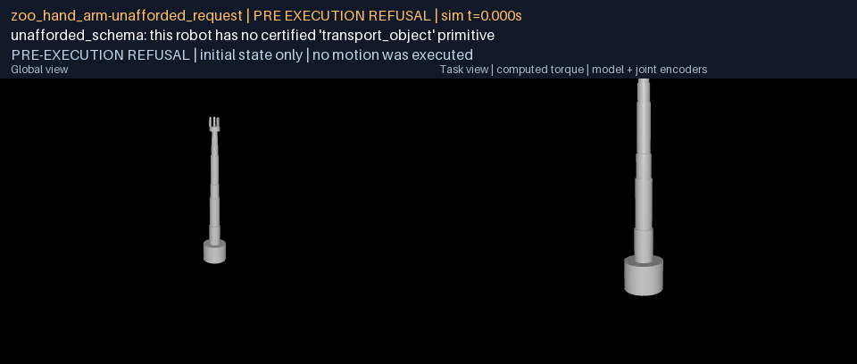 | [episode.mp4](g05-campaign/zoo_hand_arm/refusals/unafforded_request/media/episode.mp4) | [frames.json](g05-campaign/zoo_hand_arm/refusals/unafforded_request/media/frames.json) |
| zoo_hand_arm | start_self_collision | `unafforded_schema (start_state.self_collision)` | 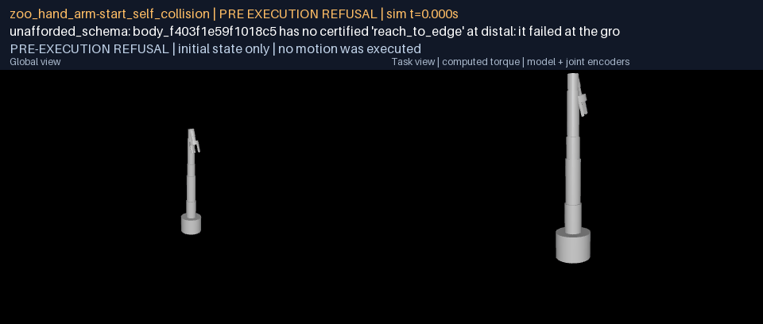 | [episode.mp4](g05-campaign/zoo_hand_arm/refusals/start_self_collision/media/episode.mp4) | [frames.json](g05-campaign/zoo_hand_arm/refusals/start_self_collision/media/frames.json) |
| zoo_jaw_arm | start_beyond_limit | `unafforded_schema (start_state.joint_limit)` | 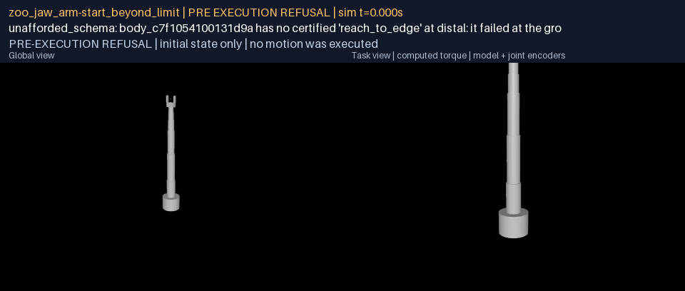 | [episode.mp4](g05-campaign/zoo_jaw_arm/refusals/start_beyond_limit/media/episode.mp4) | [frames.json](g05-campaign/zoo_jaw_arm/refusals/start_beyond_limit/media/frames.json) |
| zoo_jaw_arm | unafforded_request | `unafforded_schema` | 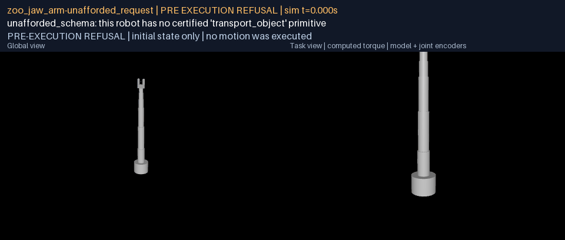 | [episode.mp4](g05-campaign/zoo_jaw_arm/refusals/unafforded_request/media/episode.mp4) | [frames.json](g05-campaign/zoo_jaw_arm/refusals/unafforded_request/media/frames.json) |
| zoo_jaw_arm | start_self_collision | `unafforded_schema (start_state.self_collision)` | 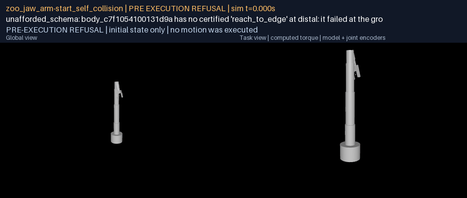 | [episode.mp4](g05-campaign/zoo_jaw_arm/refusals/start_self_collision/media/episode.mp4) | [frames.json](g05-campaign/zoo_jaw_arm/refusals/start_self_collision/media/frames.json) |
| zoo_long_arm | start_beyond_limit | `unafforded_schema (start_state.joint_limit)` | 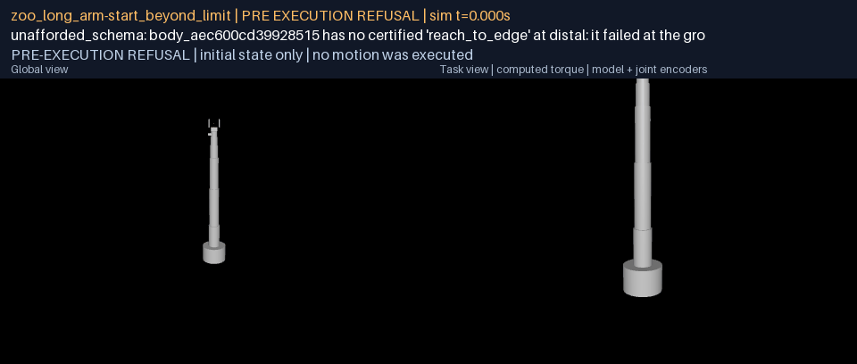 | [episode.mp4](g05-campaign/zoo_long_arm/refusals/start_beyond_limit/media/episode.mp4) | [frames.json](g05-campaign/zoo_long_arm/refusals/start_beyond_limit/media/frames.json) |
| zoo_long_arm | unafforded_request | `unafforded_schema` | 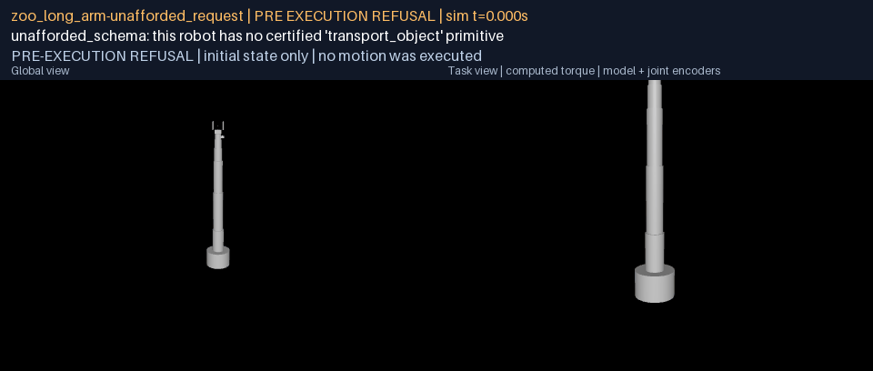 | [episode.mp4](g05-campaign/zoo_long_arm/refusals/unafforded_request/media/episode.mp4) | [frames.json](g05-campaign/zoo_long_arm/refusals/unafforded_request/media/frames.json) |
| zoo_long_arm | start_self_collision | `unafforded_schema (start_state.self_collision)` |  | [episode.mp4](g05-campaign/zoo_long_arm/refusals/start_self_collision/media/episode.mp4) | [frames.json](g05-campaign/zoo_long_arm/refusals/start_self_collision/media/frames.json) |
| zoo_tool_arm | start_beyond_limit | `unafforded_schema (start_state.joint_limit)` | 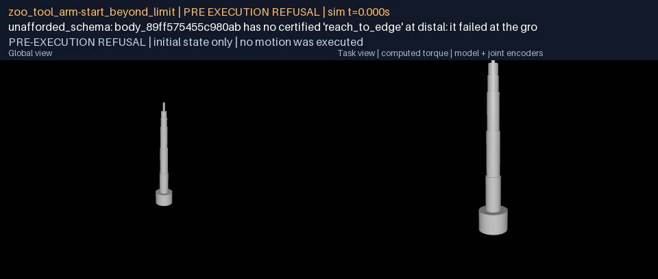 | [episode.mp4](g05-campaign/zoo_tool_arm/refusals/start_beyond_limit/media/episode.mp4) | [frames.json](g05-campaign/zoo_tool_arm/refusals/start_beyond_limit/media/frames.json) |
| zoo_tool_arm | unafforded_request | `unafforded_schema` | 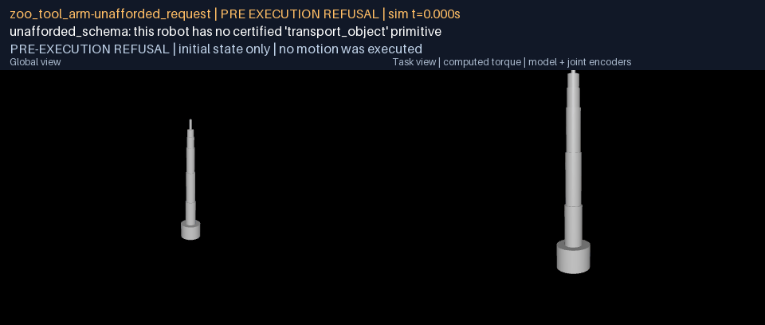 | [episode.mp4](g05-campaign/zoo_tool_arm/refusals/unafforded_request/media/episode.mp4) | [frames.json](g05-campaign/zoo_tool_arm/refusals/unafforded_request/media/frames.json) |
| zoo_tool_arm | start_self_collision | `unafforded_schema (start_state.self_collision)` | 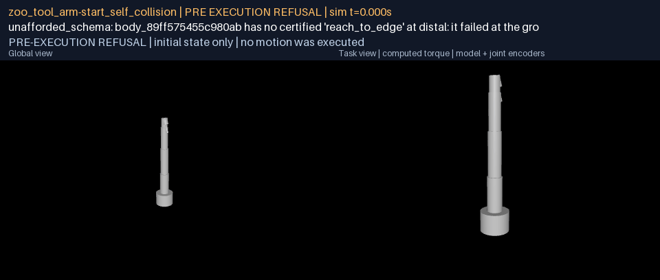 | [episode.mp4](g05-campaign/zoo_tool_arm/refusals/start_self_collision/media/episode.mp4) | [frames.json](g05-campaign/zoo_tool_arm/refusals/start_self_collision/media/frames.json) |

## Acceptance evidence

| Criterion | Evidence and outcome |
|---|---|
| G05.A01: exact prompt on all six bodies, fresh exact-region leaves, zero substitutions, unchanged limits, `left_joint_4` inside its range | Six canonical trials through the structural capability intake, each a sealed G01-style bundle with three identical native-clock replays and recorded-control physics replay. Twelve fresh leaves at duration scale 1.0, zero substitutions. The dual arm's wrist joint peaks at 1.99 rad of 2.85 and the return leg never touches the forearm. |
| G05.A02: at least 20 predeclared start/pace variants per body, at least 19 successful feasible trials, invalid requests typed and counted apart | Roster `g05-composition-v1` registered before any scored run (SHA-256 in `registration.json`): five paces of the prompt crossed with four start states per body, three invalid requests per body. Results table below; the pilot run at the pre-repair commit is retained beside the scored run. |
| G05.A03: all current physical gates retained, tracking and wall/execution time reported, canonical durations no slower than the recorded baseline | Every gate of `GatePolicy()` unchanged and the self-collision gate now effective. Five bodies reproduce their recorded canonical authored durations exactly; the dual arm's only recorded baseline was a refused, self-colliding 60.591 s program, and its executed canonical is 53.716 s. Per-trial tracking error, authored and physics durations, per-stage and total wall time are in each `trials.json`. |
| D05: six synchronized bodies, plus the old and repaired dual-arm transition | `g05-d05/six-body-synchronized.mp4` tiles the six canonical full-duration episodes on one physics clock; `g05-d05/dual-arm-before-after.mp4` runs the pre-guard grounder and the current grounder on the same body and prompt through identical physics. Both carry labelled GIF summaries. |

## What was wrong

The bounded-curve prerequisite (`g05-curves-report.md`) left one body failing:
the dual arm executed but demanded 2,922 N*m of a 95 N*m motor and pushed
`left_grip_left` 11 mm past its slide limit. Loading the recorded reference
into the model shows why. On the return leg the solver had folded the left
wrist to 2.85 rad, its limit, and at every key from 18.8 s to 23.5 s and again
from 44.0 s to 47.7 s the palm sat 28 mm and the finger 47 mm inside the
forearm. Every key was inside its joint range, so compilation accepted it; the
motor was fighting a contact, and the contact was what shoved the finger.

The self-collision gate should have named that. It could not, on this body or
any other. Ingest built the manifest's collision exclusions from the
morphology's `self_collision_pairs`, which is the list of pairs that *could*
touch, kept for guarding IK. Every non-adjacent pair was therefore excluded
from the gate: 136 of 136 on the dual arm, 21 of 21 on the compact arm, 55, 36,
46 and 15 on the others. The same list was written into grasp scenes as
`<contact><exclude>`, so contact physics between non-adjacent links was
switched off there too.

## The repairs

All three are general. No robot, joint or link name appears in any branch;
the pairs are found by structure, the bodies by their contact filter, the
starts by draw.

**Exclusions.** The manifest excludes only what ingest proved inseparable:
parent-child hulls authored inside one another at every pose of the joints
between them, and recorded rest overlaps. The public zoo now has one exclusion
in total, a wrist camera welded 9.9 mm inside its parent link. The morphology's
guard list mirrors the engine's own filter: pairs in one weld, or a weld
against the weld it hangs from, are dropped, because physics never reports
them and the gate cannot see them either.

**Guarded IK.** The grounder's damped-least-squares solver keeps guarded pairs
apart while it converges. A private copy of the model carries a contact
margin on every guarded geom, so MuJoCo's own contact solver reports each
guarded pair inside the clearance with the distance, point and normal it would
use in physics; closed-form distance queries were tried first and are not
reliable for every geom pair the engine handles (two boxes, for one).
Separation is the solver's first-priority task and the waypoint is solved in
the freedom that remains. An additive push was tried first and stalled 13 mm
short of the waypoint on the dual arm, the push and the target fighting over
the same wrist joint every iteration. Penetration at any key, or along any
span between keys, is a typed refusal naming the pair and the depth; a
waypoint held off by a guarded pair is typed as a collision, not as
unreachable. The start state is validated the same way.

The clearance is twice the solver's 4 mm waypoint tolerance, or half a percent
of reach, whichever is larger. A generous clearance, one tracking tolerance of
the certification gate (3.5 % of reach), was tried first: it reshaped postures
on bodies whose links pass within centimetres by design and cost them up to
five percent in duration for a margin their sub-millimetre tracking never
needed. At the small clearance the five previously passing bodies reproduce
their recorded authored durations to the microsecond.

**Least-deflection repair.** The two pilot runs exposed two classes of
straight span a body cannot follow, both properties of the line rather than
of the request. From a start displaced 0.14 rad backward on three pitch
joints, the compact arm's straight line from behind its head to a point in
front of and level with its base runs through the base; the pre-guard
grounder produced that reference with the upper links 31 mm inside the base
and no gate that could say so, and the guarded solver refused it, typed as a
collision. From another displaced start, the long arm's straight return from
the medial point to its fully extended rest pose, seeded from where the reach
had left it, led the damped solver into a bent configuration it could not
straighten: it stalled 20.8 mm from home with every joint well inside its
range, at a singularity, and no number of iterations moved it. The grounder
now retries a span the straight line cannot follow, for either reason, along
the least of three deflections (0.15, 0.3 and 0.5 of reach) pushed outward
from the chain root in the horizontal plane, then upward, and records every
repair with the span, the kind of obstruction, the via point, the blocking
pair or the stalled residual, and the refusal text, in the program's metadata
and the leaf's measurements. A span no deflection clears keeps its typed
refusal; a first point that cannot be reached at all is not a span problem
and is refused as before. The schema still means what it said; the executed
path is disclosed, per trial, as straight or repaired.

## Campaign

The roster (`any-robot/assets/general/research-protocols/g05-composition-v1`)
was frozen and registered before a scored trial ran. Per body: five paces of
the prompt (very slow, slow, neutral, quick, flat out, read per clause by the
offline planner) crossed with four starts: the measured rest pose and three
displaced starts drawn once from seed 20260912 with at most 0.15 rad per
positioning joint, clipped one percent inside every limit, written out
numerically, redrawn only if the body could not hold them (zero redraws were
needed). Three invalid requests per body: a start past a joint limit, a
request for a contact schema the campaign does not certify, and a start with
the body inside itself, found by folding the distal joints and confirmed by
the same guard the grounder uses. 120 feasible trials, 18 invalid requests,
none unconstructible.

A trial succeeds when the pipeline accepts the composed prompt: both leaves
freshly baked at the exact requested region, zero region substitutions, the
composition certified by every physical gate on three identical native-clock
replays. One attempt per trial; nothing was re-drawn or removed.

Bodies enter through the G03 structural capability intake, so trials carry
hashed rig identities and canonical joint names; the roster records each
package digest and the runner refuses to run if intake no longer matches it,
or if the roster no longer matches its registration.

### Results

| Body | Feasible successes | Straight | With path repair | Failed trials | Invalid requests typed correctly | Worst tracking (mm) | Mean wall time per trial (s) |
|---|---:|---:|---:|---|---:|---:|---:|
| zoo_compact_arm | 20/20 | 15 | 5 | none | 3/3 | 0.13 | 20.4 |
| zoo_dual_arm | 20/20 | 20 | 0 | none | 3/3 | 0.14 | 29.2 |
| zoo_hand_arm | 20/20 | 20 | 0 | none | 3/3 | 0.15 | 36.3 |
| zoo_jaw_arm | 20/20 | 20 | 0 | none | 3/3 | 0.21 | 30.3 |
| zoo_long_arm | 20/20 | 15 | 5 | none | 3/3 | 0.17 | 40.7 |
| zoo_tool_arm | 20/20 | 20 | 0 | none | 3/3 | 0.16 | 30.5 |

Two pilot runs of the same registered roster are retained with every
per-trial record (their canonical bundles, identical in outcome to the scored
run's, were not kept; their digests are in each `trials.json`).
`g05-campaign-pilot-1`, at the commit with the guard but no repair, failed
exactly ten trials: the five paces of one compact-arm start, typed as
self-collision, and the five paces of one long-arm start, typed as
unreachable. `g05-campaign-pilot-2`, with the collision-keyed repair, failed
the same five long-arm trials. Each time the whole roster was re-run at the
new commit rather than the failing trials alone.

Invalid requests: 18 of 18 predeclared invalid requests were refused with the expected typed code and measurement: a start past a joint limit as `ungroundable` with `start_state.joint_limit`, a start inside the body as `ungroundable` with `start_state.self_collision`, and the contact request as `unafforded_schema` at planning. None were counted as trials.

### Durations and timing

| Body | Recorded baseline (s) | Canonical now (s) | Change |
|---|---:|---:|---|
| zoo_compact_arm | 30.509918 | 30.509918 | identical |
| zoo_dual_arm | 60.591332 | 53.716499 | -6.875 s against a refused, self-colliding baseline |
| zoo_hand_arm | 49.245976 | 49.245976 | identical |
| zoo_jaw_arm | 47.844854 | 47.844854 | identical |
| zoo_long_arm | 67.454452 | 67.454452 | identical |
| zoo_tool_arm | 52.437660 | 52.437660 | identical |

The baseline column is the authored duration recorded in
`g05-curves-report.md` at commit `5a6c0b3` (legacy intake, native clock,
bounded curves). The dual arm's baseline is the refused, self-colliding
program; no valid recorded execution existed for it. Physics durations match
authored durations within one native timestep (0.002 s) on every trial.

Per-stage wall time (planning, binding, compilation, certification) and total
wall time per trial are in each body's `trials.json`; the canonical trials
took 17 to 38 s of wall time each including the fresh leaf bakes, on the
review laptop with no other load controlled.

## Tests

| Suite | Result |
|---|---|
| any-robot, with external assets linked | 396 passed, 5 skipped (one hand asset absent from this checkout) |
| core | 263 passed, 2 skipped (Windows symlink privilege) |
| new `test_general_self_collision.py` | 13 passed |

The exotic-body tests were run with the fetched `iiwa7`, `kuka_lwr`, `panda`,
`pr2_gripper` and `cartpole` descriptions present; the fetched SO-ARM101 and
Beetlebot keep their authored-overlap exclusions and pass unchanged.

## Reproduction

From the repository root in the workspace environment:

```sh
python any-robot/scripts/g05_roster.py                        # refuses: the roster is registered
python any-robot/scripts/g05_composition_campaign.py --out <fresh> --local <fresh> --render
python any-robot/scripts/g05_d05_media.py --campaign <campaign> --out <fresh>
python docs/results/verify_g05.py --replay
```

The campaign re-runs the physics; the verifier replays every sealed bundle's
recorded controls without a model call. Full variant traces are written
locally (untracked) and their hashes are committed.

## What this does not establish

Free-space reach/return on six fixed-base development bodies. No grasp,
transport, locomotion, sensor, VLM or unseen-topology capability is claimed.
The least-deflection repair is a bounded heuristic with two directions and
three magnitudes; it reports what it could not clear. The structural intake's
sensor classification remains a G03 limitation. CI could not run: GitHub
Actions is still refused by the account billing restriction recorded in the
progress ledger, so the numbers above are local.
