# G06: contact primitives across the five gripper-bearing bodies

Every gripper-bearing public zoo body was asked to approach a cube, close
on it, lift it, hold it, carry it to a platform, set it down and let go, in
one fixed world chosen and frozen from an independent feasibility map before
any controller ran, with the outcome decided by a placement evaluator the
controller never reads. Three structural configurations, the bimanual dual
arm, the jaw arm and the long-reach jaw arm, certify the whole transfer on
their canonical normalized world, on the fixed world's nominal cube and on at
least 90 of the 100 registered perturbation seeds. The multifinger hand
certifies its own capability-normalized world and fails every fixed-world
seed with the failure typed and measured; the compact arm is infeasible by
two checkable necessary conditions and is refused before it moves. This
report records the primitive, the world, the four repairs with their
before/after pairs, the two scored passes of the roster and the D06 media. It makes no
claim about recovery, language, vision or bodies outside the public zoo.

Source commits: see `g06-validation.json` (`campaign_commit`, `d06_commit`).
Verifier: `python docs/results/verify_g06.py [--replay]` from the workspace
environment. No API or model calls were made anywhere in this work.

## Playback

Every clip below is rendered from recorded physical states, at real-time
playback with the simulation clock and the outcome in the banner. The GIF is
a labelled, accelerated summary; the MP4 is the evidence. `frames.json`
beside each MP4 maps every video frame to its recorded sample and
simulation time. Failures and the refusal are shown as such; nothing was
removed to raise a count.

### D06

| Five bodies, one fixed world, one physics clock | The enabled set, synchronized |
|---|---|
| 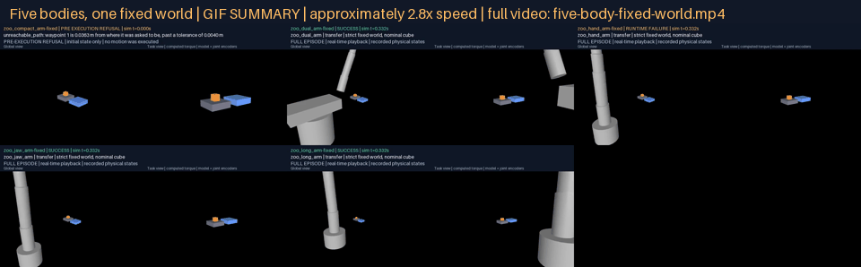 | 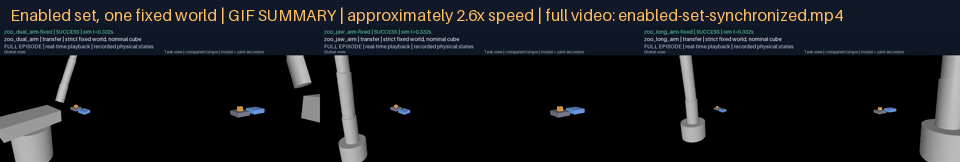 |
| [Full video](g06-d06/five-body-fixed-world.mp4) | [Full video](g06-d06/enabled-set-synchronized.mp4) |
| Top row: compact arm (`PRE EXECUTION REFUSAL`), dual arm, hand arm (`RUNTIME FAILURE`); bottom row: jaw arm, long arm. Each tile holds its final recorded state until the longest episode ends | Dual, jaw and long arms, each `SUCCESS`, on the same clock |

Before and after each repair, through identical physics (same body, same
world, same primitive; left without the repair, right with it):

| Repair | Body | Left | Right | Pair | Full video | Sides |
|---|---|---|---|---|---|---|
| facing | zoo_hand_arm | `grasp_not_achieved`: a digit through the bench, no opposition | `hold_not_sustained`: vertical approach, three-digit opposition, the cube lifted, then lost | 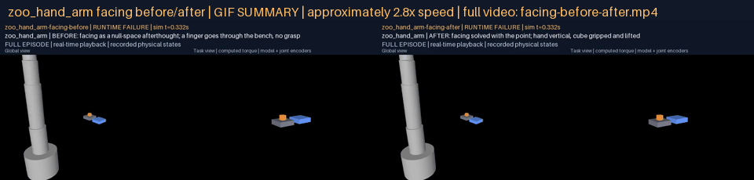 | [facing-before-after.mp4](g06-d06/facing-before-after.mp4) | [before](g06-d06/facing/before/media/episode.mp4) ([frames](g06-d06/facing/before/media/frames.json)), [after](g06-d06/facing/after/media/episode.mp4) ([frames](g06-d06/facing/after/media/frames.json)) |
| standoff | zoo_jaw_arm | `hold_not_sustained`: both fingers driven into the bench and the platform, the cube flicked out of the closing fingers | `SUCCESS` | 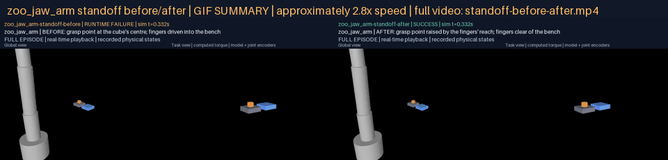 | [standoff-before-after.mp4](g06-d06/standoff-before-after.mp4) | [before](g06-d06/standoff/before/media/episode.mp4) ([frames](g06-d06/standoff/before/media/frames.json)), [after](g06-d06/standoff/after/media/episode.mp4) ([frames](g06-d06/standoff/after/media/frames.json)) |
| turn (seeded) | zoo_jaw_arm | pilot 1, seed 5: `grasp_not_achieved`, the cube knocked off the bench during the descent | `SUCCESS`, the same seed at the repaired commit | 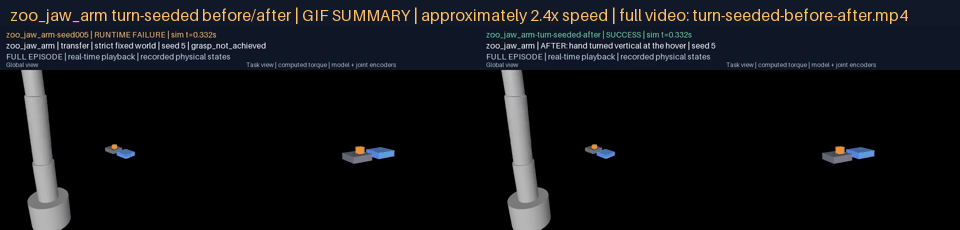 | [turn-seeded-before-after.mp4](g06-d06/turn-seeded-before-after.mp4) | [after](g06-d06/turn-seeded/after/media/episode.mp4) ([frames](g06-d06/turn-seeded/after/media/frames.json)); the before side is the pilot's own episode, linked in the pilot table below |
| turn (normalized) | zoo_long_arm | pilot 1, normalized world x1.55: `grasp_not_achieved`, the fingers swept through the cube during the turn | `SUCCESS`, the same world at the repaired commit | 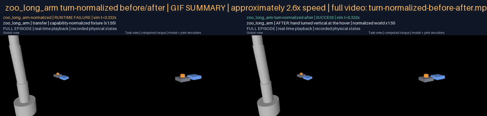 | [turn-normalized-before-after.mp4](g06-d06/turn-normalized-before-after.mp4) | [after](g06-d06/turn-normalized/after/media/episode.mp4) ([frames](g06-d06/turn-normalized/after/media/frames.json)); the before side is the pilot's own episode, linked in the pilot table below |

### Canonical transfers, two tracks per attempted body

| Body | Track | Outcome | Summary | Full episode | Frame map |
|---|---|---|---|---|---|
| zoo_compact_arm | capability-normalized (x0.29) | `RUNTIME FAILURE` `object_not_lifted` | 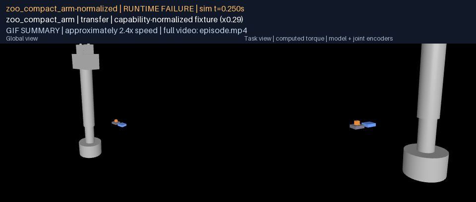 | [episode.mp4](g06-campaign/zoo_compact_arm/normalized/media/episode.mp4) | [frames.json](g06-campaign/zoo_compact_arm/normalized/media/frames.json) |
| zoo_compact_arm | strict fixed world | `PRE EXECUTION REFUSAL` `unreachable_path` |  | [episode.mp4](g06-campaign/zoo_compact_arm/fixed-canonical/media/episode.mp4) | [frames.json](g06-campaign/zoo_compact_arm/fixed-canonical/media/frames.json) |
| zoo_dual_arm | capability-normalized (x1.00) | `SUCCESS` | 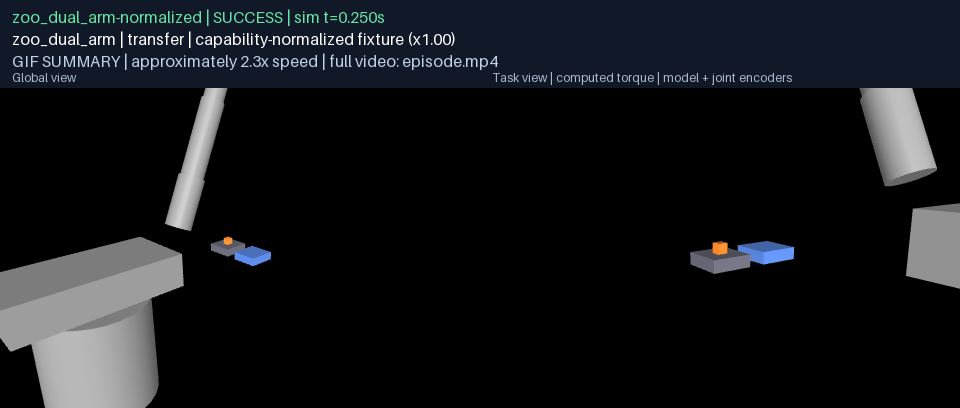 | [episode.mp4](g06-campaign/zoo_dual_arm/normalized/media/episode.mp4) | [frames.json](g06-campaign/zoo_dual_arm/normalized/media/frames.json) |
| zoo_dual_arm | strict fixed world | `SUCCESS` |  | [episode.mp4](g06-campaign/zoo_dual_arm/fixed-canonical/media/episode.mp4) | [frames.json](g06-campaign/zoo_dual_arm/fixed-canonical/media/frames.json) |
| zoo_hand_arm | capability-normalized (x1.04) | `SUCCESS` | 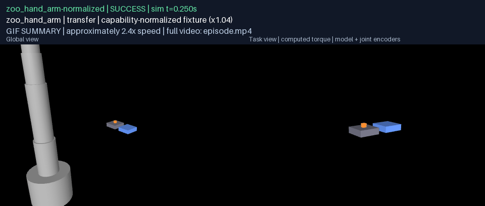 | [episode.mp4](g06-campaign/zoo_hand_arm/normalized/media/episode.mp4) | [frames.json](g06-campaign/zoo_hand_arm/normalized/media/frames.json) |
| zoo_hand_arm | strict fixed world | `RUNTIME FAILURE` `hold_not_sustained` |  | [episode.mp4](g06-campaign/zoo_hand_arm/fixed-canonical/media/episode.mp4) | [frames.json](g06-campaign/zoo_hand_arm/fixed-canonical/media/frames.json) |
| zoo_jaw_arm | capability-normalized (x1.00) | `SUCCESS` |  | [episode.mp4](g06-campaign/zoo_jaw_arm/normalized/media/episode.mp4) | [frames.json](g06-campaign/zoo_jaw_arm/normalized/media/frames.json) |
| zoo_jaw_arm | strict fixed world | `SUCCESS` |  | [episode.mp4](g06-campaign/zoo_jaw_arm/fixed-canonical/media/episode.mp4) | [frames.json](g06-campaign/zoo_jaw_arm/fixed-canonical/media/frames.json) |
| zoo_long_arm | capability-normalized (x1.55) | `SUCCESS` |  | [episode.mp4](g06-campaign/zoo_long_arm/normalized/media/episode.mp4) | [frames.json](g06-campaign/zoo_long_arm/normalized/media/frames.json) |
| zoo_long_arm | strict fixed world | `SUCCESS` |  | [episode.mp4](g06-campaign/zoo_long_arm/fixed-canonical/media/episode.mp4) | [frames.json](g06-campaign/zoo_long_arm/fixed-canonical/media/frames.json) |

### Seeded trials rendered in full

The first five certified seeds of each enabled body and the first five
failures of each kind per body (every failure of the dual and jaw arms) are
rendered in full; every one of the 100 seeds per feasible body keeps its
full trace and its row in `trials.json`, and every rendered seed's replayable
bundle is in the local results tree with its digest in that row.

| Body | Seed | Registered draw | Outcome | Summary | Full episode | Frame map |
|---|---:|---|---|---|---|---|
| zoo_compact_arm | 0 | (-11.4, -5.9) mm, mass x0.92, friction x1.02 | `PRE EXECUTION REFUSAL` `unreachable_path` |  | [episode.mp4](g06-campaign/zoo_compact_arm/fixed/seed-000/media/episode.mp4) | [frames.json](g06-campaign/zoo_compact_arm/fixed/seed-000/media/frames.json) |
| zoo_dual_arm | 0 | (-11.4, -5.9) mm, mass x0.92, friction x1.02 | `SUCCESS` |  | [episode.mp4](g06-campaign/zoo_dual_arm/fixed/seed-000/media/episode.mp4) | [frames.json](g06-campaign/zoo_dual_arm/fixed/seed-000/media/frames.json) |
| zoo_dual_arm | 1 | (-12.0, +3.8) mm, mass x1.17, friction x0.91 | `SUCCESS` |  | [episode.mp4](g06-campaign/zoo_dual_arm/fixed/seed-001/media/episode.mp4) | [frames.json](g06-campaign/zoo_dual_arm/fixed/seed-001/media/frames.json) |
| zoo_dual_arm | 2 | (+1.5, -7.2) mm, mass x1.08, friction x0.82 | `SUCCESS` | 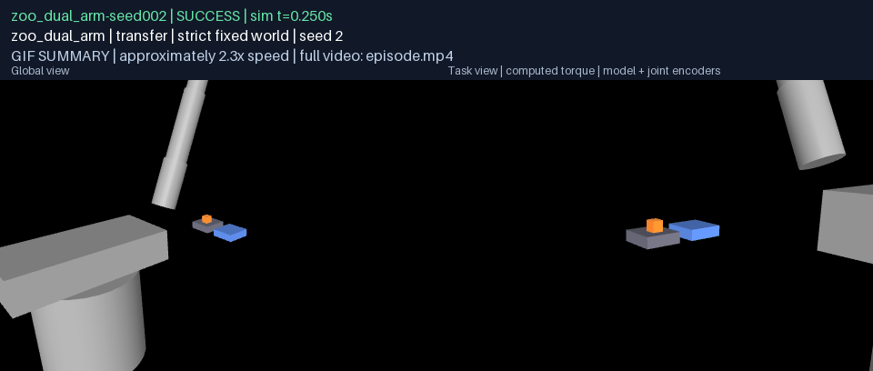 | [episode.mp4](g06-campaign/zoo_dual_arm/fixed/seed-002/media/episode.mp4) | [frames.json](g06-campaign/zoo_dual_arm/fixed/seed-002/media/frames.json) |
| zoo_dual_arm | 3 | (+1.9, +8.6) mm, mass x1.04, friction x1.07 | `SUCCESS` | 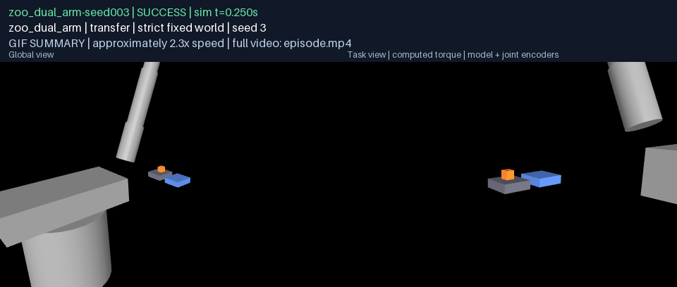 | [episode.mp4](g06-campaign/zoo_dual_arm/fixed/seed-003/media/episode.mp4) | [frames.json](g06-campaign/zoo_dual_arm/fixed/seed-003/media/frames.json) |
| zoo_dual_arm | 4 | (-2.3, -3.5) mm, mass x0.96, friction x1.02 | `SUCCESS` |  | [episode.mp4](g06-campaign/zoo_dual_arm/fixed/seed-004/media/episode.mp4) | [frames.json](g06-campaign/zoo_dual_arm/fixed/seed-004/media/frames.json) |
| zoo_dual_arm | 80 | (+13.6, +8.6) mm, mass x0.89, friction x0.80 | `RUNTIME FAILURE` `hold_not_sustained` | 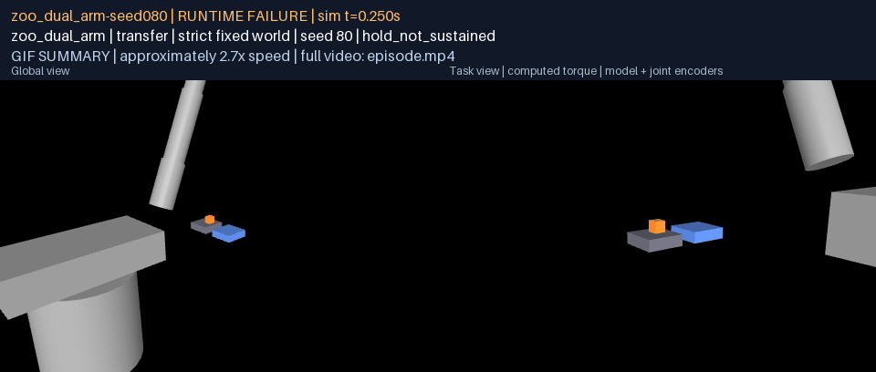 | [episode.mp4](g06-campaign/zoo_dual_arm/fixed/seed-080/media/episode.mp4) | [frames.json](g06-campaign/zoo_dual_arm/fixed/seed-080/media/frames.json) |
| zoo_hand_arm | 0 | (-11.4, -5.9) mm, mass x0.92, friction x1.02 | `RUNTIME FAILURE` `hold_not_sustained` |  | [episode.mp4](g06-campaign/zoo_hand_arm/fixed/seed-000/media/episode.mp4) | [frames.json](g06-campaign/zoo_hand_arm/fixed/seed-000/media/frames.json) |
| zoo_hand_arm | 1 | (-12.0, +3.8) mm, mass x1.17, friction x0.91 | `RUNTIME FAILURE` `hold_not_sustained` |  | [episode.mp4](g06-campaign/zoo_hand_arm/fixed/seed-001/media/episode.mp4) | [frames.json](g06-campaign/zoo_hand_arm/fixed/seed-001/media/frames.json) |
| zoo_hand_arm | 2 | (+1.5, -7.2) mm, mass x1.08, friction x0.82 | `RUNTIME FAILURE` `hold_not_sustained` |  | [episode.mp4](g06-campaign/zoo_hand_arm/fixed/seed-002/media/episode.mp4) | [frames.json](g06-campaign/zoo_hand_arm/fixed/seed-002/media/frames.json) |
| zoo_hand_arm | 3 | (+1.9, +8.6) mm, mass x1.04, friction x1.07 | `RUNTIME FAILURE` `hold_not_sustained` |  | [episode.mp4](g06-campaign/zoo_hand_arm/fixed/seed-003/media/episode.mp4) | [frames.json](g06-campaign/zoo_hand_arm/fixed/seed-003/media/frames.json) |
| zoo_hand_arm | 4 | (-2.3, -3.5) mm, mass x0.96, friction x1.02 | `RUNTIME FAILURE` `hold_not_sustained` |  | [episode.mp4](g06-campaign/zoo_hand_arm/fixed/seed-004/media/episode.mp4) | [frames.json](g06-campaign/zoo_hand_arm/fixed/seed-004/media/frames.json) |
| zoo_hand_arm | 49 | (-11.2, -5.0) mm, mass x1.04, friction x0.81 | `RUNTIME FAILURE` `object_not_lifted` |  | [episode.mp4](g06-campaign/zoo_hand_arm/fixed/seed-049/media/episode.mp4) | [frames.json](g06-campaign/zoo_hand_arm/fixed/seed-049/media/frames.json) |
| zoo_hand_arm | 52 | (-18.1, -5.7) mm, mass x1.18, friction x0.84 | `RUNTIME FAILURE` `object_not_lifted` |  | [episode.mp4](g06-campaign/zoo_hand_arm/fixed/seed-052/media/episode.mp4) | [frames.json](g06-campaign/zoo_hand_arm/fixed/seed-052/media/frames.json) |
| zoo_hand_arm | 68 | (+7.8, -14.8) mm, mass x1.13, friction x0.87 | `RUNTIME FAILURE` `object_not_lifted` | 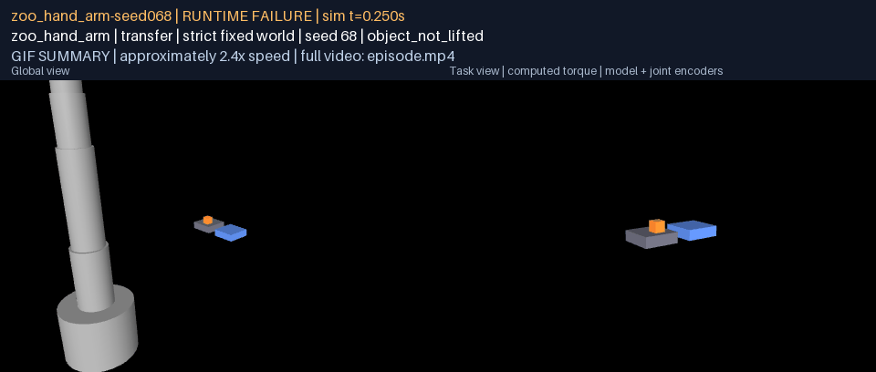 | [episode.mp4](g06-campaign/zoo_hand_arm/fixed/seed-068/media/episode.mp4) | [frames.json](g06-campaign/zoo_hand_arm/fixed/seed-068/media/frames.json) |
| zoo_hand_arm | 72 | (-9.3, +10.8) mm, mass x1.09, friction x1.04 | `RUNTIME FAILURE` `object_not_lifted` |  | [episode.mp4](g06-campaign/zoo_hand_arm/fixed/seed-072/media/episode.mp4) | [frames.json](g06-campaign/zoo_hand_arm/fixed/seed-072/media/frames.json) |
| zoo_hand_arm | 80 | (+13.6, +8.6) mm, mass x0.89, friction x0.80 | `RUNTIME FAILURE` `object_not_lifted` | 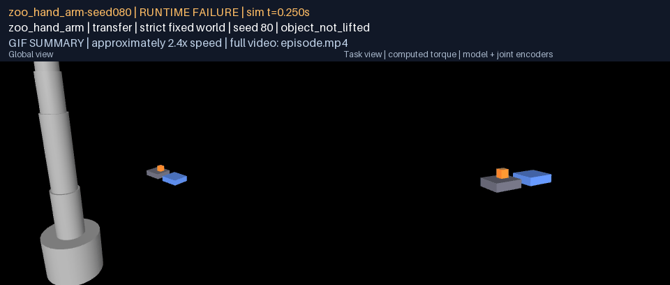 | [episode.mp4](g06-campaign/zoo_hand_arm/fixed/seed-080/media/episode.mp4) | [frames.json](g06-campaign/zoo_hand_arm/fixed/seed-080/media/frames.json) |
| zoo_jaw_arm | 0 | (-11.4, -5.9) mm, mass x0.92, friction x1.02 | `SUCCESS` |  | [episode.mp4](g06-campaign/zoo_jaw_arm/fixed/seed-000/media/episode.mp4) | [frames.json](g06-campaign/zoo_jaw_arm/fixed/seed-000/media/frames.json) |
| zoo_jaw_arm | 1 | (-12.0, +3.8) mm, mass x1.17, friction x0.91 | `SUCCESS` |  | [episode.mp4](g06-campaign/zoo_jaw_arm/fixed/seed-001/media/episode.mp4) | [frames.json](g06-campaign/zoo_jaw_arm/fixed/seed-001/media/frames.json) |
| zoo_jaw_arm | 2 | (+1.5, -7.2) mm, mass x1.08, friction x0.82 | `SUCCESS` |  | [episode.mp4](g06-campaign/zoo_jaw_arm/fixed/seed-002/media/episode.mp4) | [frames.json](g06-campaign/zoo_jaw_arm/fixed/seed-002/media/frames.json) |
| zoo_jaw_arm | 3 | (+1.9, +8.6) mm, mass x1.04, friction x1.07 | `SUCCESS` |  | [episode.mp4](g06-campaign/zoo_jaw_arm/fixed/seed-003/media/episode.mp4) | [frames.json](g06-campaign/zoo_jaw_arm/fixed/seed-003/media/frames.json) |
| zoo_jaw_arm | 4 | (-2.3, -3.5) mm, mass x0.96, friction x1.02 | `SUCCESS` |  | [episode.mp4](g06-campaign/zoo_jaw_arm/fixed/seed-004/media/episode.mp4) | [frames.json](g06-campaign/zoo_jaw_arm/fixed/seed-004/media/frames.json) |
| zoo_jaw_arm | 52 | (-18.1, -5.7) mm, mass x1.18, friction x0.84 | `RUNTIME FAILURE` `object_not_lifted` |  | [episode.mp4](g06-campaign/zoo_jaw_arm/fixed/seed-052/media/episode.mp4) | [frames.json](g06-campaign/zoo_jaw_arm/fixed/seed-052/media/frames.json) |
| zoo_jaw_arm | 96 | (-11.3, -3.9) mm, mass x1.10, friction x0.83 | `RUNTIME FAILURE` `object_not_lifted` |  | [episode.mp4](g06-campaign/zoo_jaw_arm/fixed/seed-096/media/episode.mp4) | [frames.json](g06-campaign/zoo_jaw_arm/fixed/seed-096/media/frames.json) |
| zoo_long_arm | 0 | (-11.4, -5.9) mm, mass x0.92, friction x1.02 | `SUCCESS` |  | [episode.mp4](g06-campaign/zoo_long_arm/fixed/seed-000/media/episode.mp4) | [frames.json](g06-campaign/zoo_long_arm/fixed/seed-000/media/frames.json) |
| zoo_long_arm | 1 | (-12.0, +3.8) mm, mass x1.17, friction x0.91 | `SUCCESS` | 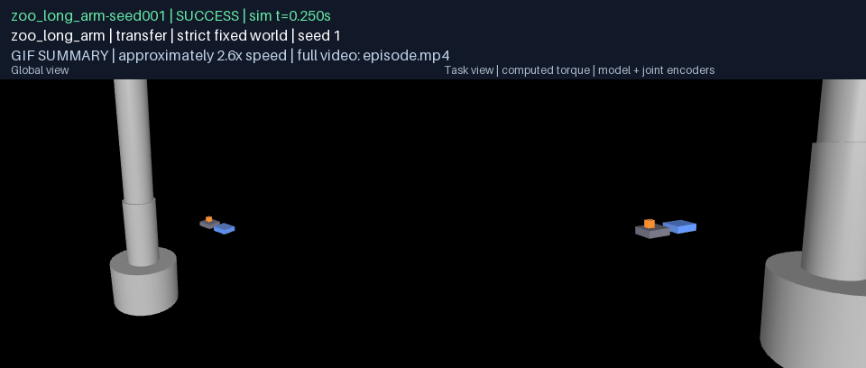 | [episode.mp4](g06-campaign/zoo_long_arm/fixed/seed-001/media/episode.mp4) | [frames.json](g06-campaign/zoo_long_arm/fixed/seed-001/media/frames.json) |
| zoo_long_arm | 2 | (+1.5, -7.2) mm, mass x1.08, friction x0.82 | `SUCCESS` |  | [episode.mp4](g06-campaign/zoo_long_arm/fixed/seed-002/media/episode.mp4) | [frames.json](g06-campaign/zoo_long_arm/fixed/seed-002/media/frames.json) |
| zoo_long_arm | 3 | (+1.9, +8.6) mm, mass x1.04, friction x1.07 | `SUCCESS` |  | [episode.mp4](g06-campaign/zoo_long_arm/fixed/seed-003/media/episode.mp4) | [frames.json](g06-campaign/zoo_long_arm/fixed/seed-003/media/frames.json) |
| zoo_long_arm | 4 | (-2.3, -3.5) mm, mass x0.96, friction x1.02 | `SUCCESS` |  | [episode.mp4](g06-campaign/zoo_long_arm/fixed/seed-004/media/episode.mp4) | [frames.json](g06-campaign/zoo_long_arm/fixed/seed-004/media/frames.json) |

### Pilot 1: the first scored pass, before the turn phase

Run whole on the same registered roster at commit `f68ab68`. Its
rendered episodes are kept with their frame maps; its replayable bundles are
not, their digests being in each `trials.json`.

| Body | Track or seed | Outcome | Summary | Full episode | Frame map |
|---|---|---|---|---|---|
| zoo_compact_arm | capability-normalized | `RUNTIME FAILURE` `object_not_lifted` |  | [episode.mp4](g06-campaign-pilot-1/zoo_compact_arm/normalized/media/episode.mp4) | [frames.json](g06-campaign-pilot-1/zoo_compact_arm/normalized/media/frames.json) |
| zoo_compact_arm | strict fixed world, nominal | `PRE EXECUTION REFUSAL` `unreachable_path` | 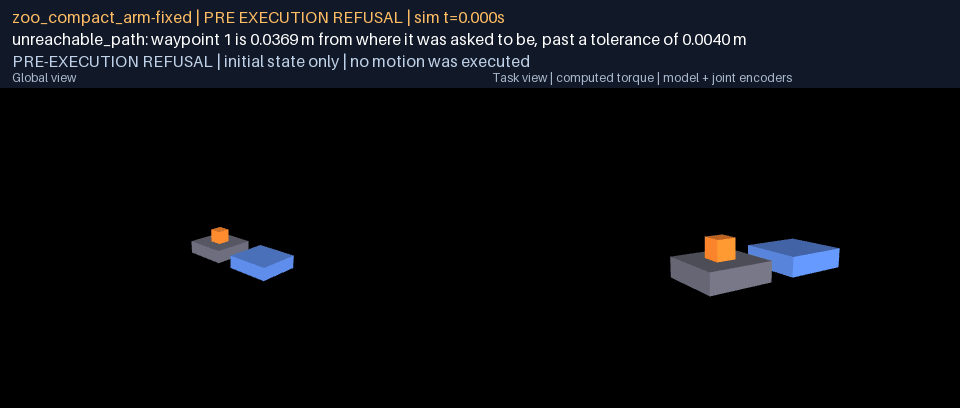 | [episode.mp4](g06-campaign-pilot-1/zoo_compact_arm/fixed-canonical/media/episode.mp4) | [frames.json](g06-campaign-pilot-1/zoo_compact_arm/fixed-canonical/media/frames.json) |
| zoo_compact_arm | seed 0 | `PRE EXECUTION REFUSAL` `unreachable_path` | 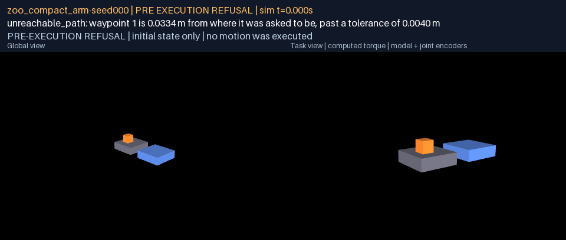 | [episode.mp4](g06-campaign-pilot-1/zoo_compact_arm/fixed/seed-000/media/episode.mp4) | [frames.json](g06-campaign-pilot-1/zoo_compact_arm/fixed/seed-000/media/frames.json) |
| zoo_dual_arm | capability-normalized | `SUCCESS` |  | [episode.mp4](g06-campaign-pilot-1/zoo_dual_arm/normalized/media/episode.mp4) | [frames.json](g06-campaign-pilot-1/zoo_dual_arm/normalized/media/frames.json) |
| zoo_dual_arm | strict fixed world, nominal | `SUCCESS` |  | [episode.mp4](g06-campaign-pilot-1/zoo_dual_arm/fixed-canonical/media/episode.mp4) | [frames.json](g06-campaign-pilot-1/zoo_dual_arm/fixed-canonical/media/frames.json) |
| zoo_dual_arm | seed 0 | `SUCCESS` |  | [episode.mp4](g06-campaign-pilot-1/zoo_dual_arm/fixed/seed-000/media/episode.mp4) | [frames.json](g06-campaign-pilot-1/zoo_dual_arm/fixed/seed-000/media/frames.json) |
| zoo_dual_arm | seed 1 | `SUCCESS` |  | [episode.mp4](g06-campaign-pilot-1/zoo_dual_arm/fixed/seed-001/media/episode.mp4) | [frames.json](g06-campaign-pilot-1/zoo_dual_arm/fixed/seed-001/media/frames.json) |
| zoo_dual_arm | seed 2 | `SUCCESS` |  | [episode.mp4](g06-campaign-pilot-1/zoo_dual_arm/fixed/seed-002/media/episode.mp4) | [frames.json](g06-campaign-pilot-1/zoo_dual_arm/fixed/seed-002/media/frames.json) |
| zoo_dual_arm | seed 3 | `SUCCESS` |  | [episode.mp4](g06-campaign-pilot-1/zoo_dual_arm/fixed/seed-003/media/episode.mp4) | [frames.json](g06-campaign-pilot-1/zoo_dual_arm/fixed/seed-003/media/frames.json) |
| zoo_dual_arm | seed 4 | `SUCCESS` |  | [episode.mp4](g06-campaign-pilot-1/zoo_dual_arm/fixed/seed-004/media/episode.mp4) | [frames.json](g06-campaign-pilot-1/zoo_dual_arm/fixed/seed-004/media/frames.json) |
| zoo_dual_arm | seed 61 | `RUNTIME FAILURE` `hold_not_sustained` | 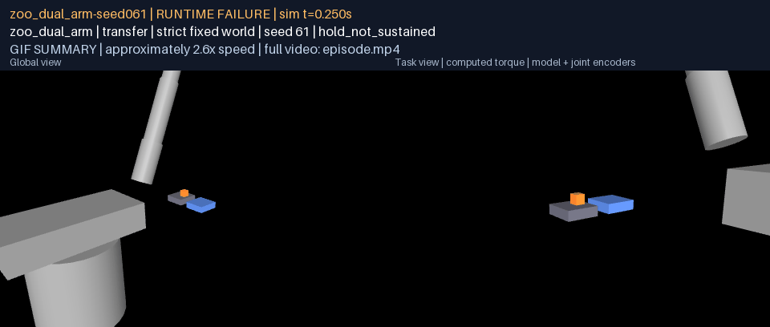 | [episode.mp4](g06-campaign-pilot-1/zoo_dual_arm/fixed/seed-061/media/episode.mp4) | [frames.json](g06-campaign-pilot-1/zoo_dual_arm/fixed/seed-061/media/frames.json) |
| zoo_hand_arm | capability-normalized | `RUNTIME FAILURE` `object_not_lifted` |  | [episode.mp4](g06-campaign-pilot-1/zoo_hand_arm/normalized/media/episode.mp4) | [frames.json](g06-campaign-pilot-1/zoo_hand_arm/normalized/media/frames.json) |
| zoo_hand_arm | strict fixed world, nominal | `RUNTIME FAILURE` `hold_not_sustained` | 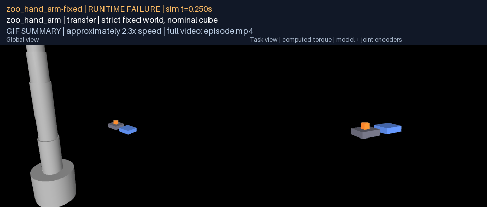 | [episode.mp4](g06-campaign-pilot-1/zoo_hand_arm/fixed-canonical/media/episode.mp4) | [frames.json](g06-campaign-pilot-1/zoo_hand_arm/fixed-canonical/media/frames.json) |
| zoo_hand_arm | seed 0 | `RUNTIME FAILURE` `hold_not_sustained` |  | [episode.mp4](g06-campaign-pilot-1/zoo_hand_arm/fixed/seed-000/media/episode.mp4) | [frames.json](g06-campaign-pilot-1/zoo_hand_arm/fixed/seed-000/media/frames.json) |
| zoo_hand_arm | seed 1 | `RUNTIME FAILURE` `hold_not_sustained` | 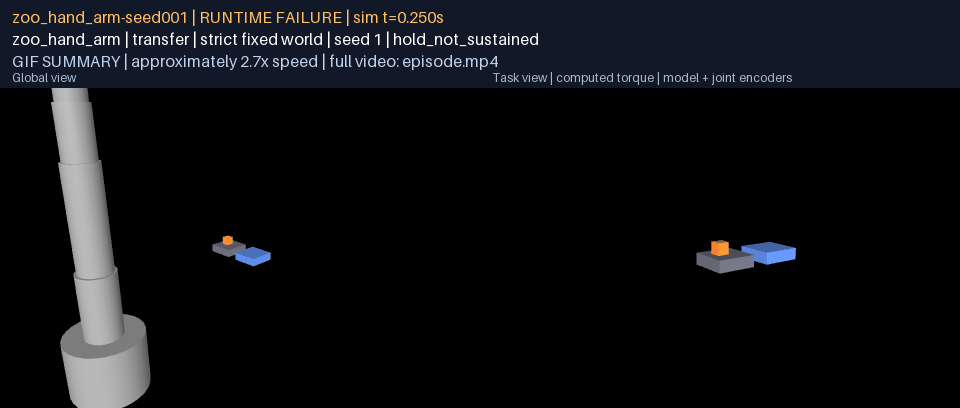 | [episode.mp4](g06-campaign-pilot-1/zoo_hand_arm/fixed/seed-001/media/episode.mp4) | [frames.json](g06-campaign-pilot-1/zoo_hand_arm/fixed/seed-001/media/frames.json) |
| zoo_hand_arm | seed 2 | `RUNTIME FAILURE` `hold_not_sustained` |  | [episode.mp4](g06-campaign-pilot-1/zoo_hand_arm/fixed/seed-002/media/episode.mp4) | [frames.json](g06-campaign-pilot-1/zoo_hand_arm/fixed/seed-002/media/frames.json) |
| zoo_hand_arm | seed 3 | `RUNTIME FAILURE` `hold_not_sustained` |  | [episode.mp4](g06-campaign-pilot-1/zoo_hand_arm/fixed/seed-003/media/episode.mp4) | [frames.json](g06-campaign-pilot-1/zoo_hand_arm/fixed/seed-003/media/frames.json) |
| zoo_hand_arm | seed 4 | `RUNTIME FAILURE` `hold_not_sustained` | 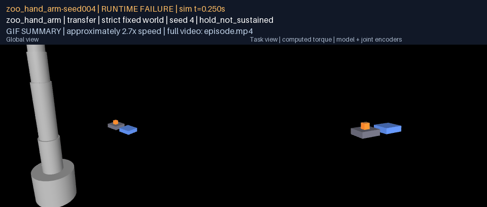 | [episode.mp4](g06-campaign-pilot-1/zoo_hand_arm/fixed/seed-004/media/episode.mp4) | [frames.json](g06-campaign-pilot-1/zoo_hand_arm/fixed/seed-004/media/frames.json) |
| zoo_hand_arm | seed 19 | `RUNTIME FAILURE` `object_not_lifted` |  | [episode.mp4](g06-campaign-pilot-1/zoo_hand_arm/fixed/seed-019/media/episode.mp4) | [frames.json](g06-campaign-pilot-1/zoo_hand_arm/fixed/seed-019/media/frames.json) |
| zoo_hand_arm | seed 23 | `RUNTIME FAILURE` `object_not_lifted` |  | [episode.mp4](g06-campaign-pilot-1/zoo_hand_arm/fixed/seed-023/media/episode.mp4) | [frames.json](g06-campaign-pilot-1/zoo_hand_arm/fixed/seed-023/media/frames.json) |
| zoo_hand_arm | seed 40 | `RUNTIME FAILURE` `object_not_lifted` |  | [episode.mp4](g06-campaign-pilot-1/zoo_hand_arm/fixed/seed-040/media/episode.mp4) | [frames.json](g06-campaign-pilot-1/zoo_hand_arm/fixed/seed-040/media/frames.json) |
| zoo_hand_arm | seed 47 | `RUNTIME FAILURE` `object_not_lifted` | 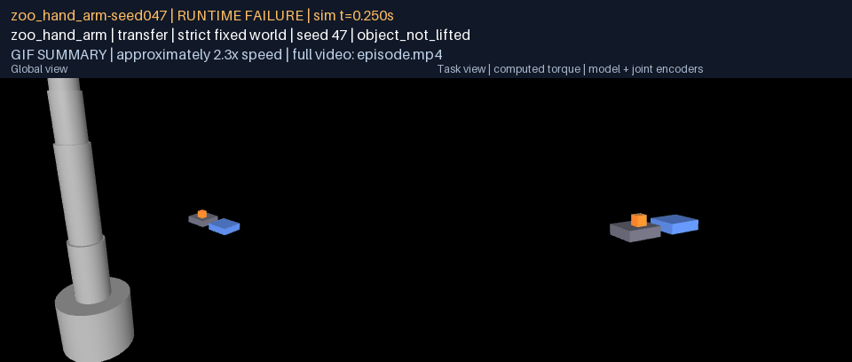 | [episode.mp4](g06-campaign-pilot-1/zoo_hand_arm/fixed/seed-047/media/episode.mp4) | [frames.json](g06-campaign-pilot-1/zoo_hand_arm/fixed/seed-047/media/frames.json) |
| zoo_hand_arm | seed 49 | `RUNTIME FAILURE` `object_not_lifted` |  | [episode.mp4](g06-campaign-pilot-1/zoo_hand_arm/fixed/seed-049/media/episode.mp4) | [frames.json](g06-campaign-pilot-1/zoo_hand_arm/fixed/seed-049/media/frames.json) |
| zoo_jaw_arm | capability-normalized | `SUCCESS` | 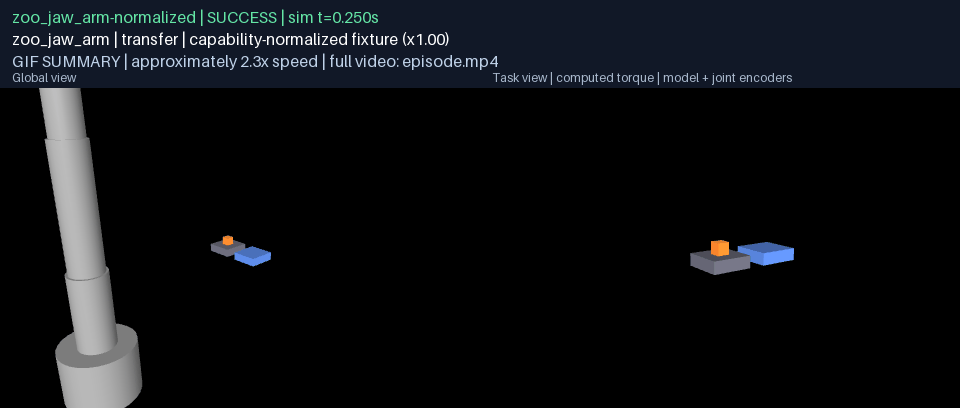 | [episode.mp4](g06-campaign-pilot-1/zoo_jaw_arm/normalized/media/episode.mp4) | [frames.json](g06-campaign-pilot-1/zoo_jaw_arm/normalized/media/frames.json) |
| zoo_jaw_arm | strict fixed world, nominal | `SUCCESS` |  | [episode.mp4](g06-campaign-pilot-1/zoo_jaw_arm/fixed-canonical/media/episode.mp4) | [frames.json](g06-campaign-pilot-1/zoo_jaw_arm/fixed-canonical/media/frames.json) |
| zoo_jaw_arm | seed 0 | `SUCCESS` |  | [episode.mp4](g06-campaign-pilot-1/zoo_jaw_arm/fixed/seed-000/media/episode.mp4) | [frames.json](g06-campaign-pilot-1/zoo_jaw_arm/fixed/seed-000/media/frames.json) |
| zoo_jaw_arm | seed 1 | `SUCCESS` | 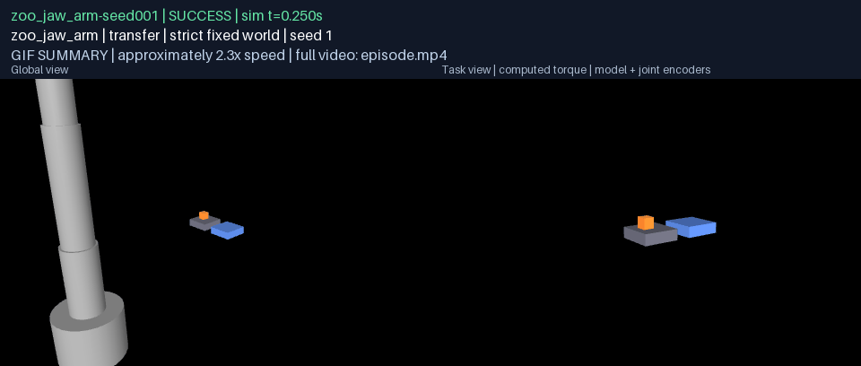 | [episode.mp4](g06-campaign-pilot-1/zoo_jaw_arm/fixed/seed-001/media/episode.mp4) | [frames.json](g06-campaign-pilot-1/zoo_jaw_arm/fixed/seed-001/media/frames.json) |
| zoo_jaw_arm | seed 2 | `SUCCESS` |  | [episode.mp4](g06-campaign-pilot-1/zoo_jaw_arm/fixed/seed-002/media/episode.mp4) | [frames.json](g06-campaign-pilot-1/zoo_jaw_arm/fixed/seed-002/media/frames.json) |
| zoo_jaw_arm | seed 3 | `SUCCESS` |  | [episode.mp4](g06-campaign-pilot-1/zoo_jaw_arm/fixed/seed-003/media/episode.mp4) | [frames.json](g06-campaign-pilot-1/zoo_jaw_arm/fixed/seed-003/media/frames.json) |
| zoo_jaw_arm | seed 4 | `SUCCESS` |  | [episode.mp4](g06-campaign-pilot-1/zoo_jaw_arm/fixed/seed-004/media/episode.mp4) | [frames.json](g06-campaign-pilot-1/zoo_jaw_arm/fixed/seed-004/media/frames.json) |
| zoo_jaw_arm | seed 5 | `RUNTIME FAILURE` `grasp_not_achieved` |  | [episode.mp4](g06-campaign-pilot-1/zoo_jaw_arm/fixed/seed-005/media/episode.mp4) | [frames.json](g06-campaign-pilot-1/zoo_jaw_arm/fixed/seed-005/media/frames.json) |
| zoo_jaw_arm | seed 8 | `RUNTIME FAILURE` `grasp_not_achieved` |  | [episode.mp4](g06-campaign-pilot-1/zoo_jaw_arm/fixed/seed-008/media/episode.mp4) | [frames.json](g06-campaign-pilot-1/zoo_jaw_arm/fixed/seed-008/media/frames.json) |
| zoo_jaw_arm | seed 11 | `RUNTIME FAILURE` `grasp_not_achieved` |  | [episode.mp4](g06-campaign-pilot-1/zoo_jaw_arm/fixed/seed-011/media/episode.mp4) | [frames.json](g06-campaign-pilot-1/zoo_jaw_arm/fixed/seed-011/media/frames.json) |
| zoo_jaw_arm | seed 12 | `RUNTIME FAILURE` `grasp_not_achieved` |  | [episode.mp4](g06-campaign-pilot-1/zoo_jaw_arm/fixed/seed-012/media/episode.mp4) | [frames.json](g06-campaign-pilot-1/zoo_jaw_arm/fixed/seed-012/media/frames.json) |
| zoo_jaw_arm | seed 14 | `RUNTIME FAILURE` `grasp_not_achieved` |  | [episode.mp4](g06-campaign-pilot-1/zoo_jaw_arm/fixed/seed-014/media/episode.mp4) | [frames.json](g06-campaign-pilot-1/zoo_jaw_arm/fixed/seed-014/media/frames.json) |
| zoo_jaw_arm | seed 71 | `RUNTIME FAILURE` `object_not_lifted` |  | [episode.mp4](g06-campaign-pilot-1/zoo_jaw_arm/fixed/seed-071/media/episode.mp4) | [frames.json](g06-campaign-pilot-1/zoo_jaw_arm/fixed/seed-071/media/frames.json) |
| zoo_jaw_arm | seed 87 | `RUNTIME FAILURE` `object_not_lifted` | 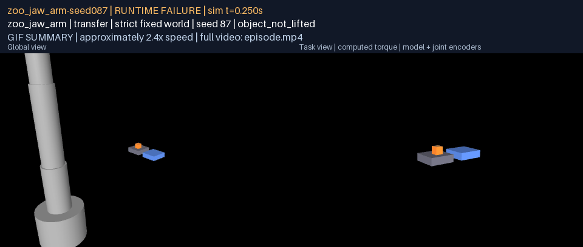 | [episode.mp4](g06-campaign-pilot-1/zoo_jaw_arm/fixed/seed-087/media/episode.mp4) | [frames.json](g06-campaign-pilot-1/zoo_jaw_arm/fixed/seed-087/media/frames.json) |
| zoo_long_arm | capability-normalized | `RUNTIME FAILURE` `grasp_not_achieved` | 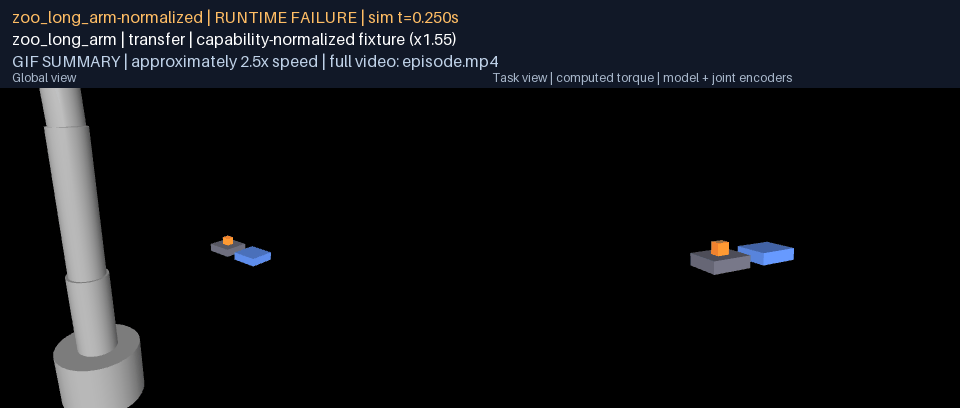 | [episode.mp4](g06-campaign-pilot-1/zoo_long_arm/normalized/media/episode.mp4) | [frames.json](g06-campaign-pilot-1/zoo_long_arm/normalized/media/frames.json) |
| zoo_long_arm | strict fixed world, nominal | `SUCCESS` |  | [episode.mp4](g06-campaign-pilot-1/zoo_long_arm/fixed-canonical/media/episode.mp4) | [frames.json](g06-campaign-pilot-1/zoo_long_arm/fixed-canonical/media/frames.json) |
| zoo_long_arm | seed 0 | `SUCCESS` |  | [episode.mp4](g06-campaign-pilot-1/zoo_long_arm/fixed/seed-000/media/episode.mp4) | [frames.json](g06-campaign-pilot-1/zoo_long_arm/fixed/seed-000/media/frames.json) |
| zoo_long_arm | seed 1 | `SUCCESS` |  | [episode.mp4](g06-campaign-pilot-1/zoo_long_arm/fixed/seed-001/media/episode.mp4) | [frames.json](g06-campaign-pilot-1/zoo_long_arm/fixed/seed-001/media/frames.json) |
| zoo_long_arm | seed 2 | `SUCCESS` |  | [episode.mp4](g06-campaign-pilot-1/zoo_long_arm/fixed/seed-002/media/episode.mp4) | [frames.json](g06-campaign-pilot-1/zoo_long_arm/fixed/seed-002/media/frames.json) |
| zoo_long_arm | seed 3 | `SUCCESS` |  | [episode.mp4](g06-campaign-pilot-1/zoo_long_arm/fixed/seed-003/media/episode.mp4) | [frames.json](g06-campaign-pilot-1/zoo_long_arm/fixed/seed-003/media/frames.json) |
| zoo_long_arm | seed 4 | `SUCCESS` |  | [episode.mp4](g06-campaign-pilot-1/zoo_long_arm/fixed/seed-004/media/episode.mp4) | [frames.json](g06-campaign-pilot-1/zoo_long_arm/fixed/seed-004/media/frames.json) |

## Acceptance evidence

| Criterion | Evidence and outcome |
|---|---|
| G06.A01: every gripper-bearing body attempts approach, opposition, lift, sustained hold, transport and release; every enabled body passes the canonical normalized grasp; the rest recorded as failed or mechanically unsupported with diagnostics | All five attempted through the whole family (`execution.json` in every bundle lists the phases on the physics clock). Enabled set zoo_dual_arm, zoo_jaw_arm, zoo_long_arm: each certifies its capability-normalized world and the fixed world's nominal cube. The multifinger hand certifies its normalized world and fails all 100 fixed-world seeds, typed and measured (below). The compact arm is infeasible on two named necessary conditions and refused before motion, `unreachable_path`, with the residual in the record. The tool arm has no grasping effector. |
| G06.A02: on a fixed fixture frozen from the independent feasibility map, at least 90/100 per enabled body; at least three structural configurations including a bimanual or multifinger one | Fixture, goal, map and roster registered and hashed before any scored run (`registration.json`, `0846972af045`). Strict fixed world: zoo_dual_arm 99/100, zoo_hand_arm 0/100, zoo_jaw_arm 98/100, zoo_long_arm 100/100. Enabled: the bimanual dual arm, the jaw arm and the long-reach jaw arm, three structural configurations. The hand (0/100) and the compact arm (refused) do not count. |
| G06.A03: stable support at least 2 s, transport into the region, stable released placement at least 2 s; displacement, load and penetration tolerances frozen before evaluation | Every certified trial records `hold_s` at least 2.000 s with the object raised, `placed_inside` from the independent evaluator, and `placement_dwell_s` at least 2.498 s released and still (the phase outlasts the requirement by half a second). Tolerances in `goal.json` and `roster.json`: 20 mm displacement, 0.8 to 1.2 mass and friction, 4 mm penetration, 0.8 heights of lift, 2.5 apertures of carry offset. |
| G06.A04: no hidden object state writes, welds, object actuators or arm/object collision exclusions; invalid source hulls documented | `world.json` in every bundle records the collision policy: 0 equality constraints, 0 object actuators, 0 exclusions naming the object, collidable object geoms, 0 object state writes; a violating world is refused before motion (pinned by test). The zoo bodies carry primitive collision geometry only; no hull treatment was needed. |
| D06: acquisition-to-release on all five attempted bodies including failures; synchronized fixed-world comparison for the enabled set | `g06-d06/five-body-fixed-world.mp4` tiles the five fixed-world canonical episodes (three successes, the hand's failure, the compact arm's refusal slate) on one clock; `g06-d06/enabled-set-synchronized.mp4` tiles the enabled set. Four before/after pairs through identical physics. |

## Campaign

Two tracks, never pooled. The capability-normalized track scales the frozen
world to each body (distances by reach over the jaw arm's 1.32 m, the cube by
aperture over its 87 mm, mass by volume, capped at payload) and runs the
canonical transfer once per body. The strict fixed-world track runs the
fixture unchanged on the bodies the map classed feasible over the 100
registered seeds, one attempt per seed, the cube displaced and its mass and
friction scaled by the registered draws; the infeasible body is attempted
once so its typed refusal is on record beside the map's reason. Bodies enter
through the G03 structural capability intake and the runner refuses to run
if intake no longer matches the roster or the roster its registration.

### Results

| Body | Map class | Normalized canonical | Fixed canonical | Fixed seeds certified | Failure taxonomy (fixed seeds) |
|---|---|---|---|---:|---|
| zoo_compact_arm | infeasible | `object_not_lifted` (x0.29) | `unreachable_path` | 0/1 | `unreachable_path` 1 |
| zoo_dual_arm | feasible | certified (x1.00) | certified | 99/100 | `hold_not_sustained` 1 |
| zoo_hand_arm | feasible | certified (x1.04) | `hold_not_sustained` | 0/100 | `hold_not_sustained` 94, `object_not_lifted` 6 |
| zoo_jaw_arm | feasible | certified (x1.00) | certified | 98/100 | `object_not_lifted` 2 |
| zoo_long_arm | feasible | certified (x1.55) | certified | 100/100 | none |
| zoo_tool_arm | unsupported by structure | not attempted | not attempted | not attempted | no grasping effector |

| Body | Lift over certified seeds (mm) | Least hold (s) | Least released dwell (s) | Largest carry offset (mm) | Largest penetration over executed seeds (mm) | Largest closure force (N) | Fixed canonical duration (s) | Mean wall time per seed (s) |
|---|---|---:|---:|---:|---:|---:|---:|---:|
| zoo_dual_arm | 74.0 to 99.1 | 2.002 | 2.498 | 128 | 3.9 | 137 | 13.89 | 3.1 |
| zoo_hand_arm | no certified seed | 0 | 0 | n/a | 15.9 | 904 | 16.84 | 2.1 |
| zoo_jaw_arm | 74.4 to 92.9 | 2.000 | 2.498 | 142 | 2.5 | 37 | 14.72 | 2.5 |
| zoo_long_arm | 74.5 to 76.3 | 2.000 | 2.498 | 177 | 2.4 | 33 | 15.55 | 2.7 |

The three failures among the enabled bodies are zoo_dual_arm seed 80 (`hold_not_sustained`; cube at (+13.6, +8.6) mm, mass x0.89, friction x0.80; lifted 36.4 mm, closure 70 N, penetration 3.9 mm); zoo_jaw_arm seed 52 (`object_not_lifted`; cube at (-18.1, -5.7) mm, mass x1.18, friction x0.84; lifted 6.7 mm, closure 37 N, penetration 2.3 mm); zoo_jaw_arm seed 96 (`object_not_lifted`; cube at (-11.3, -3.9) mm, mass x1.10, friction x0.83; lifted 23.3 mm, closure 29 N, penetration 2.5 mm). All three carry the lowest friction draws of the roster (0.80 to 0.84); in each the cube slips out of the closing fingers at the top of the lift and is ejected from between them at speed, leaving the scene (a carry offset of several hundred metres in the record), and the rest of the sequence executes over an empty bench, which the evaluator then fails. None was retried.

The multifinger hand's 100 fixed-world failures: opposition achieved on all 100, `hold_not_sustained` on 94 (median lift before the loss 59 mm) and `object_not_lifted` on 6; closure force 27 to 904 N (median 68 N) and penetration 1.2 to 15.9 mm (median 7.3 mm, over the 4 mm gate on 81), against a normalized-world transfer of a 19 mm cube that certified at 12 N and 1.2 mm. The pinch is at the fingertips, the contact is stiff, and the squeeze the closure needs to hold the 30 mm cube against the lift drives the digits into it; the record shows both the loss and the force.

### Pilot 1

| Body | Normalized canonical | Fixed canonical | Fixed seeds certified | Failure taxonomy |
|---|---|---|---:|---|
| zoo_compact_arm | `object_not_lifted` | `unreachable_path` | 0/1 | `unreachable_path` 1 |
| zoo_dual_arm | certified | certified | 99/100 | `hold_not_sustained` 1 |
| zoo_hand_arm | `object_not_lifted` | `hold_not_sustained` | 0/100 | `hold_not_sustained` 86, `object_not_lifted` 14 |
| zoo_jaw_arm | certified | certified | 56/100 | `grasp_not_achieved` 42, `object_not_lifted` 2 |
| zoo_long_arm | `grasp_not_achieved` | certified | 100/100 | none |


## What was asked, and how it is proven

A transfer is one primitive, `attempt_transfer`, with ten phases on the
model's native physics clock: approach, guarded descent, force-driven
closure, lift, a two-second hold, carry, guarded lowering, release, retreat
and a dwell. Phase timing, closure integration and every recorded timestamp
are `MjData.time`. The object is never written; its free joint evolves only
through `mj_step`. The arm's path is solved with the same self-collision
guard the grounder uses (G05), so a hand that would have to pass through
its own forearm is refused, typed, before anything moves.

The verdict is not the controller's. `PlacementEvaluator` applies the G02
benchmark's predicates to the environment model on every physics step of
the dwell: the object's whole rotated geometry inside the destination
region, no robot geom touching it and no positive normal force from one,
linear speed at most 10 mm/s and angular speed at most 0.1 rad/s, all of it
continuously for two seconds, measured, not counted, and restarted by any
gap in observation. Nothing in the transfer module reads its verdict to
decide what to do. The primitive's own gates are typed and carry a
measurement and a limit: `grasp_not_achieved`, `object_not_lifted` (less
than 0.8 object heights), `hold_not_sustained` (opposition and the object
raised at least half the required lift, continuously, for two seconds),
`object_not_carried` (the object more than 2.5 apertures from the grasp
centre while held), `not_transported`, `not_released`,
`placement_unstable`, `excessive_penetration` (more than 4 mm) and
`self_collision`. Every tolerance was written into `goal.json` and the
roster before the first scored trial.

The world cannot fake a hold. `collision_policy` is recorded in every
bundle: zero equality constraints, zero actuators on the object, zero
contact exclusions naming it, its geoms collidable, zero object state
writes. A scene failing any of these is refused before motion
(`hidden_weld`, `object_actuator`, `object_collision_exclusion`,
`object_not_collidable`); the test suite pins that a welded cube is. The
five bodies carry primitive collision geometry only (cylinders and boxes;
the effector members are boxes on every gripper), so no source-model hull
needed treatment; the one adjacent-pair exclusion in the zoo, the long arm's
wrist camera against its palm, is a proven-inseparable pair from ingest and
does not involve the object.

## The fixed world and its map

The fixture (`any-robot/assets/general/research-protocols/g06-transfer-v1`)
is a 30 mm, 8.64 g cube on a low bench 0.15 m to the left of and 0.65 m in
front of the mount, its top 0.26 m up, and an empty platform of the same
height 0.14 m to the cube's right. It was chosen by search over bench
positions with the guarded, facing-aware inverse kinematics as the witness,
because the measured reach envelope alone is not enough: at an earlier
candidate site every body's envelope contained every task point, and the
long arm's only straight path from its rest pose folded the upper link
through the base. The world never learns which body enters it.

The feasibility map records, per body and before any controller ran, four
necessary conditions and a witness: the aperture spans the cube with 4 mm
to spare; the payload carries it; the cube, the destination and the hover
above each lie inside the measured reach envelope; the fixture is clear of
the body at rest; and a guarded kinematic witness puts the grasp point on
the cube and on the destination with no finger inside a fixture. A body
missing a necessary condition is `infeasible` with the condition named; a
body with every condition and a witness is `feasible`; a body without a
grasping effector is `unsupported_by_structure`. The compact arm is
infeasible twice over: its 32 mm aperture cannot span the 30 mm cube with
margin, and every task point is 0.69 to 0.73 m from its origin against an
outer reach of 0.29 m. The tool arm has no grasping effector. The dual,
hand, jaw and long arms are feasible with witnesses. The roster registers
100 perturbation draws per body, identical across bodies, from seed
20260913: the cube displaced by up to 20 mm in the bench plane, its mass
and its sliding friction each scaled by up to 20 percent, the same family
the G02 transfer protocol registers. Environment, goal, map and roster are
hashed together in `registration.json` and the runner refuses any of them
that no longer matches.

## What was wrong, and the four repairs

All four are general. No robot, joint or link name appears in any branch.
Three were made before the first scored pass; the fourth was found by it.

**Facing solved with the point, not after it.** The grasp probe asked the
solver to keep the hand pointing down only in the position task's null
space, at a gain of 0.05. Measured at the grasp point, the multifinger hand
arrived 116 to 121 degrees from vertical over the cube and put its palm
through the bench and a finger through the platform; the jaw arm arrived
132 degrees from vertical. The first 120 iterations of every waypoint solve
now carry the facing inside the task, stacked under the position rows at
0.4 m per radian, so it is heard but cannot outvote the point; the
remaining iterations return position to sole priority so the 4 mm tolerance
is met exactly. Every larger body now arrives within ten degrees of
vertical, the hand at zero. The approach from the rest pose is solved
without the facing, because holding the hand vertical along a straight line
from a straight-up rest pose made an intermediate point unreachable (the
jaw arm was refused 53 mm short); the hand turns to face the cube at the
hover, where the position is fixed and the wrist is free.

**A standoff above the cube by the fingers' reach.** The grasp point was
placed at the cube's centre. On a hand whose gripping surfaces are longer
than the cube is tall, that drives the fingertips through the bench: the
jaw arm's fingers reach 37 mm past its grasp point along the hand's own
axis, the hand's 47 mm. The grasp point is now raised by however far the
effector's member geoms reach past it along the hand's pointing axis, less
the cube's half height, plus a 6 mm allowance for a hand that arrives a
few degrees off vertical; the reach envelope is consulted as the grasp
centre would see it. Without it the jaw arm drives both fingers into the
bench and the platform and the cube is flicked out of the closing fingers.

**Restart seeds and a fixture the witness could reach.** A local solver
goes where its seed points it. From a straight-up rest pose, the first
swing toward a target beside the body can fold the upper arm through the
base, where the guard rightly refuses. Every solve is now offered the rest
pose, the rest pose with any joint whose axis is the frame's up turned to
face the target's bearing, and the middle of every joint's range, in that
order, and the fixture itself was re-sited by the witness search. At the
registered site every certified body solves from the rest seed, so no
before/after pair exists for this repair in this world; the seeds remain
because the earlier site showed the fold.

**A turn at the hover, with the point held, before the descent.** The
first scored pass of the registered roster (retained whole as
`g06-campaign-pilot-1`, commit `f68ab68`) certified the dual arm on 99
seeds, the long arm on 100 in the fixed world but not in its normalized
world, and the jaw arm on 56: 42 seeds never achieved a grasp and 2 never
lifted, and every failed jaw seed had the cube displaced toward the
platform while every certified one had it displaced away. The cause was
one thing seen from two sides. The approach from the rest pose is solved
without the facing, so the hand reached the hover 35 to 65 degrees off
vertical and only became vertical during the descent; a finger swinging
through that arc clipped a cube a few millimetres right of the nominal
spot and knocked it off the bench. The path now carries the hover twice
with a turn phase between: the approach reaches the hover however the
straight line from home leads, the turn swings the hand to vertical with
the grasp point held, and the descent starts vertical. The turn is solved
progressively, the requested axis rotated from where the hand points to
where it must point one dense target at a time, because asking for the
final facing in one step gave a joint-space blend between two
configurations that share only the site position, and the fingers of the
two-metre arm swept fifty millimetres through the cube in its normalized
world. The roster was re-run whole at the repaired commit rather than the
failing seeds alone; the pilot's failures are in `g06-d06` beside the same
seed and the same world at the repaired commit.

Two further things surfaced while pinning the primitive. The dwell phase
was exactly as long as the required dwell and ended two milliseconds short
of it, because the evaluator starts counting a step after the object first
qualifies; the phase now outlasts the requirement by half a second. And a
world failing the collision policy was recorded as violating it and then
run anyway; it is now refused before motion, as the module always said.

## The multifinger hand

The hand is recorded as failed in the fixed world, not as mechanically
unsupported: its aperture spans the cube, its payload carries it, its
witness reaches both points, it certifies the whole transfer in its
capability-normalized world (a 19 mm cube sized to its 56 mm aperture), and
in the fixed world it approaches vertically, closes with all three digits
in opposition and lifts the 30 mm cube 60 to 70 mm. It then loses the cube
during the hold: the three fingertips pinch the cube at their
tips, the cube pivots out of the pinch as the arm decelerates at the top of
the lift, and it is either dropped beside the bench (`hold_not_sustained`)
or, on the seeds where the pinch never forms, left on the bench
(`object_not_lifted`). A deeper grasp, tried during development with the
standoff removed, closes the digits 11 mm into the cube and fails the
penetration gate instead; a higher squeeze does the same. The diagnosis is
concrete: the hand's digits are 47 mm long against a 30 mm cube and its
closure is a single-parameter squeeze, so the only grasp that clears the
bench is a fingertip pinch, and a fingertip pinch on a rigid cube has no
margin against the inertial load of the lift. A hand with a wrap grasp, a
compliant pad or a two-parameter closure would be a different primitive,
not a retuned one. The failure is in every clip and every row; nothing
about it was removed to raise a count.

## Tests

| Suite | Result |
|---|---|
| any-robot (exotic bodies run separately) | 405 passed, 5 skipped (one hand asset absent from this checkout), 0 failed |
| any-robot exotic bodies (fetched `iiwa7`, `kuka_lwr`, `panda`, `pr2_gripper`, `cartpole` linked) | 10 passed, 0 failed |
| core | 263 passed, 2 skipped (Windows symlink privilege), 0 failed |
| new `test_general_transfer.py` | 19 passed |

## Reproduction

From the repository root in the workspace environment:

```sh
python any-robot/scripts/g06_fixture.py                        # refuses: the fixture is registered
python any-robot/scripts/g06_roster.py                         # refuses: the roster is registered
python any-robot/scripts/g06_transfer_campaign.py --out <fresh> --local <fresh>
python any-robot/scripts/g06_d06_media.py --campaign <campaign> --pilot docs/results/g06-campaign-pilot-1 --out <fresh>
python docs/results/verify_g06.py --replay
```

The campaign re-runs the physics; the verifier replays every committed
bundle's recorded controls without a model call. Every seeded trial's full
trace, and the replayable bundle of every rendered seeded trial, are written
locally (untracked) and their digests are committed in each `trials.json`;
any bundle can be re-rendered with
`python -m rigby_general.evidence render <bundle> --out <dir>`.

## What this does not establish

- No recovery: a transfer that fails is recorded, never retried (one
  attempt per trial, `retry_limit` 0).
- No language, vision or planning: the task is authored, the controller is
  a fully observed model-based baseline with joint encoders and gripper
  contact, and the bodies are the public development zoo.
- No claim about the multifinger hand beyond the diagnosis above, and none
  about the compact arm beyond its two named necessary conditions.
- The capability-normalized track scales the world to each body; it is
  reported beside the strict fixed-world track and never pooled with it.
- Every gate, tolerance and perturbation family was frozen before the
  first scored trial and none was relaxed afterwards; the smoke run of the
  runner (two dual-arm seeds, `--seeds 2`, marked unscored in its own
  provenance) was made in a scratch directory and is not part of the
  evidence.
