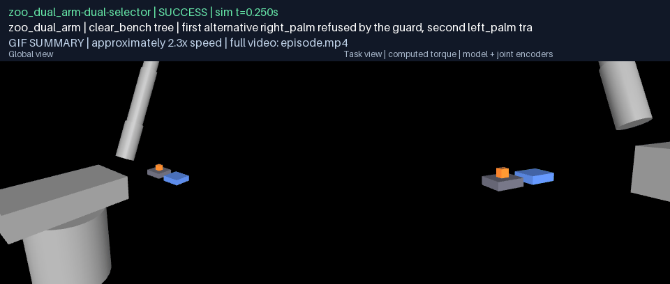
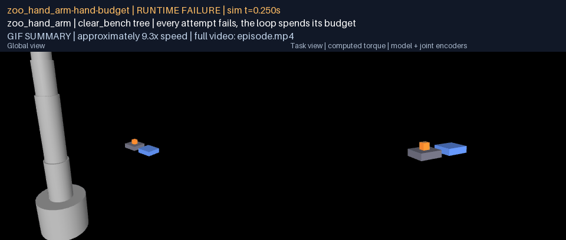
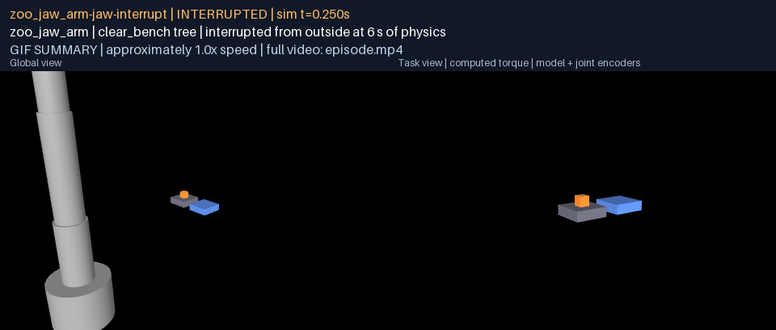
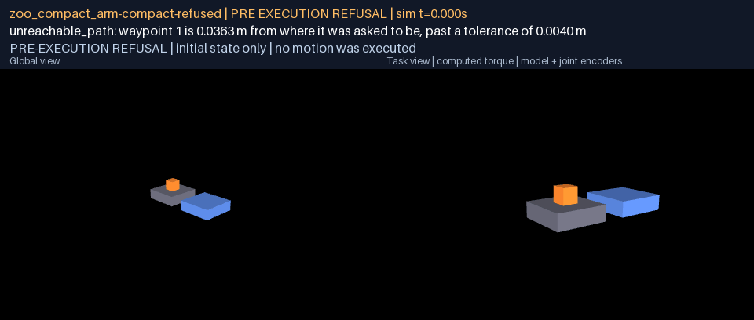

# G07: recursive superprimitive contracts

One neutral typed contract now describes every skill, leaf or composite:
typed arguments, required capabilities, initiation, invariants and effects
as declared predicates, a termination rule, a finite timeout, a bounded
recovery, the resources a running skill owns and the context its evidence
is valid in. Definitions live in a library that is a directed acyclic
graph with loops only as a bounded RepeatUntil, and the library refuses, at
construction, a cycle, a retry without a bound, a predicate nobody declared,
a child argument nobody bound and a resource a child would own that its
parent does not or that two parallel children would both own. An executor
runs Sequence, Selector, Parallel, RepeatUntil, Observe and Primitive
against a body-supplied runtime and records every node's checks, verdict
and reason. The shared example is five deep; it round-trips through JSON to
the same hash; and bound to real bodies in the G06 fixed world it succeeds
by falling through a selector, fails by spending a loop's budget, is
interrupted mid-lift, and is refused before motion, each run one continuous
physics record rendered in full. Nothing in the contract names a limb, a
digit or a joint. This report makes no claim about recovery synthesis,
transition validation between certified skills (G08) or reuse (G11).

Source commits: see `g07-validation.json` (`evidence_commit`). Verifier:
`python docs/results/verify_g07.py [--replay]` from the workspace
environment. No API or model calls were made anywhere in this work.

## Playback

Every clip below is one tree run on physics: one continuous physical record
across every leaf, rendered from recorded states at real-time playback with
the simulation clock and the tree's verdict in the banner. The GIF is a
labelled, accelerated summary; the MP4 is the evidence; `frames.json`
beside each MP4 maps every frame to its recorded sample and simulation
time. The failure, the interruption and the refusal are shown as such.

| Run | Body | Tree verdict | What the record shows | Summary | Full episode | Frame map |
|---|---|---|---|---|---|---|
| dual-selector | zoo_dual_arm | `SUCCESS` | the guard refuses the first alternative before motion (`self_collision_path`); the selector falls through; the second alternative transfers; the placement observation reads the evaluator's dwell; the loop stops after one attempt |  | [episode.mp4](g07-trees/physical/dual-selector/media/episode.mp4) | [frames.json](g07-trees/physical/dual-selector/media/frames.json) |
| hand-budget | zoo_hand_arm | `FAILURE` (child_failed:0.1) | every alternative on both attempts executes and fails typed (`hold_not_sustained`, then `grasp_not_achieved` against the cube where the first attempt left it); the loop spends its budget of two; four leaves on one record |  | [episode.mp4](g07-trees/physical/hand-budget/media/episode.mp4) | [frames.json](g07-trees/physical/hand-budget/media/frames.json) |
| jaw-interrupt | zoo_jaw_arm | `INTERRUPTED` (interrupted) | an interruption requested at 6 s of physics stops the transfer during the lift; the leaf, the selector, the sequence, the loop and the root all record `interrupted` |  | [episode.mp4](g07-trees/physical/jaw-interrupt/media/episode.mp4) | [frames.json](g07-trees/physical/jaw-interrupt/media/frames.json) |
| compact-refused | zoo_compact_arm | `FAILURE` (child_failed:0.1) | the inventory sees the cube outside the arm's envelope; both alternatives are refused before motion (`unreachable_path`); the loop stops for lack of progress; a labelled slate, nothing moved |  | [episode.mp4](g07-trees/physical/compact-refused/media/episode.mp4) | [frames.json](g07-trees/physical/compact-refused/media/frames.json) |

## Acceptance evidence

| Criterion | Evidence and outcome |
|---|---|
| G07.A01: one neutral typed contract for leaves and composites with arguments, requirements, initiation, invariants, effects, termination, timeout, recovery, resource ownership and validity context | `SkillDefinitionV1` in `rigby_core.skills`, one type for all six kinds, every field listed; schema in `g07-trees/schema/SkillLibraryV1.schema.json`; `test_every_node_kind_is_the_same_contract`. |
| G07.A02: execute Sequence, Selector, Observe, Primitive and bounded RepeatUntil at nesting depth at least 4; represent Parallel with explicit resource conflicts | The example expands 5 deep (`g07-trees/example/clear_bench.tree.json`) with all five kinds and runs on physics on four bodies; Parallel is validated for disjoint exclusive ownership at construction and executed in `test_parallel_verdicts`. |
| G07.A03: reject cycles, unbounded retries, unknown predicates and incompatible resource ownership; test success, failure, unknown and interruption at each node | Refusals pinned in `test_skills_contract.py` (cycle, cycle through recovery, self-recovery, bounds on loop and recovery attempts, unknown predicate and wrong arity, unbound or ill-typed child argument, ownership not delegated, exclusive over shared, parallel double ownership); all four verdicts per kind in `test_skills_executor.py` and the six scripted records in `g07-trees/scripted`; on physics: success, failure, interruption and refusal. |
| G07.A04: round-trip persisted definitions without changing meaning; no thumb/finger/arm names required by the neutral contract | Library and tree written and reloaded to the same content hash and the same expansion (`round_trip` in `g07-trees/index.json`, `test_persisted_definitions_round_trip_without_changing_meaning`); the schemas of the library, tree and record and the example library contain no limb, digit or joint name (`test_the_contract_names_no_limb_digit_or_joint`). |
| Demo | Not required for G07; the four physics runs above are the embodied evidence. |

## The scripted records

The example against a scripted runtime, one record per verdict the executor
can reach, in `g07-trees/scripted/<name>.record.json`:

| Record | Verdict | Root reason | Path |
|---|---|---|---|
| success-first-alternative | `success` | `-` | the first alternative places the object; the loop stops after one attempt |
| success-second-alternative | `success` | `-` | the first alternative fails typed; the selector falls through and the second places it |
| failure-budget-exhausted | `failure` | `child_failed:0.1` | both alternatives fail on both attempts; the loop spends its budget of two |
| failure-no-progress | `failure` | `child_failed:0.1` | the progress predicate fails after the first attempt; the loop stops before its budget |
| unknown-nothing-observed | `unknown` | `child_unknown:0.1` | the transfer claims no effect of its own and the verifying observation sees nothing; undecided propagates and the attempt is not repeated |
| interrupted-mid-leaf | `interrupted` | `stopped mid-motion` | an interruption arrives while the first transfer runs; the leaf, the selector, the sequence, the loop and the root all record it |

## The runs on physics

| Run | Body | First alternative | Second alternative | Leaves executed | Physics recorded (s) | Loop reason | Verdict |
|---|---|---|---|---:|---:|---|---|
| dual-selector | zoo_dual_arm | right_palm | left_palm | 1 of 2 | 13.64 | `until_after_1` | `success` |
| hand-budget | zoo_hand_arm | palm | palm | 4 of 4 | 55.92 | `budget_exhausted` | `failure` |
| jaw-interrupt | zoo_jaw_arm | palm | palm | 1 of 1 | 5.75 | `interrupted` | `interrupted` |
| compact-refused | zoo_compact_arm | palm | palm | 0 of 2 | 0.00 | `no_progress` | `failure` |

Per leaf, in order (the gate is the G06 primitive's typed reason):

| Run | Leaf | Manipulator | Executed | Certified | Gate | Last phase | Physics end (s) |
|---|---|---|---|---|---|---|---:|
| dual-selector | 0.1.0.0.0 | right_palm | no | no | `self_collision_path` | - | 0.00 |
| dual-selector | 0.1.0.0.1 | left_palm | yes | yes | `-` | dwell | 13.89 |
| hand-budget | 0.1.0.0.0 | palm | yes | no | `hold_not_sustained` | dwell | 16.84 |
| hand-budget | 0.1.0.0.1 | palm | yes | no | `grasp_not_achieved` | dwell | 29.96 |
| hand-budget | 0.1.0.0.0 | palm | yes | no | `grasp_not_achieved` | dwell | 43.07 |
| hand-budget | 0.1.0.0.1 | palm | yes | no | `grasp_not_achieved` | dwell | 56.17 |
| jaw-interrupt | 0.1.0.0.0 | palm | yes | no | `interrupted` | lift | 6.00 |
| compact-refused | 0.1.0.0.0 | palm | no | no | `unreachable_path` | - | 0.00 |
| compact-refused | 0.1.0.0.1 | palm | no | no | `unreachable_path` | - | 0.00 |


## The contract

`rigby_core.skills` (core tier, so nothing product-specific can reach it)
holds one definition type, `SkillDefinitionV1`, whose `kind` is one of
`primitive`, `observe`, `sequence`, `selector`, `parallel` or
`repeat_until`, and whose remaining fields are the same for every kind:

| Field | Meaning |
|---|---|
| `arguments` | typed (`string`, `identifier`, `integer`, `number`, `boolean`), required or optional; a child's arguments are bound from its parent's by name (`$object`) or to literals, with the types checked |
| `requirements` | capabilities the body must afford, as neutral names (`grasping_effector`) |
| `initiation`, `invariants`, `effects` | references to predicates the library declares, with their arity checked; `$name` binds a skill argument at expansion |
| `termination` | whether success additionally requires the effects to hold, and whether an undecidable predicate leaves the node undecided or counts against it |
| `timeout_s` | finite, positive; a node that overruns fails `timeout` |
| `recovery` | an optional recovery skill run between attempts, and a bound on attempts (1 to 16) that includes the first |
| `resources` | what the running skill owns, exclusively or shared, with arguments bound (`effector:$effector`, `object:$object`, `perception`) |
| `validity` | the bodies, environments, operating ranges and evidence the skill's certificate is valid in |
| `children`, `loop`, `observation`, `controller` | the kind-specific part: children by identifier with bindings and rank; a loop's `until`, optional `progress` and `max_attempts` (1 to 64); what an observation establishes and from what; a primitive's controller family |

A library expands a root and its arguments into a `TaskTreeV1` whose nodes
carry bound arguments and substituted resources, with loops kept as loops
(one child and a budget, never unrolled), selector alternatives in rank
order and a recovery expanded under the node it recovers. The executor
runs the tree with a runtime that supplies two things, a primitive runner
and an observer, and predicate evaluators that answer true, false or, when
the belief cannot decide, nothing. The record (`ExecutionRecordV1`) refers
to its tree by hash and carries, per node, the initiation, invariant,
effect and loop checks with their answers, the verdict and reason, the
attempts and recoveries, the resources owned and the leaf's evidence.

### Semantics

- **Sequence**: children in order; the first failure fails it, the first
  undecided child leaves it undecided (or fails it, by its termination
  rule), an interruption stops it.
- **Selector**: alternatives in rank order; the first success succeeds;
  a failed or undecided alternative is passed over; if none succeeds the
  verdict is undecided when any was, else failure.
- **Parallel**: children own disjoint exclusive resources by construction;
  the executor runs them one after another and reports the conjunction,
  the verdict a concurrent run would have to reach on the same facts.
- **RepeatUntil**: the predicate is checked before every attempt and after
  the last; an undecidable predicate never spends an attempt; a budget or
  a timeout fails it typed; an optional progress predicate that stops
  holding after an attempt fails it `no_progress`; an attempt whose outcome
  could not be decided leaves the loop undecided rather than repeating it.
- **Observe**: the runtime's facts enter the belief; nothing observed is
  undecided, not failure.
- **Primitive**: the runtime's verdict, then the invariants and, on success,
  the effects; a leaf that claims success without its effect fails
  `effects_unmet`.
- **Every node**: initiation is checked before it starts (`initiation_unmet`
  or `initiation_undecidable`); a resource held by a node outside its
  ancestors is a conflict; an interruption requested from outside is
  observed before every node and offered to the running leaf, and the
  leaf, and every node above it, records `interrupted`.

## What the library refuses

Each is a `ValidationError` at construction, pinned by test:

| Refused | Example message |
|---|---|
| a cycle among definitions, through children or a recovery | `skill definitions form a cycle: a -> b -> a` |
| a skill that is its own recovery | `b: a skill cannot be its own recovery` |
| a retry without a bound | `max_attempts` absent, null, 0 or above the bound on a loop or a recovery |
| a predicate nobody declared, or with the wrong arity | `p: unknown predicate 'held'`; `predicate held takes 1 argument(s), given 0` |
| a predicate or resource binding an undeclared argument | `p: predicate held binds undeclared argument $thing` |
| a child argument nobody bound, or bound to the wrong type | `a: child b argument 'object' is unbound`; `'many' is not an integer` |
| a child owning what its parent does not, or exclusively what its parent shares | `a: child b owns 'object:cube', which its parent does not` |
| two parallel children owning the same exclusive resource | `a: parallel children b and c both own 'effector:left' exclusively` |
| a timeout that is not finite and positive | `a skill needs a finite timeout` |
| a composite with a controller, a leaf with children, a loop with two children, a parallel with one | typed per kind |

## The example, bound to bodies

`clear_bench(object, destination, effector, alternate)` is a sequence:
observe the inventory, then `place_until_done`, a loop of at most two
attempts until the object is placed, whose body is a sequence of
`transfer_with_any_effector`, a selector between `transfer` on the
effector and `transfer` on the alternate, and `observe_placement`. Five
levels from the root to the transfer leaf, every kind but Parallel (which
the tests cover with disjoint ownership). The library declares three
predicates: `object_known`, `object_placed`, `object_in_reach`.

`rigby_general.skills` binds the leaves to physics without the executor
learning anything about the body. A session is one body in the registered
G06 fixed world with one physics record; every `transfer` leaf is the G06
primitive on the manipulator the node names and continues the world the
last leaf left, the arm where it stands, the object where it lies, the
clock where it stood, so nothing resets between attempts. The inventory
observation reads the scene as it is (the object's pose, whether any
manipulator's measured envelope contains it, whether it already rests in
the destination); the placement observation reads what the independent
evaluator recorded during the last transfer's dwell, and says nothing when
there was no dwell to read. The executor's clock is the physics clock.

## Tests

| Suite | Result |
|---|---|
| core (with the 54 new skill tests) | 322 passed, 2 skipped (Windows symlink privilege), 0 failed |
| any-robot (with the 4 new physics-bound skill tests; exotic bodies run separately) | 409 passed, 5 skipped (one hand asset absent from this checkout), 0 failed |
| any-robot exotic bodies | 10 passed, 0 failed |
| `test_rgb_encoders_and_truth_stay_separate_in_actual_simulator`, run alone | 1 passed, 0 failed |

The policy-worker test starts a subprocess with a 10 s startup budget; inside the full suite on this Windows machine the spawn exceeded it twice (a wall-clock flake on no code path of this branch), so the suite was run with it deselected and it was run alone, where it passes. Both JUnit records are kept.

## Reproduction

From the repository root in the workspace environment:

```sh
python any-robot/scripts/g07_tree_evidence.py --out <fresh>
python docs/results/verify_g07.py --replay
python -m pytest core/tests/test_skills_contract.py core/tests/test_skills_executor.py any-robot/tests/test_general_skill_runtime.py
```

## What this does not establish

- No transition validation between certified skills, no recovery
  synthesis and no replanning: a failed attempt is retried within its
  bound or the tree fails typed (G08 to G10).
- No language: the trees here are authored; the planner does not emit
  them (G04, G11).
- No claim that a certified leaf transfers to another world: the validity
  context records where its evidence was gathered.
- Parallel is represented with explicit resource conflicts and executed
  one child after another; no concurrent controller execution is claimed.
- The runs on physics are the G06 primitive under the executor; the
  multifinger hand's failure and the compact arm's refusal are the G06
  outcomes, now typed through the tree.
