# G08: transitions between certified skills, validated and repaired

A composition of two certified skills is not certified by their two
certificates. What the first leaves behind is measured as a boundary
state, joints and velocities against declared limits, the contact mode
from opposition, what is held and what rests, the age of the belief, the
resources still owned, and held against the second skill's initiation
set before it may begin. A boundary that fails on pose, velocity or belief
is repaired on physics, a guarded joint move inside the margin, a braked
settle, an observation, and verified again; a boundary that fails on
contact mode, ownership or a resource still owned is refused before the
second skill moves, and no motion is proposed to bridge it. On the
registered corpus the composed executions succeed at the rate the results
below give, every injected boundary is rejected or repaired and verified
again, and the reviewed dual-arm failure is among them. This report makes
no claim about recovery from failures during a skill (G09, G10), about
transitions on bodies outside the G06 enabled set, or about locomotion.

Source commits: see `g08-validation.json` (`campaign_commit`, `d08_commit`).
Verifier: `python docs/results/verify_g08.py [--replay]` from the workspace
environment. No API or model calls were made anywhere in this work.

## Playback

Every clip below is one composition on physics: the first skill, the
transitions and the second skill on one continuous physical record, rendered
from recorded states at real-time playback with the simulation clock and the
composition's outcome in the banner. The GIF is a labelled, accelerated
summary; the MP4 is the evidence; `frames.json` beside each MP4 maps every
frame to its recorded sample and simulation time. Failures and refusals are
shown as such; nothing was removed to raise a count.

### D08: before and after transition repair

Each pair is the same two skills on the same body in the same world, left
composed without the boundary check and right composed through it.

| Pair | Body | Left, without the check | Right, through the check | Summary | Full video | Sides |
|---|---|---|---|---|---|---|
| joint-limit-approach | zoo_dual_arm | `RUNTIME FAILURE`: the transfer attempted from the reviewed keyframe, the left elbow at its limit; it cannot plan from there and is refused before motion (`unreachable_path`), so the composition fails | `SUCCESS`: the elbow moved one margin inside its limit and the boundary verified; the transfer still cannot plan from there, so a guarded move to its reference configuration is inserted and verified, and the transfer certifies | 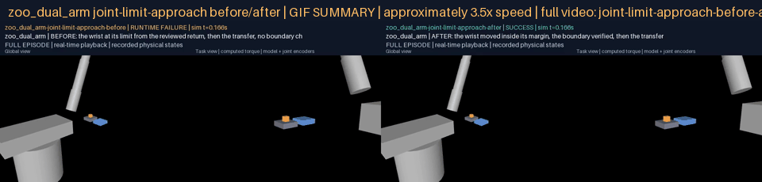 | [joint-limit-approach-before-after.mp4](g08-d08/joint-limit-approach-before-after.mp4) | [before](g08-d08/joint-limit-approach/before/media/episode.mp4) ([frames](g08-d08/joint-limit-approach/before/media/frames.json)), [after](g08-d08/joint-limit-approach/after/media/episode.mp4) ([frames](g08-d08/joint-limit-approach/after/media/frames.json)) |
| carry-to-place | zoo_jaw_arm | `SUCCESS`: the placement begun from a moving arm, the cube held, three joints over the speed limit at the boundary; at this cut the placement happened to certify anyway | `SUCCESS`: the arm braked to rest along a velocity-matched quintic with the cube held, the boundary verified again holding, the placement certified | 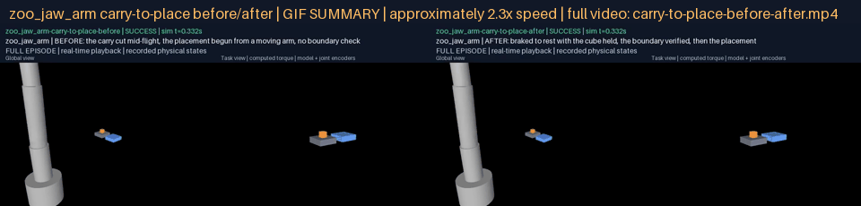 | [carry-to-place-before-after.mp4](g08-d08/carry-to-place-before-after.mp4) | [before](g08-d08/carry-to-place/before/media/episode.mp4) ([frames](g08-d08/carry-to-place/before/media/frames.json)), [after](g08-d08/carry-to-place/after/media/episode.mp4) ([frames](g08-d08/carry-to-place/after/media/frames.json)) |
| contact-mode-change | zoo_jaw_arm | `SUCCESS`: the free return begun with the cube in hand; the return opens the gripper as it moves and the cube falls 75 mm onto the platform; the return's own certificate calls the composition a success, no placement having run and nothing having verified where the cube landed | `REJECTED`: refused before the return moves, `contact_mode_mismatch`, no motion proposed: a contact change must run first; the placement inserted and both boundaries checked on one record (the `inserted` clip) | 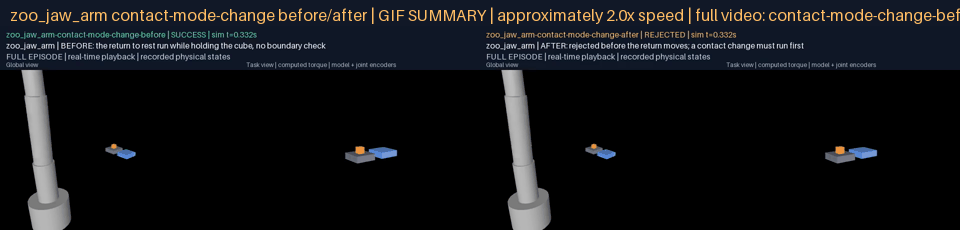 | [contact-mode-change-before-after.mp4](g08-d08/contact-mode-change-before-after.mp4) | [before](g08-d08/contact-mode-change/before/media/episode.mp4) ([frames](g08-d08/contact-mode-change/before/media/frames.json)), [after](g08-d08/contact-mode-change/after/media/episode.mp4) ([frames](g08-d08/contact-mode-change/after/media/frames.json)), [inserted](g08-d08/contact-mode-change/inserted/media/episode.mp4) ([frames](g08-d08/contact-mode-change/inserted/media/frames.json)) |

### Injected boundaries, every one rendered

| Case | Kind | Handling | Repairs | Outcome | Summary | Full episode | Frame map |
|---|---|---|---|---|---|---|---|
| zoo_dual_arm-joint_beyond_limit-00 | joint_beyond_limit | `repaired_then_reverified:joint_move,joint_move` | `joint_move` 0.50 s, `joint_move` 3.12 s | `RUNTIME FAILURE` | 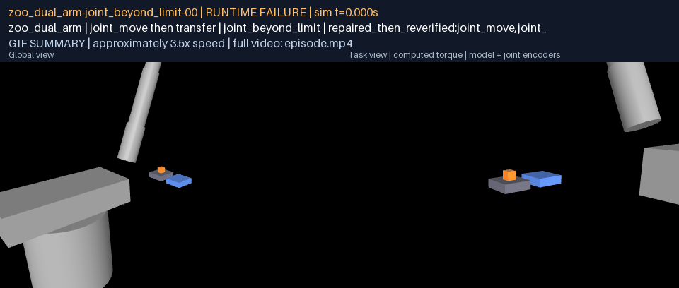 | [episode.mp4](g08-campaign/injected/zoo_dual_arm-joint_beyond_limit-00/media/episode.mp4) | [frames.json](g08-campaign/injected/zoo_dual_arm-joint_beyond_limit-00/media/frames.json) |
| zoo_jaw_arm-joint_beyond_limit-01 | joint_beyond_limit | `repaired_then_reverified:joint_move,joint_move` | `joint_move` 0.52 s, `joint_move` 3.41 s | `RUNTIME FAILURE` | 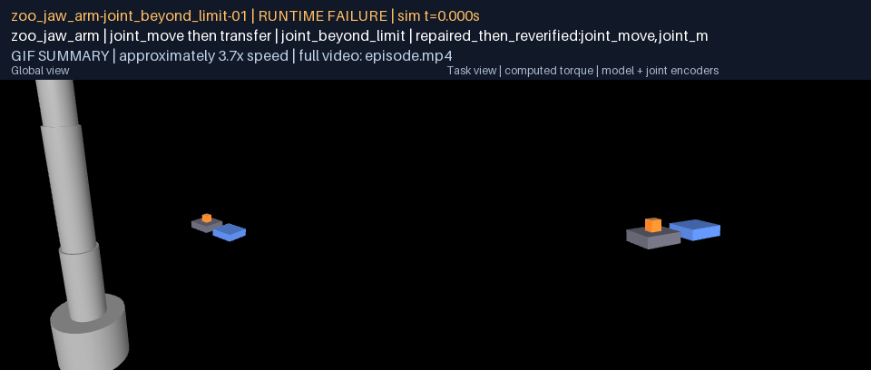 | [episode.mp4](g08-campaign/injected/zoo_jaw_arm-joint_beyond_limit-01/media/episode.mp4) | [frames.json](g08-campaign/injected/zoo_jaw_arm-joint_beyond_limit-01/media/frames.json) |
| zoo_long_arm-joint_beyond_limit-02 | joint_beyond_limit | `repaired_then_reverified:joint_move,joint_move` | `joint_move` 0.63 s, `joint_move` 4.68 s | `RUNTIME FAILURE` |  | [episode.mp4](g08-campaign/injected/zoo_long_arm-joint_beyond_limit-02/media/episode.mp4) | [frames.json](g08-campaign/injected/zoo_long_arm-joint_beyond_limit-02/media/frames.json) |
| zoo_dual_arm-joint_beyond_limit-03 | joint_beyond_limit | `repaired_then_reverified:joint_move` | `joint_move` 0.50 s | `RUNTIME FAILURE` |  | [episode.mp4](g08-campaign/injected/zoo_dual_arm-joint_beyond_limit-03/media/episode.mp4) | [frames.json](g08-campaign/injected/zoo_dual_arm-joint_beyond_limit-03/media/frames.json) |
| zoo_jaw_arm-joint_beyond_limit-04 | joint_beyond_limit | `repaired_then_reverified:joint_move,joint_move` | `joint_move` 0.52 s, `joint_move` 3.41 s | `RUNTIME FAILURE` |  | [episode.mp4](g08-campaign/injected/zoo_jaw_arm-joint_beyond_limit-04/media/episode.mp4) | [frames.json](g08-campaign/injected/zoo_jaw_arm-joint_beyond_limit-04/media/frames.json) |
| zoo_long_arm-joint_beyond_limit-05 | joint_beyond_limit | `repaired_then_reverified:joint_move,joint_move` | `joint_move` 0.63 s, `joint_move` 4.68 s | `RUNTIME FAILURE` | 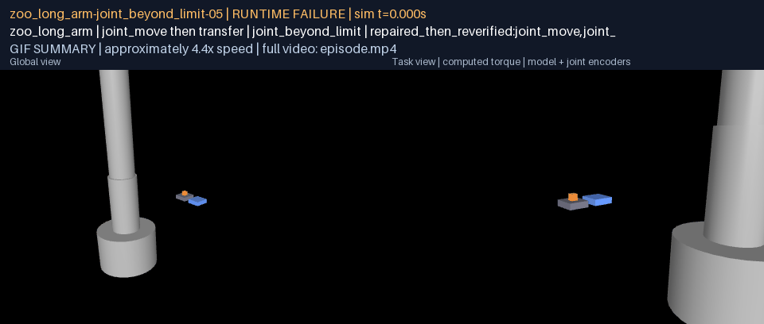 | [episode.mp4](g08-campaign/injected/zoo_long_arm-joint_beyond_limit-05/media/episode.mp4) | [frames.json](g08-campaign/injected/zoo_long_arm-joint_beyond_limit-05/media/frames.json) |
| zoo_dual_arm-joint_beyond_limit-06 | joint_beyond_limit | `repaired_then_reverified:joint_move,joint_move` | `joint_move` 0.50 s, `joint_move` 3.12 s | `RUNTIME FAILURE` |  | [episode.mp4](g08-campaign/injected/zoo_dual_arm-joint_beyond_limit-06/media/episode.mp4) | [frames.json](g08-campaign/injected/zoo_dual_arm-joint_beyond_limit-06/media/frames.json) |
| zoo_jaw_arm-joint_beyond_limit-07 | joint_beyond_limit | `repaired_then_reverified:joint_move,joint_move` | `joint_move` 0.52 s, `joint_move` 3.41 s | `RUNTIME FAILURE` |  | [episode.mp4](g08-campaign/injected/zoo_jaw_arm-joint_beyond_limit-07/media/episode.mp4) | [frames.json](g08-campaign/injected/zoo_jaw_arm-joint_beyond_limit-07/media/frames.json) |
| zoo_long_arm-joint_beyond_limit-08 | joint_beyond_limit | `repaired_then_reverified:joint_move` | `joint_move` 0.63 s | `RUNTIME FAILURE` | 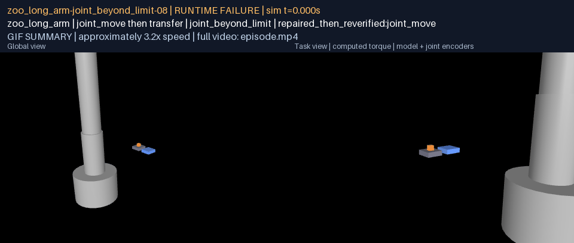 | [episode.mp4](g08-campaign/injected/zoo_long_arm-joint_beyond_limit-08/media/episode.mp4) | [frames.json](g08-campaign/injected/zoo_long_arm-joint_beyond_limit-08/media/frames.json) |
| zoo_dual_arm-joint_beyond_limit-09 | joint_beyond_limit | `repaired_then_reverified:joint_move` | `joint_move` 0.50 s | `RUNTIME FAILURE` | 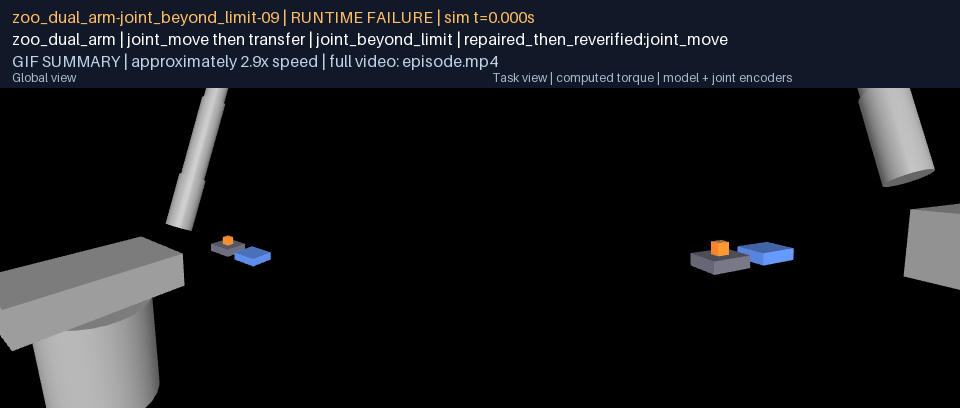 | [episode.mp4](g08-campaign/injected/zoo_dual_arm-joint_beyond_limit-09/media/episode.mp4) | [frames.json](g08-campaign/injected/zoo_dual_arm-joint_beyond_limit-09/media/frames.json) |
| zoo_dual_arm-joint_inside_margin-00 | joint_inside_margin | `repaired_then_reverified:joint_move,joint_move` | `joint_move` 0.50 s, `joint_move` 3.12 s | `SUCCESS` |  | [episode.mp4](g08-campaign/injected/zoo_dual_arm-joint_inside_margin-00/media/episode.mp4) | [frames.json](g08-campaign/injected/zoo_dual_arm-joint_inside_margin-00/media/frames.json) |
| zoo_jaw_arm-joint_inside_margin-01 | joint_inside_margin | `repaired_then_reverified:joint_move,joint_move` | `joint_move` 0.50 s, `joint_move` 3.41 s | `SUCCESS` | 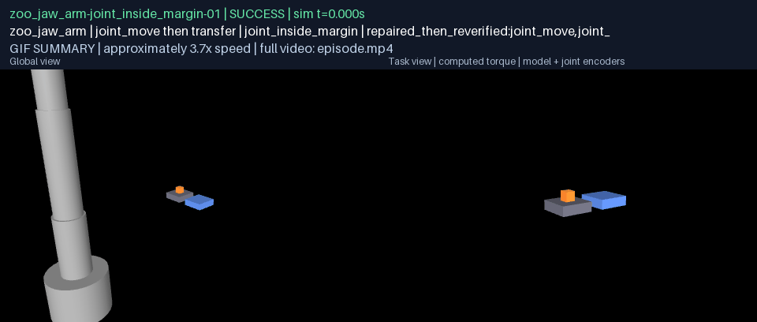 | [episode.mp4](g08-campaign/injected/zoo_jaw_arm-joint_inside_margin-01/media/episode.mp4) | [frames.json](g08-campaign/injected/zoo_jaw_arm-joint_inside_margin-01/media/frames.json) |
| zoo_long_arm-joint_inside_margin-02 | joint_inside_margin | `repaired_then_reverified:joint_move,joint_move` | `joint_move` 0.50 s, `joint_move` 4.68 s | `SUCCESS` | 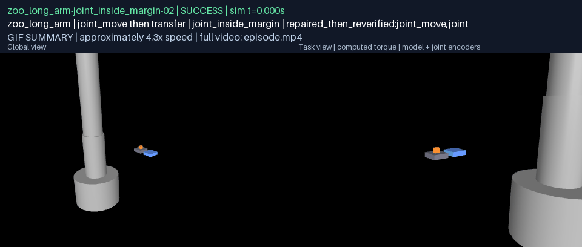 | [episode.mp4](g08-campaign/injected/zoo_long_arm-joint_inside_margin-02/media/episode.mp4) | [frames.json](g08-campaign/injected/zoo_long_arm-joint_inside_margin-02/media/frames.json) |
| zoo_dual_arm-joint_inside_margin-03 | joint_inside_margin | `repaired_then_reverified:joint_move,joint_move` | `joint_move` 0.50 s, `joint_move` 3.12 s | `SUCCESS` |  | [episode.mp4](g08-campaign/injected/zoo_dual_arm-joint_inside_margin-03/media/episode.mp4) | [frames.json](g08-campaign/injected/zoo_dual_arm-joint_inside_margin-03/media/frames.json) |
| zoo_jaw_arm-joint_inside_margin-04 | joint_inside_margin | `repaired_then_reverified:joint_move` | `joint_move` 0.50 s | `SUCCESS` | 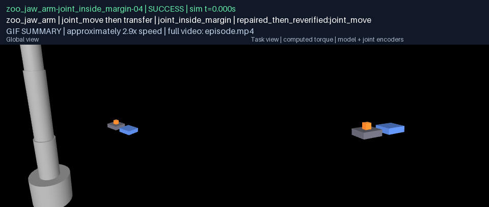 | [episode.mp4](g08-campaign/injected/zoo_jaw_arm-joint_inside_margin-04/media/episode.mp4) | [frames.json](g08-campaign/injected/zoo_jaw_arm-joint_inside_margin-04/media/frames.json) |
| zoo_long_arm-joint_inside_margin-05 | joint_inside_margin | `repaired_then_reverified:joint_move,joint_move` | `joint_move` 0.50 s, `joint_move` 4.68 s | `SUCCESS` |  | [episode.mp4](g08-campaign/injected/zoo_long_arm-joint_inside_margin-05/media/episode.mp4) | [frames.json](g08-campaign/injected/zoo_long_arm-joint_inside_margin-05/media/frames.json) |
| zoo_dual_arm-velocity_too_high-00 | velocity_too_high | `repaired_then_reverified:settle` | `settle` 0.16 s | `SUCCESS` |  | [episode.mp4](g08-campaign/injected/zoo_dual_arm-velocity_too_high-00/media/episode.mp4) | [frames.json](g08-campaign/injected/zoo_dual_arm-velocity_too_high-00/media/frames.json) |
| zoo_jaw_arm-velocity_too_high-01 | velocity_too_high | `repaired_then_reverified:settle` | `settle` 0.16 s | `SUCCESS` |  | [episode.mp4](g08-campaign/injected/zoo_jaw_arm-velocity_too_high-01/media/episode.mp4) | [frames.json](g08-campaign/injected/zoo_jaw_arm-velocity_too_high-01/media/frames.json) |
| zoo_long_arm-velocity_too_high-02 | velocity_too_high | `repaired_then_reverified:settle` | `settle` 0.16 s | `SUCCESS` |  | [episode.mp4](g08-campaign/injected/zoo_long_arm-velocity_too_high-02/media/episode.mp4) | [frames.json](g08-campaign/injected/zoo_long_arm-velocity_too_high-02/media/frames.json) |
| zoo_dual_arm-velocity_too_high-03 | velocity_too_high | `repaired_then_reverified:settle` | `settle` 0.16 s | `SUCCESS` |  | [episode.mp4](g08-campaign/injected/zoo_dual_arm-velocity_too_high-03/media/episode.mp4) | [frames.json](g08-campaign/injected/zoo_dual_arm-velocity_too_high-03/media/frames.json) |
| zoo_jaw_arm-velocity_too_high-04 | velocity_too_high | `repaired_then_reverified:settle` | `settle` 0.16 s | `SUCCESS` | 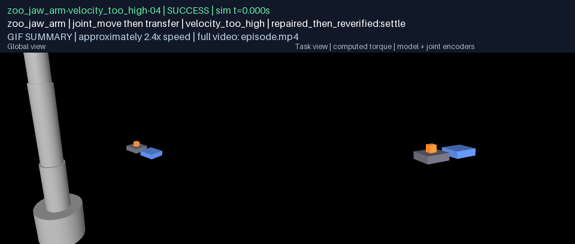 | [episode.mp4](g08-campaign/injected/zoo_jaw_arm-velocity_too_high-04/media/episode.mp4) | [frames.json](g08-campaign/injected/zoo_jaw_arm-velocity_too_high-04/media/frames.json) |
| zoo_long_arm-velocity_too_high-05 | velocity_too_high | `repaired_then_reverified:settle` | `settle` 0.16 s | `SUCCESS` | 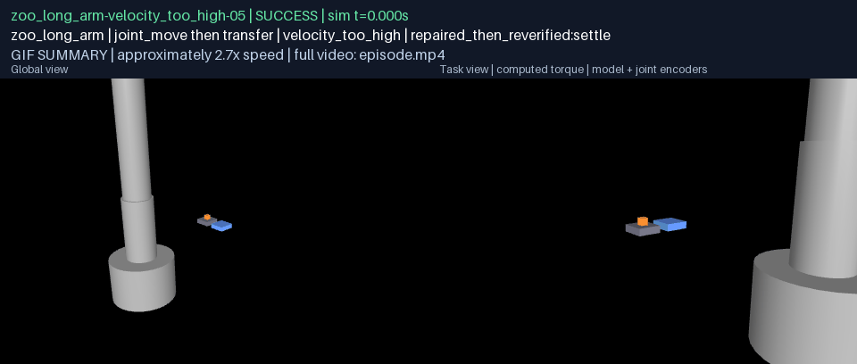 | [episode.mp4](g08-campaign/injected/zoo_long_arm-velocity_too_high-05/media/episode.mp4) | [frames.json](g08-campaign/injected/zoo_long_arm-velocity_too_high-05/media/frames.json) |
| zoo_dual_arm-velocity_too_high-06 | velocity_too_high | `repaired_then_reverified:settle` | `settle` 0.16 s | `SUCCESS` |  | [episode.mp4](g08-campaign/injected/zoo_dual_arm-velocity_too_high-06/media/episode.mp4) | [frames.json](g08-campaign/injected/zoo_dual_arm-velocity_too_high-06/media/frames.json) |
| zoo_jaw_arm-velocity_too_high-07 | velocity_too_high | `repaired_then_reverified:settle` | `settle` 0.14 s | `SUCCESS` |  | [episode.mp4](g08-campaign/injected/zoo_jaw_arm-velocity_too_high-07/media/episode.mp4) | [frames.json](g08-campaign/injected/zoo_jaw_arm-velocity_too_high-07/media/frames.json) |
| zoo_dual_arm-holding_into_free-00 | holding_into_free | `rejected:contact_mode_mismatch` | none | `REJECTED` |  | [episode.mp4](g08-campaign/injected/zoo_dual_arm-holding_into_free-00/media/episode.mp4) | [frames.json](g08-campaign/injected/zoo_dual_arm-holding_into_free-00/media/frames.json) |
| zoo_jaw_arm-holding_into_free-01 | holding_into_free | `rejected:contact_mode_mismatch` | none | `REJECTED` |  | [episode.mp4](g08-campaign/injected/zoo_jaw_arm-holding_into_free-01/media/episode.mp4) | [frames.json](g08-campaign/injected/zoo_jaw_arm-holding_into_free-01/media/frames.json) |
| zoo_long_arm-holding_into_free-02 | holding_into_free | `rejected:contact_mode_mismatch` | none | `REJECTED` |  | [episode.mp4](g08-campaign/injected/zoo_long_arm-holding_into_free-02/media/episode.mp4) | [frames.json](g08-campaign/injected/zoo_long_arm-holding_into_free-02/media/frames.json) |
| zoo_dual_arm-holding_into_free-03 | holding_into_free | `rejected:contact_mode_mismatch` | none | `REJECTED` | 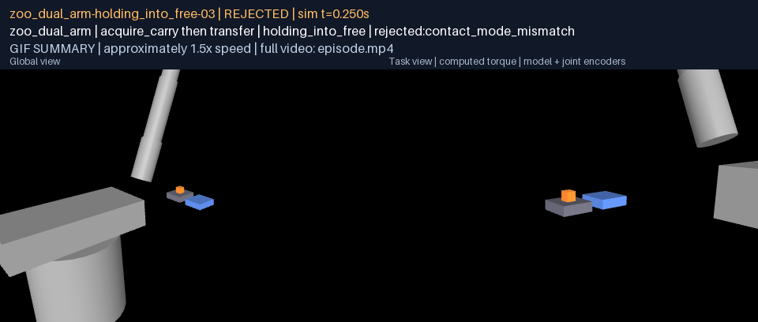 | [episode.mp4](g08-campaign/injected/zoo_dual_arm-holding_into_free-03/media/episode.mp4) | [frames.json](g08-campaign/injected/zoo_dual_arm-holding_into_free-03/media/frames.json) |
| zoo_jaw_arm-holding_into_free-04 | holding_into_free | `rejected:contact_mode_mismatch` | none | `REJECTED` | 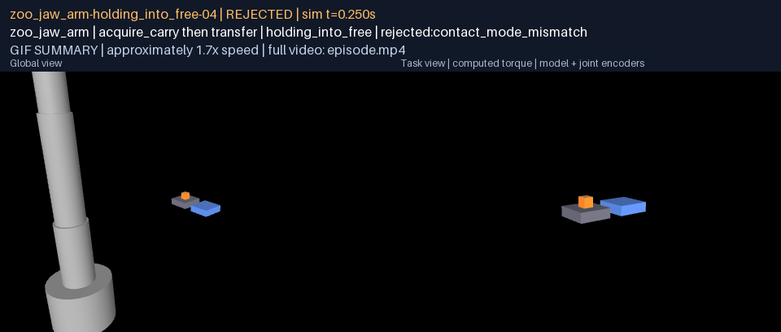 | [episode.mp4](g08-campaign/injected/zoo_jaw_arm-holding_into_free-04/media/episode.mp4) | [frames.json](g08-campaign/injected/zoo_jaw_arm-holding_into_free-04/media/frames.json) |
| zoo_long_arm-holding_into_free-05 | holding_into_free | `rejected:contact_mode_mismatch` | none | `REJECTED` | 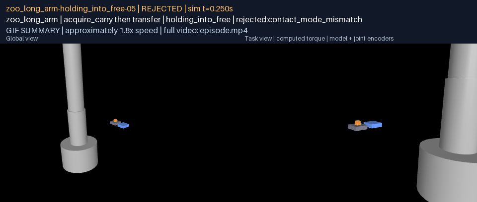 | [episode.mp4](g08-campaign/injected/zoo_long_arm-holding_into_free-05/media/episode.mp4) | [frames.json](g08-campaign/injected/zoo_long_arm-holding_into_free-05/media/frames.json) |
| zoo_dual_arm-free_into_holding-00 | free_into_holding | `rejected:contact_mode_mismatch` | none | `REJECTED` | 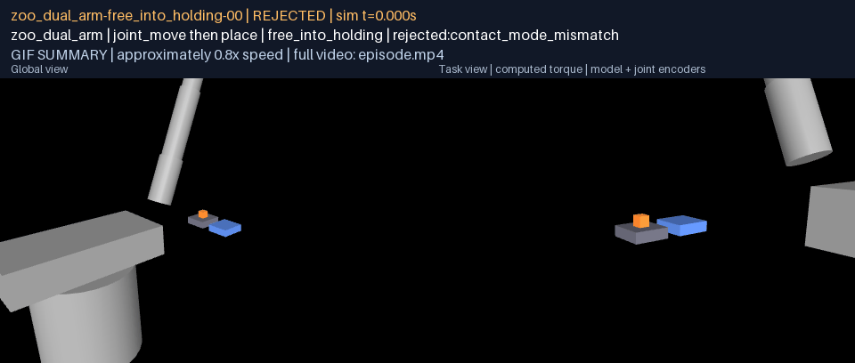 | [episode.mp4](g08-campaign/injected/zoo_dual_arm-free_into_holding-00/media/episode.mp4) | [frames.json](g08-campaign/injected/zoo_dual_arm-free_into_holding-00/media/frames.json) |
| zoo_jaw_arm-free_into_holding-01 | free_into_holding | `rejected:contact_mode_mismatch` | none | `REJECTED` | 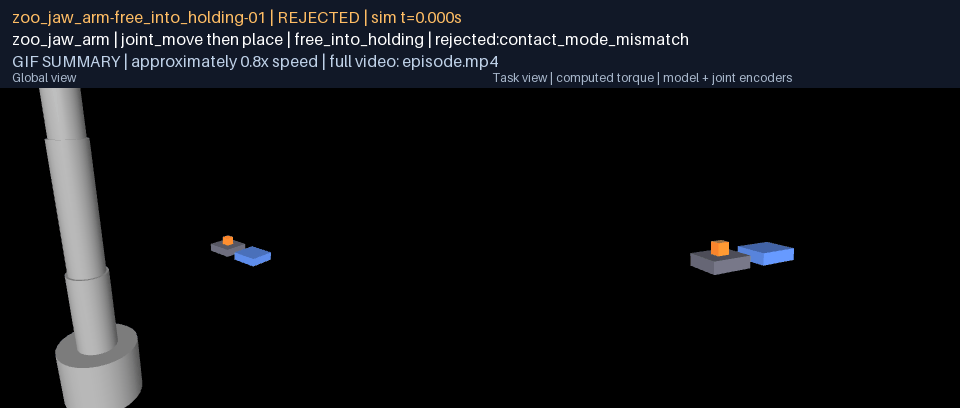 | [episode.mp4](g08-campaign/injected/zoo_jaw_arm-free_into_holding-01/media/episode.mp4) | [frames.json](g08-campaign/injected/zoo_jaw_arm-free_into_holding-01/media/frames.json) |
| zoo_long_arm-free_into_holding-02 | free_into_holding | `rejected:contact_mode_mismatch` | none | `REJECTED` | 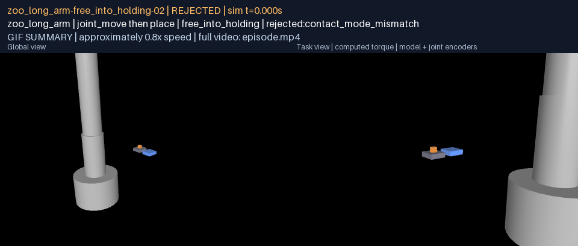 | [episode.mp4](g08-campaign/injected/zoo_long_arm-free_into_holding-02/media/episode.mp4) | [frames.json](g08-campaign/injected/zoo_long_arm-free_into_holding-02/media/frames.json) |
| zoo_dual_arm-free_into_holding-03 | free_into_holding | `rejected:contact_mode_mismatch` | none | `REJECTED` |  | [episode.mp4](g08-campaign/injected/zoo_dual_arm-free_into_holding-03/media/episode.mp4) | [frames.json](g08-campaign/injected/zoo_dual_arm-free_into_holding-03/media/frames.json) |
| zoo_jaw_arm-free_into_holding-04 | free_into_holding | `rejected:contact_mode_mismatch` | none | `REJECTED` | 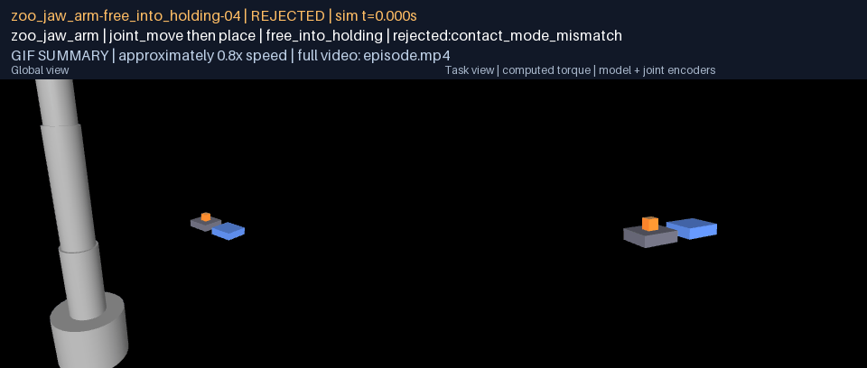 | [episode.mp4](g08-campaign/injected/zoo_jaw_arm-free_into_holding-04/media/episode.mp4) | [frames.json](g08-campaign/injected/zoo_jaw_arm-free_into_holding-04/media/frames.json) |
| zoo_long_arm-free_into_holding-05 | free_into_holding | `rejected:contact_mode_mismatch` | none | `REJECTED` |  | [episode.mp4](g08-campaign/injected/zoo_long_arm-free_into_holding-05/media/episode.mp4) | [frames.json](g08-campaign/injected/zoo_long_arm-free_into_holding-05/media/frames.json) |
| zoo_dual_arm-belief_stale-00 | belief_stale | `repaired_then_reverified:observe` | `observe` 0.00 s | `SUCCESS` | 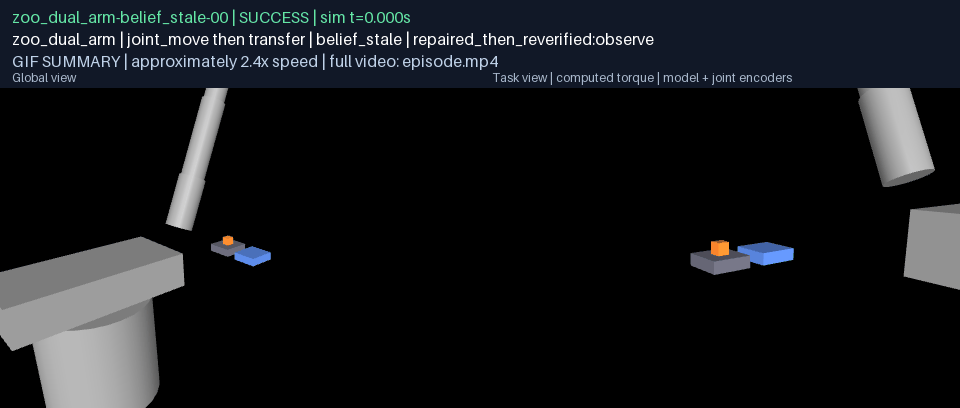 | [episode.mp4](g08-campaign/injected/zoo_dual_arm-belief_stale-00/media/episode.mp4) | [frames.json](g08-campaign/injected/zoo_dual_arm-belief_stale-00/media/frames.json) |
| zoo_jaw_arm-belief_stale-01 | belief_stale | `repaired_then_reverified:observe` | `observe` 0.00 s | `SUCCESS` |  | [episode.mp4](g08-campaign/injected/zoo_jaw_arm-belief_stale-01/media/episode.mp4) | [frames.json](g08-campaign/injected/zoo_jaw_arm-belief_stale-01/media/frames.json) |
| zoo_long_arm-belief_stale-02 | belief_stale | `repaired_then_reverified:observe` | `observe` 0.00 s | `SUCCESS` | 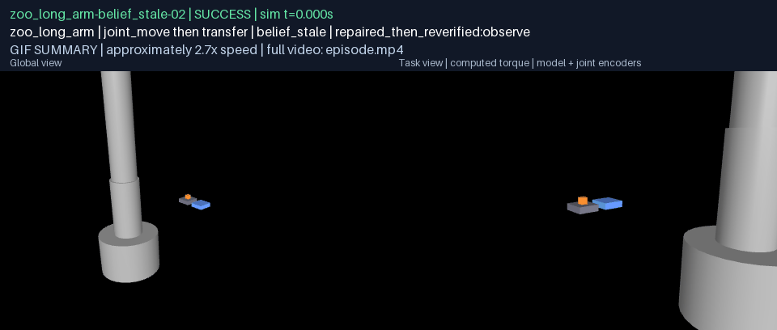 | [episode.mp4](g08-campaign/injected/zoo_long_arm-belief_stale-02/media/episode.mp4) | [frames.json](g08-campaign/injected/zoo_long_arm-belief_stale-02/media/frames.json) |
| zoo_dual_arm-belief_stale-03 | belief_stale | `repaired_then_reverified:observe` | `observe` 0.00 s | `SUCCESS` |  | [episode.mp4](g08-campaign/injected/zoo_dual_arm-belief_stale-03/media/episode.mp4) | [frames.json](g08-campaign/injected/zoo_dual_arm-belief_stale-03/media/frames.json) |
| zoo_jaw_arm-belief_stale-04 | belief_stale | `repaired_then_reverified:observe` | `observe` 0.00 s | `SUCCESS` |  | [episode.mp4](g08-campaign/injected/zoo_jaw_arm-belief_stale-04/media/episode.mp4) | [frames.json](g08-campaign/injected/zoo_jaw_arm-belief_stale-04/media/frames.json) |
| zoo_dual_arm-resource_conflict-00 | resource_conflict | `rejected:resource_conflict` | none | `REJECTED` | 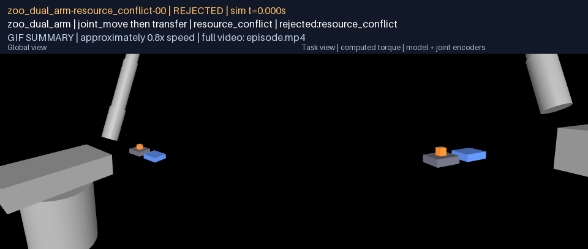 | [episode.mp4](g08-campaign/injected/zoo_dual_arm-resource_conflict-00/media/episode.mp4) | [frames.json](g08-campaign/injected/zoo_dual_arm-resource_conflict-00/media/frames.json) |
| zoo_jaw_arm-resource_conflict-01 | resource_conflict | `rejected:resource_conflict` | none | `REJECTED` |  | [episode.mp4](g08-campaign/injected/zoo_jaw_arm-resource_conflict-01/media/episode.mp4) | [frames.json](g08-campaign/injected/zoo_jaw_arm-resource_conflict-01/media/frames.json) |
| zoo_long_arm-resource_conflict-02 | resource_conflict | `rejected:resource_conflict` | none | `REJECTED` | 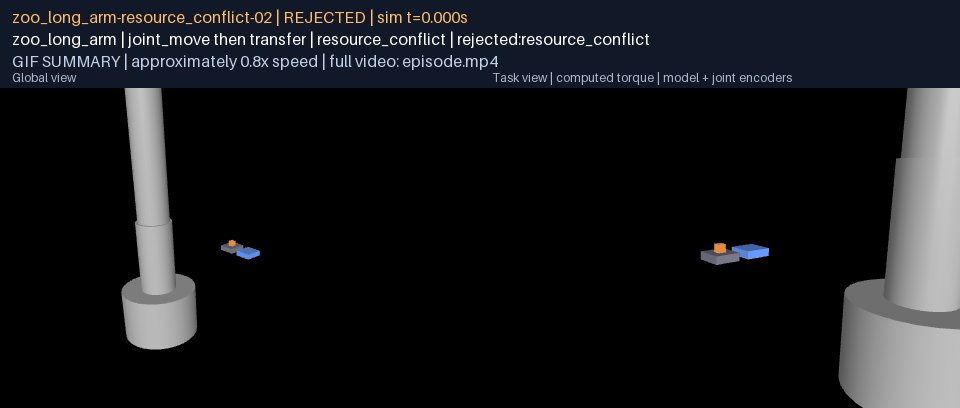 | [episode.mp4](g08-campaign/injected/zoo_long_arm-resource_conflict-02/media/episode.mp4) | [frames.json](g08-campaign/injected/zoo_long_arm-resource_conflict-02/media/frames.json) |
| zoo_dual_arm-resource_conflict-03 | resource_conflict | `rejected:resource_conflict` | none | `REJECTED` |  | [episode.mp4](g08-campaign/injected/zoo_dual_arm-resource_conflict-03/media/episode.mp4) | [frames.json](g08-campaign/injected/zoo_dual_arm-resource_conflict-03/media/frames.json) |
| zoo_jaw_arm-resource_conflict-04 | resource_conflict | `rejected:resource_conflict` | none | `REJECTED` | 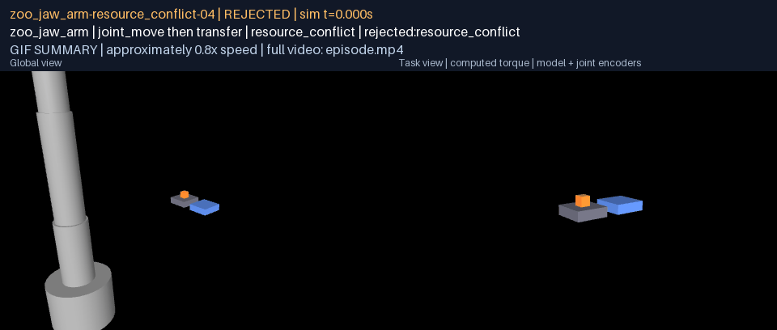 | [episode.mp4](g08-campaign/injected/zoo_jaw_arm-resource_conflict-04/media/episode.mp4) | [frames.json](g08-campaign/injected/zoo_jaw_arm-resource_conflict-04/media/frames.json) |
| zoo_dual_arm-reviewed_dual_arm_failure-00 | joint_inside_margin | `repaired_then_reverified:joint_move,joint_move` | `joint_move` 0.50 s, `joint_move` 3.12 s | `SUCCESS` |  | [episode.mp4](g08-campaign/injected/zoo_dual_arm-reviewed_dual_arm_failure-00/media/episode.mp4) | [frames.json](g08-campaign/injected/zoo_dual_arm-reviewed_dual_arm_failure-00/media/frames.json) |

### Feasible compositions rendered in full

The first five successes per body and every failure; every one of the 100 keeps its full trace and its row in `trials.json`.

| Case | Body | Outcome | Boundary | Summary | Full episode | Frame map |
|---|---|---|---|---|---|---|
| zoo_dual_arm-feasible-000 | zoo_dual_arm | `SUCCESS` | compatible |  | [episode.mp4](g08-campaign/feasible/zoo_dual_arm-feasible-000/media/episode.mp4) | [frames.json](g08-campaign/feasible/zoo_dual_arm-feasible-000/media/frames.json) |
| zoo_dual_arm-feasible-001 | zoo_dual_arm | `SUCCESS` | compatible |  | [episode.mp4](g08-campaign/feasible/zoo_dual_arm-feasible-001/media/episode.mp4) | [frames.json](g08-campaign/feasible/zoo_dual_arm-feasible-001/media/frames.json) |
| zoo_dual_arm-feasible-002 | zoo_dual_arm | `SUCCESS` | compatible | 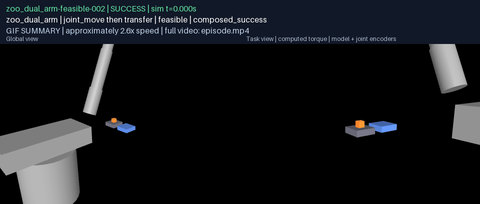 | [episode.mp4](g08-campaign/feasible/zoo_dual_arm-feasible-002/media/episode.mp4) | [frames.json](g08-campaign/feasible/zoo_dual_arm-feasible-002/media/frames.json) |
| zoo_dual_arm-feasible-003 | zoo_dual_arm | `SUCCESS` | compatible |  | [episode.mp4](g08-campaign/feasible/zoo_dual_arm-feasible-003/media/episode.mp4) | [frames.json](g08-campaign/feasible/zoo_dual_arm-feasible-003/media/frames.json) |
| zoo_dual_arm-feasible-004 | zoo_dual_arm | `SUCCESS` | compatible |  | [episode.mp4](g08-campaign/feasible/zoo_dual_arm-feasible-004/media/episode.mp4) | [frames.json](g08-campaign/feasible/zoo_dual_arm-feasible-004/media/frames.json) |
| zoo_jaw_arm-feasible-000 | zoo_jaw_arm | `SUCCESS` | compatible |  | [episode.mp4](g08-campaign/feasible/zoo_jaw_arm-feasible-000/media/episode.mp4) | [frames.json](g08-campaign/feasible/zoo_jaw_arm-feasible-000/media/frames.json) |
| zoo_jaw_arm-feasible-001 | zoo_jaw_arm | `SUCCESS` | compatible |  | [episode.mp4](g08-campaign/feasible/zoo_jaw_arm-feasible-001/media/episode.mp4) | [frames.json](g08-campaign/feasible/zoo_jaw_arm-feasible-001/media/frames.json) |
| zoo_jaw_arm-feasible-002 | zoo_jaw_arm | `SUCCESS` | compatible |  | [episode.mp4](g08-campaign/feasible/zoo_jaw_arm-feasible-002/media/episode.mp4) | [frames.json](g08-campaign/feasible/zoo_jaw_arm-feasible-002/media/frames.json) |
| zoo_jaw_arm-feasible-003 | zoo_jaw_arm | `SUCCESS` | compatible | 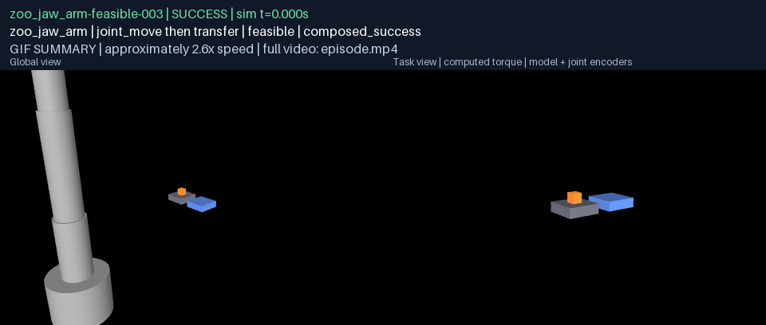 | [episode.mp4](g08-campaign/feasible/zoo_jaw_arm-feasible-003/media/episode.mp4) | [frames.json](g08-campaign/feasible/zoo_jaw_arm-feasible-003/media/frames.json) |
| zoo_jaw_arm-feasible-004 | zoo_jaw_arm | `SUCCESS` | compatible |  | [episode.mp4](g08-campaign/feasible/zoo_jaw_arm-feasible-004/media/episode.mp4) | [frames.json](g08-campaign/feasible/zoo_jaw_arm-feasible-004/media/frames.json) |
| zoo_long_arm-feasible-000 | zoo_long_arm | `SUCCESS` | compatible |  | [episode.mp4](g08-campaign/feasible/zoo_long_arm-feasible-000/media/episode.mp4) | [frames.json](g08-campaign/feasible/zoo_long_arm-feasible-000/media/frames.json) |
| zoo_long_arm-feasible-001 | zoo_long_arm | `SUCCESS` | compatible |  | [episode.mp4](g08-campaign/feasible/zoo_long_arm-feasible-001/media/episode.mp4) | [frames.json](g08-campaign/feasible/zoo_long_arm-feasible-001/media/frames.json) |
| zoo_long_arm-feasible-002 | zoo_long_arm | `SUCCESS` | compatible |  | [episode.mp4](g08-campaign/feasible/zoo_long_arm-feasible-002/media/episode.mp4) | [frames.json](g08-campaign/feasible/zoo_long_arm-feasible-002/media/frames.json) |
| zoo_long_arm-feasible-003 | zoo_long_arm | `SUCCESS` | compatible |  | [episode.mp4](g08-campaign/feasible/zoo_long_arm-feasible-003/media/episode.mp4) | [frames.json](g08-campaign/feasible/zoo_long_arm-feasible-003/media/frames.json) |
| zoo_long_arm-feasible-004 | zoo_long_arm | `SUCCESS` | compatible | 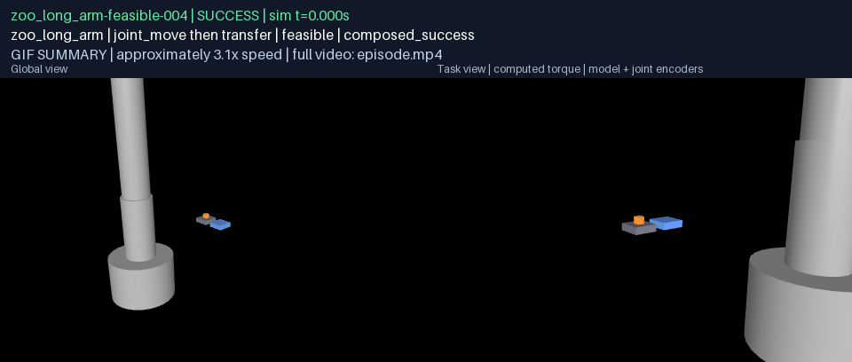 | [episode.mp4](g08-campaign/feasible/zoo_long_arm-feasible-004/media/episode.mp4) | [frames.json](g08-campaign/feasible/zoo_long_arm-feasible-004/media/frames.json) |

## Acceptance evidence

| Criterion | Evidence and outcome |
|---|---|
| G08.A01: check terminal/initiation compatibility for pose, velocity, contact mode, object ownership, belief freshness and limb/support resources | `check_boundary` in `rigby_core.skills.boundary` checks all six, typed and measured; `rigby_general.transitions` measures them from the body (contact mode by the closure's opposition test); pinned by 13 core tests and 9 physics-bound tests. |
| G08.A02: at least 100 frozen feasible boundary cases spanning every enabled body, at least 95 successful composed executions, transition cost recorded | Corpus `g08-transitions-v1` registered before any scored run, 100 cases over the three G06-enabled bodies; 100 of 100 composed executions succeeded (zoo_dual_arm 34/34, zoo_jaw_arm 33/33, zoo_long_arm 33/33); transition cost per case in `trials.json` (physics time, joint travel, peak speed fraction, repairs), 31 cases repaired, mean 1.97 s. |
| G08.A03: inject at least 40 incompatible boundaries; every one rejected or repaired and re-verified before execution; include the reviewed dual-arm failure | 47 injected of seven kinds; 47 of 47 rejected before execution or repaired and verified again before the second skill ran; the reviewed dual-arm failure (`zoo_dual_arm-reviewed_dual_arm_failure-00`, the latest keyframe of the pre-guard program with a joint at its limit, left_joint_3, from the G05 fixture by hash) was repaired by a joint move and verified again before the transfer, which certified after a further guarded move to the reference configuration. |
| G08.A04: continuity requirements appropriate to the contact mode; a smooth path cannot bypass object-hold or support checks | Free mode: position- and velocity-continuous references with bounded deceleration (the braked settle; the controller receives reference velocity and acceleration). Holding mode: the same with the closure keeping its force, the boundary measured holding before and after (carry-to-place pair). Contact mode and what rests are measured from contact forces, and a mismatch is refused with no repair proposed (`test_a_skill_that_expects_to_hold_cannot_be_given_the_object_by_a_path`, both contact-mode refusals on physics, the contact-mode pair). |
| D08: before/after transition repair, including joint-limit approach, carry-to-place and a contact-mode change | The three pairs above, each through identical physics, with the placement shown inserted where the contact change was required. |


## What is checked, and what repairs it

The boundary state (`rigby_core.skills.boundary.BoundaryStateV1`) carries
every arm joint's position and velocity with its declared range and
velocity limit, the contact mode (`free` or `holding`, measured by the
closure controller's own contact-force and opposition test, never read
from a plan), what is held and by which manipulator resource, what rests
on which support, the physics time since the last observation, and the
resources the ended skill still owns. The initiation set
(`InitiationSetV1`) says what the next skill admits: joints inside their
limits by a margin of two percent of range, every joint under five percent
of its velocity limit, the contact mode it begins in, the object held by
this manipulator if it begins holding, the object resting on a support if
it begins by acquiring it, a belief no older than five seconds, and its
manipulator and the object not owned elsewhere. Every threshold was frozen
in the corpus before the first scored run.

`check_boundary` returns every violation, typed and measured against its
limit, and the one thing that must happen before the second skill may
begin:

| Violation | Repair | On physics |
|---|---|---|
| `joint_beyond_limit`, `joint_inside_margin` | `joint_move` | a quintic in joint space from where the joints are, at the velocity they have, to one margin inside the admissible position, at most 35 percent of each joint's velocity limit, refused before it starts if the self-collision guard finds any sample of the straight joint-space path inside the body |
| `velocity_too_high` | `settle` | a brake along a quintic that starts at the velocity the arm has and ends at rest, over the time a deceleration of four velocity limits per second needs, then a hold until every joint is under the limit |
| `belief_stale` | `observe` | the belief refreshed from the scene |
| `contact_mode_mismatch`, `ownership_mismatch`, `object_not_resting` | `contact_change` | none: a skill that changes what is held or rests must run; the composition is refused |
| `resource_conflict` | `release_resource` | none: the owner must release it; the composition is refused |

When any violation admits no path the verdict is a rejection whatever else
is wrong, so a joint inside its margin beside a held object the next skill
expects free is refused, not moved. Every repair runs under the same
computed-torque controller and closure the skills run under, continues the
world the last skill left (full integration state, solver warm start and
clock included), and is recorded on the same physics record, so a repaired
composition is one continuous replayable run; the boundary is measured and
checked again after each repair, within a budget of two, and the second
skill runs only from a compatible boundary. Each transition is gated on
its own motion by the free-motion joint gates, the second skill on its
positions, and the first skill on its own record: a second skill that
begins where the first left a joint past its limit cannot be called a
success by its own certificate.

## Continuity by contact mode

In free mode the reference handed to the controller is continuous in
position and velocity across the boundary: a move or a brake begins at the
velocity the arm has (the controller receives the reference velocity and
acceleration, not a zero), and its deceleration is bounded. A reference
frozen at the current pose, which is what a naive "hold still" does, asked
the controller for an impulse and the joints crossed their velocity limits
in the few milliseconds it took to deliver it; that is why the settle
brakes. In holding mode the same holds and the closure keeps its force
through the transition, so the object stays in opposition; the carry-to-
place pair shows the brake with the cube held and the boundary measured
holding before and after. A smooth path cannot bypass the object-hold or
support checks: the contact mode and what rests are measured from contact
forces, not from the reference, and a mismatch is refused with no repair
proposed; the tests pin that a joint-margin violation beside a held object
is still a refusal, and the contact-mode pair shows the free return run
without the check carrying the cube away while the checked composition
refuses it and the placement is what must run between.

## The corpus

`g08-transitions-v1` was registered before any scored run and hashed with
the G06 fixture it composes against. A feasible case is a terminal joint
configuration for a free motion from rest, drawn uniformly from the middle
sixty percent of every joint's range, that the self-collision guard clears
along the straight joint path from rest, that touches neither a fixture
nor the object along that path, and from which the transfer's own guarded,
facing-aware path solves from that pose alone, inside every joint range,
within the facing tolerance at the hover and the grasp, and clear of the
world up to the hover; 100 across the dual arm (34), the jaw arm (33) and
the long arm (33), the draws the witness rejected recorded beside them
with their reasons. The composed execution is the
motion followed by the whole transfer, and it succeeds when the motion
certifies on its own gates, the boundary is compatible after any repair,
the transfer certifies, and no joint gate fires on a transition or on the
transfer. Forty-seven injected cases of seven kinds name what the checker
must do: reject before execution, or repair and verify again before the
second skill runs. The reviewed dual-arm failure is taken from the G05
fixture by hash: the latest keyframe of the pre-guard program with a joint
inside the margin of its limit (the left elbow at 2.850 rad against 2.85)
that the body can be moved to clear of itself and of the world; the
keyframes with the wrist folded into the forearm are self-colliding and
cannot be reached as a certified motion, which is what the guard was for.

## Campaign

### Feasible compositions

| Body | Cases | Composed successes | Boundaries compatible as left | Repaired then verified | Failure taxonomy |
|---|---:|---:|---:|---:|---|
| zoo_dual_arm | 34 | 34 | 34 | 0 | none |
| zoo_jaw_arm | 33 | 33 | 33 | 0 | none |
| zoo_long_arm | 33 | 33 | 33 | 1 | none |

Transition cost is recorded per case: physics time spent in repairs, joint travel in radians and the peak joint speed as a fraction of the limit. Over the 31 repaired cases the mean repair took 1.97 s of physics (longest 5.31 s) and 2.819 rad of joint travel.

### Injected boundaries

| Kind | What was injected | Cases | Handled correctly | Rejected | Repaired then verified |
|---|---|---:|---:|---:|---:|
| belief_stale | a belief older than the next skill allows | 5 | 5 | 0 | 5 |
| free_into_holding | a free motion, then the placement, which begins holding the cube | 6 | 6 | 6 | 0 |
| holding_into_free | an acquisition ending holding the cube, then the transfer, which begins free with the cube resting | 6 | 6 | 6 | 0 |
| joint_beyond_limit | one joint commanded three percent of its range past a limit | 10 | 10 | 0 | 10 |
| joint_inside_margin | one joint commanded inside the two percent margin of a limit (the reviewed dual-arm failure among them) | 7 | 7 | 0 | 7 |
| resource_conflict | the first skill keeps owning the manipulator | 5 | 5 | 5 | 0 |
| velocity_too_high | the motion cut part way, the arm still moving | 8 | 8 | 0 | 8 |

The reviewed dual-arm failure: left_joint_3 arrived at 2.850 rad against an admissible 2.736 (`joint_inside_margin`); the joint move brought it inside the margin in 0.50 s and the boundary was verified compatible; the transfer could not plan from there and a guarded move to the reference configuration was inserted (3.12 s) and verified; the transfer that followed certified.


## Pilot 1

The first scored pass, run whole at commit `eb53f64` on the corpus as
first registered, is retained as `g08-campaign-pilot-1` with its per-case
records, summary, provenance, its own corpus and registration, and every
rendered episode (its replayable bundles are not kept; their digests are in
each row). It composed 82 of 100 feasible cases and handled all 47 injected
boundaries. Its eighteen feasible failures had two causes, and the corpus
was re-registered under a witness that rejects both rather than the
failing cases being dropped:

- eight were poses the self-collision guard admitted but the world did
  not: a straight joint path from rest that crossed the bench or the
  platform, so the free motion was driven through it, or a transfer whose
  approach brushed the cube on the way to the hover, moved it, and stopped
  its descent;
- ten were transfers whose turn left the hand up to forty-five degrees
  from vertical: from a folded posture the solver reached the hover with
  the position met and the facing not, the hand descended tilted, and the
  fingers closed beside the cube with no contact force at all.

The same pass showed that a resumed transfer solved its path from the
restart seeds and could be asked to jump to another solution of the same
point, which is repaired in the primitive (below). The roster was re-run
whole at the repaired commit rather than the failing cases alone.

## What was wrong

Three things were found by this goal and repaired in the transfer
primitive and the recorder, all general.

A transfer that continues a world another skill left solved its path from
the restart seeds, and when the rest-seeded path failed its first row was
another solution of the same point: the controller was asked to jump to
it and slewed the arm through two joint limits in one step. Restart seeds
are configurations the arm may be placed in before the first recorded
state; a resumed transfer now solves from where the arm actually stands
and is refused typed if no path exists from there, and the corpus witness
uses the same rule.

A resumed skill that restored only positions and velocities integrated to
a slightly different state than the record shows, because the solver warm
start was fresh; the full integration state is restored now, and the
recorded controls replay across every boundary of every composition.

A transfer planned from a folded posture could reach the hover with the
position met and the facing forty-five degrees off, and descend tilted
onto nothing. The primitive now measures the planned facing at the hover
and at the grasp and refuses before motion, typed `facing_unmet`, if it is
more than fifteen degrees off; a composition treats that refusal as it
treats an unreachable path and inserts a guarded move to the reference
configuration, verified again, before one more attempt. From the rest pose
every body was already within ten degrees, so the G06 results stand.

## Tests

| Suite | Result |
|---|---|
| core (with the 13 new boundary tests) | 336 passed, 2 skipped (Windows symlink privilege), 0 failed |
| any-robot (with the 9 new physics-bound transition tests; exotic bodies run separately) | 418 passed, 5 skipped (one hand asset absent from this checkout), 0 failed |
| any-robot exotic bodies | 10 passed, 0 failed |

## Reproduction

From the repository root in the workspace environment:

```sh
python any-robot/scripts/g08_corpus.py                          # refuses: the corpus is registered
python any-robot/scripts/g08_transition_campaign.py --out <fresh> --local <fresh>
python any-robot/scripts/g08_d08_media.py --out <fresh>
python docs/results/verify_g08.py --replay
```

## What this does not establish

- No recovery from a failure inside a skill and no replanning: a
  composition whose boundary cannot be repaired within its budget is a
  typed failure (G09, G10).
- No transitions on the multifinger hand or the compact arm, which the G06
  campaign did not enable; the corpus spans the enabled set.
- Parallel skills own disjoint resources by construction (G07); this goal
  checks sequential boundaries only.
- The belief is bookkeeping on physics time: an observation refreshes it
  from the scene; no sensor model is claimed.
