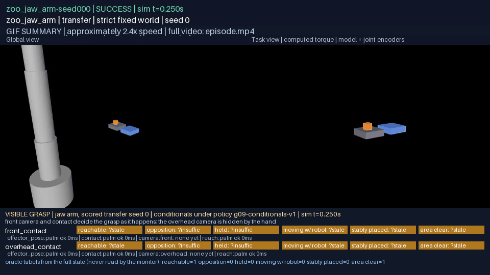
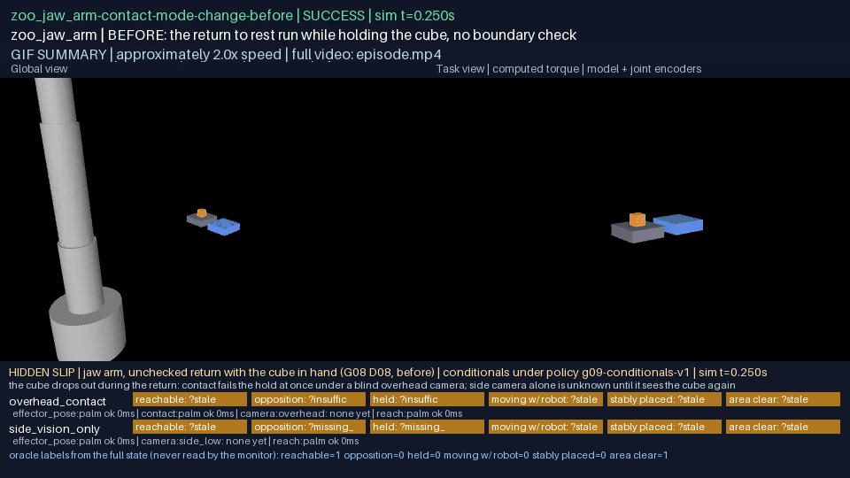
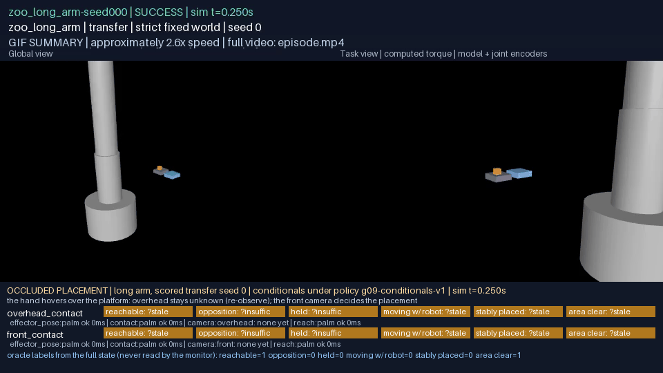

# G09: observable conditionals and honest progress monitoring

A conditional here is a predicate about the world that a monitor may
decide only from declared sensors, over a declared window, by a declared
rule under a calibrated policy, and that it must decline to decide when
the evidence is not there. Six of them (reachable, opposition
established, held, moving with the robot, stably placed, area clear) were
bound to 7 sensor configurations and scored on 114 recorded
episodes from the G06, G07 and G08 evidence (successes, failures,
refusals and an interruption alike; 37 from G06, 3 from G07,
74 from G08) against labels an oracle made from the full recorded state.
Under the primary configuration (front camera with gripper contact) the
9736 decided verdicts agreed with the labels 99.7% of the time, with
25 passes against a false label and 4 fails against a true one, every
predicate decided on at least 111 episodes; on 115 engineered
negatives (a screen in front of the camera, a frozen sensor, an absent
sensor, a sensor too sparse for the window, a sensor frozen while it still
showed a hold that had since ended) no verdict was pass, 61 of them
would have passed a monitor that trusted its newest frame; and no verdict
changed when a privileged oracle sensor was present in the configuration.
The sensors are simulated from recorded physics: encoders and contact
force are the record's own quantities at declared rates and latencies, a
camera is ray visibility from a fixed point with declared noise. This
report makes no claim about recovery from what the monitor detects (G10),
about learned perception (G13, G14), or about bodies outside the G06
enabled set.

Source commits: see `g09-validation.json` (`campaign_commit`, `d09_commit`).
Verifier: `python docs/results/verify_g09.py [--recompute N]` from the workspace
environment. No API or model calls were made anywhere in this work.

## Playback

Every clip below is a recorded episode rendered in full from its sealed
physical record at real-time playback with the simulation clock and the
episode's outcome in the banner, exactly as the G06 renderer produced it,
with a strip beneath: the verdict of every conditional under two sensor
configurations on that frame, the sensors each configuration used with
the age of their newest sample, and the oracle's labels from the full
state, which the monitor never reads. Green is pass, red is fail, amber is
unknown with the reason. The GIF is a labelled, accelerated summary; the
MP4 is the evidence; `frames.json` beside each MP4 maps every frame to its
recorded sample and simulation time; `verdicts.json` in each overlay bundle
records every verdict on every frame.

### D09: a visible grasp, a hidden slip, an occluded placement

| Case | Body | Episode | What the strip shows | Summary | Full video | Frame map |
|---|---|---|---|---|---|---|
| visible-grasp | zoo_jaw_arm | `SUCCESS`, 174 frames, 14.37 s | front camera with contact decides opposition, held and moving-with-robot as they happen; the overhead camera, which the hand stands under from the descent on, reports occlusion and its pose-based verdicts stay unknown while contact still decides the hold. Frames pass/fail/unknown, `front_contact`: held 57/116/1, reachable 173/0/1, stably placed 23/146/5; `overhead_contact`: held 57/116/1, reachable 46/0/128, stably placed 0/46/128 |  | [visible-grasp.mp4](g09-d09/visible-grasp.mp4) | [visible-grasp-frames.json](g09-d09/visible-grasp-frames.json) |
| hidden-slip | zoo_jaw_arm | `SUCCESS` by the unchecked composition's own certificate; the cube was dropped, 145 frames, 11.93 s | the unchecked return sets off with the cube in hand and drops it; under the blind overhead camera the contact sensor fails held and opposition the moment opposition is lost; the side camera alone never decides held (no contact source) and is unknown on the pose predicates while the hand hides the cube, failing them once it sees the cube on the platform. Frames pass/fail/unknown, `overhead_contact`: held 47/97/1, reachable 62/0/83, stably placed 0/46/99; `side_vision_only`: held 0/0/145, reachable 85/0/60, stably placed 0/70/75 |  | [hidden-slip.mp4](g09-d09/hidden-slip.mp4) | [hidden-slip-frames.json](g09-d09/hidden-slip-frames.json) |
| occluded-placement | zoo_long_arm | `SUCCESS`, 185 frames, 15.33 s | the hand hovers over the platform through the dwell, so the overhead camera cannot see the cube and stably-placed stays unknown with its re-observe fallback; the front camera decides the placement. Frames pass/fail/unknown, `overhead_contact`: held 56/128/1, reachable 46/0/139, stably placed 0/46/139; `front_contact`: held 56/128/1, reachable 107/0/78, stably placed 16/77/92 |  | [occluded-placement.mp4](g09-d09/occluded-placement.mp4) | [occluded-placement-frames.json](g09-d09/occluded-placement-frames.json) |

The base render of each case is beside its overlay (`g09-d09/<case>/media`), so the strip can be checked against the unannotated frames.

## The contract (A01)

`rigby_core.skills.conditionals` (core, neutral) represents a conditional
as `ConditionalV1`: its **entities** (role to identifier: manipulator,
object, region); its **evidence** requirements (a kind, the role it is
about, whether it is required, the fewest valid samples it needs); its
**temporal window** (duration and the oldest a newest sample may be); its
**decision rule** (the rule's name, its parameters, and the policy the
parameters came from); its **abstention** (the fraction of a sensor's
samples in the window that must be valid); and its **fallback**
(re-observe, fail or abstain, with a budget). A conditional that requires
privileged state is refused at construction. `evaluate` decides it from
the samples the configuration's declared sensors produced and returns a
`ConditionalVerdictV1`: pass, fail or unknown, with the reason for an
unknown (`missing_source`, `stale`, `occluded`, `missing`,
`insufficient_samples`), the window, the sensors and kinds used, the
fallback when unknown, and the rule's measured detail. The six rules are
pure functions of flattened numbers, so the same contract binds to any
configuration that supplies the kinds it names. The `held` conditional
as instantiated for the jaw arm in the fixed world:

```json
{
  "schema_version": "1.0",
  "name": "held",
  "entities": {
    "manipulator": "palm",
    "object": "cube",
    "region": "destination"
  },
  "evidence": [
    {
      "kind": "contact_force",
      "role": "manipulator",
      "required": true,
      "min_samples": 5
    },
    {
      "kind": "object_pose",
      "role": "object",
      "required": false,
      "min_samples": 1
    }
  ],
  "window": {
    "duration_s": 0.5,
    "max_age_s": 0.05
  },
  "rule": {
    "rule": "held",
    "parameters": {
      "contact_force_n": 0.1,
      "min_fraction": 0.95,
      "support_top_m": 0.26,
      "half_height_m": 0.015,
      "lift_threshold_m": 0.006
    },
    "policy": "g09-conditionals-v1"
  },
  "abstention": {
    "min_valid_fraction": 0.8,
    "note": "missing source, stale samples, occlusion or too few samples decide nothing"
  },
  "fallback": {
    "action": "re_observe",
    "budget": 1
  },
  "description": "opposition sustained through the window and, when a camera sees the object, the object off its support"
}
```

## Sensors, configurations and the policy (A04)

A configuration declares its sensors; `rigby_general.sensing` produces their samples from a sealed record. The evaluator sees only those samples.

| Configuration | Sensors | What it is |
|---|---|---|
| `contact_only` | `encoders`, `effector_pose:palm`, `contact:palm`, `region`, `reach:palm` | encoders and gripper contact; no camera |
| `front_contact` | `encoders`, `effector_pose:palm`, `contact:palm`, `camera:front`, `region`, `reach:palm` | encoders, gripper contact, a camera beyond the fixtures looking back |
| `front_contact_with_oracle` | `encoders`, `effector_pose:palm`, `contact:palm`, `camera:front`, `region`, `reach:palm`, `oracle` (oracle) | front_contact plus a privileged oracle sensor, present to show it is never read |
| `front_vision_only` | `encoders`, `effector_pose:palm`, `camera:front`, `region`, `reach:palm` | encoders and the front camera; no contact sensing |
| `overhead_contact` | `encoders`, `effector_pose:palm`, `contact:palm`, `camera:overhead`, `region`, `reach:palm` | encoders, gripper contact, a camera above the fixtures |
| `side_contact` | `encoders`, `effector_pose:palm`, `contact:palm`, `camera:side_low`, `region`, `reach:palm` | encoders, gripper contact, a low camera to the side that a closing hand stands in front of |
| `side_vision_only` | `encoders`, `effector_pose:palm`, `camera:side_low`, `region`, `reach:palm` | encoders and the low side camera; no contact sensing: a hand closing on the cube hides it |

| Camera | Position (m) | Rate | Latency | Newest sample no older than | Reports a position when | Noise |
|---|---|---|---|---|---|---|
| `front` | (-0.08, 1.35, 0.55) | 30 Hz | 33 ms | 200 ms | at least 50% of six rays (centre and five faces) reach the object first | 2 mm per axis |
| `overhead` | (-0.08, 0.65, 1.2) | 30 Hz | 33 ms | 200 ms | at least 50% of six rays (centre and five faces) reach the object first | 2 mm per axis |
| `side_low` | (0.45, 0.65, 0.35) | 30 Hz | 33 ms | 200 ms | at least 50% of six rays (centre and five faces) reach the object first | 2 mm per axis |

Encoders 500 Hz (newest sample within 20 ms), grasp point through the model 100 Hz (50 ms), contact force per opposition group 200 Hz (50 ms), region and reach 10 Hz (1 s).

Every threshold is either calibrated on the G06 pilot episodes, which the scored evaluation never sees, or a task policy declared with its reason. Nothing is read from a robot description.

| Parameter | Value | Source |
|---|---|---|
| `contact_force_n` (opposition, held, released) | 0.1 N | calibrated on opposition over 33 pilot episodes: balanced accuracy 1.0000, the middle of 8 tied grid values |
| `held.lift_fraction_of_height` | 0.2 | calibrated: balanced accuracy 0.9995 |
| `moving_with_robot.min_speed_mps`, `max_mismatch_fraction` | 0.02 m/s, 0.5 | calibrated jointly: balanced accuracy 0.9951 |
| `stably_placed.max_spread_m` | 15 mm | calibrated: balanced accuracy 0.9776 |
| `reachable.margin_fraction` | 0.05 | calibrated: balanced accuracy 1.0000 |
| `held.min_fraction` | 0.95 | task policy: a hold tolerates less than a grasp being formed |
| `moving_with_robot.pairing_tolerance_s` | 0.05 | task policy: the camera's frame period plus its latency: the nearest effector sample to a frame |
| `opposition_established.min_fraction` | 0.9 | task policy: opposition on nine tenths of the window's contact samples; the closure controller tolerates a tenth of a second of lost contact and so does the predicate |
| `position_tolerance_m` | 0.006 | task policy: three standard deviations of the declared camera noise; containment and clearance are asked to that tolerance |
| `stably_placed.max_speed_mps` | 0.01 | task policy: the registered placement goal's maximum linear speed; the predicate holds the object to the goal's own stillness |
| window `area_clear` | 0.5 s, newest within 0.2 s, at least 3 samples of the primary evidence | the region is clear when nothing was seen in it for half a second of frames |
| window `held` | 0.5 s, newest within 0.05 s, at least 5 samples of the primary evidence | as opposition; a hold is opposition that lasts |
| window `moving_with_robot` | 0.5 s, newest within 0.2 s, at least 5 samples of the primary evidence | half a second of travel at the carry's speed is centimetres, well above the camera's noise |
| window `opposition_established` | 0.5 s, newest within 0.05 s, at least 5 samples of the primary evidence | the closure's own hysteresis is a tenth of a second; half a second of contact at 200 Hz is a hundred samples, five the least that can show a fraction |
| window `reachable` | 0.5 s, newest within 0.2 s, at least 1 samples of the primary evidence | one fresh position and the calibrated shell decide reach; a fifth of a second is six camera frames |
| window `stably_placed` | 2.0 s, newest within 0.2 s, at least 10 samples of the primary evidence | the registered placement dwell is two seconds; the predicate asks for the same stillness the goal does |
| abstention `min_valid_fraction` | 0.8 | a window in which a fifth of a sensor's samples are occluded or missing is not a window that sensor observed |

The support height, the object's half extent and the region are the task's geometry, supplied to the rule as parameters and evidence. Policy `g09-conditionals-v1`, sha256 `6d2912e8df7d0a098f5d75f59ad37fc5bdf3c5bdd28f7ef940df7973cb4d1ed1`.

## Labeled evaluation (A02)

114 registered episodes (interrupted 1, pre_execution_refusal 3, rejected 14, runtime_failure 28, success 68), each observed under every configuration and queried every 1 s of simulation time (reachable at three instants, its label being a solver run); 10713 labeled queries in all. A query counts as decided when the verdict is pass or fail; agreement is over decided queries. The label is the oracle's from the full state at the same instant: opposition is positive contact force on every opposition group; held is opposition on every sample of the window with the object touching no support; moving with the robot is the object's displacement over the window within half the grasp point's travel while that travel is at least 10 mm, held or pushed; stably placed is the placement evaluator's own conditions on every sample; area clear is the object's whole rotated geometry outside the region throughout; reachable is the transfer's solver placing the grasp point above and at the object, hand facing down, within the guard, from where the arm stands or from its restart seeds.

Primary configuration `front_contact`:

| Predicate | Episodes decided | Queries | Label true | Label false | Pass on true | Fail on false | Pass on false | Fail on true | Unknown | Agreement |
|---|---|---|---|---|---|---|---|---|---|---|
| reachable | 114 of 114 | 408 | 289 | 119 | 269 | 116 | 0 | 0 | 23 (occluded 23) | 100.0% |
| opposition_established | 111 of 114 | 2061 | 387 | 1674 | 387 | 1671 | 0 | 0 | 3 (stale 3) | 100.0% |
| held | 111 of 114 | 2061 | 378 | 1683 | 378 | 1676 | 4 | 0 | 3 (stale 3) | 99.8% |
| moving_with_robot | 111 of 114 | 2061 | 251 | 1810 | 123 | 1621 | 17 | 3 | 297 (insufficient_samples 3, occluded 294) | 98.9% |
| stably_placed | 111 of 114 | 2061 | 171 | 1890 | 158 | 1546 | 2 | 1 | 354 (insufficient_samples 3, occluded 351) | 99.8% |
| area_clear | 111 of 114 | 2061 | 1515 | 546 | 1410 | 352 | 2 | 0 | 297 (insufficient_samples 3, occluded 294) | 99.9% |

Every configuration, agreement over decided queries with the fraction abstained and the passes against a false label:

| Configuration | reachable | opposition established | held | moving with robot | stably placed | area clear |
|---|---|---|---|---|---|---|
| `overhead_contact` | 100.0%, 51.2% abstained, 0 false pass | 100.0%, 0.1% abstained, 0 false pass | 99.8%, 0.1% abstained, 4 false pass | 99.2%, 63.3% abstained, 6 false pass | 100.0%, 63.3% abstained, 0 false pass | 100.0%, 63.3% abstained, 0 false pass |
| `front_contact` | 100.0%, 5.6% abstained, 0 false pass | 100.0%, 0.1% abstained, 0 false pass | 99.8%, 0.1% abstained, 4 false pass | 98.9%, 14.4% abstained, 17 false pass | 99.8%, 17.2% abstained, 2 false pass | 99.9%, 14.4% abstained, 2 false pass |
| `side_contact` | 100.0%, 7.1% abstained, 0 false pass | 100.0%, 0.1% abstained, 0 false pass | 99.8%, 0.1% abstained, 4 false pass | 98.7%, 10.7% abstained, 24 false pass | 99.8%, 11.0% abstained, 3 false pass | 99.8%, 10.7% abstained, 2 false pass |
| `contact_only` | unknown on all (missing_source) | 100.0%, 0.1% abstained, 0 false pass | 99.8%, 0.1% abstained, 4 false pass | unknown on all (missing_source) | unknown on all (missing_source) | unknown on all (missing_source) |
| `front_vision_only` | 100.0%, 5.6% abstained, 0 false pass | unknown on all (missing_source) | unknown on all (missing_source) | 98.9%, 14.4% abstained, 17 false pass | 99.2%, 17.2% abstained, 13 false pass | 99.9%, 14.4% abstained, 2 false pass |
| `side_vision_only` | 100.0%, 7.1% abstained, 0 false pass | unknown on all (missing_source) | unknown on all (missing_source) | 98.7%, 10.7% abstained, 24 false pass | 99.2%, 11.0% abstained, 14 false pass | 99.8%, 10.7% abstained, 2 false pass |
| `front_contact_with_oracle` | 100.0%, 5.6% abstained, 0 false pass | 100.0%, 0.1% abstained, 0 false pass | 99.8%, 0.1% abstained, 4 false pass | 98.9%, 14.4% abstained, 17 false pass | 99.8%, 17.2% abstained, 2 false pass | 99.9%, 14.4% abstained, 2 false pass |

**Where the verdicts and the labels disagree.** Held: 4 passes against a false label, each an instant at which one opposition group's recorded force dipped to zero for a step or two inside the window; the rule tolerates a twentieth of the window without opposition, as the closure controller does, and the label does not. Moving with the robot: 17 passes on a false label and 3 fails on a true one, all at the start or end of a motion where the grasp point's travel over the window sits at the calibrated minimum speed and the camera's 33 ms latency shifts the sensed window against the oracle's. Stably placed: 2 passes on a false label, both windows that began at the instant of release, the cube still touching a finger and moving on that first sample and still for the two seconds after; the sensed rule's end-to-end drift and spread do not see one sample, the oracle's per-sample limits do; 1 fail on a true one. Area clear: 2 passes on a false label, both the multifinger hand flinging the cube through the region as it closed; the oracle at 500 Hz saw the cube cross the region, the camera's frames and latency did not. Reachable and opposition established: no disagreement.

**What the configurations show.** The overhead camera stands where the hand goes: from the descent on it reports occlusion, and the pose predicates abstain on 51.2% of the reach queries and 63.3% of the placement queries; a top-down camera is the wrong sensor to watch a top-down grasp with, and the monitor says so rather than guessing. Without contact sensing, held and opposition are never decided (no source), and stably placed cannot check release: the front camera alone passes 13 placements that a member was still loading, against 2 with contact. Without a camera, reachable, moving with the robot, stably placed and area clear are never decided, and held is decided from sustained opposition alone at 99.8% agreement.

## Engineered negatives (A03)

From instants at which the primary configuration decided pass in agreement with the label, the evidence was degraded and the same conditional decided again: a 0.6 m square screen added to a copy of the recorded world between the front camera and the fixtures, the camera's rays cast again (`occlusion`); the required sensor frozen a quarter second beyond the window's allowance before the decision (`stale`); the required sensor removed from the configuration (`absent`); the required sensor thinned below the window's sample requirement (`sparse`); and, from every instant a decided hold ended, the contact sensor frozen while it still showed the hold and the decision asked after (`stale_after_lost_hold`). 115 cases; every verdict unknown (115) or fail (0), none pass. A monitor that trusted its newest frame regardless of age (`naive`) would have passed 61 of them.

| Kind | Cases | Unknown | Fail | Pass | Naive monitor would pass |
|---|---|---|---|---|---|
| `absent` | 30 | 30 | 0 | 0 | 0 |
| `occlusion` | 20 | 20 | 0 | 0 | 0 |
| `sparse` | 25 | 25 | 0 | 0 | 25 |
| `stale` | 30 | 30 | 0 | 0 | 26 |
| `stale_after_lost_hold` | 10 | 10 | 0 | 0 | 10 |

Every case:

| Predicate | Kind | Episode | t (s) | Degradation | Verdict | Reason | Fallback | Naive monitor |
|---|---|---|---|---|---|---|---|---|
| reachable | `occlusion` | zoo_jaw_arm-seed001 | 0.75 | a screen 0.6 m square between the front camera and the fixtures | `UNKNOWN` | `occluded:camera:front` | re_observe | unknown |
| reachable | `stale` | zoo_jaw_arm-seed001 | 0.75 | ['camera:front'] frozen at 0.300 s, 0.45 s before the decision | `UNKNOWN` | `stale:camera:front` | re_observe | pass |
| reachable | `absent` | zoo_jaw_arm-seed001 | 0.75 | no sensor of kind object_pose | `UNKNOWN` | `missing_source:object_pose` | re_observe | unknown |
| reachable | `occlusion` | zoo_dual_arm-feasible-001 | 7.50 | a screen 0.6 m square between the front camera and the fixtures | `UNKNOWN` | `occluded:camera:front` | re_observe | unknown |
| reachable | `stale` | zoo_dual_arm-feasible-001 | 7.50 | ['camera:front'] frozen at 7.050 s, 0.45 s before the decision | `UNKNOWN` | `stale:camera:front` | re_observe | pass |
| reachable | `absent` | zoo_dual_arm-feasible-001 | 7.50 | no sensor of kind object_pose | `UNKNOWN` | `missing_source:object_pose` | re_observe | unknown |
| reachable | `occlusion` | zoo_long_arm-feasible-004 | 18.50 | a screen 0.6 m square between the front camera and the fixtures | `UNKNOWN` | `occluded:camera:front` | re_observe | unknown |
| reachable | `stale` | zoo_long_arm-feasible-004 | 18.50 | ['camera:front'] frozen at 18.050 s, 0.45 s before the decision | `UNKNOWN` | `stale:camera:front` | re_observe | pass |
| reachable | `absent` | zoo_long_arm-feasible-004 | 18.50 | no sensor of kind object_pose | `UNKNOWN` | `missing_source:object_pose` | re_observe | unknown |
| reachable | `occlusion` | zoo_jaw_arm-feasible-001 | 13.50 | a screen 0.6 m square between the front camera and the fixtures | `UNKNOWN` | `occluded:camera:front` | re_observe | unknown |
| reachable | `stale` | zoo_jaw_arm-feasible-001 | 13.50 | ['camera:front'] frozen at 13.050 s, 0.45 s before the decision | `UNKNOWN` | `stale:camera:front` | re_observe | pass |
| reachable | `absent` | zoo_jaw_arm-feasible-001 | 13.50 | no sensor of kind object_pose | `UNKNOWN` | `missing_source:object_pose` | re_observe | unknown |
| reachable | `occlusion` | zoo_jaw_arm-carry-to-place-after | 13.75 | a screen 0.6 m square between the front camera and the fixtures | `UNKNOWN` | `occluded:camera:front` | re_observe | unknown |
| reachable | `stale` | zoo_jaw_arm-carry-to-place-after | 13.75 | ['camera:front'] frozen at 13.300 s, 0.45 s before the decision | `UNKNOWN` | `stale:camera:front` | re_observe | pass |
| reachable | `absent` | zoo_jaw_arm-carry-to-place-after | 13.75 | no sensor of kind object_pose | `UNKNOWN` | `missing_source:object_pose` | re_observe | unknown |
| opposition_established | `stale` | zoo_jaw_arm-velocity_too_high-07 | 6.50 | ['contact:palm'] frozen at 6.200 s, 0.30 s before the decision | `UNKNOWN` | `stale:contact:palm` | fail | pass |
| opposition_established | `absent` | zoo_jaw_arm-velocity_too_high-07 | 6.50 | no sensor of kind contact_force | `UNKNOWN` | `missing_source:contact_force` | fail | none |
| opposition_established | `sparse` | zoo_jaw_arm-velocity_too_high-07 | 6.50 | ['contact:palm'] thinned to 7 Hz, at most 4 samples in 0.5 s | `UNKNOWN` | `stale:contact:palm` | fail | pass |
| opposition_established | `stale` | zoo_jaw_arm-feasible-002 | 8.50 | ['contact:palm'] frozen at 8.200 s, 0.30 s before the decision | `UNKNOWN` | `stale:contact:palm` | fail | pass |
| opposition_established | `absent` | zoo_jaw_arm-feasible-002 | 8.50 | no sensor of kind contact_force | `UNKNOWN` | `missing_source:contact_force` | fail | none |
| opposition_established | `sparse` | zoo_jaw_arm-feasible-002 | 8.50 | ['contact:palm'] thinned to 7 Hz, at most 4 samples in 0.5 s | `UNKNOWN` | `stale:contact:palm` | fail | pass |
| opposition_established | `stale` | zoo_long_arm-feasible-001 | 7.50 | ['contact:palm'] frozen at 7.200 s, 0.30 s before the decision | `UNKNOWN` | `stale:contact:palm` | fail | pass |
| opposition_established | `absent` | zoo_long_arm-feasible-001 | 7.50 | no sensor of kind contact_force | `UNKNOWN` | `missing_source:contact_force` | fail | none |
| opposition_established | `sparse` | zoo_long_arm-feasible-001 | 7.50 | ['contact:palm'] thinned to 7 Hz, at most 4 samples in 0.5 s | `UNKNOWN` | `stale:contact:palm` | fail | pass |
| opposition_established | `stale` | zoo_long_arm-feasible-001 | 8.50 | ['contact:palm'] frozen at 8.200 s, 0.30 s before the decision | `UNKNOWN` | `stale:contact:palm` | fail | pass |
| opposition_established | `absent` | zoo_long_arm-feasible-001 | 8.50 | no sensor of kind contact_force | `UNKNOWN` | `missing_source:contact_force` | fail | none |
| opposition_established | `sparse` | zoo_long_arm-feasible-001 | 8.50 | ['contact:palm'] thinned to 7 Hz, at most 4 samples in 0.5 s | `UNKNOWN` | `stale:contact:palm` | fail | pass |
| opposition_established | `stale` | zoo_long_arm-feasible-002 | 10.50 | ['contact:palm'] frozen at 10.200 s, 0.30 s before the decision | `UNKNOWN` | `stale:contact:palm` | fail | pass |
| opposition_established | `absent` | zoo_long_arm-feasible-002 | 10.50 | no sensor of kind contact_force | `UNKNOWN` | `missing_source:contact_force` | fail | none |
| opposition_established | `sparse` | zoo_long_arm-feasible-002 | 10.50 | ['contact:palm'] thinned to 7 Hz, at most 4 samples in 0.5 s | `UNKNOWN` | `stale:contact:palm` | fail | pass |
| held | `stale` | zoo_dual_arm-belief_stale-00 | 6.50 | ['contact:left_palm'] frozen at 6.200 s, 0.30 s before the decision | `UNKNOWN` | `stale:contact:left_palm` | re_observe | pass |
| held | `absent` | zoo_dual_arm-belief_stale-00 | 6.50 | no sensor of kind contact_force | `UNKNOWN` | `missing_source:contact_force` | re_observe | none |
| held | `sparse` | zoo_dual_arm-belief_stale-00 | 6.50 | ['contact:left_palm'] thinned to 7 Hz, at most 4 samples in 0.5 s | `UNKNOWN` | `stale:contact:left_palm` | re_observe | pass |
| held | `stale` | zoo_dual_arm-joint_beyond_limit-03 | 10.50 | ['contact:left_palm'] frozen at 10.200 s, 0.30 s before the decision | `UNKNOWN` | `stale:contact:left_palm` | re_observe | pass |
| held | `absent` | zoo_dual_arm-joint_beyond_limit-03 | 10.50 | no sensor of kind contact_force | `UNKNOWN` | `missing_source:contact_force` | re_observe | none |
| held | `sparse` | zoo_dual_arm-joint_beyond_limit-03 | 10.50 | ['contact:left_palm'] thinned to 7 Hz, at most 4 samples in 0.5 s | `UNKNOWN` | `stale:contact:left_palm` | re_observe | pass |
| held | `stale` | zoo_long_arm-holding_into_free-02 | 9.75 | ['contact:palm'] frozen at 9.450 s, 0.30 s before the decision | `UNKNOWN` | `stale:contact:palm` | re_observe | pass |
| held | `absent` | zoo_long_arm-holding_into_free-02 | 9.75 | no sensor of kind contact_force | `UNKNOWN` | `missing_source:contact_force` | re_observe | none |
| held | `sparse` | zoo_long_arm-holding_into_free-02 | 9.75 | ['contact:palm'] thinned to 7 Hz, at most 4 samples in 0.5 s | `UNKNOWN` | `stale:contact:palm` | re_observe | pass |
| held | `stale` | zoo_long_arm-joint_inside_margin-02 | 19.50 | ['contact:palm'] frozen at 19.200 s, 0.30 s before the decision | `UNKNOWN` | `stale:contact:palm` | re_observe | pass |
| held | `absent` | zoo_long_arm-joint_inside_margin-02 | 19.50 | no sensor of kind contact_force | `UNKNOWN` | `missing_source:contact_force` | re_observe | none |
| held | `sparse` | zoo_long_arm-joint_inside_margin-02 | 19.50 | ['contact:palm'] thinned to 7 Hz, at most 4 samples in 0.5 s | `UNKNOWN` | `stale:contact:palm` | re_observe | pass |
| held | `stale` | zoo_long_arm-feasible-000 | 11.50 | ['contact:palm'] frozen at 11.200 s, 0.30 s before the decision | `UNKNOWN` | `stale:contact:palm` | re_observe | pass |
| held | `absent` | zoo_long_arm-feasible-000 | 11.50 | no sensor of kind contact_force | `UNKNOWN` | `missing_source:contact_force` | re_observe | none |
| held | `sparse` | zoo_long_arm-feasible-000 | 11.50 | ['contact:palm'] thinned to 7 Hz, at most 4 samples in 0.5 s | `UNKNOWN` | `insufficient_samples:contact_force` | re_observe | pass |
| moving_with_robot | `occlusion` | zoo_jaw_arm-feasible-004 | 11.50 | a screen 0.6 m square between the front camera and the fixtures | `UNKNOWN` | `occluded:camera:front` | re_observe | unknown |
| moving_with_robot | `stale` | zoo_jaw_arm-feasible-004 | 11.50 | ['camera:front'] frozen at 11.050 s, 0.45 s before the decision | `UNKNOWN` | `stale:camera:front` | re_observe | fail |
| moving_with_robot | `absent` | zoo_jaw_arm-feasible-004 | 11.50 | no sensor of kind object_pose | `UNKNOWN` | `missing_source:object_pose` | re_observe | unknown |
| moving_with_robot | `sparse` | zoo_jaw_arm-feasible-004 | 11.50 | ['camera:front'] thinned to 7 Hz, at most 4 samples in 0.5 s | `UNKNOWN` | `insufficient_samples:object_pose` | re_observe | pass |
| moving_with_robot | `occlusion` | zoo_dual_arm-belief_stale-00 | 6.50 | a screen 0.6 m square between the front camera and the fixtures | `UNKNOWN` | `occluded:camera:front` | re_observe | unknown |
| moving_with_robot | `stale` | zoo_dual_arm-belief_stale-00 | 6.50 | ['camera:front'] frozen at 6.050 s, 0.45 s before the decision | `UNKNOWN` | `stale:camera:front` | re_observe | pass |
| moving_with_robot | `absent` | zoo_dual_arm-belief_stale-00 | 6.50 | no sensor of kind object_pose | `UNKNOWN` | `missing_source:object_pose` | re_observe | unknown |
| moving_with_robot | `sparse` | zoo_dual_arm-belief_stale-00 | 6.50 | ['camera:front'] thinned to 7 Hz, at most 4 samples in 0.5 s | `UNKNOWN` | `insufficient_samples:object_pose` | re_observe | pass |
| moving_with_robot | `occlusion` | zoo_jaw_arm-feasible-003 | 10.50 | a screen 0.6 m square between the front camera and the fixtures | `UNKNOWN` | `occluded:camera:front` | re_observe | unknown |
| moving_with_robot | `stale` | zoo_jaw_arm-feasible-003 | 10.50 | ['camera:front'] frozen at 10.050 s, 0.45 s before the decision | `UNKNOWN` | `stale:camera:front` | re_observe | pass |
| moving_with_robot | `absent` | zoo_jaw_arm-feasible-003 | 10.50 | no sensor of kind object_pose | `UNKNOWN` | `missing_source:object_pose` | re_observe | unknown |
| moving_with_robot | `sparse` | zoo_jaw_arm-feasible-003 | 10.50 | ['camera:front'] thinned to 7 Hz, at most 4 samples in 0.5 s | `UNKNOWN` | `insufficient_samples:object_pose` | re_observe | pass |
| moving_with_robot | `occlusion` | zoo_jaw_arm-feasible-005 | 6.50 | a screen 0.6 m square between the front camera and the fixtures | `UNKNOWN` | `occluded:camera:front` | re_observe | unknown |
| moving_with_robot | `stale` | zoo_jaw_arm-feasible-005 | 6.50 | ['camera:front'] frozen at 6.050 s, 0.45 s before the decision | `UNKNOWN` | `stale:camera:front` | re_observe | fail |
| moving_with_robot | `absent` | zoo_jaw_arm-feasible-005 | 6.50 | no sensor of kind object_pose | `UNKNOWN` | `missing_source:object_pose` | re_observe | unknown |
| moving_with_robot | `sparse` | zoo_jaw_arm-feasible-005 | 6.50 | ['camera:front'] thinned to 7 Hz, at most 4 samples in 0.5 s | `UNKNOWN` | `insufficient_samples:object_pose` | re_observe | pass |
| moving_with_robot | `occlusion` | zoo_jaw_arm-contact-mode-change-before | 6.75 | a screen 0.6 m square between the front camera and the fixtures | `UNKNOWN` | `occluded:camera:front` | re_observe | unknown |
| moving_with_robot | `stale` | zoo_jaw_arm-contact-mode-change-before | 6.75 | ['camera:front'] frozen at 6.300 s, 0.45 s before the decision | `UNKNOWN` | `stale:camera:front` | re_observe | pass |
| moving_with_robot | `absent` | zoo_jaw_arm-contact-mode-change-before | 6.75 | no sensor of kind object_pose | `UNKNOWN` | `missing_source:object_pose` | re_observe | unknown |
| moving_with_robot | `sparse` | zoo_jaw_arm-contact-mode-change-before | 6.75 | ['camera:front'] thinned to 7 Hz, at most 4 samples in 0.5 s | `UNKNOWN` | `insufficient_samples:object_pose` | re_observe | pass |
| stably_placed | `occlusion` | zoo_dual_arm-feasible-002 | 14.50 | a screen 0.6 m square between the front camera and the fixtures | `UNKNOWN` | `occluded:camera:front` | re_observe | unknown |
| stably_placed | `stale` | zoo_dual_arm-feasible-002 | 14.50 | ['camera:front'] frozen at 14.050 s, 0.45 s before the decision | `UNKNOWN` | `stale:camera:front` | re_observe | pass |
| stably_placed | `absent` | zoo_dual_arm-feasible-002 | 14.50 | no sensor of kind object_pose | `UNKNOWN` | `missing_source:object_pose` | re_observe | unknown |
| stably_placed | `sparse` | zoo_dual_arm-feasible-002 | 14.50 | ['camera:front'] thinned to 4.25 Hz, at most 9 samples in 2 s | `UNKNOWN` | `insufficient_samples:object_pose` | re_observe | pass |
| stably_placed | `occlusion` | zoo_dual_arm-joint_beyond_limit-06 | 19.50 | a screen 0.6 m square between the front camera and the fixtures | `UNKNOWN` | `occluded:camera:front` | re_observe | unknown |
| stably_placed | `stale` | zoo_dual_arm-joint_beyond_limit-06 | 19.50 | ['camera:front'] frozen at 19.050 s, 0.45 s before the decision | `UNKNOWN` | `stale:camera:front` | re_observe | unknown |
| stably_placed | `absent` | zoo_dual_arm-joint_beyond_limit-06 | 19.50 | no sensor of kind object_pose | `UNKNOWN` | `missing_source:object_pose` | re_observe | unknown |
| stably_placed | `sparse` | zoo_dual_arm-joint_beyond_limit-06 | 19.50 | ['camera:front'] thinned to 4.25 Hz, at most 9 samples in 2 s | `UNKNOWN` | `insufficient_samples:object_pose` | re_observe | pass |
| stably_placed | `occlusion` | zoo_jaw_arm-joint_inside_margin-04 | 16.50 | a screen 0.6 m square between the front camera and the fixtures | `UNKNOWN` | `occluded:camera:front` | re_observe | unknown |
| stably_placed | `stale` | zoo_jaw_arm-joint_inside_margin-04 | 16.50 | ['camera:front'] frozen at 16.050 s, 0.45 s before the decision | `UNKNOWN` | `stale:camera:front` | re_observe | pass |
| stably_placed | `absent` | zoo_jaw_arm-joint_inside_margin-04 | 16.50 | no sensor of kind object_pose | `UNKNOWN` | `missing_source:object_pose` | re_observe | unknown |
| stably_placed | `sparse` | zoo_jaw_arm-joint_inside_margin-04 | 16.50 | ['camera:front'] thinned to 4.25 Hz, at most 9 samples in 2 s | `UNKNOWN` | `stale:camera:front` | re_observe | pass |
| stably_placed | `occlusion` | zoo_long_arm-feasible-004 | 17.50 | a screen 0.6 m square between the front camera and the fixtures | `UNKNOWN` | `occluded:camera:front` | re_observe | unknown |
| stably_placed | `stale` | zoo_long_arm-feasible-004 | 17.50 | ['camera:front'] frozen at 17.050 s, 0.45 s before the decision | `UNKNOWN` | `stale:camera:front` | re_observe | pass |
| stably_placed | `absent` | zoo_long_arm-feasible-004 | 17.50 | no sensor of kind object_pose | `UNKNOWN` | `missing_source:object_pose` | re_observe | unknown |
| stably_placed | `sparse` | zoo_long_arm-feasible-004 | 17.50 | ['camera:front'] thinned to 4.25 Hz, at most 9 samples in 2 s | `UNKNOWN` | `insufficient_samples:object_pose` | re_observe | pass |
| stably_placed | `occlusion` | zoo_jaw_arm-carry-to-place-before | 12.75 | a screen 0.6 m square between the front camera and the fixtures | `UNKNOWN` | `occluded:camera:front` | re_observe | unknown |
| stably_placed | `stale` | zoo_jaw_arm-carry-to-place-before | 12.75 | ['camera:front'] frozen at 12.300 s, 0.45 s before the decision | `UNKNOWN` | `stale:camera:front` | re_observe | fail |
| stably_placed | `absent` | zoo_jaw_arm-carry-to-place-before | 12.75 | no sensor of kind object_pose | `UNKNOWN` | `missing_source:object_pose` | re_observe | unknown |
| stably_placed | `sparse` | zoo_jaw_arm-carry-to-place-before | 12.75 | ['camera:front'] thinned to 4.25 Hz, at most 9 samples in 2 s | `UNKNOWN` | `stale:camera:front` | re_observe | pass |
| area_clear | `occlusion` | zoo_hand_arm-seed003 | 8.75 | a screen 0.6 m square between the front camera and the fixtures | `UNKNOWN` | `occluded:camera:front` | re_observe | unknown |
| area_clear | `stale` | zoo_hand_arm-seed003 | 8.75 | ['camera:front'] frozen at 8.300 s, 0.45 s before the decision | `UNKNOWN` | `stale:camera:front` | re_observe | pass |
| area_clear | `absent` | zoo_hand_arm-seed003 | 8.75 | no sensor of kind object_pose | `UNKNOWN` | `missing_source:object_pose` | re_observe | unknown |
| area_clear | `sparse` | zoo_hand_arm-seed003 | 8.75 | ['camera:front'] thinned to 3 Hz, at most 2 samples in 0.5 s | `UNKNOWN` | `insufficient_samples:object_pose` | re_observe | pass |
| area_clear | `occlusion` | zoo_jaw_arm-seed052 | 0.75 | a screen 0.6 m square between the front camera and the fixtures | `UNKNOWN` | `occluded:camera:front` | re_observe | unknown |
| area_clear | `stale` | zoo_jaw_arm-seed052 | 0.75 | ['camera:front'] frozen at 0.300 s, 0.45 s before the decision | `UNKNOWN` | `stale:camera:front` | re_observe | pass |
| area_clear | `absent` | zoo_jaw_arm-seed052 | 0.75 | no sensor of kind object_pose | `UNKNOWN` | `missing_source:object_pose` | re_observe | unknown |
| area_clear | `sparse` | zoo_jaw_arm-seed052 | 0.75 | ['camera:front'] thinned to 3 Hz, at most 2 samples in 0.5 s | `UNKNOWN` | `insufficient_samples:object_pose` | re_observe | pass |
| area_clear | `occlusion` | zoo_long_arm-joint_inside_margin-05 | 12.50 | a screen 0.6 m square between the front camera and the fixtures | `UNKNOWN` | `occluded:camera:front` | re_observe | unknown |
| area_clear | `stale` | zoo_long_arm-joint_inside_margin-05 | 12.50 | ['camera:front'] frozen at 12.050 s, 0.45 s before the decision | `UNKNOWN` | `stale:camera:front` | re_observe | pass |
| area_clear | `absent` | zoo_long_arm-joint_inside_margin-05 | 12.50 | no sensor of kind object_pose | `UNKNOWN` | `missing_source:object_pose` | re_observe | unknown |
| area_clear | `sparse` | zoo_long_arm-joint_inside_margin-05 | 12.50 | ['camera:front'] thinned to 3 Hz, at most 2 samples in 0.5 s | `UNKNOWN` | `insufficient_samples:object_pose` | re_observe | pass |
| area_clear | `occlusion` | zoo_jaw_arm-contact-mode-change-before | 2.75 | a screen 0.6 m square between the front camera and the fixtures | `UNKNOWN` | `occluded:camera:front` | re_observe | unknown |
| area_clear | `stale` | zoo_jaw_arm-contact-mode-change-before | 2.75 | ['camera:front'] frozen at 2.300 s, 0.45 s before the decision | `UNKNOWN` | `stale:camera:front` | re_observe | pass |
| area_clear | `absent` | zoo_jaw_arm-contact-mode-change-before | 2.75 | no sensor of kind object_pose | `UNKNOWN` | `missing_source:object_pose` | re_observe | unknown |
| area_clear | `sparse` | zoo_jaw_arm-contact-mode-change-before | 2.75 | ['camera:front'] thinned to 3 Hz, at most 2 samples in 0.5 s | `UNKNOWN` | `insufficient_samples:object_pose` | re_observe | pass |
| area_clear | `occlusion` | zoo_dual_arm-joint-limit-approach-before | 0.50 | a screen 0.6 m square between the front camera and the fixtures | `UNKNOWN` | `occluded:camera:front` | re_observe | unknown |
| area_clear | `stale` | zoo_dual_arm-joint-limit-approach-before | 0.50 | ['camera:front'] frozen at 0.050 s, 0.45 s before the decision | `UNKNOWN` | `stale:camera:front` | re_observe | pass |
| area_clear | `absent` | zoo_dual_arm-joint-limit-approach-before | 0.50 | no sensor of kind object_pose | `UNKNOWN` | `missing_source:object_pose` | re_observe | unknown |
| area_clear | `sparse` | zoo_dual_arm-joint-limit-approach-before | 0.50 | ['camera:front'] thinned to 3 Hz, at most 2 samples in 0.5 s | `UNKNOWN` | `insufficient_samples:object_pose` | re_observe | pass |
| held | `stale_after_lost_hold` | zoo_dual_arm-seed000 | 10.75 | the contact sensor frozen at 9.75 s while the hold was real; by 10.75 s the hold had ended (released or lost) | `UNKNOWN` | `stale:contact:left_palm:no_sample_in_window` | re_observe | pass |
| held | `stale_after_lost_hold` | zoo_dual_arm-seed001 | 10.75 | the contact sensor frozen at 9.75 s while the hold was real; by 10.75 s the hold had ended (released or lost) | `UNKNOWN` | `stale:contact:left_palm:no_sample_in_window` | re_observe | pass |
| held | `stale_after_lost_hold` | zoo_dual_arm-seed002 | 10.75 | the contact sensor frozen at 9.75 s while the hold was real; by 10.75 s the hold had ended (released or lost) | `UNKNOWN` | `stale:contact:left_palm:no_sample_in_window` | re_observe | pass |
| held | `stale_after_lost_hold` | zoo_dual_arm-seed003 | 10.75 | the contact sensor frozen at 9.75 s while the hold was real; by 10.75 s the hold had ended (released or lost) | `UNKNOWN` | `stale:contact:left_palm:no_sample_in_window` | re_observe | pass |
| held | `stale_after_lost_hold` | zoo_dual_arm-seed004 | 10.75 | the contact sensor frozen at 9.75 s while the hold was real; by 10.75 s the hold had ended (released or lost) | `UNKNOWN` | `stale:contact:left_palm:no_sample_in_window` | re_observe | pass |
| held | `stale_after_lost_hold` | zoo_jaw_arm-seed000 | 11.75 | the contact sensor frozen at 10.75 s while the hold was real; by 11.75 s the hold had ended (released or lost) | `UNKNOWN` | `stale:contact:palm:no_sample_in_window` | re_observe | pass |
| held | `stale_after_lost_hold` | zoo_jaw_arm-seed001 | 11.75 | the contact sensor frozen at 10.75 s while the hold was real; by 11.75 s the hold had ended (released or lost) | `UNKNOWN` | `stale:contact:palm:no_sample_in_window` | re_observe | pass |
| held | `stale_after_lost_hold` | zoo_jaw_arm-seed002 | 11.75 | the contact sensor frozen at 10.75 s while the hold was real; by 11.75 s the hold had ended (released or lost) | `UNKNOWN` | `stale:contact:palm:no_sample_in_window` | re_observe | pass |
| held | `stale_after_lost_hold` | zoo_jaw_arm-seed003 | 11.75 | the contact sensor frozen at 10.75 s while the hold was real; by 11.75 s the hold had ended (released or lost) | `UNKNOWN` | `stale:contact:palm:no_sample_in_window` | re_observe | pass |
| held | `stale_after_lost_hold` | zoo_jaw_arm-seed004 | 11.75 | the contact sensor frozen at 10.75 s while the hold was real; by 11.75 s the hold had ended (released or lost) | `UNKNOWN` | `stale:contact:palm:no_sample_in_window` | re_observe | pass |

## No privileged access (A04)

Every one of the 10713 queries was decided twice, under `front_contact` and under the same configuration with a privileged oracle sensor added; 0 verdicts differed in decision, reason, detail or sensors used. A conditional that names privileged state as evidence is refused at construction; a configuration whose only sensor of a kind is the oracle supplies no source for that kind; sensors are scoped to the entity a role names, so a dual arm's contact sensors decide only for their own manipulator (`core/tests/test_skills_conditionals.py`, `any-robot/tests/test_general_sensing.py`). The labeler and the evaluator live in different modules and share no thresholds: the labeler's constants are physical facts (positive force, a 10 mm travel, half the travel), the evaluator's are the policy's.

## What was found

- **A camera in the way of the hand is honest about it.** The overhead camera reports occlusion from the descent to the end of the dwell on every transfer; the monitor abstains there with `occluded` and its re-observe fallback, and the front camera decides the same instants. D09's occluded placement is that, unstaged.
- **A hold ends by release as well as by loss, and a frozen sensor cannot tell.** The `stale_after_lost_hold` cases froze the contact sensor at an instant a hold was real and asked after it had ended; every one is unknown, and every one would have passed a monitor that trusted its last frame. D09's hidden slip is the one natural drop in the evidence, the G08 pair's unchecked return, seen by a blind overhead camera and the contact sensor.
- **The multifinger hand never holds.** Its 13 recorded failures never reach a sustained opposition the labeler accepts; they are the largest natural negative set for held and opposition, and the monitor fails them at every query.
- **Vision alone cannot verify release.** Without contact, stably placed passes placements the fingers were still loading (13 against 2 with contact); release is a contact fact.
- **Thresholds calibrated in the middle of a plateau transfer.** Every calibrated value was chosen on the pilot episodes; on the 114 scored episodes reachable and opposition agree with the labels on every decided query, and the remaining disagreements are the boundary cases listed above.

## Tests

| Suite | Tests | Failures | Errors | Skipped |
|---|---|---|---|---|
| core | 355 | 0 | 0 | 2 |
| any-robot | 439 | 0 | 0 | 5 |
| exotic | 10 | 0 | 0 | 0 |

Counts as recorded in `g09-validation.json`; the JUnit records stay in the local results tree with the campaign logs.

New: 16 in core (`test_skills_conditionals.py`: representation, refusal of privileged evidence, every abstention reason, optional evidence dropped when stale rather than used, the oracle never read, sensor scoping, the six rules) and 6 in any-robot (`test_general_sensing.py`: a recorded jaw-arm transfer under every configuration, physical occlusion by the hand and by a screen, degraded evidence never passing where full evidence did, the oracle changing nothing, labels agreeing with verdicts).

## Scope and limits

The sensors are simulated from recorded physics, declared as such: encoders and contact force are exact at their rates, the camera is geometric visibility from a point with Gaussian position noise and no false detections, and there is no learned perception anywhere. The episodes are the G06 fixed world on the G06 enabled bodies, so the cameras stand in one world. The oracle labels are computed, not human; where they and the verdicts disagree the report says so and why. A conditional's fallback is recorded, not acted on: the monitor says re-observe, and G10 is where something re-observes. The calibration set is the G06 pilot, which shares bodies and world with the evaluation; thresholds chosen there transferred, and no claim is made beyond that world.

## Files

- `core/src/rigby_core/skills/conditionals.py`: the contract, the evaluator, the six rules.
- `any-robot/src/rigby_general/sensing/`: episodes, sensors and configurations, the binding, the oracle labeler, the degradations.
- `any-robot/assets/general/research-protocols/g09-conditionals-v1/`: `policy.json` (calibrated, with the calibration record), `corpus.json` (the roster by trace hash, the configurations), `registration.json`.
- `docs/results/g09-conditionals/`: `summary.json`, `queries.jsonl.gz` (every labeled query with every configuration's verdict), `negatives.json`, `leakage.json`, `provenance.json`.
- `docs/results/g09-d09/`: the three cases, each with its base render and its overlay bundle (`episode.mp4`, `preview.gif`, `frames.json`, `verdicts.json`), and the MP4, GIF and frame map beside `index.json`.
- `docs/results/verify_g09.py`, `docs/results/g09-validation.json`.
