# G10: the first reusable closed-loop TransferObject skill

One root skill definition, `transfer_object`, ran on 480 recorded episodes
over the three G06-enabled bodies in one registered world: acquire until a
hold is verified from the declared sensors, transport, release, verify the
placement from the sensors, and repeat the whole of it until the placement
is verified, each loop within three attempts, the episode within a frozen
120 s cap. A completion is claimed only when the stably-placed conditional
decides pass from the front and overhead cameras and the gripper's contact sensor; every
claimed completion was judged again from the full recorded state by the
independent oracle. Nominal: dual_arm 94/100, jaw_arm 100/100, long_arm 100/100
(target 90 per body met).
Disturbed, twenty per class per body: displaced object dual_arm 15, jaw_arm 14, long_arm 14;
induced slip dual_arm 13, jaw_arm 16, long_arm 18;
temporary occlusion dual_arm 18, jaw_arm 20, long_arm 20
(target 16 per class per body: displaced NOT met, slip NOT met, occlusion met).
False completions across all 480 episodes: 0. Every episode ended
within the cap: True. No loop exceeded its budget of three (largest used: place 3, acquire 3).
Every failed, undecided or interrupted episode and the first five successes
per body and class are sealed and rendered; every episode keeps its row;
nothing was removed to raise a count. The sensors are simulated from physics as in
G09; the disturbances are the protocol's, applied through the physics step
and kept as recorded user input. This report makes no claim beyond the
registered world and bodies, and none about learned perception.

Source commits: see `g10-validation.json` (`campaign_commit`, `d10_commit`).
Verifier: `python docs/results/verify_g10.py [--replay]` from the workspace
environment. No API or model calls were made anywhere in this work.

## Playback

Every clip is one episode of the skill on one continuous physical record, rendered from recorded states at real-time playback with the simulation clock and the skill's verdict in the banner. The GIF is a labelled, accelerated summary; the MP4 is the evidence; `frames.json` beside each MP4 maps every frame to its recorded sample. Failures are shown as such.

### D10: three bodies, one skill, one clock

Left to right the dual arm, the jaw arm and the long arm on their first nominal episodes (zoo_dual_arm-nominal-000 success, zoo_jaw_arm-nominal-000 success, zoo_long_arm-nominal-000 success), the shorter clips held on their final frame.

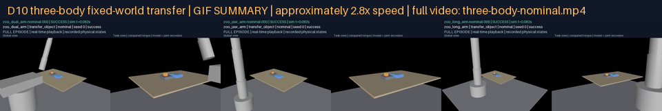

[three-body-nominal.mp4](g10-d10/three-body-nominal.mp4) (199 frames, 16.6 s); the three source episodes' frame maps: [zoo_dual_arm-nominal-000](g10-campaign/zoo_dual_arm/nominal/seed-000/media/frames.json), [zoo_jaw_arm-nominal-000](g10-campaign/zoo_jaw_arm/nominal/seed-000/media/frames.json), [zoo_long_arm-nominal-000](g10-campaign/zoo_long_arm/nominal/seed-000/media/frames.json)

### D10: slip and occlusion recoveries, uninterrupted

Each clip carries a strip on every frame: the leaf in progress with its attempt count and the retries used, the monitor's last verdicts from the declared sensors with the sensors and their ages, the protocol's disturbance as it acts, and the oracle labels the skill never reads. A body whose first such episode did not recover is shown not recovering.

| Case | Body | Verdict | Retries | What happened | Summary | Full video | Frame map |
|---|---|---|---|---|---|---|---|
| slip-zoo_dual_arm | zoo_dual_arm | `SUCCESS` | place 2, acquire [1, 1] | pull served to 0.25 m/s from 3.1 N against a capacity of 6.2 N at 9.32 s; the object left the fingers at 1.63 m/s; the monitor failed held at once and the carry stopped | 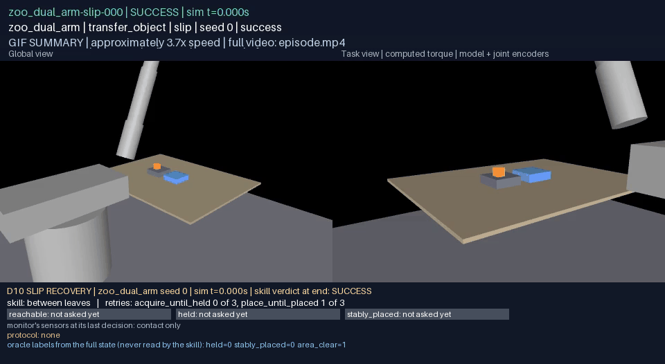 | [slip-zoo_dual_arm.mp4](g10-d10/slip-zoo_dual_arm.mp4) | [slip-zoo_dual_arm-frames.json](g10-d10/slip-zoo_dual_arm-frames.json) |
| slip-zoo_jaw_arm | zoo_jaw_arm | `SUCCESS` | place 2, acquire [1, 1] | pull served to 0.25 m/s from 4.0 N against a capacity of 7.9 N at 10.25 s; the object left the fingers at 2.72 m/s; the monitor failed held at once and the carry stopped |  | [slip-zoo_jaw_arm.mp4](g10-d10/slip-zoo_jaw_arm.mp4) | [slip-zoo_jaw_arm-frames.json](g10-d10/slip-zoo_jaw_arm-frames.json) |
| slip-zoo_long_arm | zoo_long_arm | `SUCCESS` | place 2, acquire [1, 1] | pull served to 0.25 m/s from 3.1 N against a capacity of 6.2 N at 11.18 s; the object left the fingers at 0.00 m/s; the monitor failed held at once and the carry stopped |  | [slip-zoo_long_arm.mp4](g10-d10/slip-zoo_long_arm.mp4) | [slip-zoo_long_arm-frames.json](g10-d10/slip-zoo_long_arm-frames.json) |
| occlusion-zoo_dual_arm | zoo_dual_arm | `SUCCESS` | place 1, acquire [1] | occluder between the camera and the fixtures from 12.58 s for 3 s; the placement verification was unknown (occluded) and re-observed | 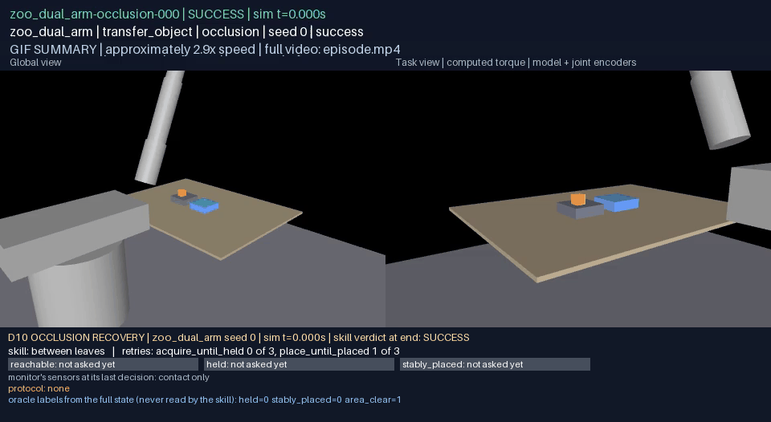 | [occlusion-zoo_dual_arm.mp4](g10-d10/occlusion-zoo_dual_arm.mp4) | [occlusion-zoo_dual_arm-frames.json](g10-d10/occlusion-zoo_dual_arm-frames.json) |
| occlusion-zoo_jaw_arm | zoo_jaw_arm | `SUCCESS` | place 1, acquire [1] | occluder between the camera and the fixtures from 13.47 s for 3 s; the placement verification was unknown (occluded) and re-observed | 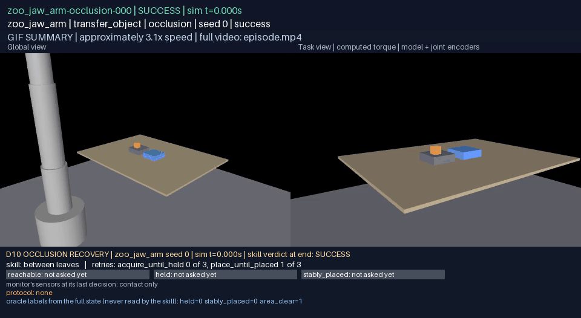 | [occlusion-zoo_jaw_arm.mp4](g10-d10/occlusion-zoo_jaw_arm.mp4) | [occlusion-zoo_jaw_arm-frames.json](g10-d10/occlusion-zoo_jaw_arm-frames.json) |
| occlusion-zoo_long_arm | zoo_long_arm | `SUCCESS` | place 1, acquire [1] | occluder between the camera and the fixtures from 14.43 s for 3 s; the placement verification was unknown (occluded) and re-observed | 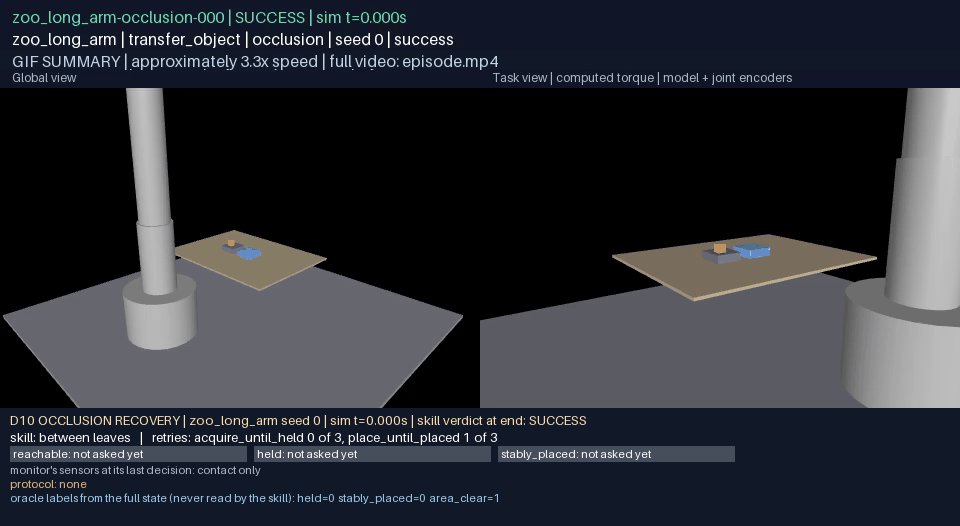 | [occlusion-zoo_long_arm.mp4](g10-d10/occlusion-zoo_long_arm.mp4) | [occlusion-zoo_long_arm-frames.json](g10-d10/occlusion-zoo_long_arm-frames.json) |

## The skill (A01, A04)

`transfer_object` is a neutral library (`rigby_core.skills.examples.transfer_object_library`, sha256 `8af1e9cda3a446e7...`), six levels deep:

- `transfer_object` (sequence, timeout 120 s, effect `object_placed`) runs `place_until_placed` (repeat until `object_placed`, at most 3) over `attempt_transfer`;
- `attempt_transfer` (sequence) runs `acquire_until_held` (repeat until `object_held`, at most 3) over `acquire_and_verify`, then `transport`, `release`, `verify_placement`;
- `acquire_and_verify` (sequence) runs `observe_object`, `acquire`, `verify_hold`.

Every verification is an Observe leaf: what it establishes is what the G09 conditionals decided from the declared sensors (`held` from the gripper's contact per opposition group with the camera optional; `stably_placed` from the camera and the region with contact optional; `reachable` from the camera and the calibrated reach shell), under the G09 policy by hash. The primitives' own certificates settle nothing (`require_effects` is off on every one): an acquisition that reports success is followed by a verification that decides from sensors; a transport is stopped by the monitor when the sensors lose the hold. Predicates never established are false, never unknown, so the loops ask honestly before the first attempt.

The body binding (`rigby_general.skills.transfer_object`) runs every leaf on the G06 transfer primitive over a phase range, continuing the world the last leaf left: the arm where it stands, the object where it lies, the clock where it stood, on one physics record per episode. `acquire` plans to the position the camera last reported, after the camera has seen the object still for a second; it never reads the authored position. An acquisition refused from the arm's posture (`facing_unmet`, a self-collision or unreachable path) reroutes to the reference configuration on a guarded path and plans once more within the same attempt. `verify_hold` and `verify_placement` hold the arm still for their windows while the sensors sample, decide, and re-observe within the conditional's fallback budget when undecidable; after the budget they leave the leaf undecided and the skill's verdict is `unknown`, never `success`. Nothing resets the world or writes the object's state; the object's recorded motion is continuous on every episode (a test pins it).

## The protocol

Registered before any scored run (`registration.json`, sha256 `383cca195e67e3a4...`): the world (`g06_transfer_v1+table+floor`: the G06 fixture on a floor with its top 12 cm below the mount, because the G06 world had no floor and an object dropped beside its fixtures fell forever), the three bodies, the G06 seed draws (translation, mass and friction of the cube) for 100 nominal episodes per body and the first 20 for each disturbance class, the disturbances, the cap, the library and the policy.

| Class | Declared disturbance |
|---|---|
| displaced | a constant force on the object, applied through the step hook while the first acquisition approaches, recorded as user input: 0.2 N for 30 ms, 0.4 s into the first acquisition |
| slip | a downward pull on the held object early in the first carry: gain x 2 x friction x the grip force the contact sensor reports, plus extra, capped: target slide 0.25 m/s, from 0.5 to at most 1.5 times the capacity, 0.05 s into the first carry |
| occlusion | a mocap occluder between the front camera and the fixtures from the start of the first placement verification, parked again after: 3 s |

The push and pull magnitudes were chosen on seeds 20 to 24 of each body, outside the disturbed classes' seeds 0 to 19, so that the push moves the cube one to three centimetres across the bench and the pull draws it out at a walking pace rather than throwing it; the cube weighs 8.6 g and any pull far above the grip's friction capacity throws it metres.

## Results (A02, A03)

| Body | Nominal | Displaced | Slip | Occlusion | False completions | Within cap | Physics per episode (mean / max) |
|---|---|---|---|---|---|---|---|
| zoo_dual_arm | 94/100 ✓ | 15/20 ✗ | 13/20 ✗ | 18/20 ✓ | 0 | 160/160 | 17.1 s / 51.2 s |
| zoo_jaw_arm | 100/100 ✓ | 14/20 ✗ | 16/20 ✓ | 20/20 ✓ | 0 | 160/160 | 18.1 s / 36.7 s |
| zoo_long_arm | 100/100 ✓ | 14/20 ✗ | 18/20 ✓ | 20/20 ✓ | 0 | 160/160 | 18.5 s / 33.0 s |

✓ marks a class at or above its target (90 nominal, 16 per disturbed class). Every failure, undecided and interrupted episode by body and class, with its reason:

| Body | Class | Verdict | Reason | Episodes |
|---|---|---|---|---|
| zoo_dual_arm | nominal | `UNKNOWN` | `child_unknown:0.0` | [023](g10-campaign/zoo_dual_arm/nominal/seed-023/media/episode.mp4), [041](g10-campaign/zoo_dual_arm/nominal/seed-041/media/episode.mp4), [056](g10-campaign/zoo_dual_arm/nominal/seed-056/media/episode.mp4), [080](g10-campaign/zoo_dual_arm/nominal/seed-080/media/episode.mp4) |
| zoo_dual_arm | nominal | `FAILURE` | `child_failed:0.0` | [053](g10-campaign/zoo_dual_arm/nominal/seed-053/media/episode.mp4), [068](g10-campaign/zoo_dual_arm/nominal/seed-068/media/episode.mp4) |
| zoo_dual_arm | displaced | `UNKNOWN` | `child_unknown:0.0` | [005](g10-campaign/zoo_dual_arm/displaced/seed-005/media/episode.mp4), [007](g10-campaign/zoo_dual_arm/displaced/seed-007/media/episode.mp4), [012](g10-campaign/zoo_dual_arm/displaced/seed-012/media/episode.mp4), [019](g10-campaign/zoo_dual_arm/displaced/seed-019/media/episode.mp4) |
| zoo_dual_arm | displaced | `FAILURE` | `child_failed:0.0` | [002](g10-campaign/zoo_dual_arm/displaced/seed-002/media/episode.mp4) |
| zoo_dual_arm | slip | `UNKNOWN` | `child_unknown:0.0` | [001](g10-campaign/zoo_dual_arm/slip/seed-001/media/episode.mp4), [002](g10-campaign/zoo_dual_arm/slip/seed-002/media/episode.mp4), [008](g10-campaign/zoo_dual_arm/slip/seed-008/media/episode.mp4), [012](g10-campaign/zoo_dual_arm/slip/seed-012/media/episode.mp4), [017](g10-campaign/zoo_dual_arm/slip/seed-017/media/episode.mp4) |
| zoo_dual_arm | slip | `FAILURE` | `child_failed:0.0` | [010](g10-campaign/zoo_dual_arm/slip/seed-010/media/episode.mp4), [011](g10-campaign/zoo_dual_arm/slip/seed-011/media/episode.mp4) |
| zoo_dual_arm | occlusion | `UNKNOWN` | `child_unknown:0.0` | [012](g10-campaign/zoo_dual_arm/occlusion/seed-012/media/episode.mp4), [017](g10-campaign/zoo_dual_arm/occlusion/seed-017/media/episode.mp4) |
| zoo_jaw_arm | displaced | `FAILURE` | `child_failed:0.0` | [002](g10-campaign/zoo_jaw_arm/displaced/seed-002/media/episode.mp4), [005](g10-campaign/zoo_jaw_arm/displaced/seed-005/media/episode.mp4), [007](g10-campaign/zoo_jaw_arm/displaced/seed-007/media/episode.mp4), [012](g10-campaign/zoo_jaw_arm/displaced/seed-012/media/episode.mp4) |
| zoo_jaw_arm | displaced | `UNKNOWN` | `child_unknown:0.0` | [001](g10-campaign/zoo_jaw_arm/displaced/seed-001/media/episode.mp4), [003](g10-campaign/zoo_jaw_arm/displaced/seed-003/media/episode.mp4) |
| zoo_jaw_arm | slip | `UNKNOWN` | `child_unknown:0.0` | [000](g10-campaign/zoo_jaw_arm/slip/seed-000/media/episode.mp4), [016](g10-campaign/zoo_jaw_arm/slip/seed-016/media/episode.mp4) |
| zoo_jaw_arm | slip | `FAILURE` | `child_failed:0.0` | [010](g10-campaign/zoo_jaw_arm/slip/seed-010/media/episode.mp4), [012](g10-campaign/zoo_jaw_arm/slip/seed-012/media/episode.mp4) |
| zoo_long_arm | displaced | `UNKNOWN` | `child_unknown:0.0` | [002](g10-campaign/zoo_long_arm/displaced/seed-002/media/episode.mp4), [003](g10-campaign/zoo_long_arm/displaced/seed-003/media/episode.mp4), [007](g10-campaign/zoo_long_arm/displaced/seed-007/media/episode.mp4), [012](g10-campaign/zoo_long_arm/displaced/seed-012/media/episode.mp4), [017](g10-campaign/zoo_long_arm/displaced/seed-017/media/episode.mp4) |
| zoo_long_arm | displaced | `FAILURE` | `child_failed:0.0` | [005](g10-campaign/zoo_long_arm/displaced/seed-005/media/episode.mp4) |
| zoo_long_arm | slip | `UNKNOWN` | `child_unknown:0.0` | [003](g10-campaign/zoo_long_arm/slip/seed-003/media/episode.mp4), [018](g10-campaign/zoo_long_arm/slip/seed-018/media/episode.mp4) |

### Where the failures come from

**Where the failures come from, and what was general.** Three things
were found in pilot 1, two of them general and fixed before the scored
pass, the pilot retained whole; a fourth was found in the scored pass and
is reported, not fixed.

- **A slab one object-length across sends a dropped object to the floor.**
  The G06 fixtures are 10 cm slabs whose tops stand 26 cm above the mount,
  and the G06 world has no floor. In the pilot an object that slipped from
  the grip fell from its lift height onto the slab it came from, bounced,
  and landed on a floor 38 cm down (added for the pilot so that a dropped
  object landed somewhere); thirteen of the dual arm's twenty induced slips
  ended there, outside its measured reach shell, and most of the jaw arm's
  ended there too, where a descent beside the slabs collided with them or
  the object was hidden from the front camera. The fixtures now stand on a
  table whose top is three centimetres below theirs, which is where such
  fixtures stand; nothing about the task changed. The pilot's slip class
  measured the world, not the skill.
- **The newest camera frame is two millimetres of noise a side.** An
  acquisition planned to it pinched the cube off-centre often enough to
  lose it on the lift once in twenty nominal episodes on the dual arm. The
  acquisition now plans to the mean of the frames that showed the object
  still, a fraction of a millimetre of noise.
- **A flung object no camera can see is `unknown`, not a failure.**
  When an acquisition throws the cube, the next observation cannot see it
  still within its budget and the skill ends undecided: it does not claim
  a failure of the placement it cannot see, and never a success. These are
  counted against the class's target all the same. Where the cubes went
  was checked from the sealed records of pilot 2's undecided episodes: in
  most of them the cube left the two-metre floor entirely, hundreds of
  metres away by the end of the record, fired from the fingers at the
  moment of the closure described next; a second camera (the scored pass
  observes with the front and the overhead cameras) sees nothing there
  either, and rightly reports it.
- **The dual arm's grasp tolerates less than half a millimetre.** In the
  scored pass the dual arm's first acquisition still ejected the cube on
  the close in six nominal episodes of a hundred, at contact forces of
  forty to five hundred newtons where G06's transfer, planned to the
  authored position on the same seeds, closed at twelve. Varying one thing
  at a time on one of them: planned to the authored position the closure
  settles in 0.21 s at 12.5 N; planned to the mean sensed position, 0.4 mm
  away, the fingers close past the cube and it leaves at speed; another
  noise realisation of the same mean succeeds at 21.6 N. The closure's
  tolerance to perception error on this hand is under half a millimetre,
  which is a fact about the hand's grasp geometry the transfer primitive
  did not have to meet in G06, and the reason the dual arm's nominal count
  is 94 rather than G06's 99. The mechanism is the closure's: the fingers
  advance under position control until contact, and a cube caught on an
  edge by one finger is driven against the bench at a force the contact
  stiffness turns into a launch before opposition is ever measured. The
  fix belongs to the G06 closure (a force limit on the advance), not to
  this skill, and is recorded as a discovered prerequisite rather than made
  here. In the scored pass four of the dual arm's disturbed episodes
  (slip and occlusion on seeds 12 and 17) ended this way on the first
  acquisition, before the protocol's disturbance ever fired, and are
  counted against their classes as they stand; its remaining slip
  non-recoveries are acquisitions from the table refused as unreachable
  from where the arm stood, the table being at the edge of its reach shell.

The multifinger-hand finding of G06 stands: the hand is not in the enabled
set and no transfer was attempted with it.

### Pilot 1, retained whole

The same skill on the same seeds: the G06 fixtures over a floor alone, each acquisition planned to the newest camera frame, the front camera the skill's only camera (`g06_transfer_v1+floor`, registration `ac51d5422b134f67...`, commit `593b9df09552`). Retained as `g10-campaign-pilot-1`: every row, its summary, its protocol as registered then, and the media of every failed, undecided or interrupted episode (successes' media and every bundle local).

| Body | Nominal | Displaced | Slip | Occlusion | Undecided | False completions |
|---|---|---|---|---|---|---|
| zoo_dual_arm | 93/100 | 16/20 | 3/20 | 20/20 | 11 | 0 |
| zoo_jaw_arm | 98/100 | 16/20 | 4/20 | 20/20 | 8 | 0 |
| zoo_long_arm | 100/100 | 8/20 | 19/20 | 20/20 | 9 | 0 |

Every pilot 1 failure by body and class, with its reason:

| Body | Class | Verdict | Reason | Episodes |
|---|---|---|---|---|
| zoo_dual_arm | nominal | `UNKNOWN` | `child_unknown:0.0` | [029](g10-campaign-pilot-1/zoo_dual_arm/nominal/seed-029/media/episode.mp4), [041](g10-campaign-pilot-1/zoo_dual_arm/nominal/seed-041/media/episode.mp4), [043](g10-campaign-pilot-1/zoo_dual_arm/nominal/seed-043/media/episode.mp4), [052](g10-campaign-pilot-1/zoo_dual_arm/nominal/seed-052/media/episode.mp4), [080](g10-campaign-pilot-1/zoo_dual_arm/nominal/seed-080/media/episode.mp4) |
| zoo_dual_arm | nominal | `FAILURE` | `child_failed:0.0` | [057](g10-campaign-pilot-1/zoo_dual_arm/nominal/seed-057/media/episode.mp4), [066](g10-campaign-pilot-1/zoo_dual_arm/nominal/seed-066/media/episode.mp4) |
| zoo_dual_arm | displaced | `UNKNOWN` | `child_unknown:0.0` | [002](g10-campaign-pilot-1/zoo_dual_arm/displaced/seed-002/media/episode.mp4), [012](g10-campaign-pilot-1/zoo_dual_arm/displaced/seed-012/media/episode.mp4), [019](g10-campaign-pilot-1/zoo_dual_arm/displaced/seed-019/media/episode.mp4) |
| zoo_dual_arm | displaced | `FAILURE` | `child_failed:0.0` | [011](g10-campaign-pilot-1/zoo_dual_arm/displaced/seed-011/media/episode.mp4) |
| zoo_dual_arm | slip | `FAILURE` | `child_failed:0.0` | [000](g10-campaign-pilot-1/zoo_dual_arm/slip/seed-000/media/episode.mp4), [001](g10-campaign-pilot-1/zoo_dual_arm/slip/seed-001/media/episode.mp4), [002](g10-campaign-pilot-1/zoo_dual_arm/slip/seed-002/media/episode.mp4), [003](g10-campaign-pilot-1/zoo_dual_arm/slip/seed-003/media/episode.mp4), [004](g10-campaign-pilot-1/zoo_dual_arm/slip/seed-004/media/episode.mp4), [005](g10-campaign-pilot-1/zoo_dual_arm/slip/seed-005/media/episode.mp4), [007](g10-campaign-pilot-1/zoo_dual_arm/slip/seed-007/media/episode.mp4), [009](g10-campaign-pilot-1/zoo_dual_arm/slip/seed-009/media/episode.mp4), [010](g10-campaign-pilot-1/zoo_dual_arm/slip/seed-010/media/episode.mp4), [011](g10-campaign-pilot-1/zoo_dual_arm/slip/seed-011/media/episode.mp4), [014](g10-campaign-pilot-1/zoo_dual_arm/slip/seed-014/media/episode.mp4), [016](g10-campaign-pilot-1/zoo_dual_arm/slip/seed-016/media/episode.mp4), [017](g10-campaign-pilot-1/zoo_dual_arm/slip/seed-017/media/episode.mp4), [018](g10-campaign-pilot-1/zoo_dual_arm/slip/seed-018/media/episode.mp4) |
| zoo_dual_arm | slip | `UNKNOWN` | `child_unknown:0.0` | [008](g10-campaign-pilot-1/zoo_dual_arm/slip/seed-008/media/episode.mp4), [012](g10-campaign-pilot-1/zoo_dual_arm/slip/seed-012/media/episode.mp4), [019](g10-campaign-pilot-1/zoo_dual_arm/slip/seed-019/media/episode.mp4) |
| zoo_jaw_arm | nominal | `FAILURE` | `child_failed:0.0` | [043](g10-campaign-pilot-1/zoo_jaw_arm/nominal/seed-043/media/episode.mp4) |
| zoo_jaw_arm | nominal | `UNKNOWN` | `child_unknown:0.0` | [096](g10-campaign-pilot-1/zoo_jaw_arm/nominal/seed-096/media/episode.mp4) |
| zoo_jaw_arm | displaced | `FAILURE` | `child_failed:0.0` | [002](g10-campaign-pilot-1/zoo_jaw_arm/displaced/seed-002/media/episode.mp4), [007](g10-campaign-pilot-1/zoo_jaw_arm/displaced/seed-007/media/episode.mp4) |
| zoo_jaw_arm | displaced | `UNKNOWN` | `child_unknown:0.0` | [003](g10-campaign-pilot-1/zoo_jaw_arm/displaced/seed-003/media/episode.mp4), [012](g10-campaign-pilot-1/zoo_jaw_arm/displaced/seed-012/media/episode.mp4) |
| zoo_jaw_arm | slip | `FAILURE` | `child_failed:0.0` | [000](g10-campaign-pilot-1/zoo_jaw_arm/slip/seed-000/media/episode.mp4), [001](g10-campaign-pilot-1/zoo_jaw_arm/slip/seed-001/media/episode.mp4), [002](g10-campaign-pilot-1/zoo_jaw_arm/slip/seed-002/media/episode.mp4), [003](g10-campaign-pilot-1/zoo_jaw_arm/slip/seed-003/media/episode.mp4), [004](g10-campaign-pilot-1/zoo_jaw_arm/slip/seed-004/media/episode.mp4), [005](g10-campaign-pilot-1/zoo_jaw_arm/slip/seed-005/media/episode.mp4), [006](g10-campaign-pilot-1/zoo_jaw_arm/slip/seed-006/media/episode.mp4), [007](g10-campaign-pilot-1/zoo_jaw_arm/slip/seed-007/media/episode.mp4), [009](g10-campaign-pilot-1/zoo_jaw_arm/slip/seed-009/media/episode.mp4), [011](g10-campaign-pilot-1/zoo_jaw_arm/slip/seed-011/media/episode.mp4), [012](g10-campaign-pilot-1/zoo_jaw_arm/slip/seed-012/media/episode.mp4) |
| zoo_jaw_arm | slip | `UNKNOWN` | `child_unknown:0.0` | [008](g10-campaign-pilot-1/zoo_jaw_arm/slip/seed-008/media/episode.mp4), [013](g10-campaign-pilot-1/zoo_jaw_arm/slip/seed-013/media/episode.mp4), [015](g10-campaign-pilot-1/zoo_jaw_arm/slip/seed-015/media/episode.mp4), [017](g10-campaign-pilot-1/zoo_jaw_arm/slip/seed-017/media/episode.mp4), [019](g10-campaign-pilot-1/zoo_jaw_arm/slip/seed-019/media/episode.mp4) |
| zoo_long_arm | displaced | `UNKNOWN` | `child_unknown:0.0` | [000](g10-campaign-pilot-1/zoo_long_arm/displaced/seed-000/media/episode.mp4), [002](g10-campaign-pilot-1/zoo_long_arm/displaced/seed-002/media/episode.mp4), [005](g10-campaign-pilot-1/zoo_long_arm/displaced/seed-005/media/episode.mp4), [008](g10-campaign-pilot-1/zoo_long_arm/displaced/seed-008/media/episode.mp4), [012](g10-campaign-pilot-1/zoo_long_arm/displaced/seed-012/media/episode.mp4), [015](g10-campaign-pilot-1/zoo_long_arm/displaced/seed-015/media/episode.mp4), [016](g10-campaign-pilot-1/zoo_long_arm/displaced/seed-016/media/episode.mp4), [017](g10-campaign-pilot-1/zoo_long_arm/displaced/seed-017/media/episode.mp4) |
| zoo_long_arm | displaced | `FAILURE` | `child_failed:0.0` | [003](g10-campaign-pilot-1/zoo_long_arm/displaced/seed-003/media/episode.mp4), [004](g10-campaign-pilot-1/zoo_long_arm/displaced/seed-004/media/episode.mp4), [011](g10-campaign-pilot-1/zoo_long_arm/displaced/seed-011/media/episode.mp4), [019](g10-campaign-pilot-1/zoo_long_arm/displaced/seed-019/media/episode.mp4) |
| zoo_long_arm | slip | `UNKNOWN` | `child_unknown:0.0` | [010](g10-campaign-pilot-1/zoo_long_arm/slip/seed-010/media/episode.mp4) |

### Pilot 2, retained whole

The same skill on the same seeds: the fixtures on the table, each acquisition planned to the mean of the still frames, the front camera the skill's only camera (`g06_transfer_v1+table+floor`, registration `7769d4ecc49f2663...`, commit `aa3c07438948`). Retained as `g10-campaign-pilot-2`: every row, its summary, its protocol as registered then, and the media of every failed, undecided or interrupted episode (successes' media and every bundle local).

| Body | Nominal | Displaced | Slip | Occlusion | Undecided | False completions |
|---|---|---|---|---|---|---|
| zoo_dual_arm | 94/100 | 16/20 | 13/20 | 19/20 | 12 | 0 |
| zoo_jaw_arm | 99/100 | 12/20 | 14/20 | 18/20 | 8 | 0 |
| zoo_long_arm | 100/100 | 13/20 | 19/20 | 20/20 | 7 | 0 |

Every pilot 2 failure by body and class, with its reason:

| Body | Class | Verdict | Reason | Episodes |
|---|---|---|---|---|
| zoo_dual_arm | nominal | `UNKNOWN` | `child_unknown:0.0` | [017](g10-campaign-pilot-2/zoo_dual_arm/nominal/seed-017/media/episode.mp4), [027](g10-campaign-pilot-2/zoo_dual_arm/nominal/seed-027/media/episode.mp4), [054](g10-campaign-pilot-2/zoo_dual_arm/nominal/seed-054/media/episode.mp4), [085](g10-campaign-pilot-2/zoo_dual_arm/nominal/seed-085/media/episode.mp4), [099](g10-campaign-pilot-2/zoo_dual_arm/nominal/seed-099/media/episode.mp4) |
| zoo_dual_arm | nominal | `FAILURE` | `child_failed:0.0` | [037](g10-campaign-pilot-2/zoo_dual_arm/nominal/seed-037/media/episode.mp4) |
| zoo_dual_arm | displaced | `UNKNOWN` | `child_unknown:0.0` | [005](g10-campaign-pilot-2/zoo_dual_arm/displaced/seed-005/media/episode.mp4), [007](g10-campaign-pilot-2/zoo_dual_arm/displaced/seed-007/media/episode.mp4), [012](g10-campaign-pilot-2/zoo_dual_arm/displaced/seed-012/media/episode.mp4) |
| zoo_dual_arm | displaced | `FAILURE` | `child_failed:0.0` | [019](g10-campaign-pilot-2/zoo_dual_arm/displaced/seed-019/media/episode.mp4) |
| zoo_dual_arm | slip | `UNKNOWN` | `child_unknown:0.0` | [002](g10-campaign-pilot-2/zoo_dual_arm/slip/seed-002/media/episode.mp4), [012](g10-campaign-pilot-2/zoo_dual_arm/slip/seed-012/media/episode.mp4), [013](g10-campaign-pilot-2/zoo_dual_arm/slip/seed-013/media/episode.mp4), [017](g10-campaign-pilot-2/zoo_dual_arm/slip/seed-017/media/episode.mp4) |
| zoo_dual_arm | slip | `FAILURE` | `child_failed:0.0` | [007](g10-campaign-pilot-2/zoo_dual_arm/slip/seed-007/media/episode.mp4), [009](g10-campaign-pilot-2/zoo_dual_arm/slip/seed-009/media/episode.mp4), [018](g10-campaign-pilot-2/zoo_dual_arm/slip/seed-018/media/episode.mp4) |
| zoo_dual_arm | occlusion | `FAILURE` | `child_failed:0.0` | [005](g10-campaign-pilot-2/zoo_dual_arm/occlusion/seed-005/media/episode.mp4) |
| zoo_jaw_arm | nominal | `FAILURE` | `child_failed:0.0` | [096](g10-campaign-pilot-2/zoo_jaw_arm/nominal/seed-096/media/episode.mp4) |
| zoo_jaw_arm | displaced | `UNKNOWN` | `child_unknown:0.0` | [001](g10-campaign-pilot-2/zoo_jaw_arm/displaced/seed-001/media/episode.mp4), [003](g10-campaign-pilot-2/zoo_jaw_arm/displaced/seed-003/media/episode.mp4), [013](g10-campaign-pilot-2/zoo_jaw_arm/displaced/seed-013/media/episode.mp4), [017](g10-campaign-pilot-2/zoo_jaw_arm/displaced/seed-017/media/episode.mp4) |
| zoo_jaw_arm | displaced | `FAILURE` | `child_failed:0.0` | [002](g10-campaign-pilot-2/zoo_jaw_arm/displaced/seed-002/media/episode.mp4), [005](g10-campaign-pilot-2/zoo_jaw_arm/displaced/seed-005/media/episode.mp4), [007](g10-campaign-pilot-2/zoo_jaw_arm/displaced/seed-007/media/episode.mp4), [012](g10-campaign-pilot-2/zoo_jaw_arm/displaced/seed-012/media/episode.mp4) |
| zoo_jaw_arm | slip | `FAILURE` | `child_failed:0.0` | [001](g10-campaign-pilot-2/zoo_jaw_arm/slip/seed-001/media/episode.mp4), [011](g10-campaign-pilot-2/zoo_jaw_arm/slip/seed-011/media/episode.mp4), [012](g10-campaign-pilot-2/zoo_jaw_arm/slip/seed-012/media/episode.mp4) |
| zoo_jaw_arm | slip | `UNKNOWN` | `child_unknown:0.0` | [004](g10-campaign-pilot-2/zoo_jaw_arm/slip/seed-004/media/episode.mp4), [017](g10-campaign-pilot-2/zoo_jaw_arm/slip/seed-017/media/episode.mp4), [019](g10-campaign-pilot-2/zoo_jaw_arm/slip/seed-019/media/episode.mp4) |
| zoo_jaw_arm | occlusion | `FAILURE` | `child_failed:0.0` | [002](g10-campaign-pilot-2/zoo_jaw_arm/occlusion/seed-002/media/episode.mp4) |
| zoo_jaw_arm | occlusion | `UNKNOWN` | `child_unknown:0.0` | [012](g10-campaign-pilot-2/zoo_jaw_arm/occlusion/seed-012/media/episode.mp4) |
| zoo_long_arm | displaced | `UNKNOWN` | `child_unknown:0.0` | [002](g10-campaign-pilot-2/zoo_long_arm/displaced/seed-002/media/episode.mp4), [004](g10-campaign-pilot-2/zoo_long_arm/displaced/seed-004/media/episode.mp4), [005](g10-campaign-pilot-2/zoo_long_arm/displaced/seed-005/media/episode.mp4), [007](g10-campaign-pilot-2/zoo_long_arm/displaced/seed-007/media/episode.mp4), [012](g10-campaign-pilot-2/zoo_long_arm/displaced/seed-012/media/episode.mp4), [017](g10-campaign-pilot-2/zoo_long_arm/displaced/seed-017/media/episode.mp4) |
| zoo_long_arm | displaced | `FAILURE` | `child_failed:0.0` | [011](g10-campaign-pilot-2/zoo_long_arm/displaced/seed-011/media/episode.mp4) |
| zoo_long_arm | slip | `UNKNOWN` | `child_unknown:0.0` | [018](g10-campaign-pilot-2/zoo_long_arm/slip/seed-018/media/episode.mp4) |

### No false completion

A completion is the skill's `success` verdict, reached only when `verify_placement` decided pass from the camera and contact over the two-second dwell. Every one of the 442 completions was judged again from the full recorded state over its final dwell (the object's whole geometry inside the region on every sample, no robot geom touching it, its speeds under the goal's limits); 0 disagreed. The 26 episodes that ended `unknown` are ones in which a verification could not be decided within its fallback budget (an object the camera could not see still, or a placement it could not see); they are not counted as completions and not as failures of the object being placed.

### Disturbed episodes rendered in full

Every failure and the first five successes per body and class; every one of the twenty per class keeps its row in `trials.json` with its disturbance log, leaf calls, verdict trail and oracle judgement.

| Episode | Verdict | Retries (place; acquire per pass) | Physics | Disturbance | Summary | Full episode | Frame map |
|---|---|---|---|---|---|---|---|
| zoo_dual_arm-displaced-000 | `SUCCESS` | 1; [2] | 23.0 s | push at 1.50 s, moved 1.0 cm |  | [episode.mp4](g10-campaign/zoo_dual_arm/displaced/seed-000/media/episode.mp4) | [frames.json](g10-campaign/zoo_dual_arm/displaced/seed-000/media/frames.json) |
| zoo_dual_arm-displaced-001 | `SUCCESS` | 1; [2] | 23.0 s | push at 1.50 s, moved 0.7 cm |  | [episode.mp4](g10-campaign/zoo_dual_arm/displaced/seed-001/media/episode.mp4) | [frames.json](g10-campaign/zoo_dual_arm/displaced/seed-001/media/frames.json) |
| zoo_dual_arm-displaced-002 | `FAILURE` `child_failed:0.0` | 3; [3, 3, 3] | 19.2 s | push at 1.50 s, moved 0.9 cm |  | [episode.mp4](g10-campaign/zoo_dual_arm/displaced/seed-002/media/episode.mp4) | [frames.json](g10-campaign/zoo_dual_arm/displaced/seed-002/media/frames.json) |
| zoo_dual_arm-displaced-003 | `SUCCESS` | 1; [2] | 23.2 s | push at 1.50 s, moved 0.9 cm |  | [episode.mp4](g10-campaign/zoo_dual_arm/displaced/seed-003/media/episode.mp4) | [frames.json](g10-campaign/zoo_dual_arm/displaced/seed-003/media/frames.json) |
| zoo_dual_arm-displaced-004 | `SUCCESS` | 1; [2] | 23.1 s | push at 1.50 s, moved 1.5 cm | 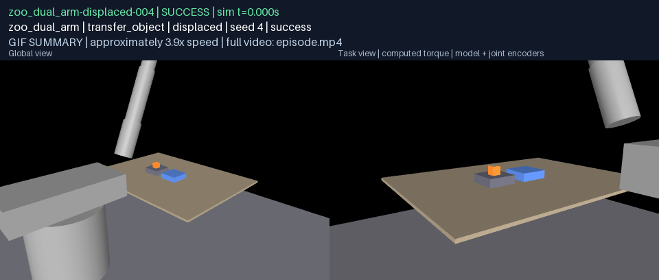 | [episode.mp4](g10-campaign/zoo_dual_arm/displaced/seed-004/media/episode.mp4) | [frames.json](g10-campaign/zoo_dual_arm/displaced/seed-004/media/frames.json) |
| zoo_dual_arm-displaced-005 | `UNKNOWN` `child_unknown:0.0` | 1; [2] | 13.7 s | push at 1.50 s, moved 0.9 cm |  | [episode.mp4](g10-campaign/zoo_dual_arm/displaced/seed-005/media/episode.mp4) | [frames.json](g10-campaign/zoo_dual_arm/displaced/seed-005/media/frames.json) |
| zoo_dual_arm-displaced-006 | `SUCCESS` | 1; [2] | 23.1 s | push at 1.50 s, moved 0.6 cm |  | [episode.mp4](g10-campaign/zoo_dual_arm/displaced/seed-006/media/episode.mp4) | [frames.json](g10-campaign/zoo_dual_arm/displaced/seed-006/media/frames.json) |
| zoo_dual_arm-displaced-007 | `UNKNOWN` `child_unknown:0.0` | 1; [2] | 13.3 s | push at 1.50 s, moved 1.7 cm | 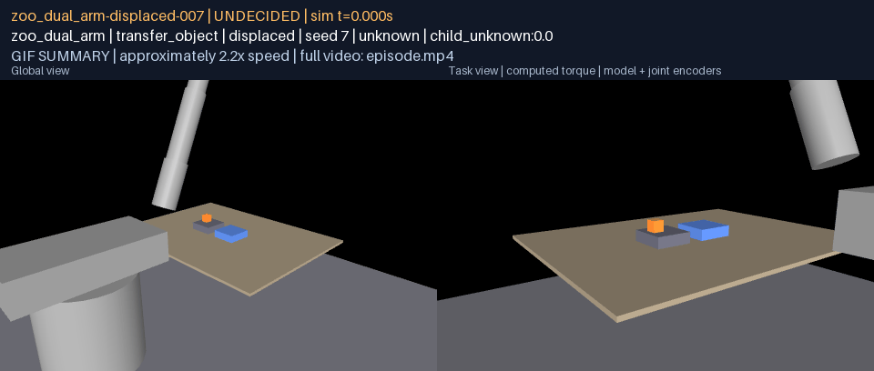 | [episode.mp4](g10-campaign/zoo_dual_arm/displaced/seed-007/media/episode.mp4) | [frames.json](g10-campaign/zoo_dual_arm/displaced/seed-007/media/frames.json) |
| zoo_dual_arm-displaced-012 | `UNKNOWN` `child_unknown:0.0` | 1; [2] | 13.5 s | push at 1.50 s, moved 1.0 cm | 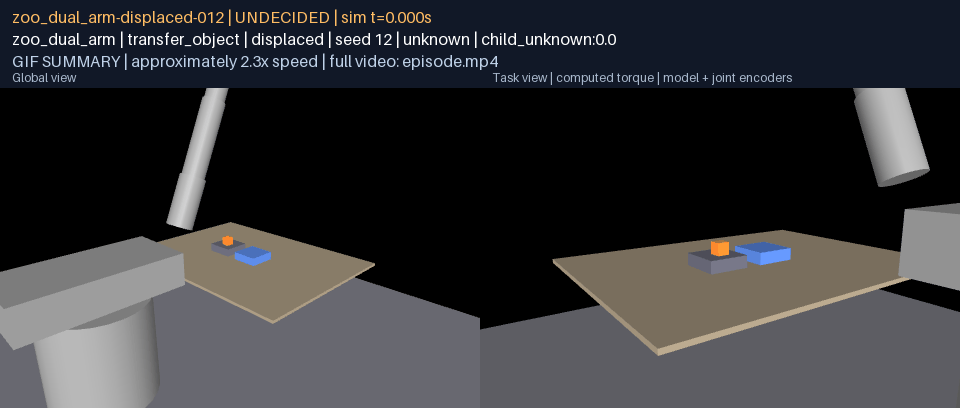 | [episode.mp4](g10-campaign/zoo_dual_arm/displaced/seed-012/media/episode.mp4) | [frames.json](g10-campaign/zoo_dual_arm/displaced/seed-012/media/frames.json) |
| zoo_dual_arm-displaced-019 | `UNKNOWN` `child_unknown:0.0` | 1; [2] | 13.5 s | push at 1.50 s, moved 3.5 cm |  | [episode.mp4](g10-campaign/zoo_dual_arm/displaced/seed-019/media/episode.mp4) | [frames.json](g10-campaign/zoo_dual_arm/displaced/seed-019/media/frames.json) |
| zoo_dual_arm-slip-000 | `SUCCESS` | 2; [1, 1] | 22.2 s | pull at 9.32 s, exit 1.63 m/s |  | [episode.mp4](g10-campaign/zoo_dual_arm/slip/seed-000/media/episode.mp4) | [frames.json](g10-campaign/zoo_dual_arm/slip/seed-000/media/frames.json) |
| zoo_dual_arm-slip-001 | `UNKNOWN` `child_unknown:0.0` | 2; [1, 3] | 29.7 s | pull at 9.37 s, exit 2.24 m/s | 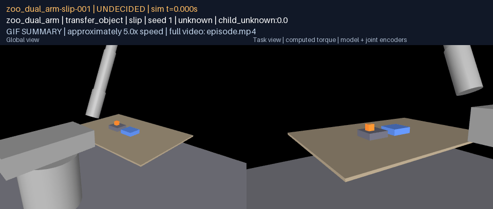 | [episode.mp4](g10-campaign/zoo_dual_arm/slip/seed-001/media/episode.mp4) | [frames.json](g10-campaign/zoo_dual_arm/slip/seed-001/media/frames.json) |
| zoo_dual_arm-slip-002 | `UNKNOWN` `child_unknown:0.0` | 3; [2, 3, 2] | 51.2 s | pull at 16.39 s, exit 2.50 m/s |  | [episode.mp4](g10-campaign/zoo_dual_arm/slip/seed-002/media/episode.mp4) | [frames.json](g10-campaign/zoo_dual_arm/slip/seed-002/media/frames.json) |
| zoo_dual_arm-slip-003 | `SUCCESS` | 2; [1, 1] | 22.4 s | pull at 9.56 s, exit 2.24 m/s | 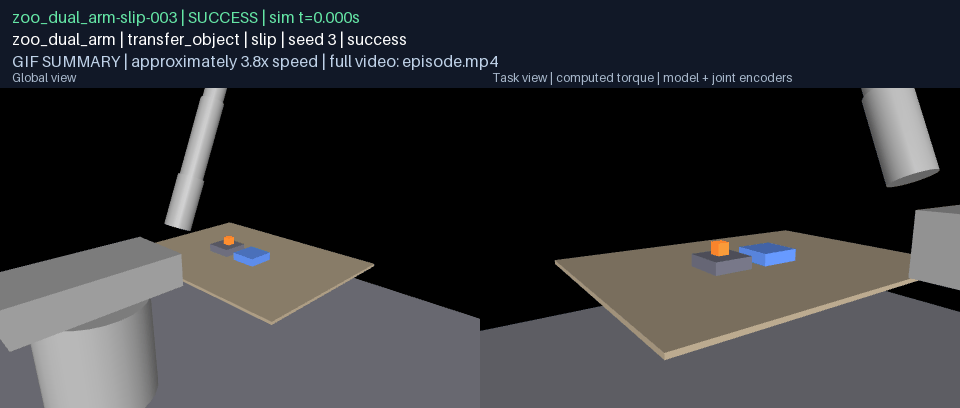 | [episode.mp4](g10-campaign/zoo_dual_arm/slip/seed-003/media/episode.mp4) | [frames.json](g10-campaign/zoo_dual_arm/slip/seed-003/media/frames.json) |
| zoo_dual_arm-slip-004 | `SUCCESS` | 2; [1, 1] | 23.3 s | pull at 9.44 s, exit 2.26 m/s | 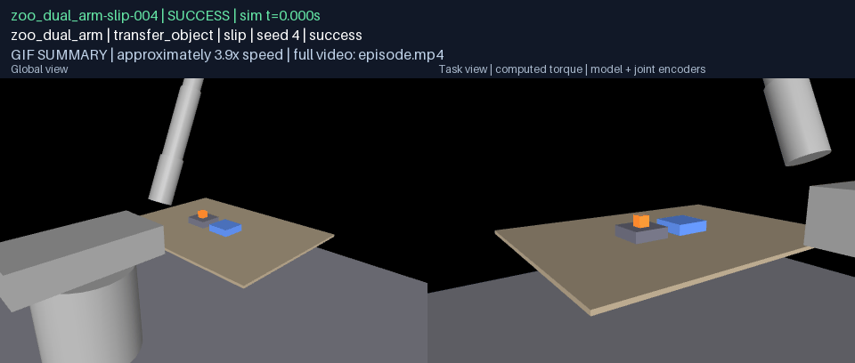 | [episode.mp4](g10-campaign/zoo_dual_arm/slip/seed-004/media/episode.mp4) | [frames.json](g10-campaign/zoo_dual_arm/slip/seed-004/media/frames.json) |
| zoo_dual_arm-slip-005 | `SUCCESS` | 2; [1, 1] | 22.5 s | pull at 9.63 s, exit 2.62 m/s | 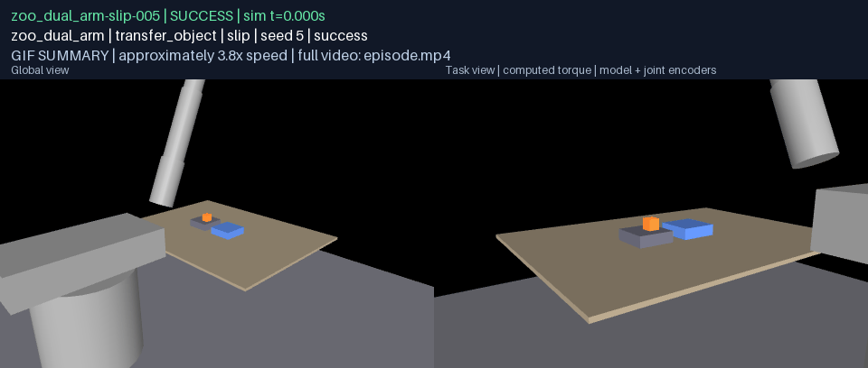 | [episode.mp4](g10-campaign/zoo_dual_arm/slip/seed-005/media/episode.mp4) | [frames.json](g10-campaign/zoo_dual_arm/slip/seed-005/media/frames.json) |
| zoo_dual_arm-slip-006 | `SUCCESS` | 2; [1, 1] | 22.2 s | pull at 9.42 s, exit 2.55 m/s |  | [episode.mp4](g10-campaign/zoo_dual_arm/slip/seed-006/media/episode.mp4) | [frames.json](g10-campaign/zoo_dual_arm/slip/seed-006/media/frames.json) |
| zoo_dual_arm-slip-008 | `UNKNOWN` `child_unknown:0.0` | 2; [1, 1] | 12.9 s | pull at 9.66 s, exit 2.32 m/s | 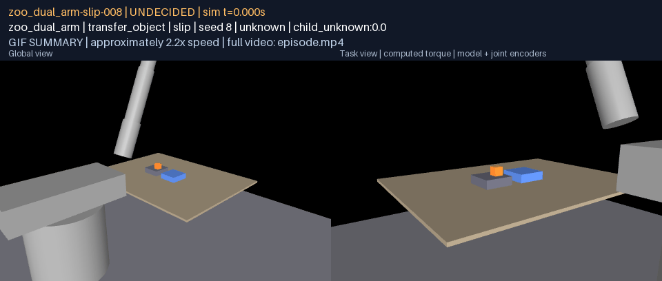 | [episode.mp4](g10-campaign/zoo_dual_arm/slip/seed-008/media/episode.mp4) | [frames.json](g10-campaign/zoo_dual_arm/slip/seed-008/media/frames.json) |
| zoo_dual_arm-slip-010 | `FAILURE` `child_failed:0.0` | 3; [1, 3, 3] | 17.0 s | pull at 9.25 s, exit 2.21 m/s | 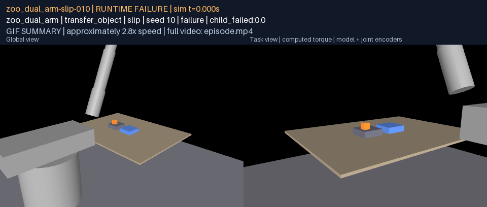 | [episode.mp4](g10-campaign/zoo_dual_arm/slip/seed-010/media/episode.mp4) | [frames.json](g10-campaign/zoo_dual_arm/slip/seed-010/media/frames.json) |
| zoo_dual_arm-slip-011 | `FAILURE` `child_failed:0.0` | 3; [1, 3, 3] | 17.3 s | pull at 9.55 s, exit 4.53 m/s |  | [episode.mp4](g10-campaign/zoo_dual_arm/slip/seed-011/media/episode.mp4) | [frames.json](g10-campaign/zoo_dual_arm/slip/seed-011/media/frames.json) |
| zoo_dual_arm-slip-012 | `UNKNOWN` `child_unknown:0.0` | 1; [2] | 14.3 s | pull at 0.00 s, no exit | 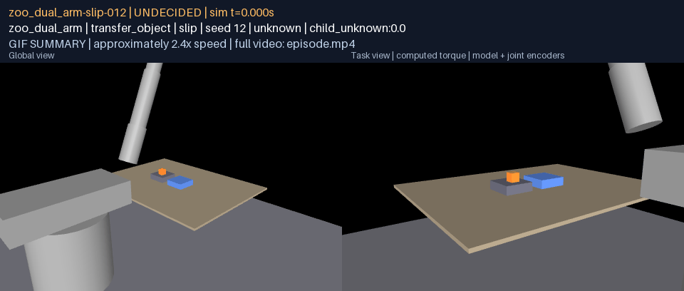 | [episode.mp4](g10-campaign/zoo_dual_arm/slip/seed-012/media/episode.mp4) | [frames.json](g10-campaign/zoo_dual_arm/slip/seed-012/media/frames.json) |
| zoo_dual_arm-slip-017 | `UNKNOWN` `child_unknown:0.0` | 1; [2] | 14.4 s | pull at 0.00 s, no exit | 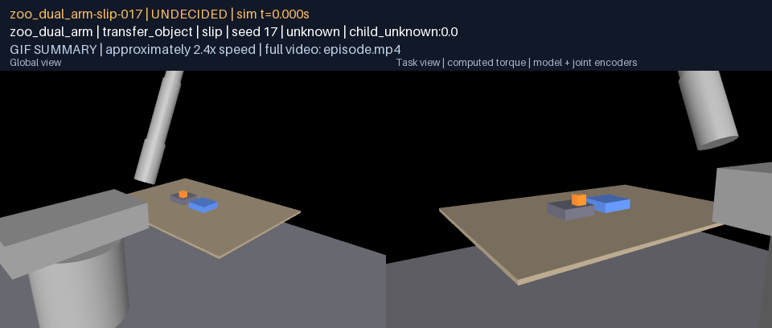 | [episode.mp4](g10-campaign/zoo_dual_arm/slip/seed-017/media/episode.mp4) | [frames.json](g10-campaign/zoo_dual_arm/slip/seed-017/media/frames.json) |
| zoo_dual_arm-occlusion-000 | `SUCCESS` | 1; [1] | 17.6 s | occluder from 12.58 s for 3 s |  | [episode.mp4](g10-campaign/zoo_dual_arm/occlusion/seed-000/media/episode.mp4) | [frames.json](g10-campaign/zoo_dual_arm/occlusion/seed-000/media/frames.json) |
| zoo_dual_arm-occlusion-001 | `SUCCESS` | 1; [2] | 24.5 s | occluder from 19.55 s for 3 s | 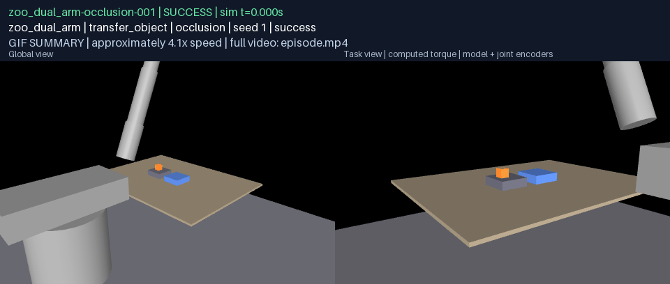 | [episode.mp4](g10-campaign/zoo_dual_arm/occlusion/seed-001/media/episode.mp4) | [frames.json](g10-campaign/zoo_dual_arm/occlusion/seed-001/media/frames.json) |
| zoo_dual_arm-occlusion-002 | `SUCCESS` | 1; [1] | 17.7 s | occluder from 12.71 s for 3 s |  | [episode.mp4](g10-campaign/zoo_dual_arm/occlusion/seed-002/media/episode.mp4) | [frames.json](g10-campaign/zoo_dual_arm/occlusion/seed-002/media/frames.json) |
| zoo_dual_arm-occlusion-003 | `SUCCESS` | 1; [1] | 17.8 s | occluder from 12.81 s for 3 s |  | [episode.mp4](g10-campaign/zoo_dual_arm/occlusion/seed-003/media/episode.mp4) | [frames.json](g10-campaign/zoo_dual_arm/occlusion/seed-003/media/frames.json) |
| zoo_dual_arm-occlusion-004 | `SUCCESS` | 1; [1] | 17.7 s | occluder from 12.69 s for 3 s |  | [episode.mp4](g10-campaign/zoo_dual_arm/occlusion/seed-004/media/episode.mp4) | [frames.json](g10-campaign/zoo_dual_arm/occlusion/seed-004/media/frames.json) |
| zoo_dual_arm-occlusion-012 | `UNKNOWN` `child_unknown:0.0` | 1; [2] | 14.3 s | occluder from 0.00 s for 0 s |  | [episode.mp4](g10-campaign/zoo_dual_arm/occlusion/seed-012/media/episode.mp4) | [frames.json](g10-campaign/zoo_dual_arm/occlusion/seed-012/media/frames.json) |
| zoo_dual_arm-occlusion-017 | `UNKNOWN` `child_unknown:0.0` | 1; [2] | 14.4 s | occluder from 0.00 s for 0 s | 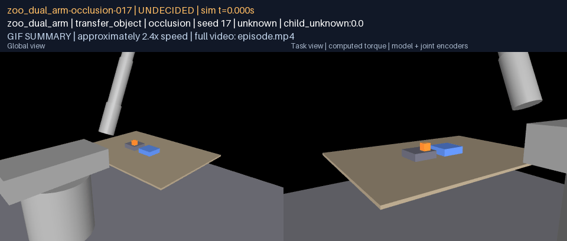 | [episode.mp4](g10-campaign/zoo_dual_arm/occlusion/seed-017/media/episode.mp4) | [frames.json](g10-campaign/zoo_dual_arm/occlusion/seed-017/media/frames.json) |
| zoo_jaw_arm-displaced-000 | `SUCCESS` | 1; [2] | 23.9 s | push at 1.50 s, moved 1.0 cm |  | [episode.mp4](g10-campaign/zoo_jaw_arm/displaced/seed-000/media/episode.mp4) | [frames.json](g10-campaign/zoo_jaw_arm/displaced/seed-000/media/frames.json) |
| zoo_jaw_arm-displaced-001 | `UNKNOWN` `child_unknown:0.0` | 1; [2] | 14.3 s | push at 1.50 s, moved 0.7 cm | 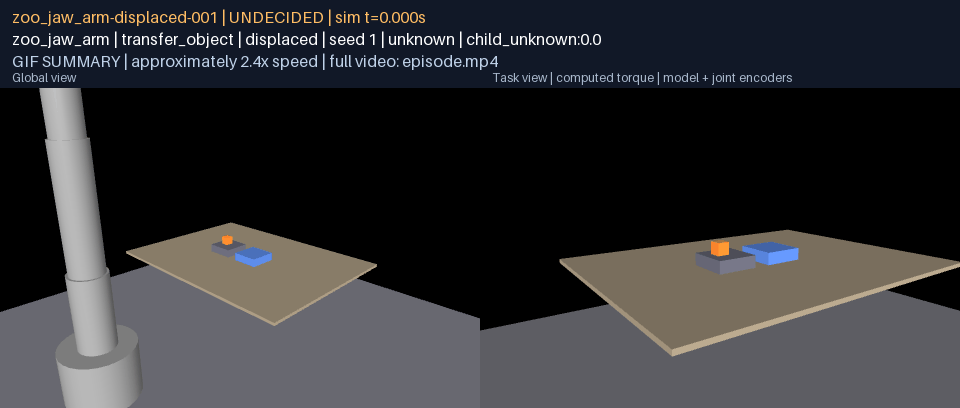 | [episode.mp4](g10-campaign/zoo_jaw_arm/displaced/seed-001/media/episode.mp4) | [frames.json](g10-campaign/zoo_jaw_arm/displaced/seed-001/media/frames.json) |
| zoo_jaw_arm-displaced-002 | `FAILURE` `child_failed:0.0` | 3; [3, 3, 3] | 20.0 s | push at 1.50 s, moved 0.9 cm | 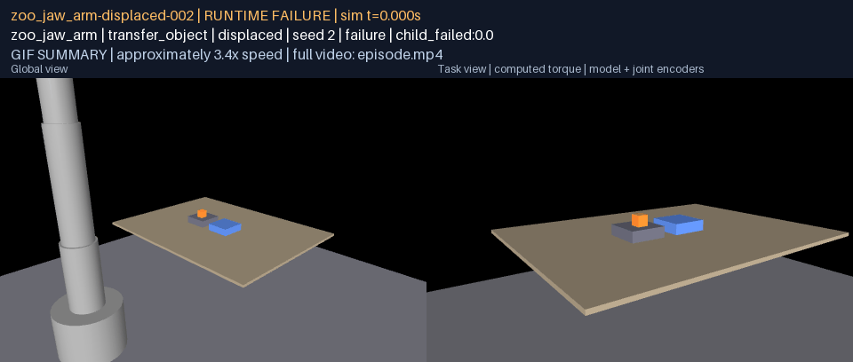 | [episode.mp4](g10-campaign/zoo_jaw_arm/displaced/seed-002/media/episode.mp4) | [frames.json](g10-campaign/zoo_jaw_arm/displaced/seed-002/media/frames.json) |
| zoo_jaw_arm-displaced-003 | `UNKNOWN` `child_unknown:0.0` | 2; [2, 1] | 27.4 s | push at 1.50 s, moved 0.9 cm | 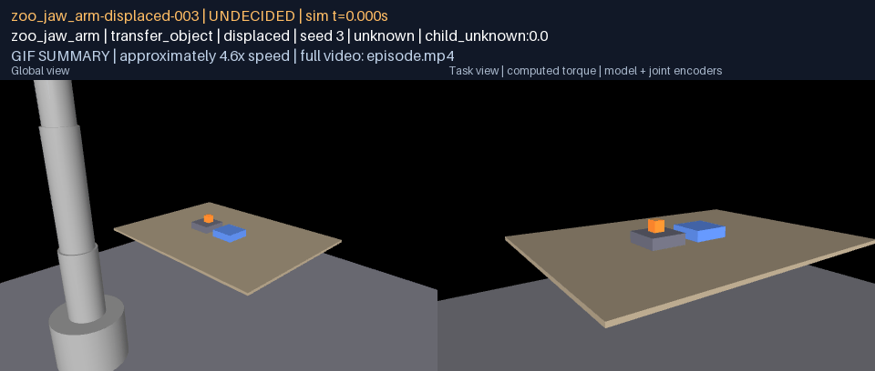 | [episode.mp4](g10-campaign/zoo_jaw_arm/displaced/seed-003/media/episode.mp4) | [frames.json](g10-campaign/zoo_jaw_arm/displaced/seed-003/media/frames.json) |
| zoo_jaw_arm-displaced-004 | `SUCCESS` | 1; [2] | 23.9 s | push at 1.50 s, moved 1.5 cm |  | [episode.mp4](g10-campaign/zoo_jaw_arm/displaced/seed-004/media/episode.mp4) | [frames.json](g10-campaign/zoo_jaw_arm/displaced/seed-004/media/frames.json) |
| zoo_jaw_arm-displaced-005 | `FAILURE` `child_failed:0.0` | 3; [3, 3, 3] | 25.7 s | push at 1.50 s, moved 0.9 cm |  | [episode.mp4](g10-campaign/zoo_jaw_arm/displaced/seed-005/media/episode.mp4) | [frames.json](g10-campaign/zoo_jaw_arm/displaced/seed-005/media/frames.json) |
| zoo_jaw_arm-displaced-006 | `SUCCESS` | 1; [2] | 23.9 s | push at 1.50 s, moved 0.6 cm |  | [episode.mp4](g10-campaign/zoo_jaw_arm/displaced/seed-006/media/episode.mp4) | [frames.json](g10-campaign/zoo_jaw_arm/displaced/seed-006/media/frames.json) |
| zoo_jaw_arm-displaced-007 | `FAILURE` `child_failed:0.0` | 3; [3, 3, 3] | 19.9 s | push at 1.50 s, moved 1.7 cm | 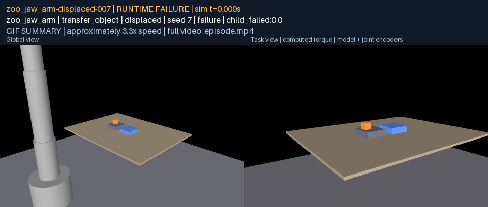 | [episode.mp4](g10-campaign/zoo_jaw_arm/displaced/seed-007/media/episode.mp4) | [frames.json](g10-campaign/zoo_jaw_arm/displaced/seed-007/media/frames.json) |
| zoo_jaw_arm-displaced-008 | `SUCCESS` | 1; [2] | 24.1 s | push at 1.50 s, moved 1.0 cm | 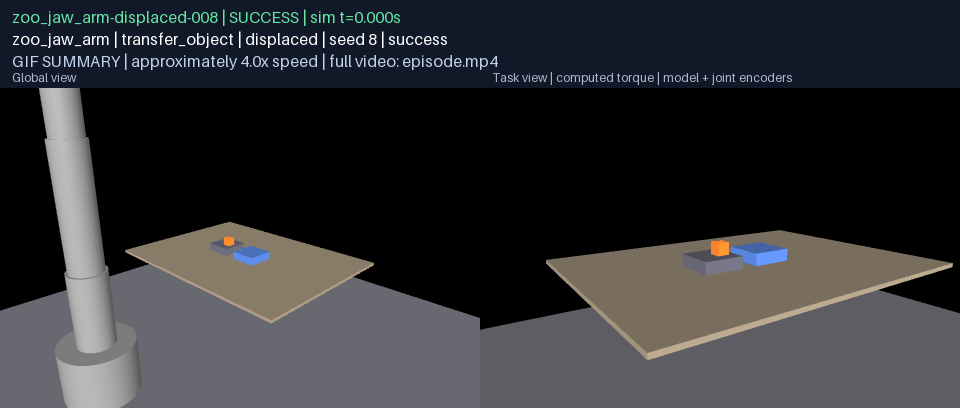 | [episode.mp4](g10-campaign/zoo_jaw_arm/displaced/seed-008/media/episode.mp4) | [frames.json](g10-campaign/zoo_jaw_arm/displaced/seed-008/media/frames.json) |
| zoo_jaw_arm-displaced-009 | `SUCCESS` | 1; [2] | 23.8 s | push at 1.50 s, moved 1.3 cm |  | [episode.mp4](g10-campaign/zoo_jaw_arm/displaced/seed-009/media/episode.mp4) | [frames.json](g10-campaign/zoo_jaw_arm/displaced/seed-009/media/frames.json) |
| zoo_jaw_arm-displaced-012 | `FAILURE` `child_failed:0.0` | 3; [3, 3, 3] | 20.0 s | push at 1.50 s, moved 1.0 cm | 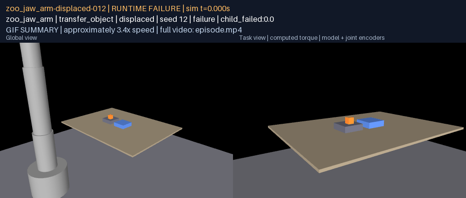 | [episode.mp4](g10-campaign/zoo_jaw_arm/displaced/seed-012/media/episode.mp4) | [frames.json](g10-campaign/zoo_jaw_arm/displaced/seed-012/media/frames.json) |
| zoo_jaw_arm-slip-000 | `UNKNOWN` `child_unknown:0.0` | 2; [1, 1] | 13.4 s | pull at 10.22 s, exit 2.27 m/s | 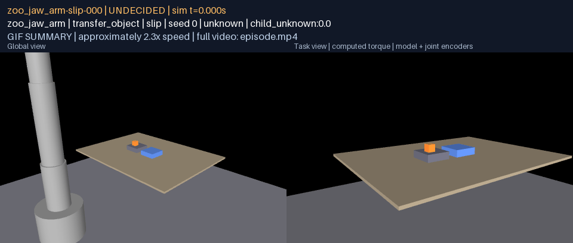 | [episode.mp4](g10-campaign/zoo_jaw_arm/slip/seed-000/media/episode.mp4) | [frames.json](g10-campaign/zoo_jaw_arm/slip/seed-000/media/frames.json) |
| zoo_jaw_arm-slip-001 | `SUCCESS` | 2; [1, 1] | 23.1 s | pull at 10.25 s, exit 2.72 m/s | 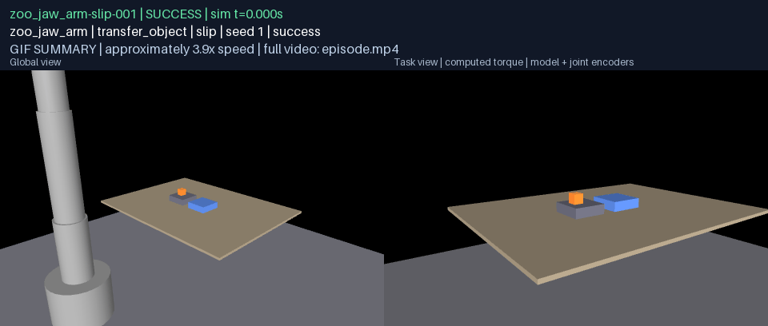 | [episode.mp4](g10-campaign/zoo_jaw_arm/slip/seed-001/media/episode.mp4) | [frames.json](g10-campaign/zoo_jaw_arm/slip/seed-001/media/frames.json) |
| zoo_jaw_arm-slip-002 | `SUCCESS` | 2; [1, 1] | 24.4 s | pull at 10.29 s, exit 3.22 m/s |  | [episode.mp4](g10-campaign/zoo_jaw_arm/slip/seed-002/media/episode.mp4) | [frames.json](g10-campaign/zoo_jaw_arm/slip/seed-002/media/frames.json) |
| zoo_jaw_arm-slip-003 | `SUCCESS` | 2; [1, 1] | 23.2 s | pull at 10.37 s, exit 2.24 m/s | 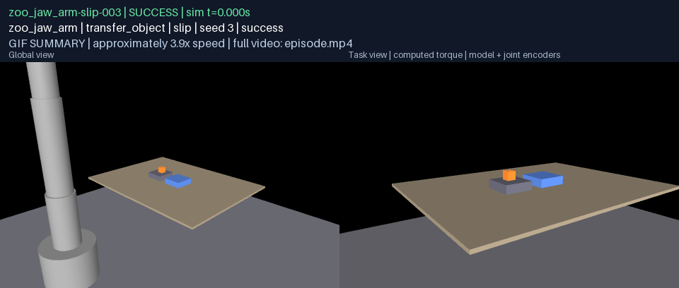 | [episode.mp4](g10-campaign/zoo_jaw_arm/slip/seed-003/media/episode.mp4) | [frames.json](g10-campaign/zoo_jaw_arm/slip/seed-003/media/frames.json) |
| zoo_jaw_arm-slip-004 | `SUCCESS` | 2; [1, 1] | 23.1 s | pull at 10.29 s, exit 2.35 m/s | 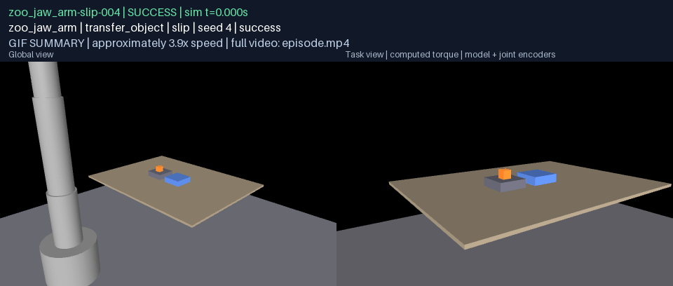 | [episode.mp4](g10-campaign/zoo_jaw_arm/slip/seed-004/media/episode.mp4) | [frames.json](g10-campaign/zoo_jaw_arm/slip/seed-004/media/frames.json) |
| zoo_jaw_arm-slip-005 | `SUCCESS` | 2; [1, 1] | 23.9 s | pull at 10.38 s, exit 2.05 m/s | 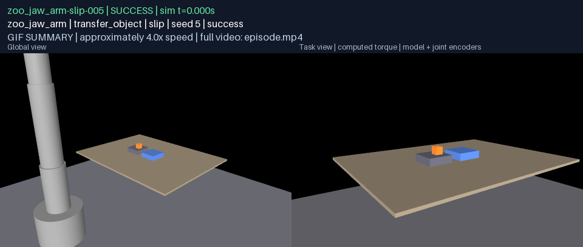 | [episode.mp4](g10-campaign/zoo_jaw_arm/slip/seed-005/media/episode.mp4) | [frames.json](g10-campaign/zoo_jaw_arm/slip/seed-005/media/frames.json) |
| zoo_jaw_arm-slip-010 | `FAILURE` `child_failed:0.0` | 3; [1, 3, 3] | 22.5 s | pull at 10.18 s, exit 2.76 m/s | 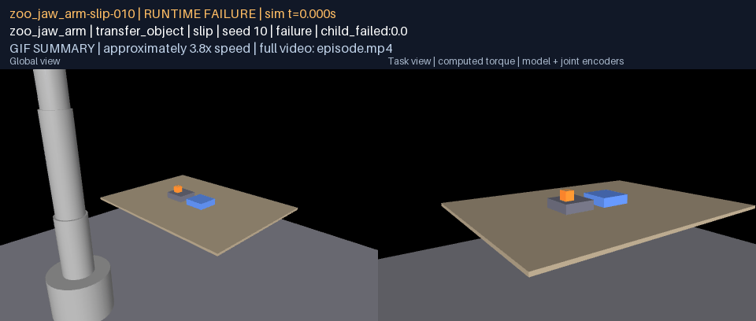 | [episode.mp4](g10-campaign/zoo_jaw_arm/slip/seed-010/media/episode.mp4) | [frames.json](g10-campaign/zoo_jaw_arm/slip/seed-010/media/frames.json) |
| zoo_jaw_arm-slip-012 | `FAILURE` `child_failed:0.0` | 3; [1, 3, 3] | 18.0 s | pull at 10.31 s, exit 2.87 m/s | 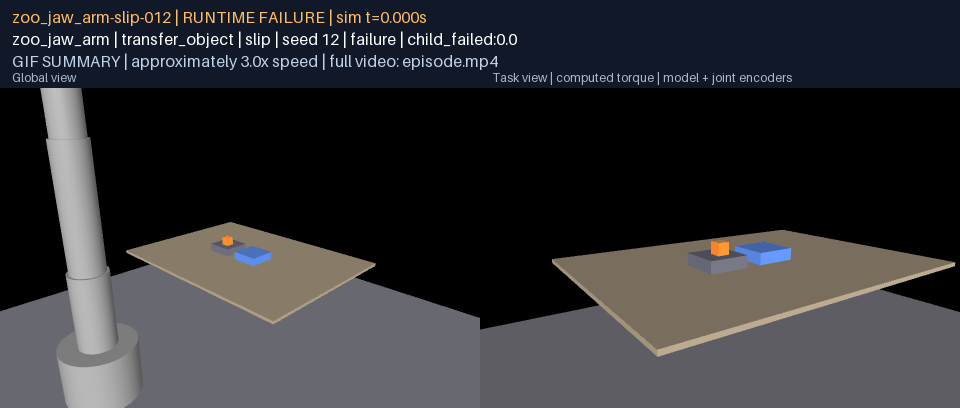 | [episode.mp4](g10-campaign/zoo_jaw_arm/slip/seed-012/media/episode.mp4) | [frames.json](g10-campaign/zoo_jaw_arm/slip/seed-012/media/frames.json) |
| zoo_jaw_arm-slip-016 | `UNKNOWN` `child_unknown:0.0` | 2; [1, 1] | 13.4 s | pull at 10.15 s, exit 1.87 m/s | 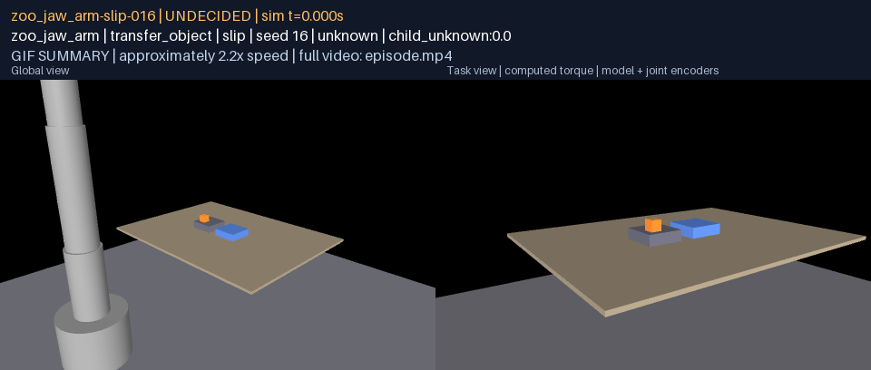 | [episode.mp4](g10-campaign/zoo_jaw_arm/slip/seed-016/media/episode.mp4) | [frames.json](g10-campaign/zoo_jaw_arm/slip/seed-016/media/frames.json) |
| zoo_jaw_arm-occlusion-000 | `SUCCESS` | 1; [1] | 18.5 s | occluder from 13.47 s for 3 s |  | [episode.mp4](g10-campaign/zoo_jaw_arm/occlusion/seed-000/media/episode.mp4) | [frames.json](g10-campaign/zoo_jaw_arm/occlusion/seed-000/media/frames.json) |
| zoo_jaw_arm-occlusion-001 | `SUCCESS` | 1; [1] | 18.5 s | occluder from 13.50 s for 3 s | 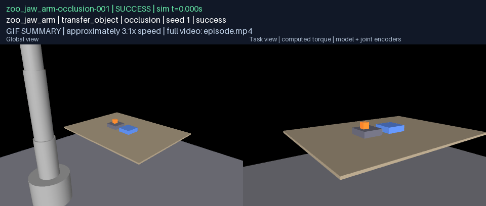 | [episode.mp4](g10-campaign/zoo_jaw_arm/occlusion/seed-001/media/episode.mp4) | [frames.json](g10-campaign/zoo_jaw_arm/occlusion/seed-001/media/frames.json) |
| zoo_jaw_arm-occlusion-002 | `SUCCESS` | 1; [1] | 18.5 s | occluder from 13.54 s for 3 s |  | [episode.mp4](g10-campaign/zoo_jaw_arm/occlusion/seed-002/media/episode.mp4) | [frames.json](g10-campaign/zoo_jaw_arm/occlusion/seed-002/media/frames.json) |
| zoo_jaw_arm-occlusion-003 | `SUCCESS` | 1; [1] | 18.6 s | occluder from 13.62 s for 3 s |  | [episode.mp4](g10-campaign/zoo_jaw_arm/occlusion/seed-003/media/episode.mp4) | [frames.json](g10-campaign/zoo_jaw_arm/occlusion/seed-003/media/frames.json) |
| zoo_jaw_arm-occlusion-004 | `SUCCESS` | 1; [1] | 18.5 s | occluder from 13.53 s for 3 s |  | [episode.mp4](g10-campaign/zoo_jaw_arm/occlusion/seed-004/media/episode.mp4) | [frames.json](g10-campaign/zoo_jaw_arm/occlusion/seed-004/media/frames.json) |
| zoo_long_arm-displaced-000 | `SUCCESS` | 1; [2] | 24.8 s | push at 1.50 s, moved 1.0 cm |  | [episode.mp4](g10-campaign/zoo_long_arm/displaced/seed-000/media/episode.mp4) | [frames.json](g10-campaign/zoo_long_arm/displaced/seed-000/media/frames.json) |
| zoo_long_arm-displaced-001 | `SUCCESS` | 1; [2] | 24.8 s | push at 1.50 s, moved 0.7 cm |  | [episode.mp4](g10-campaign/zoo_long_arm/displaced/seed-001/media/episode.mp4) | [frames.json](g10-campaign/zoo_long_arm/displaced/seed-001/media/frames.json) |
| zoo_long_arm-displaced-002 | `UNKNOWN` `child_unknown:0.0` | 1; [2] | 15.1 s | push at 1.50 s, moved 0.9 cm |  | [episode.mp4](g10-campaign/zoo_long_arm/displaced/seed-002/media/episode.mp4) | [frames.json](g10-campaign/zoo_long_arm/displaced/seed-002/media/frames.json) |
| zoo_long_arm-displaced-003 | `UNKNOWN` `child_unknown:0.0` | 1; [3] | 24.3 s | push at 1.50 s, moved 0.9 cm | 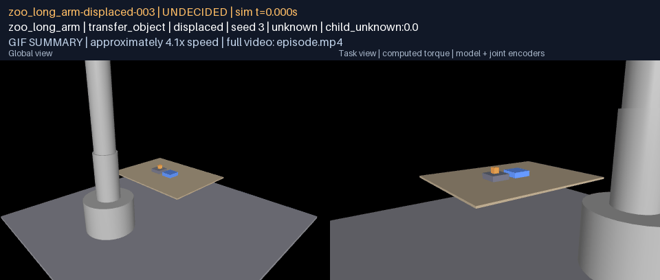 | [episode.mp4](g10-campaign/zoo_long_arm/displaced/seed-003/media/episode.mp4) | [frames.json](g10-campaign/zoo_long_arm/displaced/seed-003/media/frames.json) |
| zoo_long_arm-displaced-004 | `SUCCESS` | 1; [2] | 25.8 s | push at 1.50 s, moved 1.5 cm |  | [episode.mp4](g10-campaign/zoo_long_arm/displaced/seed-004/media/episode.mp4) | [frames.json](g10-campaign/zoo_long_arm/displaced/seed-004/media/frames.json) |
| zoo_long_arm-displaced-005 | `FAILURE` `child_failed:0.0` | 3; [3, 3, 3] | 20.8 s | push at 1.50 s, moved 0.9 cm | 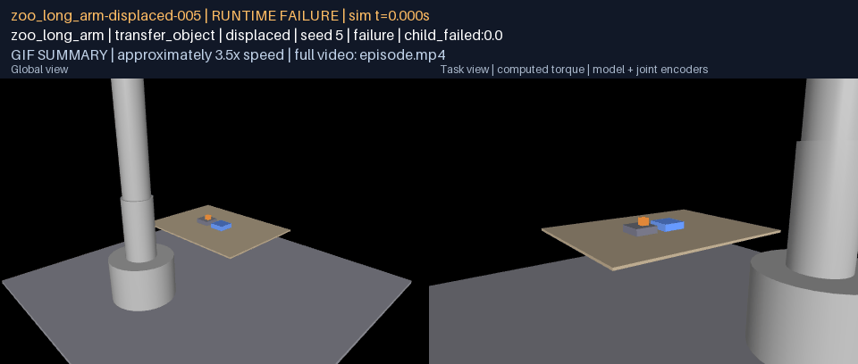 | [episode.mp4](g10-campaign/zoo_long_arm/displaced/seed-005/media/episode.mp4) | [frames.json](g10-campaign/zoo_long_arm/displaced/seed-005/media/frames.json) |
| zoo_long_arm-displaced-006 | `SUCCESS` | 1; [2] | 24.8 s | push at 1.50 s, moved 0.6 cm | 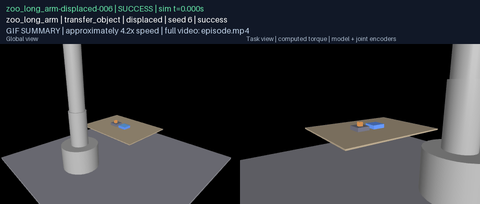 | [episode.mp4](g10-campaign/zoo_long_arm/displaced/seed-006/media/episode.mp4) | [frames.json](g10-campaign/zoo_long_arm/displaced/seed-006/media/frames.json) |
| zoo_long_arm-displaced-007 | `UNKNOWN` `child_unknown:0.0` | 1; [2] | 15.2 s | push at 1.50 s, moved 1.7 cm |  | [episode.mp4](g10-campaign/zoo_long_arm/displaced/seed-007/media/episode.mp4) | [frames.json](g10-campaign/zoo_long_arm/displaced/seed-007/media/frames.json) |
| zoo_long_arm-displaced-008 | `SUCCESS` | 1; [2] | 24.8 s | push at 1.50 s, moved 1.0 cm |  | [episode.mp4](g10-campaign/zoo_long_arm/displaced/seed-008/media/episode.mp4) | [frames.json](g10-campaign/zoo_long_arm/displaced/seed-008/media/frames.json) |
| zoo_long_arm-displaced-012 | `UNKNOWN` `child_unknown:0.0` | 1; [2] | 15.1 s | push at 1.50 s, moved 1.0 cm | 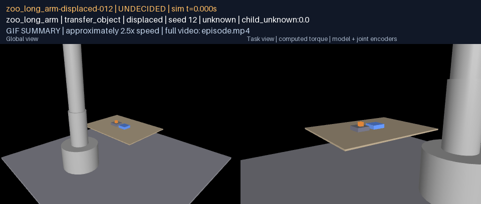 | [episode.mp4](g10-campaign/zoo_long_arm/displaced/seed-012/media/episode.mp4) | [frames.json](g10-campaign/zoo_long_arm/displaced/seed-012/media/frames.json) |
| zoo_long_arm-displaced-017 | `UNKNOWN` `child_unknown:0.0` | 1; [2] | 15.1 s | push at 1.50 s, moved 2.1 cm | 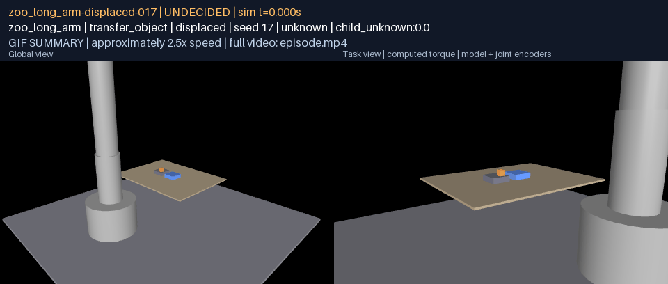 | [episode.mp4](g10-campaign/zoo_long_arm/displaced/seed-017/media/episode.mp4) | [frames.json](g10-campaign/zoo_long_arm/displaced/seed-017/media/frames.json) |
| zoo_long_arm-slip-000 | `SUCCESS` | 2; [1, 1] | 24.1 s | pull at 11.18 s, the object did not slide clear of the fingers within the allowance |  | [episode.mp4](g10-campaign/zoo_long_arm/slip/seed-000/media/episode.mp4) | [frames.json](g10-campaign/zoo_long_arm/slip/seed-000/media/frames.json) |
| zoo_long_arm-slip-001 | `SUCCESS` | 2; [1, 1] | 24.1 s | pull at 11.17 s, the object did not slide clear of the fingers within the allowance | 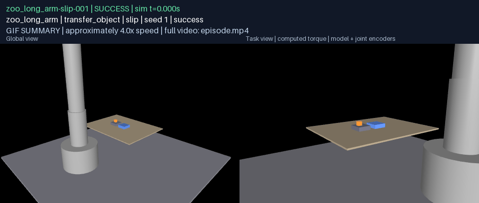 | [episode.mp4](g10-campaign/zoo_long_arm/slip/seed-001/media/episode.mp4) | [frames.json](g10-campaign/zoo_long_arm/slip/seed-001/media/frames.json) |
| zoo_long_arm-slip-002 | `SUCCESS` | 2; [1, 1] | 24.1 s | pull at 11.16 s, the object did not slide clear of the fingers within the allowance |  | [episode.mp4](g10-campaign/zoo_long_arm/slip/seed-002/media/episode.mp4) | [frames.json](g10-campaign/zoo_long_arm/slip/seed-002/media/frames.json) |
| zoo_long_arm-slip-003 | `UNKNOWN` `child_unknown:0.0` | 3; [1, 1, 1] | 24.1 s | pull at 11.14 s, exit 1.37 m/s | 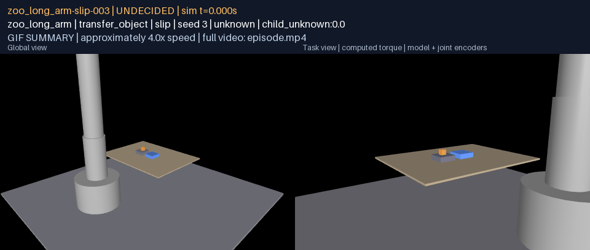 | [episode.mp4](g10-campaign/zoo_long_arm/slip/seed-003/media/episode.mp4) | [frames.json](g10-campaign/zoo_long_arm/slip/seed-003/media/frames.json) |
| zoo_long_arm-slip-004 | `SUCCESS` | 2; [1, 1] | 24.0 s | pull at 11.16 s, the object did not slide clear of the fingers within the allowance |  | [episode.mp4](g10-campaign/zoo_long_arm/slip/seed-004/media/episode.mp4) | [frames.json](g10-campaign/zoo_long_arm/slip/seed-004/media/frames.json) |
| zoo_long_arm-slip-005 | `SUCCESS` | 2; [1, 1] | 24.0 s | pull at 11.13 s, the object did not slide clear of the fingers within the allowance | 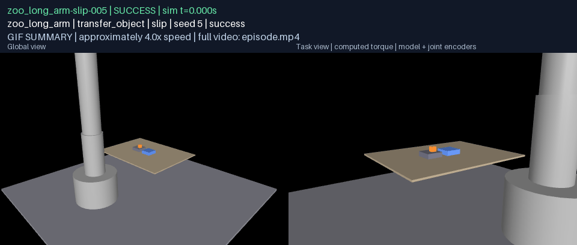 | [episode.mp4](g10-campaign/zoo_long_arm/slip/seed-005/media/episode.mp4) | [frames.json](g10-campaign/zoo_long_arm/slip/seed-005/media/frames.json) |
| zoo_long_arm-slip-018 | `UNKNOWN` `child_unknown:0.0` | 2; [1, 1] | 14.4 s | pull at 11.20 s, exit 1.67 m/s |  | [episode.mp4](g10-campaign/zoo_long_arm/slip/seed-018/media/episode.mp4) | [frames.json](g10-campaign/zoo_long_arm/slip/seed-018/media/frames.json) |
| zoo_long_arm-occlusion-000 | `SUCCESS` | 1; [1] | 19.4 s | occluder from 14.43 s for 3 s |  | [episode.mp4](g10-campaign/zoo_long_arm/occlusion/seed-000/media/episode.mp4) | [frames.json](g10-campaign/zoo_long_arm/occlusion/seed-000/media/frames.json) |
| zoo_long_arm-occlusion-001 | `SUCCESS` | 1; [1] | 19.4 s | occluder from 14.42 s for 3 s |  | [episode.mp4](g10-campaign/zoo_long_arm/occlusion/seed-001/media/episode.mp4) | [frames.json](g10-campaign/zoo_long_arm/occlusion/seed-001/media/frames.json) |
| zoo_long_arm-occlusion-002 | `SUCCESS` | 1; [1] | 19.4 s | occluder from 14.41 s for 3 s |  | [episode.mp4](g10-campaign/zoo_long_arm/occlusion/seed-002/media/episode.mp4) | [frames.json](g10-campaign/zoo_long_arm/occlusion/seed-002/media/frames.json) |
| zoo_long_arm-occlusion-003 | `SUCCESS` | 1; [1] | 19.4 s | occluder from 14.39 s for 3 s |  | [episode.mp4](g10-campaign/zoo_long_arm/occlusion/seed-003/media/episode.mp4) | [frames.json](g10-campaign/zoo_long_arm/occlusion/seed-003/media/frames.json) |
| zoo_long_arm-occlusion-004 | `SUCCESS` | 1; [1] | 19.4 s | occluder from 14.41 s for 3 s |  | [episode.mp4](g10-campaign/zoo_long_arm/occlusion/seed-004/media/episode.mp4) | [frames.json](g10-campaign/zoo_long_arm/occlusion/seed-004/media/frames.json) |

### Nominal episodes rendered in full

The first five successes per body and every failure; every one of the 100 per body keeps its row in `trials.json` with its leaf calls, verdict trail and oracle judgement.

| Episode | Verdict | Physics | Summary | Full episode | Frame map |
|---|---|---|---|---|---|
| zoo_dual_arm-nominal-000 | `SUCCESS` | 14.6 s |  | [episode.mp4](g10-campaign/zoo_dual_arm/nominal/seed-000/media/episode.mp4) | [frames.json](g10-campaign/zoo_dual_arm/nominal/seed-000/media/frames.json) |
| zoo_dual_arm-nominal-001 | `SUCCESS` | 21.6 s |  | [episode.mp4](g10-campaign/zoo_dual_arm/nominal/seed-001/media/episode.mp4) | [frames.json](g10-campaign/zoo_dual_arm/nominal/seed-001/media/frames.json) |
| zoo_dual_arm-nominal-002 | `SUCCESS` | 14.7 s | 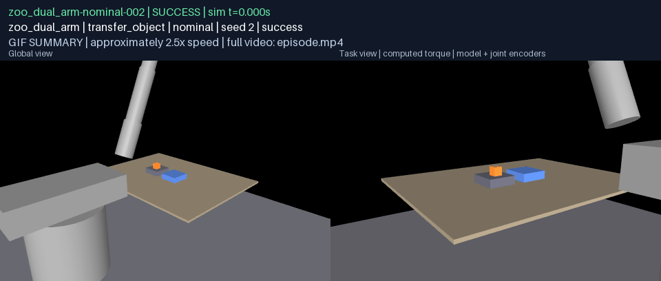 | [episode.mp4](g10-campaign/zoo_dual_arm/nominal/seed-002/media/episode.mp4) | [frames.json](g10-campaign/zoo_dual_arm/nominal/seed-002/media/frames.json) |
| zoo_dual_arm-nominal-003 | `SUCCESS` | 14.8 s | 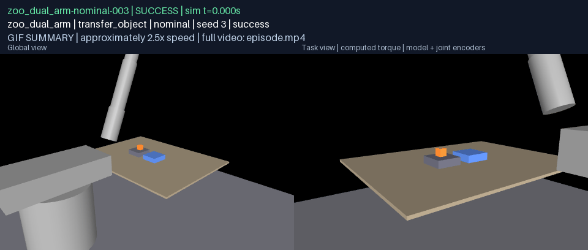 | [episode.mp4](g10-campaign/zoo_dual_arm/nominal/seed-003/media/episode.mp4) | [frames.json](g10-campaign/zoo_dual_arm/nominal/seed-003/media/frames.json) |
| zoo_dual_arm-nominal-004 | `SUCCESS` | 14.7 s |  | [episode.mp4](g10-campaign/zoo_dual_arm/nominal/seed-004/media/episode.mp4) | [frames.json](g10-campaign/zoo_dual_arm/nominal/seed-004/media/frames.json) |
| zoo_dual_arm-nominal-023 | `UNKNOWN` `child_unknown:0.0` | 14.1 s | 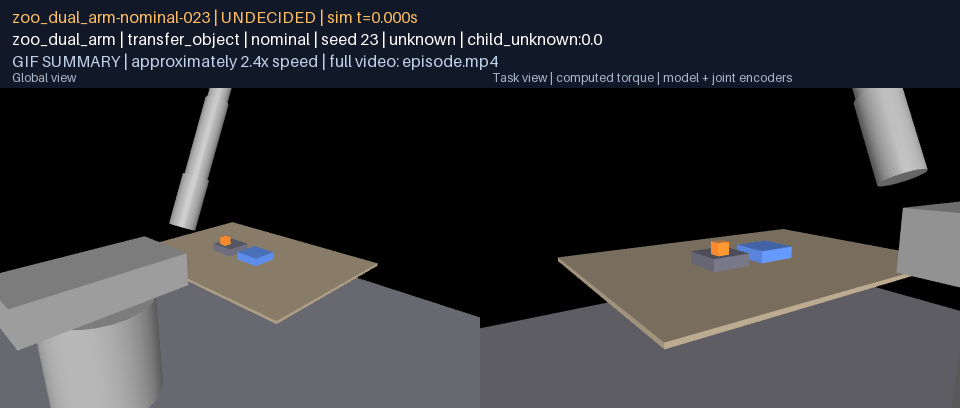 | [episode.mp4](g10-campaign/zoo_dual_arm/nominal/seed-023/media/episode.mp4) | [frames.json](g10-campaign/zoo_dual_arm/nominal/seed-023/media/frames.json) |
| zoo_dual_arm-nominal-041 | `UNKNOWN` `child_unknown:0.0` | 14.5 s | 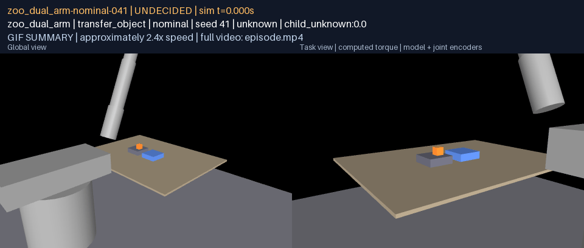 | [episode.mp4](g10-campaign/zoo_dual_arm/nominal/seed-041/media/episode.mp4) | [frames.json](g10-campaign/zoo_dual_arm/nominal/seed-041/media/frames.json) |
| zoo_dual_arm-nominal-053 | `FAILURE` `child_failed:0.0` | 19.9 s |  | [episode.mp4](g10-campaign/zoo_dual_arm/nominal/seed-053/media/episode.mp4) | [frames.json](g10-campaign/zoo_dual_arm/nominal/seed-053/media/frames.json) |
| zoo_dual_arm-nominal-056 | `UNKNOWN` `child_unknown:0.0` | 14.3 s | 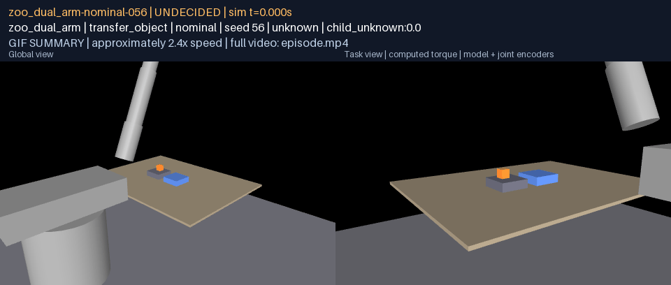 | [episode.mp4](g10-campaign/zoo_dual_arm/nominal/seed-056/media/episode.mp4) | [frames.json](g10-campaign/zoo_dual_arm/nominal/seed-056/media/frames.json) |
| zoo_dual_arm-nominal-068 | `FAILURE` `child_failed:0.0` | 20.0 s |  | [episode.mp4](g10-campaign/zoo_dual_arm/nominal/seed-068/media/episode.mp4) | [frames.json](g10-campaign/zoo_dual_arm/nominal/seed-068/media/frames.json) |
| zoo_dual_arm-nominal-080 | `UNKNOWN` `child_unknown:0.0` | 21.4 s | 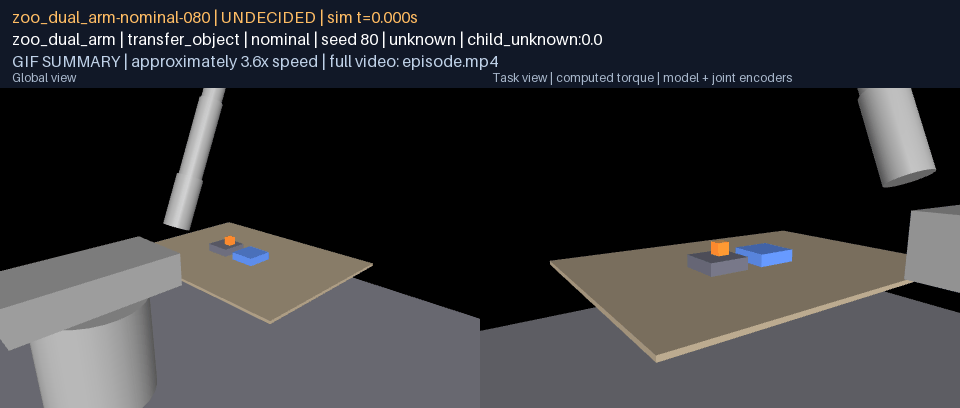 | [episode.mp4](g10-campaign/zoo_dual_arm/nominal/seed-080/media/episode.mp4) | [frames.json](g10-campaign/zoo_dual_arm/nominal/seed-080/media/frames.json) |
| zoo_jaw_arm-nominal-000 | `SUCCESS` | 15.5 s | 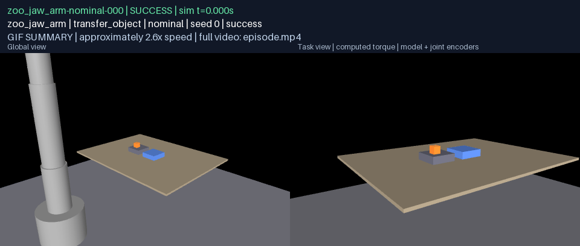 | [episode.mp4](g10-campaign/zoo_jaw_arm/nominal/seed-000/media/episode.mp4) | [frames.json](g10-campaign/zoo_jaw_arm/nominal/seed-000/media/frames.json) |
| zoo_jaw_arm-nominal-001 | `SUCCESS` | 15.5 s |  | [episode.mp4](g10-campaign/zoo_jaw_arm/nominal/seed-001/media/episode.mp4) | [frames.json](g10-campaign/zoo_jaw_arm/nominal/seed-001/media/frames.json) |
| zoo_jaw_arm-nominal-002 | `SUCCESS` | 15.5 s | 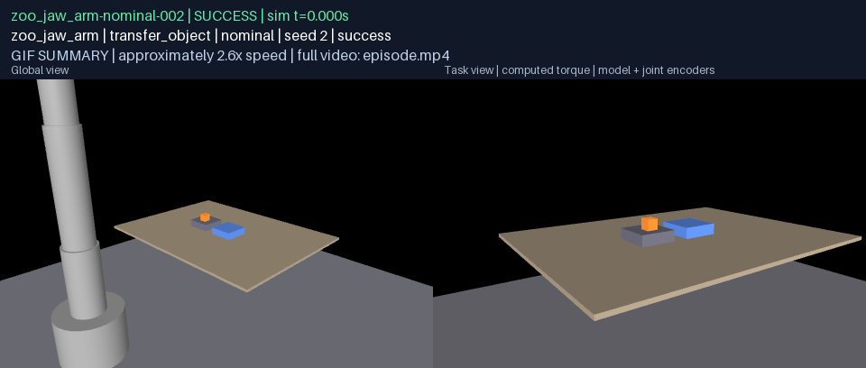 | [episode.mp4](g10-campaign/zoo_jaw_arm/nominal/seed-002/media/episode.mp4) | [frames.json](g10-campaign/zoo_jaw_arm/nominal/seed-002/media/frames.json) |
| zoo_jaw_arm-nominal-003 | `SUCCESS` | 28.4 s |  | [episode.mp4](g10-campaign/zoo_jaw_arm/nominal/seed-003/media/episode.mp4) | [frames.json](g10-campaign/zoo_jaw_arm/nominal/seed-003/media/frames.json) |
| zoo_jaw_arm-nominal-004 | `SUCCESS` | 15.5 s |  | [episode.mp4](g10-campaign/zoo_jaw_arm/nominal/seed-004/media/episode.mp4) | [frames.json](g10-campaign/zoo_jaw_arm/nominal/seed-004/media/frames.json) |
| zoo_long_arm-nominal-000 | `SUCCESS` | 16.4 s |  | [episode.mp4](g10-campaign/zoo_long_arm/nominal/seed-000/media/episode.mp4) | [frames.json](g10-campaign/zoo_long_arm/nominal/seed-000/media/frames.json) |
| zoo_long_arm-nominal-001 | `SUCCESS` | 16.4 s |  | [episode.mp4](g10-campaign/zoo_long_arm/nominal/seed-001/media/episode.mp4) | [frames.json](g10-campaign/zoo_long_arm/nominal/seed-001/media/frames.json) |
| zoo_long_arm-nominal-002 | `SUCCESS` | 16.4 s |  | [episode.mp4](g10-campaign/zoo_long_arm/nominal/seed-002/media/episode.mp4) | [frames.json](g10-campaign/zoo_long_arm/nominal/seed-002/media/frames.json) |
| zoo_long_arm-nominal-003 | `SUCCESS` | 16.4 s |  | [episode.mp4](g10-campaign/zoo_long_arm/nominal/seed-003/media/episode.mp4) | [frames.json](g10-campaign/zoo_long_arm/nominal/seed-003/media/frames.json) |
| zoo_long_arm-nominal-004 | `SUCCESS` | 16.4 s |  | [episode.mp4](g10-campaign/zoo_long_arm/nominal/seed-004/media/episode.mp4) | [frames.json](g10-campaign/zoo_long_arm/nominal/seed-004/media/frames.json) |

## Tests

| Suite | Tests | Failures | Errors | Skipped |
|---|---|---|---|---|
| core | 358 | 0 | 0 | 2 |
| any-robot | 445 | 0 | 0 | 5 |
| exotic | 10 | 0 | 0 | 0 |

New: 3 in core (`test_skills_transfer_object_library.py`: the tree's shape, every loop bounded at three, the root's cap, every verification an observation) and 6 physics-bound in any-robot (`test_general_transfer_object.py`: a nominal, a slip and an occlusion episode of the jaw arm; completion only on sensor verdicts, planning to the sensed position, the carry stopped by a lost hold, an occluded verification undecided then decided, one replayable record per episode with the object's motion continuous, predicates false rather than unknown before evidence).

## Files

- `core/src/rigby_core/skills/examples.py`: `transfer_object_library`.
- `any-robot/src/rigby_general/skills/transfer_object.py`: the session, the runtime, the disturbances, the world's floor and occluder; `any-robot/src/rigby_general/sensing/live.py`: the sensors sampled live.
- `any-robot/assets/general/research-protocols/g10-transfer-v1/`: `environment.json`, `library.json`, `corpus.json`, `registration.json`.
- `docs/results/g10-campaign/`: `trials.json` (every episode), `summary.json`, `provenance.json`, and the rendered media of every disturbed episode, every failure and the first five nominal successes per body; the replayable bundles live in the local results tree (`any-robot/results/g10-campaign`, untracked) and are named by digest in the rows.
- `docs/results/g10-d10/`: the three-body tile and the six recovery overlays with their `frames.json` and `trail.json`.
- `docs/results/verify_g10.py`, `docs/results/g10-validation.json`.
