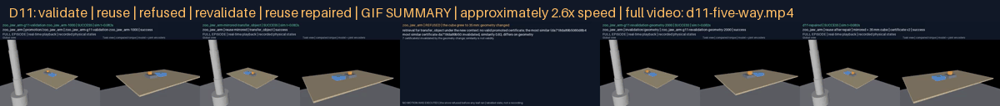

# G11 — Promote, retrieve and reuse skills with validity conditions

**Status:** A01, A03 and A04 verified; A02 verified on the 2 bodies that hold a promoted TransferObject certificate (jaw arm, long arm) and not on the dual arm, whose transfer stays an unpromoted candidate; D11 delivered. A versioned store of 12 certificates over 3 bodies and 3 skills, 21 reuse runs from persisted storage in three new layouts, five context changes each invalidating and revalidating on its own, 18 restarts at every leaf boundary with 18 completions. No API or model calls. Verify with `python docs/results/verify_g11.py --replay`.

## What this goal asked

Promote a candidate only after an independent validation set passes, storing its definition, its body, controller and sensor context, its cost and its evidence hashes; execute the same TransferObject and at least two subskills from persisted storage on three new object or layout instances per enabled body with no manual edits, logging cache reuse; change geometry, controller, sensors, friction assumptions and the evidence schema in separate tests and invalidate or revalidate every affected certificate; interrupt and restart at ten or more safe boundaries, reconstruct the state from observations and complete or stop explicitly, treating retrieval similarity as no proof of validity. D11: learn and validate once, reuse in a new layout, invalidate and repair after a physical-context change.

## What was built

**A neutral store of certificates.** `rigby_core.skills.store`: a certificate binds one skill definition of one library (both by content digest) to an `ExecutionContextV1` of six facets, one per dimension the catalog names (body, controller, sensors, geometry, friction assumption, evidence schema), each a name for people and a digest for the check, plus the ranges the certificate claims to cover and, on a query, the values a run brings. `compare` is exact on every facet and inside every range; it also reports a similarity (the fraction of facets that match), which retrieval uses to rank and never to decide: `retrieve` returns every certificate of the skill with its verdict and chooses the most similar certificate that is both promoted and valid, or none. `promote` is a gate: it refuses a validation set that does not name every development set it is independent of, an outcome under the threshold, and any false completion, keeping such candidates as candidates with the reason attached. `invalidate(dimension, facet)` marks every promoted certificate whose facet differs, naming the dimension; `revalidate` issues a superseding version under the new context only when that version's own validation passes, and records a failed revalidation in the history. The store persists as one index file, one file per certificate and one per library, and loads back to the same hash.

**Restart from observation.** `rigby_core.skills.restart`: a safe boundary is the instant a leaf returns, where the executor checks its interrupt; a `CheckpointingRuntime` wraps a body's runtime, writes a checkpoint after the requested leaf (the completed leaves, the belief for the record, the clock, and the world state the runtime hands over) and requests the interrupt. A restart never resumes: a fresh executor with an empty belief lets the runtime look at the world and runs the tree from its root.

**Bound to bodies.** `rigby_general.skills.skill_store` computes the six facets from a TransferObject session as it stands (the manifest's digest; the computed-torque and closure configurations the leaves actually run with, now threaded through `attempt_transfer`, `track` and `joint_move`; the sensor configuration and policy the conditionals were bound with; the object's size and every fixture's size and height; the friction assumption; the episode protocol and record versions), draws validation sets by the G06 rule from a generator seeded apart over seeds no development set used, authors the three layouts, and restarts a session on a checkpoint's full integration state: the closure is read as engaged or not from the contact the object exerts on the members, the arm holds still for the observation window while the declared sensors sample, and the same conditionals every verification uses decide held, placed and reachable. Nothing from the checkpoint's belief is copied.

## Registered protocol

`g11-skill-store-v1` (registration `8c9701398879`): per body an independent validation set of 12 episodes (seeds 1000-1011, threshold 11, no false completion, independent of the G10 development seeds 0-99 and the G06 roster); per change a revalidation set of 6 (seeds 2000-2005, threshold 5) on the jaw arm; three layouts inside the claimed ranges (the platform six centimetres further; the bench and platform mirrored; the bench five centimetres nearer, the platform four to the right, the cube a third heavier and a tenth slicker); five changes, one per dimension; six leaf boundaries on every body.

## Results

### A01 — promotion only after an independent set passes

| Body | transfer_object | acquire_until_held | observe_object | Undecided | Failed | False completions | Physics |
|---|---|---|---|---|---|---|---|
| zoo_dual_arm | 10/12 → **candidate** | candidate | promoted | 2 | 0 | 0 | 186 s |
| zoo_jaw_arm | 12/12 → **promoted** | promoted | promoted | 0 | 0 | 0 | 187 s |
| zoo_long_arm | 12/12 → **promoted** | promoted | promoted | 0 | 0 | 0 | 197 s |

The dual arm's transfer passed 10/12 against a threshold of 11 and stays a candidate: in 2 episodes the closure flung the cube during the first acquisition (the ejection G10 recorded as open) and the re-observation found it moving or hidden from the front camera within its budget, so the tree ended undecided rather than guessing. `observe_object` passed on every body. Neither the two saved successes nor the ten of twelve promote it; the certificate is stored as a candidate with the outcome attached.

Every certificate stores the definition and library digests, the six-facet context, the validation outcome with the digests of every sealed bundle it rests on and of every row, and the cost (physics seconds, wall seconds, episodes, zero generation calls). The persisted store (`any-robot/assets/general/skill-store-v1`) holds 12 certificates: 3 promoted, 2 candidate, 4 invalidated, 3 superseded, over 41 recorded decisions.

### A02 — reuse from persisted storage in three new layouts

The store was loaded from disk and queried with the context each session actually stood in: 27 queries (3 bodies × 3 layouts × 3 skills), 21 served by a promoted, valid certificate and executed from the persisted library, 6 refused typed for want of one. 21/21 executed runs succeeded, 0 false completions. Each hit skipped the certificate's validation episodes (252 in all), which is the cache's whole value, and the log records it.

| Body | Executed (successes) | Refused |
|---|---|---|
| zoo_dual_arm | 3 (3) | mirrored/acquire_until_held, mirrored/transfer_object, near_heavy/acquire_until_held, near_heavy/transfer_object, platform_far/acquire_until_held, platform_far/transfer_object |
| zoo_jaw_arm | 9 (9) | none |
| zoo_long_arm | 9 (9) | none |

Per skill: `transfer_object` 6/6; `acquire_until_held` 6/6; `observe_object` 9/9. Every retrieval trace is in `reuse.json` with every candidate's similarity and exact verdict; `verify_g11.py` recomputes each from the certificate's context and the run's query.

### A03 — five changes, each invalidating and revalidating on its own

| Change | Declared | Certificates invalidated | Revalidation on the jaw arm | Result |
|---|---|---|---|---|
| controller | the arm's computed-torque tracking runs at half its natural frequency (7 Hz instead of 14 Hz), damping ratio unchanged | 7 | 6/6 (threshold 5) | version 2 promoted, supersedes version 1 |
| evidence_schema | the episode protocol is bumped to /2; nothing physical changes | 7 | 6/6 (threshold 5) | version 2 promoted, supersedes version 1 |
| friction | the friction assumption drops to 0.5-0.9 and the revalidation cubes are drawn at half the registered friction | 7 | 0/6 (threshold 5) | version 2 stays a candidate; version 1 stays invalidated |
| geometry | the cube grows from 30 mm to 35 mm a side, its mass with its volume; every fixture as it was | 7 | 6/6 (threshold 5) | version 2 promoted, supersedes version 1 |
| sensors | the overhead camera is removed: the front camera and the gripper's contact sensor alone | 7 | 6/6 (threshold 5) | version 2 promoted, supersedes version 1 |

Each change was applied to its own copy of the promoted store from the same baseline and saved beside its rows (`invalidation/<change>/store`); under the new context retrieval returned nothing until the revalidation passed, and under the old context it returns nothing after, since an invalidated certificate is not served. The geometry change was also applied to the persisted store, which is D11's physical-context change: the jaw arm's transfer is at version 2 there and the other bodies' certificates stay invalidated until they are revalidated.

### A04 — interrupt and restart at every leaf boundary

18 restarts (3 bodies × 6 boundaries): 18 completed the transfer after the restart, 0 stopped explicitly. In 9 restarts the hold was reconstructed from the contact and the cameras and the acquisition was not repeated; in 6 the placement was reconstructed and the tree completed before any leaf ran. The physics clock continues across every boundary; both halves are sealed and replay.

| Body | Completed / restarts |
|---|---|
| zoo_dual_arm | 6 / 6 |
| zoo_jaw_arm | 6 / 6 |
| zoo_long_arm | 6 / 6 |

## D11

Left to right: the jaw arm's validation episode that promoted transfer_object; the skill reused from the persisted store in the mirrored layout; the retrieval refused after the cube grew to 35 mm, with the differing dimension named and the most similar certificate's similarity shown beside its invalid verdict; the revalidation episode under the grown cube that issued version 2; the repaired skill reused again in the mirrored layout with the grown cube, retrieved as version 2. Every panel but the refusal is a sealed episode rendered from recorded states at real-time playback; the refusal is a labelled slate, since nothing ran.

[d11-five-way.mp4](g11-d11/d11-five-way.mp4) · [frames map](g11-d11/d11-five-way-frames.json)

| Panel | What it shows | Clip |
|---|---|---|
| 1 validate once | validation episode zoo_jaw_arm-g11-validation-zoo_jaw_arm-1000: success; the set passed 12/12 (threshold 11); certificate da718da89b50 v1 promoted | [mp4](g11-d11/validate/episode.mp4) · [frames](g11-d11/validate/frames.json) |
| 2 reuse in the mirrored layout | retrieved da718da89b50 v1 (12 validation episodes not re-run); success | [mp4](g11-d11/reuse/episode.mp4) · [frames](g11-d11/reuse/frames.json) |
| 3 invalidated: retrieval refused | no valid promoted certificate; the most similar (da718da89b5060d8b4ffb781bae6307b, invalidated, similarity 0.83) differs on geometry | [mp4](g11-d11/refused/refused.mp4) (slate) |
| 4 revalidate under the grown cube | revalidation zoo_jaw_arm-g11-revalidation-geometry-2000: success; the set passed 6/6 (threshold 5); certificate cb0e66bfec19 v2 promoted | [mp4](g11-d11/revalidate/episode.mp4) · [frames](g11-d11/revalidate/frames.json) |
| 5 reuse again, repaired | retrieved cb0e66bfec19 v2; success | [mp4](g11-d11/repaired/media/episode.mp4) · [frames](g11-d11/repaired/media/frames.json) |

## Evidence and media

`docs/results/g11-store/promotion.json`, `reuse.json`, `invalidation.json`, `restart.json` carry every row with its leaf calls, verdict trail, oracle judgement and, where sealed, the bundle and media digests. Every failed or undecided episode and the first two successes per set are sealed (local, `any-robot/results/g11-store`) and rendered in full under `docs/results/g11-store` with the simulation clock and the tree's verdict in the banner; every reuse run and every restart's second half is rendered, and the jaw arm's first halves too. All MP4s are registered in `demos/registry`.

## Findings

1. **Promotion refused the dual arm, correctly.** Ten of twelve is a good number and not the threshold; the two undecided episodes trace to the closure ejection G10 left open, and the store holds the candidate with that outcome rather than a certificate. Reuse then refused the dual arm's transfer and acquisition in every layout, typed, while running its observation, which was promoted.

2. **Similarity is visible and inert.** Every refused retrieval lists the most similar certificate, its similarity and the exact facet or range it differs on; none was chosen on that account. The tests pin it: a certificate five facets in six similar is not served.

3. **A restart that trusts nothing completes anyway.** With an empty belief and the sensors alone, the restarted tree skipped the acquisition when the contact and the cameras showed the cube held, and finished before any leaf ran when they showed it placed; the clock never reset.

4. **Invalidation is by dimension, not by body.** Every one of the five changes invalidated all seven promoted certificates, because a controller configuration, a sensor configuration, a friction assumption, an object size or an evidence schema is shared by every body that was certified under it; only the jaw arm's were revalidated here, and the rest stay invalidated on record until they are. A certificate is conditioned on the value, not on who ran under it.

## Tests

`core/tests/test_skills_store.py` (24): promotion refused on a failing outcome, a false completion, a dependent set and a missing library; exact comparison with similarity as a ranking only; each of the six dimensions invalidating only the certificates that differ; revalidation issuing a superseding version only on a pass; disk round-trip; safe boundaries; a checkpoint after each leaf and a restart that completes, or stops explicitly with nothing to see. `any-robot/tests/test_general_skill_store.py` (5): the goal drawn around a moved platform reproduces the registered G06 goal; the layouts stay inside the claimed ranges; each facet changes with what the session runs with and nothing else; validation sets reproducible and disjoint; on physics, the tree interrupted after the grasp restarts in a fresh session that reconstructs the hold and finishes.

