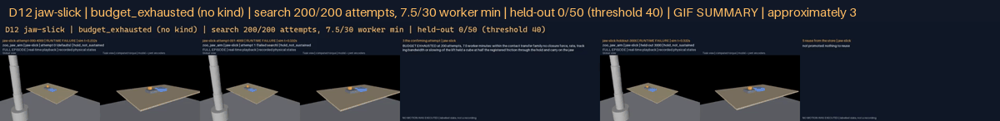
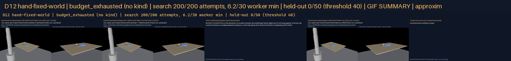
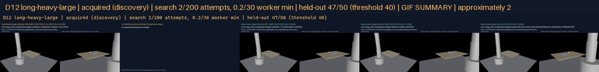

# G12 — Acquire missing motor skills within a bounded search budget

**Status:** research goal. A01, A02 and A04 verified; A03 met on long-heavy-large and not on jaw-slick, hand-fixed-world; D12 delivered. `jaw-slick` budget_exhausted, held-out 0/50; `hand-fixed-world` budget_exhausted, held-out 0/50; `long-heavy-large` acquired (discovery), held-out 47/50. Ledger separation: discovery ['long-heavy-large']; instantiation none; unsupported hypothesis ['jaw-slick', 'hand-fixed-world']; composition none posed. No API or model calls; zero manual trajectory edits. Verify with `python docs/results/verify_g12.py --replay`.

## What this goal asked

Freeze three acquisition problems in at least two body families before any search, at least one needing new contact timing, trajectory or controller parameters rather than a new sequence or a rename; starting without a validated implementation, synthesize one through simulation and optimization and store its contract, within 200 attempts or 30 simulator-worker minutes per problem; evaluate on 50 unseen perturbation trials per body and problem with at least 40 succeeding under every hard gate and zero manual trajectory edits; separate instantiation, composition and motor-skill discovery in the ledger, an unsupported discovery hypothesis being a valid result but not a capability pass. D12: missing skill, failed attempts, acquired execution, reuse, with the search budget and an uninterrupted final trial.

## What was built

**A bounded search with an honest classification.** `rigby_core.skills.acquisition`: an `AcquisitionProblemV1` freezes the effect wanted, the body and family, the world change that defeats the existing implementation, the admissible controller family and its parameters with bounds and defaults, the development and confirmation draws the search may see, the held-out acceptance it may not, and the ceiling. `EvolutionSearch` is a seeded (1+λ) evolution strategy in the unit cube of the parameters, log-scaled where a parameter spans orders of magnitude; attempt 0 is always the defaults, so the first question is whether search is needed at all; the step stays wide while the objective is a plateau and narrows only after something has beaten the defaults. `classify` names what was found: an instantiation when the defaults passed and nothing moved, a discovery when a searched vector passed the acceptance test, budget exhausted or acceptance failed otherwise, with a hypothesis about the limiting capability. The whole search replays from its provenance and the attempts' digest.

**Bound to the transfer.** The contact transfer now takes a `ClosureConfig` and a `duration_scale` beside its `ControllerConfig` (threaded through `attempt_transfer`, `track`, `joint_move` and the session), so the family the search moves in is exactly: how the closure advances, detects contact and squeezes; how the arm tracks; how much slower than the declared joint speeds the moving phases run. Every evaluation is the G06 primitive single-shot with every hard gate on, no retry and no observation loop, so a parameter's quality cannot hide behind a second attempt. A held-out trial is sealed in the G06 single-transfer layout under goal G12 and replays. An acquired or instantiated vector is promoted into the persisted G11 store as a certificate whose controller facet carries it, on the held-out outcome as its independent validation, and reused from the store in a new layout.

## The frozen problems

`g12-acquisition-v1` (registration `6e72ee93825d`), registered before any search: development draws 4000-4001 with confirmation 4002-4003, fifty held-out draws 3000-3049 (the G06 rule from a generator seeded apart, independent of every development set through G11), threshold 40, ceiling 200 attempts or 30 simulator-worker minutes, search seed 20261212.

| Problem | Body (family) | World change | Hypothesis |
|---|---|---|---|
| `jaw-slick` | zoo_jaw_arm (single-arm jaw gripper) | the cube at half its registered friction (0.7 against 1.4): the G11 friction revalidation failed 0/6 with the implementation as it stands | discovery |
| `hand-fixed-world` | zoo_hand_arm (multifinger hand) | none: the registered fixed world, in which G06 recorded the hand failing all 100 seeds (94 hold_not_sustained, 6 object_not_lifted) with the fingertip pinch losing the cube as the lift decelerates | discovery |
| `long-heavy-large` | zoo_long_arm (single-arm long-reach jaw gripper) | the cube grown to 35 mm a side and made half again heavier than its volume would make it (about 20.6 g against 8.6 g) | instantiation |

Parameters searched (bounds, defaults): `closure.grip_safety_factor` [10, 400] default 80 (log); `closure.closing_force_fraction` [0.03, 0.4] default 0.12; `closure.actuator_ceiling_fraction` [0.2, 0.9] default 0.5; `closure.closure_rate_per_s` [0.1, 1] default 0.55; `closure.hold_duration_s` [0.1, 0.5] default 0.15; `arm.natural_frequency_hz` [5, 25] default 14; `duration_scale` [1, 4] default 1.

## Results

| Problem | Attempts | Worker min | Best attempt | Held-out | Outcome | Parameters moved |
|---|---|---|---|---|---|---|
| `jaw-slick` | 200/200 | 7.5/30 | 0 | 0/50 (not accepted) | **budget_exhausted** (no kind) | none |
| `hand-fixed-world` | 200/200 | 6.2/30 | 0 | 0/50 (not accepted) | **budget_exhausted** (no kind) | none |
| `long-heavy-large` | 2/200 | 0.2/30 | 1 | 47/50 (accepted) | **acquired** (discovery) | closure.grip_safety_factor, closure.actuator_ceiling_fraction, closure.hold_duration_s, arm.natural_frequency_hz |

### `jaw-slick`

The search exhausted its ceiling (200 attempts, 7.5 worker minutes; stopped on attempts) without a vector certifying the development draws; over the search the development episodes failed as hold_not_sustained 169, object_not_lifted 31; the best attempt certified 0 of 2. The settled vector, the defaults, certified 0/50 held-out trials (failures: hold_not_sustained 47, object_not_lifted 3). Reported as an unsupported discovery hypothesis, not a capability: Within the contact transfer family no closure force, rate, tracking bandwidth or slowing of the lift held a cube at half the registered friction through the hold and carry on the jaw arm.

### `hand-fixed-world`

The search exhausted its ceiling (200 attempts, 6.2 worker minutes; stopped on attempts) without a vector certifying the development draws; over the search the development episodes failed as hold_not_sustained 149, object_not_lifted 48, grasp_not_achieved 2, object_not_carried 1; the best attempt certified 0 of 2. The settled vector, the defaults, certified 0/50 held-out trials (failures: hold_not_sustained 43, object_not_lifted 7). Reported as an unsupported discovery hypothesis, not a capability: The multifinger hand's digits are 47 mm long against a 30 mm cube and its closure is a single-parameter squeeze, so the only grasp that clears the bench is a fingertip pinch; within the contact transfer family no closure force, rate, tracking bandwidth or slowing of the lift gave that pinch a margin against the load of the lift. A wrap grasp, a compliant pad or a two-parameter closure is a different primitive, not a retuned one.

### `long-heavy-large`

The defaults failed (object_not_lifted on the first development draw). The search confirmed attempt 1 after 2 attempts and 0.2 worker minutes; the settled vector moved `grip_safety_factor` 80 → 109, `actuator_ceiling_fraction` 0.5 → 0.408, `hold_duration_s` 0.15 → 0.128, `natural_frequency_hz` 14 → 17.1. On the fifty held-out draws it certified 47/50 against a threshold of 40; failures: hold_not_sustained 2, object_not_lifted 1. Recorded as a discovery of new contact and timing parameters within the transfer family; certificate `e7329b941d20` promoted into the store on the held-out outcome and reused in the mirrored layout (success).

## D12

One row per problem, left to right: the defaults failing in the problem's world (the missing skill); a searched attempt that failed; the attempt that confirmed; one held-out trial run uninterrupted with the settled vector; the transfer tree reused from the persisted store in the mirrored layout. Where the budget ran out or nothing was promoted the panel is a labelled slate. The strip above each row names the search budget used of the ceiling, the held-out score and what was found.

**`jaw-slick`** — D12 jaw-slick | budget_exhausted (no kind) | search 200/200 attempts, 7.5/30 worker min | held-out 0/50 (threshold 40)

[jaw-slick-five-way.mp4](g12-d12/jaw-slick/jaw-slick-five-way.mp4) · [frames map](g12-d12/jaw-slick/jaw-slick-five-way-frames.json)

| Panel | What it shows | Clip |
|---|---|---|
| 1 missing: the defaults | attempt 0 at the defaults: hold_not_sustained | [mp4](g12-d12/jaw-slick/missing/episode.mp4) · [frames](g12-d12/jaw-slick/missing/frames.json) |
| 2 a failed searched attempt | attempt 1: hold_not_sustained; natural_frequency_hz=17.1, actuator_ceiling_fraction=0.408, closing_force_fraction=0.13, closure_rate_per_s=0.564, grip_safety_factor=109,  | [mp4](g12-d12/jaw-slick/failed/episode.mp4) · [frames](g12-d12/jaw-slick/failed/frames.json) |
| 3 the confirming attempt | BUDGET EXHAUSTED at 200 attempts, 7.5 worker minutes: within the contact transfer family no closure force, rate, tracking bandwidth or slowing of the lift held a cube at  | [mp4](g12-d12/jaw-slick/acquired/slate.mp4) (slate) |
| 4 an uninterrupted held-out trial | held-out seed 3000: hold_not_sustained; the set scored 0/50 against 40 | [mp4](g12-d12/jaw-slick/holdout/episode.mp4) · [frames](g12-d12/jaw-slick/holdout/frames.json) |
| 5 reuse from the store | not promoted: nothing to reuse | [mp4](g12-d12/jaw-slick/reuse/slate.mp4) (slate) |

**`hand-fixed-world`** — D12 hand-fixed-world | budget_exhausted (no kind) | search 200/200 attempts, 6.2/30 worker min | held-out 0/50 (threshold 40)

[hand-fixed-world-five-way.mp4](g12-d12/hand-fixed-world/hand-fixed-world-five-way.mp4) · [frames map](g12-d12/hand-fixed-world/hand-fixed-world-five-way-frames.json)

| Panel | What it shows | Clip |
|---|---|---|
| 1 missing: the defaults | attempt 0 at the defaults: hold_not_sustained | [mp4](g12-d12/hand-fixed-world/missing/episode.mp4) · [frames](g12-d12/hand-fixed-world/missing/frames.json) |
| 2 a failed searched attempt | attempt 1: hold_not_sustained; natural_frequency_hz=17.1, actuator_ceiling_fraction=0.408, closing_force_fraction=0.13, closure_rate_per_s=0.564, grip_safety_factor=109,  | [mp4](g12-d12/hand-fixed-world/failed/episode.mp4) · [frames](g12-d12/hand-fixed-world/failed/frames.json) |
| 3 the confirming attempt | BUDGET EXHAUSTED at 200 attempts, 6.2 worker minutes: the multifinger hand's digits are 47 mm long against a 30 mm cube and its closure is a single-parameter squeeze, so  | [mp4](g12-d12/hand-fixed-world/acquired/slate.mp4) (slate) |
| 4 an uninterrupted held-out trial | held-out seed 3000: hold_not_sustained; the set scored 0/50 against 40 | [mp4](g12-d12/hand-fixed-world/holdout/episode.mp4) · [frames](g12-d12/hand-fixed-world/holdout/frames.json) |
| 5 reuse from the store | not promoted: nothing to reuse | [mp4](g12-d12/hand-fixed-world/reuse/slate.mp4) (slate) |

**`long-heavy-large`** — D12 long-heavy-large | acquired (discovery) | search 2/200 attempts, 0.2/30 worker min | held-out 47/50 (threshold 40)

[long-heavy-large-five-way.mp4](g12-d12/long-heavy-large/long-heavy-large-five-way.mp4) · [frames map](g12-d12/long-heavy-large/long-heavy-large-five-way-frames.json)

| Panel | What it shows | Clip |
|---|---|---|
| 1 missing: the defaults | attempt 0 at the defaults: object_not_lifted | [mp4](g12-d12/long-heavy-large/missing/episode.mp4) · [frames](g12-d12/long-heavy-large/missing/frames.json) |
| 2 a failed searched attempt | no searched attempt recorded | [mp4](g12-d12/long-heavy-large/failed/slate.mp4) (slate) |
| 3 the confirming attempt | attempt 1 certified the development and confirmation draws; moved: closure.grip_safety_factor, closure.actuator_ceiling_fraction, closure.hold_duration_s, arm.natural_fre | [mp4](g12-d12/long-heavy-large/acquired/episode.mp4) · [frames](g12-d12/long-heavy-large/acquired/frames.json) |
| 4 an uninterrupted held-out trial | held-out seed 3000: certified; the set scored 47/50 against 40 | [mp4](g12-d12/long-heavy-large/holdout/episode.mp4) · [frames](g12-d12/long-heavy-large/holdout/frames.json) |
| 5 reuse from the store | transfer_object from the persisted store in the mirrored layout under certificate e7329b941d20: success | [mp4](g12-d12/long-heavy-large/reuse/episode.mp4) · [frames](g12-d12/long-heavy-large/reuse/frames.json) |

## Evidence and media

`docs/results/g12-acquisition/<problem>/problem.json` carries the frozen problem, the world, every attempt with its parameters, episodes, gates, physics and wall seconds, the search's provenance and budget, every held-out row with its draw and gate, the classification, the shown attempts re-run with the recorder, the store decision and the reuse. `attempts.json` and `holdout.json` are written as the run goes. Every held-out failure and the first two successes are sealed (local, `any-robot/results/g12-acquisition`) and rendered in full under `docs/results/g12-acquisition`; the shown attempts and the reuse likewise. All MP4s are registered in `demos/registry`.

## Findings

1. **`jaw-slick` was not acquired, and the reason is on record.** Within the contact transfer family no closure force, rate, tracking bandwidth or slowing of the lift held a cube at half the registered friction through the hold and carry on the jaw arm. The skill stays unpromoted; nothing was rebranded.

2. **`hand-fixed-world` was not acquired, and the reason is on record.** The multifinger hand's digits are 47 mm long against a 30 mm cube and its closure is a single-parameter squeeze, so the only grasp that clears the bench is a fingertip pinch; within the contact transfer family no closure force, rate, tracking bandwidth or slowing of the lift gave that pinch a margin against the load of the lift. A wrap grasp, a compliant pad or a two-parameter closure is a different primitive, not a retuned one. The skill stays unpromoted; nothing was rebranded.

3. **`long-heavy-large` was acquired by the family, not by a new mechanism.** The parameters that moved are exactly the contact and timing parameters the catalog names; no trajectory was edited and no leaf was added. It was posed as an instantiation control and the defaults failed, so the classifier overruled the author's expectation: a control that needs search is a discovery, and is recorded as one.

4. **The ceiling was real.** Every search stopped at a confirmation or at the ceiling the protocol registered, never past it, and every episode the search ran is in the attempts file with its gate.

## Tests

`core/tests/test_skills_acquisition.py` (7): the search finds a region the defaults do not occupy and the outcome is a discovery with the moved parameters named; defaults that pass are an instantiation with nothing moved; a world nothing satisfies exhausts the ceiling; a vector that fails acceptance is not acquired; the search is deterministic per seed and stays in bounds; the step stays wide on the plateau and narrows after an improvement; the contract refuses bad bounds and shared seeds. `any-robot/tests/test_general_acquisition.py` (3): the defaults reproduce the G06 configurations; each problem's world applies its declared change and nothing else; on the long arm a single-shot trial at the defaults certifies and seals, and a slowed vector runs longer in physics.

