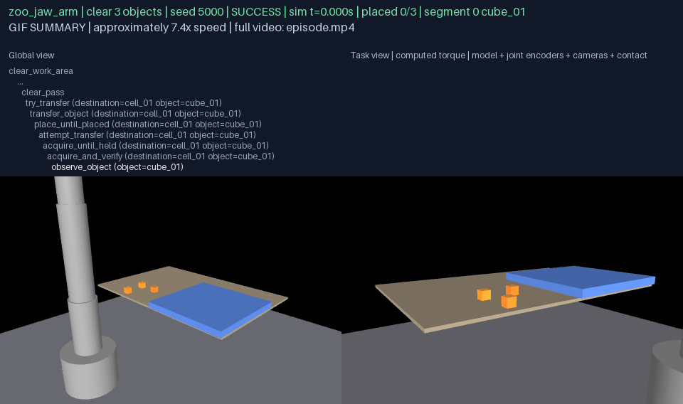
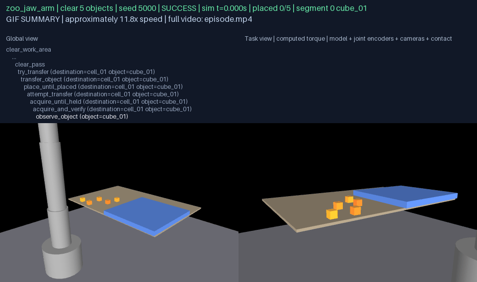
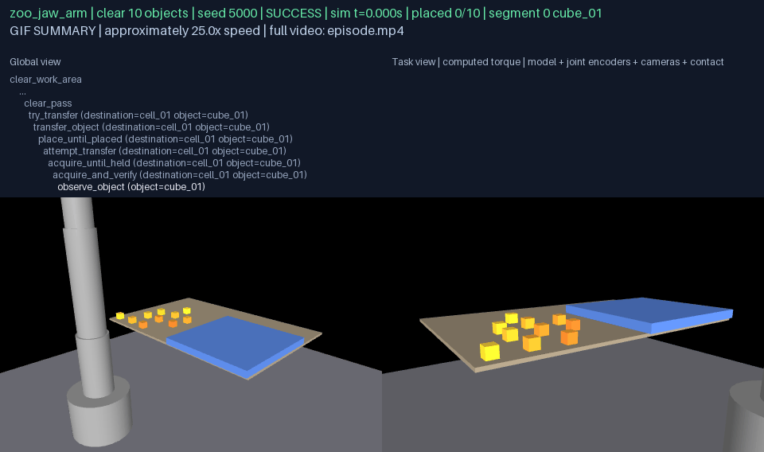
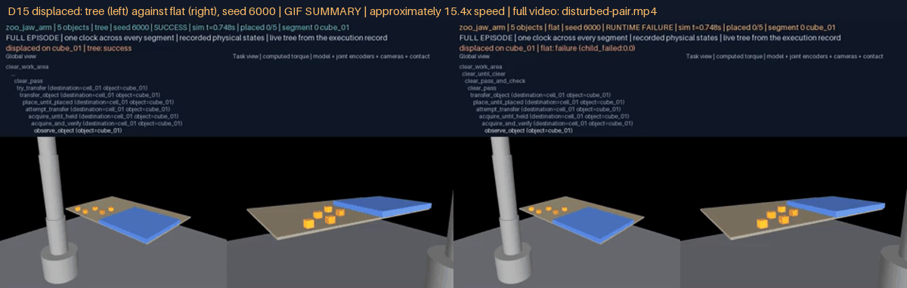
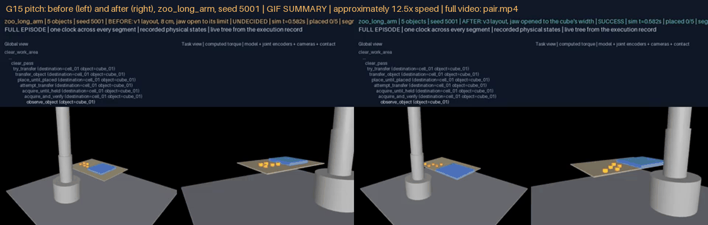
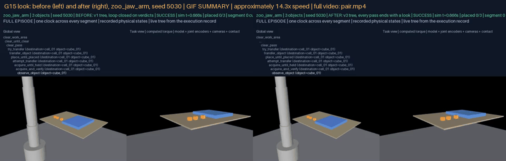
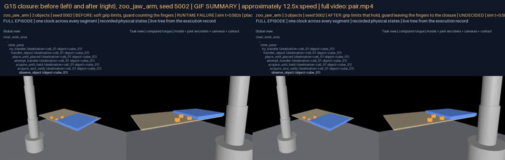

# G15 — Demonstrate recursive long-horizon manipulation before mobility

**Status:** A01 and A04 verified; A02 met on every body and chain length; A03 met on every body; D15 delivered. 450 nominal and 180 disturbed episodes on physics under protocol v3, every one a chain of sealed-capable segments on one clock, no API or model calls; the first protocol's runs kept as a baseline, with before/after pairs for each revision and each fix. Verify with `python docs/results/verify_g15.py --replay`.

## What this goal asked

Generate ClearWorkArea trees of depth at least four for 3, 5 and 10 objects from shared subskills with per-object grounding rather than per-instance scripts; on three frozen enabled bodies run fifty paired nominal seeds per chain length against whole-task targets of 90%, 80% and 60% with confidence intervals; run thirty paired disturbed seeds per body for five objects, where the hierarchy with recovery should beat the same leaves in a flat executor without recovery by at least fifteen percentage points under equal time and retry budgets; count root success only when every designated object is placed and the area is clear, and track planning calls and reuse. D15: uninterrupted 3-, 5- and 10-object clearances with a live tree, and a disturbance with recovery.

## What was built

**A generated tree over the shared transfer.** `rigby_core.skills.clearance`: the library for a list of objects and cells is generated, not written. The root is a clearing loop; each turn of the loop is one pass over the objects, the arm standing clear, and a look at the work area and the cells; a pass is a sequence of per-object selectors, each trying the unchanged G10 `transfer_object` bound to that object and its cell and, failing that, standing by so the pass goes on; the transfer's two loops and six leaves are the G10 definitions, one set shared by every object. The loop exits when every object has been seen in its cell and the area seen clear, within a pass budget of two. The tree is eleven deep. The root's effects are that every object is placed and the area is observed clear, so no child's success counts toward an unfinished root, and no stale belief does either: a cube a later placement knocked out of its cell loses its `placed` fact at the look and the next pass transfers it again. The flat twin keeps the same leaves in the same order with the same retry budget at the leaf (three) and no recovery structure: one pass, one look, a failed object ends the pass, and a failed leaf is retried in place without re-observing.

**Bound to a body as a chain of sessions.** `rigby_general.skills.clear_work_area`: each object is manipulated through its own TransferObject session, compiled with that object under the grasp machinery's canonical names and every other object standing in the world as a bystander; when the tree moves to the next object the runtime closes the session, reads every object's pose and the arm's joints from the last recorded state and opens the next session on exactly that state at the same clock, so a knocked-over cube stays knocked over and the arm begins where it stood. Before a look the arm stands clear: its reference configuration on a guarded path, so it is not between the cameras and the cubes. The look is observation, not belief: both declared cameras cast rays at every object; the area is clear only when every object is seen and none lies in it, an object's placement stands only while a camera sees it in its cell, and a hidden object leaves the look undecided. The oracle judges the final poses apart. The G10 runtime's facts are now keyed by the bound object and destination, and the session takes an object name, a destination cell offset and an already-ingested body.

## Registered protocol, and why it is version 3

`g15-clearance-v3` (registration `fb452dd0005d`): the G10 table and floor, an enlarged platform of cells to the robot's right, slots on the table to its left, neighbours 10 cm apart, every slot and cell a position every enabled body has transferred a cube from and to alone (the qualification table, `qualification.json`, is registered with the layout), nearest the robot first; fifty nominal seeds (5000-5049) drawing jitter (±1 cm), mass and friction (×0.9-1.1) for twelve objects, the same seed on every body and every chain length; thirty disturbed seeds (6000-6029) for five objects naming the object and the kind (displaced, slip, occlusion, ten each), each run through the tree and through its flat twin; caps of 270 s for 3, 450 s for 5, 900 s for 10 objects; retry budget 3, pass budget 2; targets 90/80/60% and +15 pp.

The first registration, `g15-clearance-v1`, was run first and is kept: neighbours eight centimetres apart in two grids, and the clearing loop closed on the transfers' own verdicts with one look after it. Its runs showed faults of the protocol, the tree and the shared transfer, not of the bodies:

1. **A jaw open to its limit is a sweep.** The long arm's fingers stand 17 cm apart across the outer faces at full open; descending on its target, a finger came down on the cube eight centimetres away and flung it off the table (in seed 5001's first segment the recorded states show the right finger pressing the fourth cube into the table at 60-160 N from 7.8 s). Most five-object episodes on the long arm lost a cube this way. Two answers, both kept: the jaw now opens as wide as the object needs (its width, the aperture measured at closed, and 1.5 cm of clearance a side: `OPENING_SIZED` in `rigby_general.contact.closure`, sized per object, which is the per-object grounding the goal asks for), and neighbours stand ten centimetres apart.
2. **A placement the arm later undid stayed "placed".** On the jaw arm, placing the second cube knocked the first out of its cell in seven of fifty three-object episodes; the transfers' verdicts had been honest at the time, the final look reported only the area, and the root claimed success: seven false completions the oracle caught. Every pass now ends with a look at the area and the cells, and what the cameras see decides which placements stand.
3. **After one lost hold, the chain died.** When a hold was lost the jaw snapped shut on nothing, and the compiler's soft grip-joint limits (solref 0.02 s) let the 60 N finger actuators drive the fingers 1.3 cm past their range, through one another and crossed; no later grasp could open them, and the arm planner's self-collision guard, counting the closure's own finger pair, refused every later path and every IK solution besides, since no arm joint can part the fingers. Every object after the lost one failed unattempted (jaw arm v1 seeds 5016, 5033, 5048; dual arm 5026, 5030; the second registration's jaw seeds 5002, 5003, 5012). Two changes to the shared transfer, not to the protocol: the grip joints of every compiled scene get limit constraints that hold against the closure's force (`hold_closure_limits` in `rigby_general.contact.closure`, time constant 5 ms), and the guard leaves to the closure the pairs parted by grip joints alone (`GUARD_LEAVES_CLOSURE_PAIRS` in `rigby_general.grounding.grounder`). The chain goes on to the objects it can still place.
4. **The reach envelope is not the solver, and the arm is in the cameras' way.** The second registration, `g15-clearance-v2` (kept as registered; its run stopped after the three-object cells), took positions from the reach envelope at twelve centimetres: the dual arm's IK missed two of them by four millimetres on every attempt, so its fifth slot failed in every five-object episode, and the look, taken with the arm parked over the platform, hid cubes from both cameras, so the long arm placed all ten and the root stayed undecided. Version 3 takes only positions every enabled body has transferred from and to alone, and the arm stands clear (its reference configuration, on a guarded path) before every look.

The draws are unchanged between the protocols: the same seed draws the same jitter, mass and friction. Before/after pairs for each change, rendered through the same renderer on the same seeds, are in the D15 section. The baseline rows are under `docs/results/g15-clearance-v1/` (stopped where the revision found them):

| Baseline cell (v1) | Episodes | Root success | False completions | Complete | Failure reasons |
|---|---|---|---|---|---|
| nominal-zoo_dual_arm-3 | 50 | 42/50 (84%) | 0 | yes | child_failed:0.0 8 |
| nominal-zoo_dual_arm-5 | 35 | 28/35 (80%) | 0 | no | child_failed:0.0 7 |
| nominal-zoo_jaw_arm-3 | 50 | 44/50 (88%) | 7 | yes | child_failed:0.0 6 |
| nominal-zoo_jaw_arm-5 | 50 | 39/50 (78%) | 5 | yes | child_failed:0.0 9, effects_unmet 2 |
| nominal-zoo_long_arm-3 | 50 | 50/50 (100%) | 0 | yes | — |
| nominal-zoo_long_arm-5 | 50 | 20/50 (40%) | 8 | yes | child_unknown:0.1 4, child_failed:0.0 24, effects_unmet 2 |

## Results (protocol v3)

### A02 — chain-length curves, fifty paired seeds per body and length

| Body | Objects | Root success | 95% interval | Target | False completions | Placements undone by a look (recovered) | Mean placed | Mean physics | Passes |
|---|---|---|---|---|---|---|---|---|---|
| zoo_dual_arm | 3 | 50/50 (100%) | [0.93, 1.00] | 90% met | 0 | 0 (0) | 3.00 | 51 s | 1.00 |
| zoo_dual_arm | 5 | 50/50 (100%) | [0.93, 1.00] | 80% met | 0 | 0 (0) | 5.00 | 85 s | 1.00 |
| zoo_dual_arm | 10 | 47/50 (94%) | [0.84, 0.98] | 60% met | 0 | 0 (0) | 9.94 | 169 s | 1.00 |
| zoo_jaw_arm | 3 | 50/50 (100%) | [0.93, 1.00] | 90% met | 0 | 0 (0) | 3.00 | 46 s | 1.00 |
| zoo_jaw_arm | 5 | 50/50 (100%) | [0.93, 1.00] | 80% met | 0 | 0 (0) | 5.00 | 73 s | 1.00 |
| zoo_jaw_arm | 10 | 50/50 (100%) | [0.93, 1.00] | 60% met | 0 | 0 (0) | 10.00 | 139 s | 1.00 |
| zoo_long_arm | 3 | 50/50 (100%) | [0.93, 1.00] | 90% met | 0 | 0 (0) | 3.00 | 48 s | 1.00 |
| zoo_long_arm | 5 | 50/50 (100%) | [0.93, 1.00] | 80% met | 0 | 0 (0) | 5.00 | 75 s | 1.00 |
| zoo_long_arm | 10 | 50/50 (100%) | [0.93, 1.00] | 60% met | 0 | 0 (0) | 10.00 | 145 s | 1.00 |

Root success is the executor's verdict: every object seen in its cell and the area seen clear at the last look; the oracle judges the final poses apart and a success it denies is a false completion. Failure reasons and the first object to fail, per cell:

- zoo_dual_arm, 10 objects: child_unknown:0.0 3; first failed object cube_07 ×2, cube_09 ×1

### A03 — hierarchy with recovery against the flat twin, thirty paired disturbed seeds

| Body | Pairs | Tree | Flat | Gain | Target | Tree-only wins | Flat-only wins | False completions |
|---|---|---|---|---|---|---|---|---|
| zoo_dual_arm | 30 | 25 | 15 | +33 pp | +15 pp met | 10 | 0 | 0 |
| zoo_jaw_arm | 30 | 28 | 15 | +43 pp | +15 pp met | 13 | 0 | 0 |
| zoo_long_arm | 30 | 28 | 13 | +50 pp | +15 pp met | 16 | 1 | 0 |

By kind of disturbance (tree / flat successes of ten pairs):

| Body | displaced | slip | occlusion |
|---|---|---|---|
| zoo_dual_arm | 10 / 6 | 5 / 0 | 10 / 9 |
| zoo_jaw_arm | 10 / 7 | 8 / 0 | 10 / 8 |
| zoo_long_arm | 8 / 3 | 10 / 0 | 10 / 10 |

Both executors ran the same seed, the same world, the same disturbance on the same object, the same caps and the same retry budget per leaf; the tree's advantage is its structure: a lost hold re-observes and re-acquires, a failed object is passed over and returned to, a placement is verified before the next object is touched, and a look after every pass sends the tree back for what it finds undone.

### A01 and A04 — generated trees, reuse, planning calls

Every tree is generated from the object list: 19 definitions in the library whatever the count, of which eleven are the shared transfer subskills; 3 objects: 45 nodes, depth 11, 3 transfer instances; 5 objects: 71 nodes, depth 11, 5 transfer instances; 10 objects: 136 nodes, depth 11, 10 transfer instances. Reuse per episode: one library generation and one tree expansion (the planning calls), one grounding per object, the eleven transfer definitions bound 10 times over for ten objects. Root success requires every object seen in its cell and the area seen clear; `verify_g15.py` checks that no successful root has fewer placed objects than designated.

## D15

**3 objects** — zoo_jaw_arm, seed 5000, success in 44 s of physics over 3 segments, 1 pass(es); the live tree on every frame.

[episode.mp4](g15-d15/clearance-3/media/episode.mp4) · [frames map](g15-d15/clearance-3/media/frames.json)

**5 objects** — zoo_jaw_arm, seed 5000, success in 70 s of physics over 5 segments, 1 pass(es); the live tree on every frame.

[episode.mp4](g15-d15/clearance-5/media/episode.mp4) · [frames map](g15-d15/clearance-5/media/frames.json)

**10 objects** — zoo_jaw_arm, seed 5000, success in 149 s of physics over 10 segments, 1 pass(es); the live tree on every frame.

[episode.mp4](g15-d15/clearance-10/media/episode.mp4) · [frames map](g15-d15/clearance-10/media/frames.json)

**Disturbance and recovery** — zoo_jaw_arm, displaced on cube_01, seed 6000: the tree success (5/5 placed), the flat twin failure (1/5 placed), side by side on one clock.

[disturbed-pair.mp4](g15-d15/disturbed-pair.mp4) · tree: [mp4](g15-d15/disturbed-tree/media/episode.mp4) · [frames](g15-d15/disturbed-tree/media/frames.json) · flat: [mp4](g15-d15/disturbed-flat/media/episode.mp4) · [frames](g15-d15/disturbed-flat/media/frames.json)

### Before and after each revision

**The v1 layout with the jaw open to its limit against the v3 layout with the jaw opened to the cube's width (the long arm, five objects, seed 5001).** What changed: the layout (positions every enabled body has transferred from and to alone, ten centimetres between neighbours) and the jaw's opening (sized to the object rather than the joint limit); the same draw, the same library. Before: unknown (child_unknown:0.0), 3/5 placed by the oracle. After: success, 5/5 placed.

[pair.mp4](g15-before-after/pitch/pair.mp4) · before: [mp4](g15-before-after/pitch/before/media/episode.mp4) · [frames](g15-before-after/pitch/before/media/frames.json) · after: [mp4](g15-before-after/pitch/after/media/episode.mp4) · [frames](g15-before-after/pitch/after/media/frames.json)

**The loop closed on verdicts against the loop closed on a look (the jaw arm, three objects, seed 5030, the v1 layout in both).** What changed: the tree only: every pass ends with a look at the area and the cells, and what the cameras see decides which placements stand; the same world, the same draw, identical physics until the trees diverge. Before: success, 1/3 placed by the oracle, a false completion. After: success, 3/3 placed, 2 placement(s) seen undone and transferred again.

[pair.mp4](g15-before-after/look/pair.mp4) · before: [mp4](g15-before-after/look/before/media/episode.mp4) · [frames](g15-before-after/look/before/media/frames.json) · after: [mp4](g15-before-after/look/after/media/episode.mp4) · [frames](g15-before-after/look/after/media/frames.json)

**Soft grip limits and a guard counting the fingers against limits that hold and a guard that leaves them to the closure (the jaw arm, three objects, seed 5002, the v2 layout in both).** What changed: the closure only: grip-joint limits that hold against the closure's force (fingers cannot cross), and the arm planner's guard no longer counting the closure's own finger pair; the same world, the same draw, the same tree, identical physics until the first lost hold. Before: failure (child_failed:0.0), 0/3 placed by the oracle. After: unknown (child_unknown:0.0), 2/3 placed.

[pair.mp4](g15-before-after/closure/pair.mp4) · before: [mp4](g15-before-after/closure/before/media/episode.mp4) · [frames](g15-before-after/closure/before/media/frames.json) · after: [mp4](g15-before-after/closure/after/media/episode.mp4) · [frames](g15-before-after/closure/after/media/frames.json)

## Evidence and media

`docs/results/g15-clearance/<cell>/trials.json` carries every episode's row: verdict and reason, the oracle's judgement, per-object attempts with verdicts and timings, segment boundaries, leaf calls, the verdict trail, the looks with what each camera saw of every object, the placements a look undid, the disturbance log, planning calls and reuse counts. Failed, undecided and interrupted episodes (up to fifteen per cell) and the first two successes per cell are sealed segment by segment, locally under `any-robot/results/g15-clearance`, each segment a replayable bundle carrying the full execution record; the D15 episodes are rendered from those segments, the before/after pairs from their own. All D15 and before/after MP4s are registered in `demos/registry`.

## Findings

1. **Clutter is a property of the jaw, and a layout is a property of the bodies.** A jaw open to its limit sweeps its neighbours; sized to the object it stands where the grasp needs it. A reach envelope says where the arm can be, not where its solver lands within four millimetres: every position of the registered layout was earned by a single-object transfer on every enabled body before a seed was run, and the qualification table is part of the registration.

2. **A verdict is true when it is given, not forever.** The transfer's placement verdict was honest each time; what the first tree lacked was a look after the fact. Closing the loop on observation turns a stale placement into another pass: the table above counts, per cell, the episodes in which a look undid a placement and how many of them the next pass recovered.

3. **One clock, many models.** Each object is manipulated in a scene compiled with it under the canonical names, so an episode is a chain of records rather than one; the state carried between them is exact to the joint values, and the executor's clock never resets. The frame maps of every D15 video name the segment and object of every frame.

## Tests

`core/tests/test_skills_clearance.py` (10): the library expands eleven deep with one transfer per object for 3, 5 and 10 and every pass ends with the arm standing clear and a look; the legacy structure reproduced behind its flag; the flat twin keeps the leaves and the retry budget without loops; mismatched or repeated names refused; a failed object is passed over and returned to on the next pass; a placement the cameras see undone is transferred again on the next pass, where the flat twin fails; the flat run stops at the first failed object with the leaf retried within the same budget; the root fails when the area never clears though every transfer succeeded. `any-robot/tests/test_general_clear_work_area.py` (6): slots inside the work area and cells on the platform with margin, the table as support; on the jaw arm a two-object clearance runs as two sessions on one clock, the second on the state the first left, and the look decides both placements; the registered layout keeps every neighbour a pitch apart, every slot and cell qualified on every enabled body, and nothing of any robot touching a cube at rest; the guard leaves the closure's own fingers to the closure; every compiled scene's grip joints hold their limits, the shutter recompile keeping them; the jaw opens as wide as the cube needs on every body, and the toggle opens it to the limit. The self-collision guard coverage test is updated for the closure's pairs.

