# G16 — Build and validate the three exotic mobile embodiments

**Status:** A01–A04 verified; D16 delivered. Three procedural mobile bodies with physical, actuator and sensor manifests, every one passing the floating-base integrity rules; every declared stance settled on physics as declared (6 settling tests), 21 supported recovery trials all recovered and 6 unsupported manoeuvres kept as clips; one course frozen with a feasibility map and an internal expert baseline. No API or model calls. Verify with `python docs/results/verify_g16.py --replay`.

## What this goal asked

Provide dog-plus-arm, wheeled-biped and rigid segmented octopus-like models with physical, actuator and sensor manifests as development and showcase bodies; validate inertias, limits, collision geometry, support and contact roles and recoverable initial states, with no robot-ID special cases in shared task code; freeze one common feasible world and goal set for the three before any policy tuning, supported by reach, support and traction analysis and a labelled expert feasibility baseline; record the origin and redistribution terms of every asset, procedural models being the default. D16: physical inspection and contact/support tests for all three bodies, including any unsupported manoeuvres.

## What was built

**Three bodies, procedurally.** `any-robot/scripts/build_mobile_zoo.py` writes each body as MJCF from primitive geometry at declared densities, so the compiler's inertias are the solid-body ones: a quadruped with three-hinge legs on rubber spherical feet and a four-hinge arm with a parallel jaw on its torso; a two-legged wheeled body with hip and knee hinges, a driven wheel at each foot, a tail skid to park on and a three-hinge arm with a jaw; and a rigid segmented octopus, a mantle with six tentacles of four capsule segments on pitch and yaw hinges, the two front tentacles ending in a hinge pincer. Position servos on the limbs and arms, velocity servos on the wheels, every actuator with a declared force limit; joint encoders, a base gyro, accelerometer and orientation sensor, and touch sensors on the members meant to bear weight. Beside every model: a mobility declaration (base kind, root joint, support members, limbs, manipulators, stances with the static stability its author claims, the working stance) and a provenance record (procedural, this repository, redistributable under its licence, not a holdout).

**Ingest for a floating base.** `rigby_general.mobility` is the mobile counterpart of the fixed-base pipeline, which refuses a free joint on purpose. It requires exactly one, on the declared base, and otherwise holds the model to the same rules: no external asset paths, finite positive inertias obeying the triangle inequality, valid limits on every hinge and slide (a wheel may be declared unlimited), convex colliders, a collider on every declared support member, every actuator on a declared joint with a finite force range, the model hashing to its declaration. The manifest it measures reads its numbers off the compiled model, never off a name: masses, ranges, efforts, each limb's tip and length, each support member's colliders and friction, each manipulator's aperture at the open end and its stretched reach, the footprint in the working stance, the sensors. Nothing in it names a specific robot; the same code ingests all three.

**Validation on physics.** A stance is validated by dropping the body two centimetres onto a level floor in it with every servo holding, for four seconds, and reading what happened: settled or not, upright or not, which members touch the floor at rest against the declared ones, the support polygon's area, the height it stands at. A recoverable initial state is one the body is released from, rolled, pitched or dropped, and comes back from to its stance on its own; a trial declared unsupported is a manoeuvre the body is not meant to survive without a controller, run anyway and kept. An inspection sweep drives every joint from its rest towards each end of its range and back while the rest of the body holds. Every run is a sealed bundle whose recorded controls replay to the recorded states; nothing acts on a body but its own servos.

**One course, frozen.** `rigby_general.mobility.world` fixes a level floor with a start pad, a walled corridor to an object station (a 6 cm platform with a 30 mm cube), a delivery tray on a plinth, a 6-degree ramp on the way back, and two side branches the bodies are expected to disagree about: a 0.7 m doorway and a 5 cm step. Two goals: travel (G17) and retrieve (G18). The feasibility analysis judges each body on each element from its measured manifest and settling tests: footprint against clearances, support friction against the ramp, wheel radius or leg length or mantle rise against the step, stance heights and manipulator reach against the station and the tray. The expert baseline beside it is labelled by hand, marked internal, and compared rather than assumed.

## Bodies

| Body | Base | Mass | Joints (actuators) | Limbs | Support members | Manipulator aperture / reach | Footprint | Sensors | Integrity |
|---|---|---|---|---|---|---|---|---|---|
| mobile_dog_arm | legged | 17.55 kg | 18 (18) | 5 | 4 | arm: 7.2 cm / 54 cm | 0.94 × 0.58 m | 7 | passed |
| mobile_wheeled_biped | wheeled | 16.01 kg | 11 (11) | 3 | 3 | arm: 7.2 cm / 34 cm | 0.67 × 0.70 m | 6 | passed |
| mobile_octopus | crawling | 12.89 kg | 52 (52) | 6 | 31 | tentacle_0: 3.0 cm / 55 cm; tentacle_5: 3.0 cm / 55 cm | 1.20 × 1.27 m | 28 | passed |

Provenance: mobile_dog_arm: procedural, the repository's own licence; redistributable with the repository, holdout False; mobile_wheeled_biped: procedural, the repository's own licence; redistributable with the repository, holdout False; mobile_octopus: procedural, the repository's own licence; redistributable with the repository, holdout False. No external design, mesh or measurement was used; the builder is the origin of every asset and the assets rebuild from it byte for byte.

## Stances, support and recoverable initial states

| Body | Stance | Declared | Measured | Height | Tilt | Floor contacts at rest | Undeclared |
|---|---|---|---|---|---|---|---|
| mobile_dog_arm | parked | stable | stable | 0.195 m | 0.4° | fl_foot, fr_foot, hl_foot, hr_foot | — |
| mobile_dog_arm | standing | stable | stable | 0.386 m | 0.0° | fl_foot, fr_foot, hl_foot, hr_foot | — |
| mobile_wheeled_biped | parked | stable | stable | 0.195 m | 2.6° | left_wheel, right_wheel, torso | — |
| mobile_wheeled_biped | standing | unstable without a controller | unstable | 0.265 m | 63.3° | arm_link_1, left_shank, left_wheel, right_shank, right_wheel | arm_link_1, left_shank, right_shank |
| mobile_octopus | reaching | stable | stable | 0.113 m | 10.1° | mantle, t0_root, t0_seg_0, t1_seg_0, t1_seg_1, t2_seg_1, t3_seg_1, t4_seg_0, t4_seg_1, t5_root, t5_seg_0 | — |
| mobile_octopus | resting | stable | stable | 0.127 m | 0.1° | t0_seg_1, t1_seg_1, t2_seg_1, t3_seg_1, t4_seg_1, t5_seg_1 | — |

Every declared stance measured as declared. The wheeled biped's standing stance is declared unstable without a balance controller and measures so: released standing it pitches over onto its shanks and arm within the first second; its parked stance, legs stretched forward on the two wheels and the tail skid, holds. That is the honest boundary G17 has to move.

| Body | Trial | Perturbation | Supported | Recovered | Final tilt | Final height |
|---|---|---|---|---|---|---|
| mobile_dog_arm | drop_10cm | released 10 cm higher than its stance | yes | yes | 0.0° | 0.386 m |
| mobile_dog_arm | roll_8 | released rolled 8 degrees | yes | yes | 0.0° | 0.386 m |
| mobile_dog_arm | roll_-8 | released rolled -8 degrees | yes | yes | 0.0° | 0.386 m |
| mobile_dog_arm | pitch_8 | released pitched 8 degrees nose down | yes | yes | 0.0° | 0.386 m |
| mobile_dog_arm | pitch_-8 | released pitched 8 degrees nose up | yes | yes | 0.0° | 0.386 m |
| mobile_dog_arm | roll_25 | released rolled 25 degrees | yes | yes | 0.0° | 0.386 m |
| mobile_dog_arm | pitch_25 | released pitched 25 degrees nose down | yes | yes | 0.0° | 0.386 m |
| mobile_dog_arm | roll_60 | released rolled 60 degrees: an unsupported manoeuvre, kept to show what the body does without a controller | no | no | 170.6° | 0.103 m |
| mobile_dog_arm | rearing | released rearing on its hind legs: an unsupported manoeuvre | no | yes | 12.6° | 0.338 m |
| mobile_wheeled_biped | released_standing | released in its working stance with no balance controller: declared unsupported | no | no | 62.4° | 0.267 m |
| mobile_wheeled_biped | drop_10cm | released 10 cm higher than its stance | yes | yes | 2.6° | 0.195 m |
| mobile_wheeled_biped | roll_8 | released rolled 8 degrees | yes | yes | 2.6° | 0.195 m |
| mobile_wheeled_biped | roll_-8 | released rolled -8 degrees | yes | yes | 2.6° | 0.195 m |
| mobile_wheeled_biped | pitch_8 | released pitched 8 degrees nose down | yes | yes | 2.6° | 0.195 m |
| mobile_wheeled_biped | pitch_-8 | released pitched 8 degrees nose up | yes | yes | 2.6° | 0.195 m |
| mobile_wheeled_biped | roll_25 | released rolled 25 degrees | yes | yes | 2.6° | 0.195 m |
| mobile_wheeled_biped | pitch_25 | released pitched 25 degrees nose down | yes | yes | 2.6° | 0.195 m |
| mobile_wheeled_biped | roll_60 | released rolled 60 degrees: an unsupported manoeuvre, kept to show what the body does without a controller | no | no | 93.8° | 0.110 m |
| mobile_octopus | drop_10cm | released 10 cm higher than its stance | yes | yes | 0.1° | 0.127 m |
| mobile_octopus | roll_8 | released rolled 8 degrees | yes | yes | 0.1° | 0.127 m |
| mobile_octopus | roll_-8 | released rolled -8 degrees | yes | yes | 0.1° | 0.127 m |
| mobile_octopus | pitch_8 | released pitched 8 degrees nose down | yes | yes | 0.0° | 0.127 m |
| mobile_octopus | pitch_-8 | released pitched 8 degrees nose up | yes | yes | 0.1° | 0.127 m |
| mobile_octopus | roll_25 | released rolled 25 degrees | yes | yes | 0.2° | 0.127 m |
| mobile_octopus | pitch_25 | released pitched 25 degrees nose down | yes | yes | 0.1° | 0.127 m |
| mobile_octopus | roll_60 | released rolled 60 degrees: an unsupported manoeuvre, kept to show what the body does without a controller | no | yes | 0.3° | 0.127 m |
| mobile_octopus | upside_down | released upside down: an unsupported manoeuvre, it has no righting reflex | no | no | 173.2° | 0.112 m |

Recovered means settled, upright within 15 degrees, and back within a quarter of the stance's measured height, with nothing acting on the body but its servos. The supported set is the recoverable initial states each body declares; the unsupported set (large rolls, the biped released standing, the dog rearing, the octopus upside down) shows what each body does without a controller and is kept, labelled, in D16.

## The course and the feasibility map

`mobile-course-v1` (course `244af80bd16b`, registration `14bb869a6c82`): A level floor with a start pad, a walled corridor to an object station, a delivery tray on a plinth, a gentle ramp on the way back, and two side branches: a narrow doorway and a step. Route: (0.0, 0.0) → (3.0, 0.0) → (3.4, 2.2) → (1.2, 2.2) → (0.0, 0.0). Goals: **travel** (G17): leave the start pad, pass the corridor to the station, stop within 0.3 m of it for 2 s, turn around, return to the start pad and stop; **retrieve** (G18): approach the station, stabilise, acquire the cube, carry it to the tray, place it inside the rim, return to the start pad. Frozen before any controller exists and independent of which one later succeeds; each body compiled into it and settled on the start pad (stable on all three).

| Body | corridor (1.4 m) | doorway (0.7 m) | ramp (6°) | step (5 cm) | station (0.09 m) | tray (0.11 m) | main route |
|---|---|---|---|---|---|---|---|
| mobile_dog_arm | feasible | feasible | feasible | feasible | feasible | feasible | feasible |
| mobile_wheeled_biped | feasible | infeasible | feasible | infeasible | feasible | feasible | feasible |
| mobile_octopus | feasible | infeasible | feasible | infeasible | feasible | feasible | feasible |

- mobile_dog_arm: corridor: footprint 0.59 m + 0.1 m margin fits 1.4 m; doorway: footprint 0.59 m + 0.1 m margin fits 0.7 m; ramp: support friction 1.30 against 2 x tan(6 deg) = 0.21; step: a 5 cm step against a third of the leg length (41 cm): 13.7 cm; station: target at 0.09 m; the grasp site spans -0.24 to 1.02 m over the stances the body can hold; tray: target at 0.11 m; the grasp site spans -0.24 to 1.02 m over the stances the body can hold
- mobile_wheeled_biped: corridor: footprint 0.67 m + 0.1 m margin fits 1.4 m; doorway: footprint 0.67 m + 0.1 m margin does not fit 0.7 m; ramp: support friction 1.00 against 2 x tan(6 deg) = 0.21; step: a 5 cm step against half the wheel radius (8 cm): 4.0 cm; station: target at 0.09 m; the grasp site spans 0.04 to 0.98 m over the stances the body can hold; tray: target at 0.11 m; the grasp site spans 0.04 to 0.98 m over the stances the body can hold
- mobile_octopus: corridor: footprint 1.20 m + 0.1 m margin fits 1.4 m; doorway: footprint 1.20 m + 0.1 m margin does not fit 0.7 m; ramp: support friction 0.80 against 2 x tan(6 deg) = 0.21; step: a 5 cm step against the mantle's rise (2 cm): 1.7 cm; station: target at 0.09 m; the grasp site spans -0.49 to 0.61 m over the stances the body can hold; tray: target at 0.11 m; the grasp site spans -0.49 to 0.61 m over the stances the body can hold

The analysis and the internal expert labels agree on 18 of 18 body × element cells. The labels are internal (the author of the bodies and the course), recorded as such; an independent review would replace them under U3.

## D16

### mobile_dog_arm

**physical inspection in stance 'parked'** — stable; 285 frames at 12 fps, real-time playback, the floor contacts, base height and tilt on every frame.

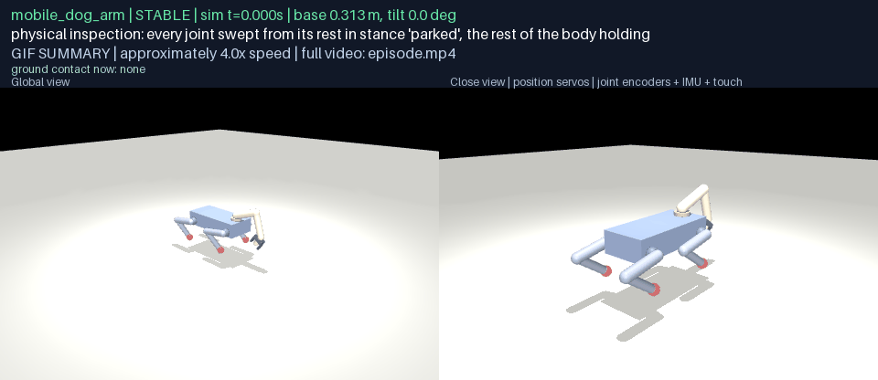

[episode.mp4](g16-d16/mobile_dog_arm/inspection/media/episode.mp4) · [frames map](g16-d16/mobile_dog_arm/inspection/media/frames.json)

**settling test, stance 'parked'** — stable; 49 frames at 12 fps, real-time playback, the floor contacts, base height and tilt on every frame.

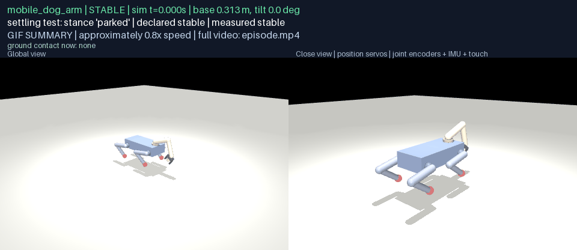

[episode.mp4](g16-d16/mobile_dog_arm/stance-parked/media/episode.mp4) · [frames map](g16-d16/mobile_dog_arm/stance-parked/media/frames.json)

**settling test, stance 'standing'** — stable; 49 frames at 12 fps, real-time playback, the floor contacts, base height and tilt on every frame.

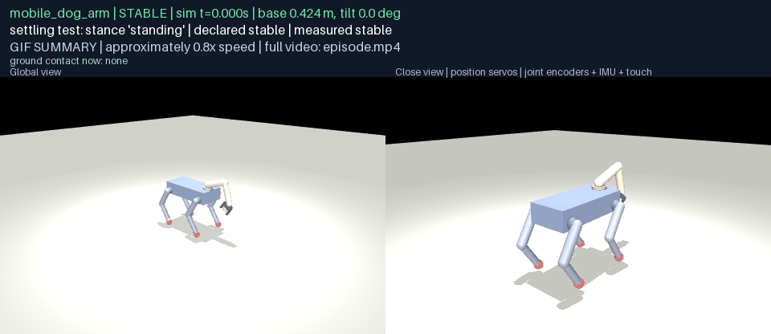

[episode.mp4](g16-d16/mobile_dog_arm/stance-standing/media/episode.mp4) · [frames map](g16-d16/mobile_dog_arm/stance-standing/media/frames.json)

**recovery trial: released rolled 25 degrees** — recovered — supported, recovered; 97 frames at 12 fps, real-time playback, the floor contacts, base height and tilt on every frame.

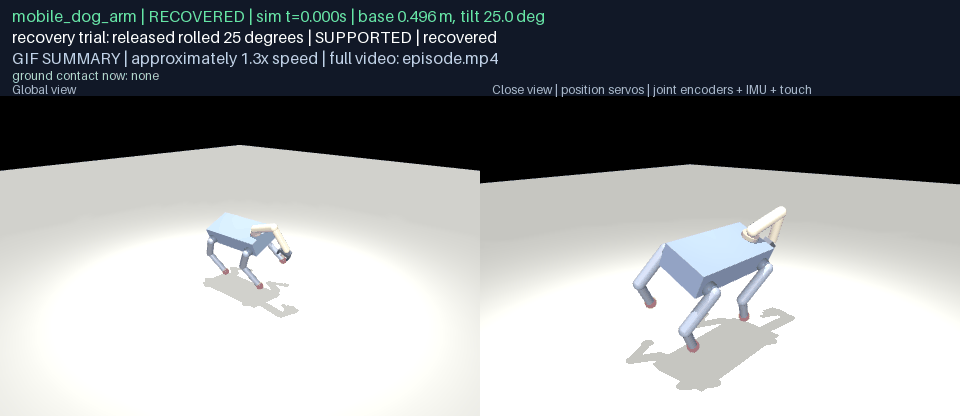

[episode.mp4](g16-d16/mobile_dog_arm/recovery-roll_25/media/episode.mp4) · [frames map](g16-d16/mobile_dog_arm/recovery-roll_25/media/frames.json)

**recovery trial: released rolled 60 degrees: an unsupported manoeuvre, kept to show what the body does without a controller** — not recovered unsupported — **UNSUPPORTED MANOEUVRE** (did not recover, as expected); 97 frames at 12 fps, real-time playback, the floor contacts, base height and tilt on every frame.

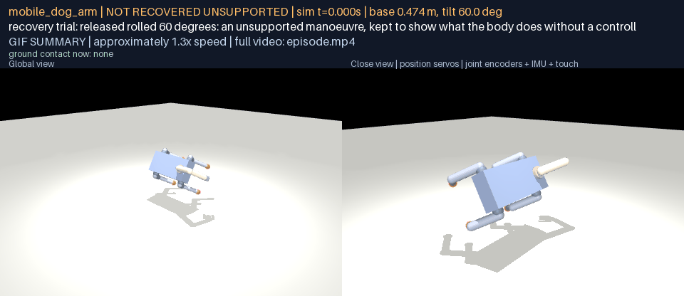

[episode.mp4](g16-d16/mobile_dog_arm/recovery-roll_60/media/episode.mp4) · [frames map](g16-d16/mobile_dog_arm/recovery-roll_60/media/frames.json)

**recovery trial: released rearing on its hind legs: an unsupported manoeuvre** — recovered — **UNSUPPORTED MANOEUVRE** (recovered anyway); 97 frames at 12 fps, real-time playback, the floor contacts, base height and tilt on every frame.

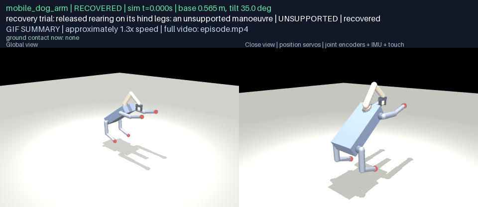

[episode.mp4](g16-d16/mobile_dog_arm/recovery-rearing/media/episode.mp4) · [frames map](g16-d16/mobile_dog_arm/recovery-rearing/media/frames.json)

**on the course: settled on the start pad in stance 'standing'** — stable; 37 frames at 12 fps, real-time playback, the floor contacts, base height and tilt on every frame.

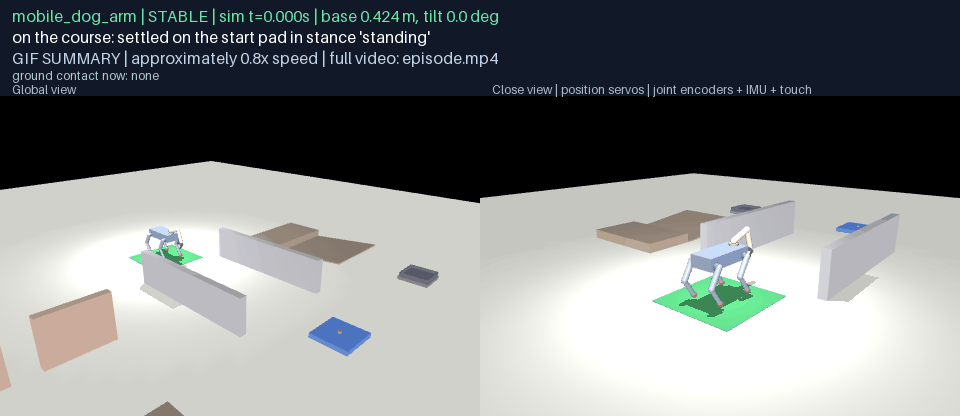

[episode.mp4](g16-d16/mobile_dog_arm/course-start/media/episode.mp4) · [frames map](g16-d16/mobile_dog_arm/course-start/media/frames.json)

### mobile_wheeled_biped

**physical inspection in stance 'parked'** — stable; 184 frames at 12 fps, real-time playback, the floor contacts, base height and tilt on every frame.

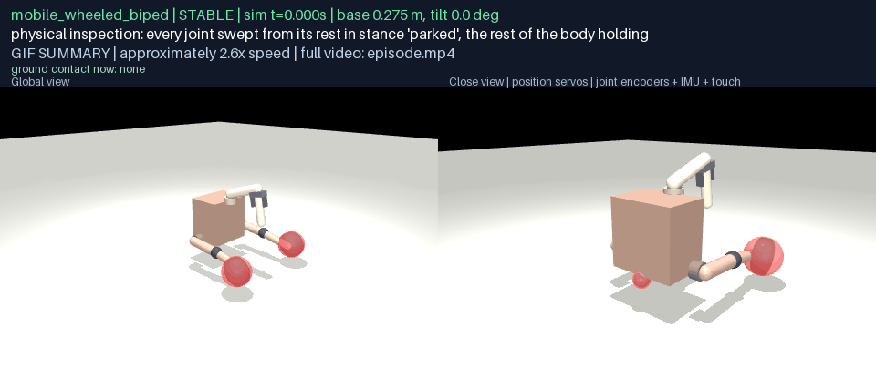

[episode.mp4](g16-d16/mobile_wheeled_biped/inspection/media/episode.mp4) · [frames map](g16-d16/mobile_wheeled_biped/inspection/media/frames.json)

**settling test, stance 'parked'** — stable; 49 frames at 12 fps, real-time playback, the floor contacts, base height and tilt on every frame.

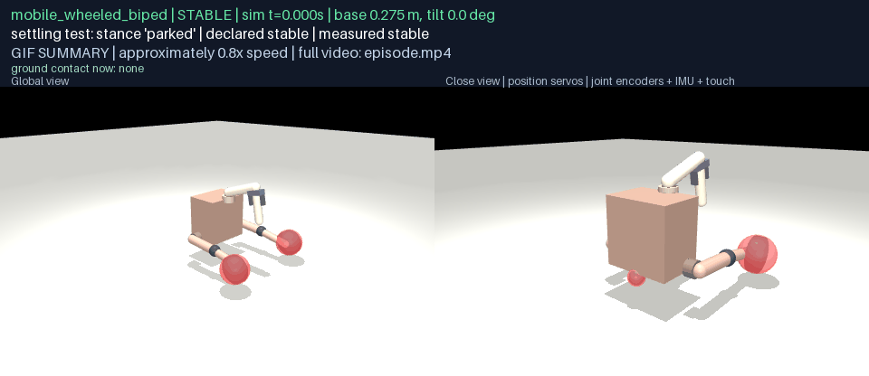

[episode.mp4](g16-d16/mobile_wheeled_biped/stance-parked/media/episode.mp4) · [frames map](g16-d16/mobile_wheeled_biped/stance-parked/media/frames.json)

**settling test, stance 'standing'** — unstable as declared; 49 frames at 12 fps, real-time playback, the floor contacts, base height and tilt on every frame.

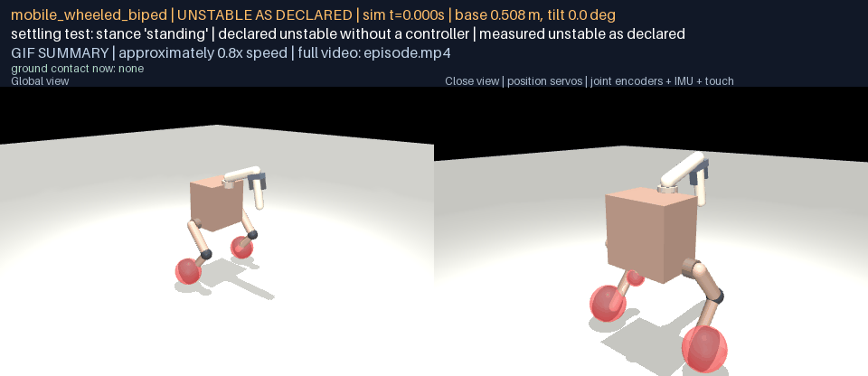

[episode.mp4](g16-d16/mobile_wheeled_biped/stance-standing/media/episode.mp4) · [frames map](g16-d16/mobile_wheeled_biped/stance-standing/media/frames.json)

**recovery trial: released rolled 25 degrees** — recovered — supported, recovered; 97 frames at 12 fps, real-time playback, the floor contacts, base height and tilt on every frame.

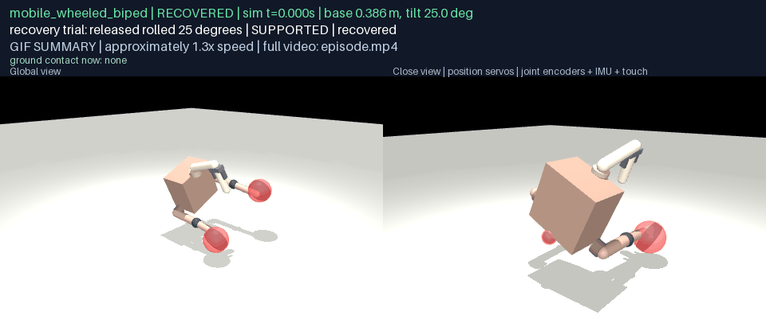

[episode.mp4](g16-d16/mobile_wheeled_biped/recovery-roll_25/media/episode.mp4) · [frames map](g16-d16/mobile_wheeled_biped/recovery-roll_25/media/frames.json)

**recovery trial: released in its working stance with no balance controller: declared unsupported** — not recovered unsupported — **UNSUPPORTED MANOEUVRE** (did not recover, as expected); 97 frames at 12 fps, real-time playback, the floor contacts, base height and tilt on every frame.

[episode.mp4](g16-d16/mobile_wheeled_biped/recovery-released_standing/media/episode.mp4) · [frames map](g16-d16/mobile_wheeled_biped/recovery-released_standing/media/frames.json)

**recovery trial: released rolled 60 degrees: an unsupported manoeuvre, kept to show what the body does without a controller** — not recovered unsupported — **UNSUPPORTED MANOEUVRE** (did not recover, as expected); 97 frames at 12 fps, real-time playback, the floor contacts, base height and tilt on every frame.

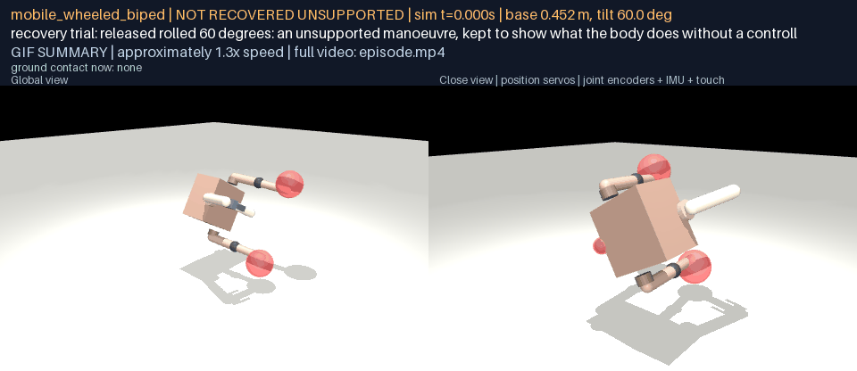

[episode.mp4](g16-d16/mobile_wheeled_biped/recovery-roll_60/media/episode.mp4) · [frames map](g16-d16/mobile_wheeled_biped/recovery-roll_60/media/frames.json)

**on the course: settled on the start pad in stance 'parked'** — stable; 37 frames at 12 fps, real-time playback, the floor contacts, base height and tilt on every frame.

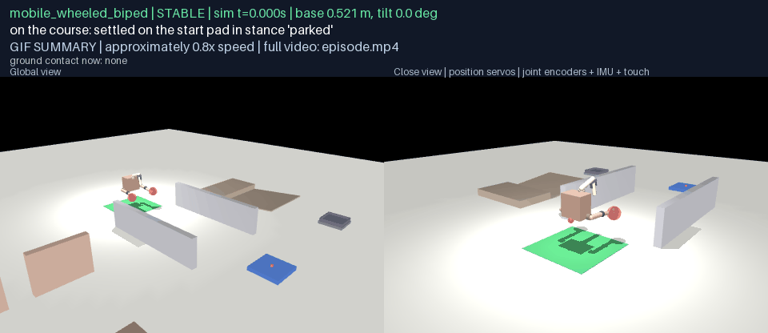

[episode.mp4](g16-d16/mobile_wheeled_biped/course-start/media/episode.mp4) · [frames map](g16-d16/mobile_wheeled_biped/course-start/media/frames.json)

### mobile_octopus

**physical inspection in stance 'reaching'** — stable; 400 frames at 12 fps, real-time playback, the floor contacts, base height and tilt on every frame.

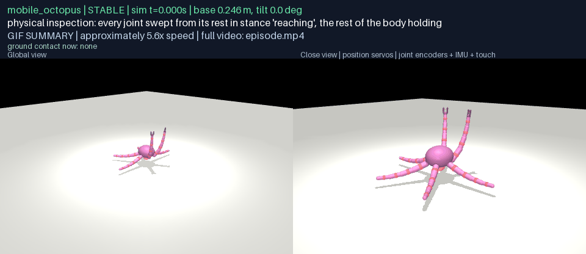

[episode.mp4](g16-d16/mobile_octopus/inspection/media/episode.mp4) · [frames map](g16-d16/mobile_octopus/inspection/media/frames.json)

**settling test, stance 'reaching'** — stable; 49 frames at 12 fps, real-time playback, the floor contacts, base height and tilt on every frame.

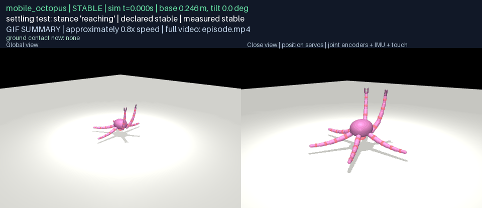

[episode.mp4](g16-d16/mobile_octopus/stance-reaching/media/episode.mp4) · [frames map](g16-d16/mobile_octopus/stance-reaching/media/frames.json)

**settling test, stance 'resting'** — stable; 49 frames at 12 fps, real-time playback, the floor contacts, base height and tilt on every frame.

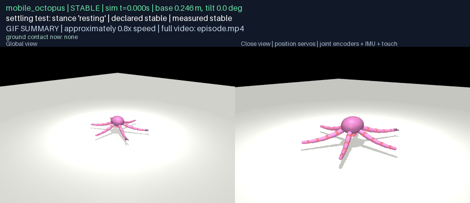

[episode.mp4](g16-d16/mobile_octopus/stance-resting/media/episode.mp4) · [frames map](g16-d16/mobile_octopus/stance-resting/media/frames.json)

**recovery trial: released rolled 25 degrees** — recovered — supported, recovered; 97 frames at 12 fps, real-time playback, the floor contacts, base height and tilt on every frame.

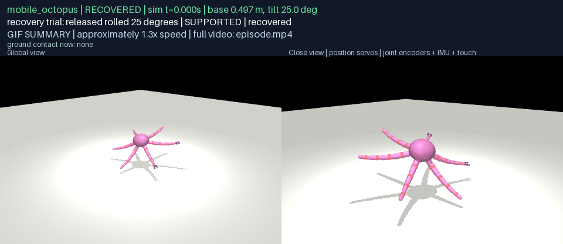

[episode.mp4](g16-d16/mobile_octopus/recovery-roll_25/media/episode.mp4) · [frames map](g16-d16/mobile_octopus/recovery-roll_25/media/frames.json)

**recovery trial: released rolled 60 degrees: an unsupported manoeuvre, kept to show what the body does without a controller** — recovered — **UNSUPPORTED MANOEUVRE** (recovered anyway); 97 frames at 12 fps, real-time playback, the floor contacts, base height and tilt on every frame.

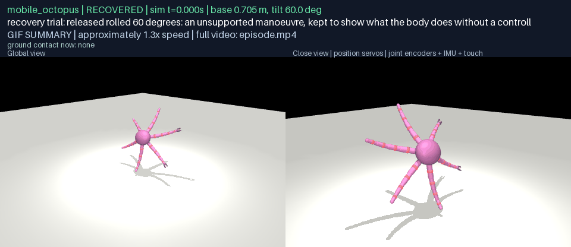

[episode.mp4](g16-d16/mobile_octopus/recovery-roll_60/media/episode.mp4) · [frames map](g16-d16/mobile_octopus/recovery-roll_60/media/frames.json)

**recovery trial: released upside down: an unsupported manoeuvre, it has no righting reflex** — not recovered unsupported — **UNSUPPORTED MANOEUVRE** (did not recover, as expected); 97 frames at 12 fps, real-time playback, the floor contacts, base height and tilt on every frame.

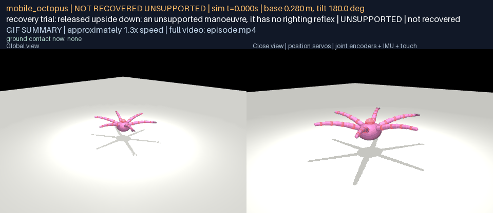

[episode.mp4](g16-d16/mobile_octopus/recovery-upside_down/media/episode.mp4) · [frames map](g16-d16/mobile_octopus/recovery-upside_down/media/frames.json)

**on the course: settled on the start pad in stance 'resting'** — stable; 37 frames at 12 fps, real-time playback, the floor contacts, base height and tilt on every frame.

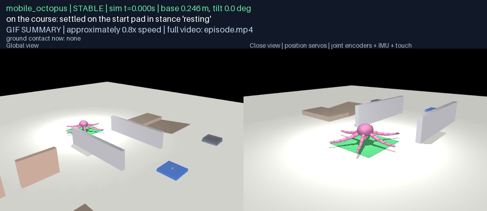

[episode.mp4](g16-d16/mobile_octopus/course-start/media/episode.mp4) · [frames map](g16-d16/mobile_octopus/course-start/media/frames.json)

## Evidence and media

`docs/results/g16-bodies/<body>/` carries the measured manifest, the integrity report with every settling and recovery measurement, and the test record with every sealed run's digest; `any-robot/assets/general/mobile/<body>/` the model, its declaration and its provenance; `any-robot/assets/general/mobile/course-v1/` the frozen course, the feasibility map, the expert labels and the registration; `docs/results/g16-course/` the settle-on-course records. Every run's bundle lives locally under `any-robot/results/g16-*` with the full physics record; `verify_g16.py --replay` replays each on native physics. All D16 MP4s are registered in `demos/registry`.

## Findings

1. **A body's declaration is a claim the physics checks.** The declared support members are compared with what actually touches the floor at rest; the octopus's first declaration left out the tentacle roots, which its reaching stance rests on, and the settling test said so. The wheeled biped's first parked stance, knees folded under, pitched it onto its arm; the stance it holds is legs forward on the tail skid, and that is what is declared now.

2. **Static stability without a controller is the honest boundary.** The biped stands only with active balance; G16 declares that, measures it (released standing, it falls in under a second) and hands the boundary to G17 rather than hiding it with a wider wheelbase.

3. **Feasibility is read off geometry, and the expert can be wrong.** The doorway's 0.7 m turns the octopus and the biped away by footprint; the step turns the wheels and the crawler away by wheel radius and mantle rise; the reach bands put the station and the tray inside every body's grasp. Where the hand labels disagreed with the numbers, the numbers are reported and the label kept beside them.

## Tests

`any-robot/tests/test_general_mobility.py` (6): the builder writes the committed assets byte for byte; every body passes the floating-base integrity rules; the manifest is measured, not copied; every stance settles as declared; a small roll is recovered where the body can hold itself and the biped does not stand without a controller; the course freezes to a hash and the feasibility map follows the geometry.

