# G17 — Establish independent locomotion control

**Status:** A01–A04 assessed, with shortfalls named below; D17 delivered. Three analytic, hand-authored controllers (a trot, a wheeled balance, a tripod crawl) behind one body-neutral navigator drove the frozen course without the language planner. Travel: dog-plus-arm (legged) 100/100, wheeled biped 100/100, octopus (crawling) 100/100 of the registered 100 (target ≥ 90). Perturbations: dog-plus-arm (legged) 26/30, wheeled biped 23/30, octopus (crawling) 27/30 of the registered 30 (target ≥ 24). Every trial recorded on physics; every failure and the first successes per kind sealed and replayable; four before/after pairs on identical physics for the fixes made on the way. No API or model calls. Verify with `python docs/results/verify_g17.py --replay`.

## What this goal asked

For each body, execute travel, stop, turn and return on the common course in at least 100 frozen trials with at least 90 reaching the goal and standing stable for 2 s; run 30 predetermined perturbation trials per body with at least 24 recoveries, including traction and support disturbances appropriate to the declared mechanics, reported separately; controller logs that identify the provenance (analytic, per-body trained, adapted or shared), with no root teleportation, artificial support or hidden stabilising wrench counting as success; fall, collision, energy, speed, controller latency and time-budget outcomes published; locomotion control working without the high-level language planner. D17: a synchronized walk/roll/crawl course plus uninterrupted perturbation recoveries.

## What was built

**Three drives, one interface.** `rigby_general.mobility.locomotion` gives each body a hand-authored controller behind the same call, `control(data, forward speed, turn rate)`, that returns a command for the body's own actuators and nothing else. The dog trots: diagonal pairs alternate at a fixed period, a stance foot slides back at the body speed and a swing foot lifts and comes forward, through an analytic two-link leg IK in the dog's joint convention; turning is a stride difference between the sides, half again as large in place because two-centimetre strides mostly slip. The biped balances: the wheels' velocity servos are driven as torque servos by feeding the measured wheel speed forward, the torque law is a pitch and pitch-rate regulator about a lean that commands speed (the lean that produces the commanded acceleration is fed forward), the regulated speed is the axle's ground speed, a slow integral learns where upright is for the load and is gated during transients, the turn is closed on the gyro's yaw rate, and the model's undamped leg servos are held on target under the reaction of the wheel torque (target plus torque over kp) and damped through the same servos. The octopus crawls: two groups of three tentacles alternate, the lifted group curling up and swinging its tips forward while the pressed group sweeps its tips back; direction comes from each tentacle's mounting angle, and the in-place turn's sweep sense is the opposite of the moving differential's. Each controller's provenance string names it as analytic and hand-authored; nothing is trained, adapted or shared.

**A navigator that knows no body.** `Navigator` takes a base pose and a drive's speed range: it turns towards the next waypoint, drives when facing it, eases off over a run-in and arrives at the drive's minimum speed, stops inside the radius, holds for the dwell, then goes on; it commits to a turn direction while the target is behind it, because a wrapped heading error flips sign across the seam and the body should not. The same code drives a walker, a roller and a crawler.

**Recorded trials.** `rigby_general.mobility.trials.run_travel` compiles the body into the frozen course with its start jitter, lets the navigator drive the travel goal under a cap, and records every step. The root is placed once and never written again; a push is `xfrc_applied` on the base, recorded as user input and replayed exactly by the same replay every goal uses; a slick patch is a static geom of the world with its own friction; a support disturbance is an external joint torque fighting a declared limb's servos at 3 Hz, or the controller cutting one of its own wheel drives. Each trial keeps the outcome and its reason, the waypoints reached and when, falls and collisions (base or arm against a wall, the station or the tray), actuator energy, distance and speeds, the controller's latency, the time against the cap, an actuation log (saturation fraction and peak force per actuator, the external inputs, no root write, no artificial support) and a support log (ground-contact fraction per declared member, any undeclared contact).

**A registered protocol.** `g17-locomotion-v1` (registration `bd7a675bcd7d`, course `244af80bd16b`) fixes 100 travel seeds per body (jitter 10 cm, 10°) and 30 perturbation trials on their own seeds: 12 pushes (four directions at three magnitudes, 0.3 s, landing when the body is about a metre out: dog [40.0, 70.0, 100.0] N at 6 s, biped [30.0, 55.0, 80.0] N at 4 s, octopus [100.0, 200.0, 300.0] N at 8 s), 6 slick patches (friction 0.15, 0.30, 0.50 across the corridor at x = 1.5 m and across the approach at x = 2.5 m, met on the way out and back), and 12 support disturbances matched to the mechanics (the dog: each leg's servos fought at 8, 16 and 24 N m; the biped: each wheel's drive cut for 0.15, 0.30 and 0.50 s, each leg's servos fought at 6, 12 and 18 N m; the octopus: each tentacle's servos fought at 4 and 8 N m). Caps: dog 120 s, biped 90 s, octopus 300 s. The push magnitudes bracket what a pilot ladder on seed 1 found each body survives (kept beside the registration as `pilot-ladder.json`, run on development versions of the controllers, not scored), so the ladder records recoveries and failures alike. The campaign refuses a protocol, course or body that no longer hashes to the registration.

## Results

### Travel: start → station → start

| Body | Trials | Reached the goal, stable 2 s | Falls | Time caps | Unstable at the end | Collisions (trials) | Mean duration of successes / cap | Mean speed | Mean energy | Latency p99 (max) | Target |
|---|---|---|---|---|---|---|---|---|---|---|---|
| mobile_dog_arm | 100 | **100** | 0 | 0 | 0 | 0 | 64.7 s / 120 s | 0.12 m/s | 3879.3 J | 0.157 ms | ≥ 90: met |
| mobile_wheeled_biped | 100 | **100** | 0 | 0 | 0 | 0 | 30.1 s / 90 s | 0.188 m/s | 101.5 J | 0.666 ms | ≥ 90: met |
| mobile_octopus | 100 | **100** | 0 | 0 | 0 | 0 | 142.7 s / 300 s | 0.049 m/s | 3886.2 J | 0.522 ms | ≥ 90: met |

Reached the goal means every waypoint in turn within 0.3 m, then stable for 2 s (speed below 0.05 m/s, tilt under 15°), no fall (tilt over 55°), and within the release radius at the end; the duration counts from the start of the record, 1.5 s of which is the settle before the navigator speaks. Energy is the actuators' absolute mechanical work over the run, holding included. Latency is the controller's wall time per step on this machine.

### Perturbations, by kind

| Body | Kind | Trials | Recovered | Falls | Time caps | Unstable / drifted | Collisions (trials) | Peak speed | Saturation (max fraction) |
|---|---|---|---|---|---|---|---|---|---|
| mobile_dog_arm | push | 12 | **9** | 3 | 0 | 0 | 3 | 1.377 m/s | 0.0489 |
| mobile_dog_arm | patch | 6 | **5** | 0 | 1 | 0 | 0 | 0.448 m/s | 0.0 |
| mobile_dog_arm | support | 12 | **12** | 0 | 0 | 0 | 0 | 0.626 m/s | 0.001 |
| mobile_dog_arm | **all** | 30 | **26** | 3 | | | | | ≥ 24: met |
| mobile_wheeled_biped | push | 12 | **11** | 1 | 0 | 0 | 0 | 2.058 m/s | 0.0102 |
| mobile_wheeled_biped | patch | 6 | **5** | 1 | 0 | 0 | 0 | 1.236 m/s | 0.0038 |
| mobile_wheeled_biped | support | 12 | **7** | 2 | 3 | 0 | 0 | 1.276 m/s | 0.0783 |
| mobile_wheeled_biped | **all** | 30 | **23** | 4 | | | | | ≥ 24: NOT met |
| mobile_octopus | push | 12 | **9** | 3 | 0 | 0 | 1 | 4.814 m/s | 0.109 |
| mobile_octopus | patch | 6 | **6** | 0 | 0 | 0 | 0 | 0.488 m/s | 0.0033 |
| mobile_octopus | support | 12 | **12** | 0 | 0 | 0 | 0 | 0.557 m/s | 0.0129 |
| mobile_octopus | **all** | 30 | **27** | 3 | | | | | ≥ 24: met |

A push is 0.3 s on the base; a patch is met twice, on the way out and on the way back; a support disturbance lasts 1.0 s (1.5 s for a tentacle). Traction (patch) and support disturbances are the mechanics-specific classes the goal asks to see separately.

### Every failure

**mobile_dog_arm** — 4 of 130 trials failed; all sealed and replayable.

| Trial | Kind | Disturbance | Reason |
|---|---|---|---|
| mobile_dog_arm-push-02 | push | 70 N left push on the base for 0.3 s at 6.0 s | fell at 7.8 s |
| mobile_dog_arm-push-03 | push | 100 N left push on the base for 0.3 s at 6.0 s | fell at 6.5 s |
| mobile_dog_arm-push-09 | push | 100 N fore push on the base for 0.3 s at 6.0 s | fell at 7.1 s |
| mobile_dog_arm-patch-16 | patch | a slick patch (friction 0.15) across the approach at x = 2.5 m, met on the way out and on the way back | time cap: waypoint 0 of 2 not reached |

**mobile_wheeled_biped** — 7 of 130 trials failed; all sealed and replayable.

| Trial | Kind | Disturbance | Reason |
|---|---|---|---|
| mobile_wheeled_biped-push-09 | push | 80 N fore push on the base for 0.3 s at 4.0 s | fell at 5.9 s |
| mobile_wheeled_biped-patch-16 | patch | a slick patch (friction 0.15) across the approach at x = 2.5 m, met on the way out and on the way back | fell at 17.9 s |
| mobile_wheeled_biped-support-20 | support | the left wheel's drive cut by the controller for 0.30 s at 4.0 s | time cap: waypoint 1 of 2 not reached |
| mobile_wheeled_biped-support-21 | support | the left wheel's drive cut by the controller for 0.50 s at 4.0 s | time cap: waypoint 0 of 2 not reached |
| mobile_wheeled_biped-support-24 | support | the right wheel's drive cut by the controller for 0.50 s at 4.0 s | time cap: waypoint 0 of 2 not reached |
| mobile_wheeled_biped-support-27 | support | leg_left's servos fought by a 18 N m external torque at 3 Hz for 1.0 s at 4.0 s | fell at 4.5 s |
| mobile_wheeled_biped-support-30 | support | leg_right's servos fought by a 18 N m external torque at 3 Hz for 1.0 s at 4.0 s | fell at 4.5 s |

**mobile_octopus** — 3 of 130 trials failed; all sealed and replayable.

| Trial | Kind | Disturbance | Reason |
|---|---|---|---|
| mobile_octopus-push-03 | push | 300 N left push on the base for 0.3 s at 8.0 s | fell at 8.3 s |
| mobile_octopus-push-11 | push | 200 N aft push on the base for 0.3 s at 8.0 s | fell at 8.5 s |
| mobile_octopus-push-12 | push | 300 N aft push on the base for 0.3 s at 8.0 s | fell at 8.4 s |

### Controller provenance and the actuation/support logs

| Body | Controller | Provenance | Root writes | Artificial support | Undeclared ground contacts seen | Trials sealed |
|---|---|---|---|---|---|---|
| mobile_dog_arm | DogTrot | analytic, hand-authored: trot gait over an analytic leg IK, position servos | none after placement | none | arm_finger_left, arm_link_0, arm_link_1, arm_palm, fl_shank, fl_thigh, fr_shank, fr_thigh, hl_shank, hl_thigh, hr_shank, hr_thigh, torso | 12 |
| mobile_wheeled_biped | WheeledBalance | analytic, hand-authored: wheeled inverted-pendulum balance (pitch regulator about a speed-commanding lean) through velocity servos on the wheels, legs held | none after placement | none | arm_finger_left, arm_link_1, arm_palm, left_shank, right_shank | 15 |
| mobile_octopus | OctopusCrawl | analytic, hand-authored: tripod crawl of six segmented tentacles, position servos on every joint | none after placement | none | t0_finger_left, t0_finger_right, t0_pincer, t5_finger_left, t5_finger_right, t5_pincer | 11 |

Every row carries the controller's provenance, the fraction of steps each actuator sat at its force limit, its peak force, the external inputs (a push or a fought limb, which the record keeps as user input and the replay reapplies; a cut wheel drive is the controller's own command, in the record), and which declared support members bore the body for what fraction of the run. Undeclared ground contacts are the members that touched the ground without being declared support: a fall puts shanks, arm links or the mantle on the floor, and the log says so. No trial called the language planner or any model (`generation_calls` 0 in every provenance).

## Before/after pairs

Each pair runs the same body, the same course, the same seed and the same disturbance twice on identical physics: once with the fix switched off (the controller or navigator as it first was) and once as committed. Both runs are sealed and rendered in full.

### biped-legs-held (mobile_wheeled_biped)

**Fix:** the undamped leg servos held under the wheel torque (feed-forward) and damped through the same servos. **Symptom before:** the balance rings against the 12 N m torque limit: the legs flex in series with the pitch loop. Seed 1, no disturbance.

| Side | Outcome | Reason | Duration | Distance | Peak speed | Saturation | Waypoints |
|---|---|---|---|---|---|---|---|
| before | **fell** | fell at 4.7 s | 5.66 s | 3.792 m | 1.401 m/s | 0.2245 | 0/2 |
| after | **success** | — | 29.78 s | 5.306 m | 0.477 m/s | 0.0 | 2/2 |

**before** — fell (fell at 4.7 s); 69 frames at 12 fps, real-time playback.

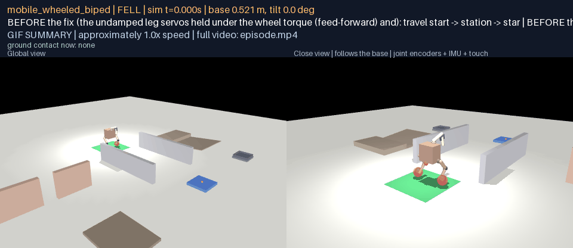

[episode.mp4](g17-before-after/biped-legs-held/before/media/episode.mp4) · [frames map](g17-before-after/biped-legs-held/before/media/frames.json)

**after** — success; 359 frames at 12 fps, real-time playback.

[episode.mp4](g17-before-after/biped-legs-held/after/media/episode.mp4) · [frames map](g17-before-after/biped-legs-held/after/media/frames.json)

### biped-arrival (mobile_wheeled_biped)

**Fix:** the navigator's run-in and floor at the drive's minimum speed, the lean fed forward, the integral gated during transients. **Symptom before:** after a push from behind the integral winds up, the body arrives fast and stops at the route point against the station platform, where a turn in place is blocked. Seed 201, 80 N aft push on the base for 0.3 s at 4 s.

| Side | Outcome | Reason | Duration | Distance | Peak speed | Saturation | Waypoints |
|---|---|---|---|---|---|---|---|
| before | **time_cap** | time cap: waypoint 1 of 2 not reached | 90.0 s | 4.19 m | 1.13 m/s | 0.0 | 1/2 |
| after | **success** | — | 32.92 s | 6.53 m | 1.11 m/s | 0.0 | 2/2 |

**before** — time_cap (time cap: waypoint 1 of 2 not reached); 1081 frames at 12 fps, real-time playback.

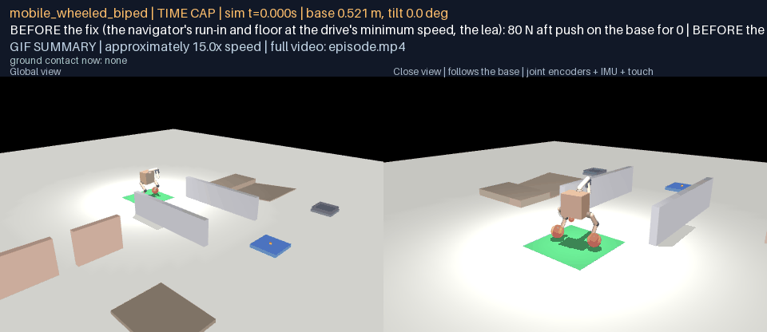

[episode.mp4](g17-before-after/biped-arrival/before/media/episode.mp4) · [frames map](g17-before-after/biped-arrival/before/media/frames.json)

**after** — success; 397 frames at 12 fps, real-time playback.

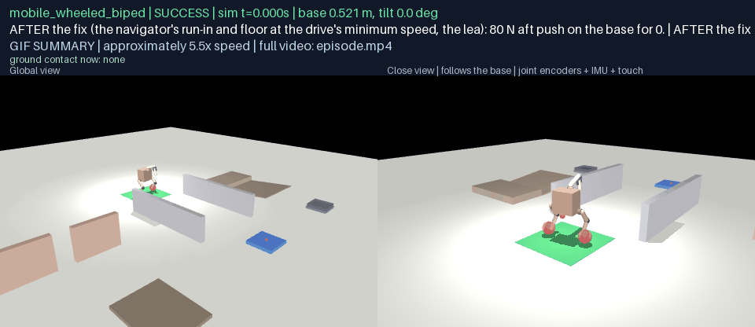

[episode.mp4](g17-before-after/biped-arrival/after/media/episode.mp4) · [frames map](g17-before-after/biped-arrival/after/media/frames.json)

### octopus-turn-sense (mobile_octopus)

**Fix:** the in-place sweep difference's sense corrected (it is the opposite of the moving differential's). **Symptom before:** at the station the body turns the wrong way for the command; the navigator's feedback then holds the heading at the seam and it never comes back. Seed 1, no disturbance.

| Side | Outcome | Reason | Duration | Distance | Peak speed | Saturation | Waypoints |
|---|---|---|---|---|---|---|---|
| before | **time_cap** | time cap: waypoint 1 of 2 not reached | 300.0 s | 4.99 m | 0.396 m/s | 0.0 | 1/2 |
| after | **success** | — | 140.18 s | 6.775 m | 0.413 m/s | 0.0002 | 2/2 |

**before** — time_cap (time cap: waypoint 1 of 2 not reached); 3602 frames at 12 fps, real-time playback.

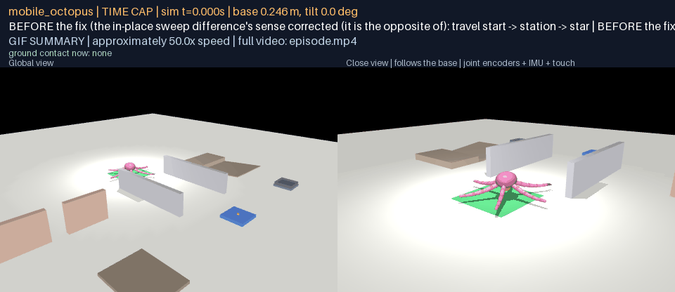

[episode.mp4](g17-before-after/octopus-turn-sense/before/media/episode.mp4) · [frames map](g17-before-after/octopus-turn-sense/before/media/frames.json)

**after** — success; 1684 frames at 12 fps, real-time playback.

[episode.mp4](g17-before-after/octopus-turn-sense/after/media/episode.mp4) · [frames map](g17-before-after/octopus-turn-sense/after/media/frames.json)

### dog-turn-boost (mobile_dog_arm)

**Fix:** the in-place stride difference half again as large. **Symptom before:** two-centimetre strides mostly slip: the turn at the station is slow. Seed 1, no disturbance.

| Side | Outcome | Reason | Duration | Distance | Peak speed | Saturation | Waypoints |
|---|---|---|---|---|---|---|---|
| before | **success** | — | 70.21 s | 8.0 m | 0.397 m/s | 0.0 | 2/2 |
| after | **success** | — | 64.43 s | 7.489 m | 0.397 m/s | 0.0 | 2/2 |

**before** — success; 844 frames at 12 fps, real-time playback.

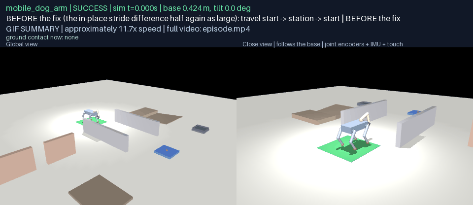

[episode.mp4](g17-before-after/dog-turn-boost/before/media/episode.mp4) · [frames map](g17-before-after/dog-turn-boost/before/media/frames.json)

**after** — success; 775 frames at 12 fps, real-time playback.

[episode.mp4](g17-before-after/dog-turn-boost/after/media/episode.mp4) · [frames map](g17-before-after/dog-turn-boost/after/media/frames.json)

## D17

### Synchronized course

The three bodies' first sealed travel successes composed side by side on one simulation clock (140.2 s, 1684 frames at 12 fps): the dog walks, the biped rolls, the octopus crawls the same course; a body that finishes early holds its final state. Sources: mobile_dog_arm mobile_dog_arm-travel-001 (success, 64.4 s); mobile_octopus mobile_octopus-travel-001 (success, 140.2 s); mobile_wheeled_biped mobile_wheeled_biped-travel-001 (success, 29.8 s).

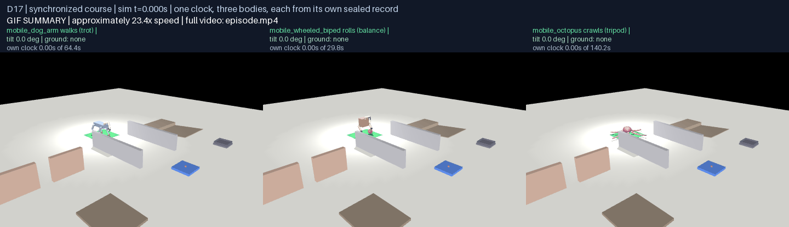

[episode.mp4](g17-d17/synchronized/media/episode.mp4) · [frames map](g17-d17/synchronized/media/frames.json)

### mobile_dog_arm

**travel: start -> station -> start (walks (trot))** — SUCCESS; 775 frames at 12 fps, real-time playback, the navigator's phase, the disturbance window, the base height and tilt, and the floor contacts on every frame.

[episode.mp4](g17-d17/mobile_dog_arm/travel/media/episode.mp4) · [frames map](g17-d17/mobile_dog_arm/travel/media/frames.json)

**push recovery: 40 N left push on the base for 0.3 s at 6.0 s** — SUCCESS; 792 frames at 12 fps, real-time playback, the navigator's phase, the disturbance window, the base height and tilt, and the floor contacts on every frame.

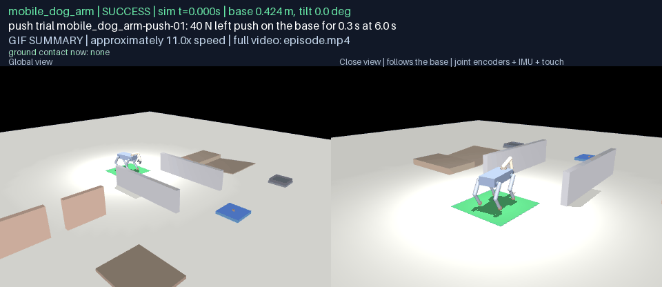

[episode.mp4](g17-d17/mobile_dog_arm/recovery-push/media/episode.mp4) · [frames map](g17-d17/mobile_dog_arm/recovery-push/media/frames.json)

**patch recovery: a slick patch (friction 0.15) across the corridor at x = 1.5 m, met on the way out and on the way back** — SUCCESS; 780 frames at 12 fps, real-time playback, the navigator's phase, the disturbance window, the base height and tilt, and the floor contacts on every frame.

[episode.mp4](g17-d17/mobile_dog_arm/recovery-patch/media/episode.mp4) · [frames map](g17-d17/mobile_dog_arm/recovery-patch/media/frames.json)

**support recovery: leg_fl's servos fought by a 8 N m external torque at 3 Hz for 1.0 s at 6.0 s** — SUCCESS; 795 frames at 12 fps, real-time playback, the navigator's phase, the disturbance window, the base height and tilt, and the floor contacts on every frame.

[episode.mp4](g17-d17/mobile_dog_arm/recovery-support/media/episode.mp4) · [frames map](g17-d17/mobile_dog_arm/recovery-support/media/frames.json)

**FAILURE (push): 70 N left push on the base for 0.3 s at 6.0 s; fell at 7.8 s** — FELL (fell at 7.8 s); 107 frames at 12 fps, real-time playback, the navigator's phase, the disturbance window, the base height and tilt, and the floor contacts on every frame.

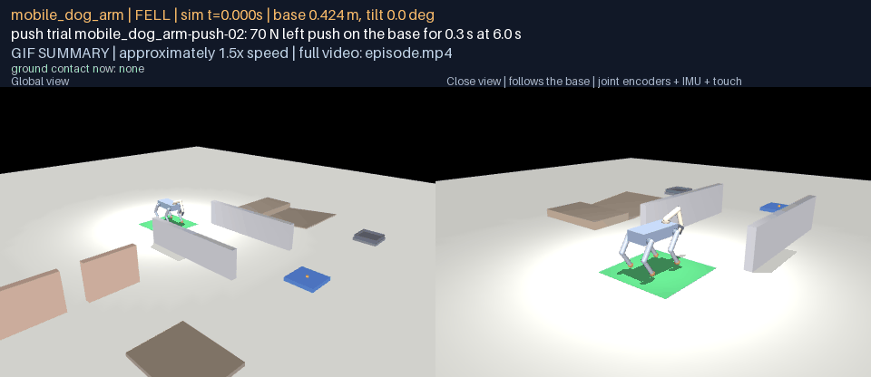

[episode.mp4](g17-d17/mobile_dog_arm/failure/media/episode.mp4) · [frames map](g17-d17/mobile_dog_arm/failure/media/frames.json)

### mobile_wheeled_biped

**travel: start -> station -> start (rolls (balance))** — SUCCESS; 359 frames at 12 fps, real-time playback, the navigator's phase, the disturbance window, the base height and tilt, and the floor contacts on every frame.

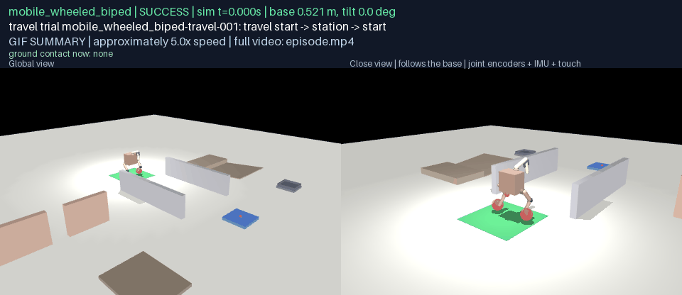

[episode.mp4](g17-d17/mobile_wheeled_biped/travel/media/episode.mp4) · [frames map](g17-d17/mobile_wheeled_biped/travel/media/frames.json)

**push recovery: 30 N left push on the base for 0.3 s at 4.0 s** — SUCCESS; 364 frames at 12 fps, real-time playback, the navigator's phase, the disturbance window, the base height and tilt, and the floor contacts on every frame.

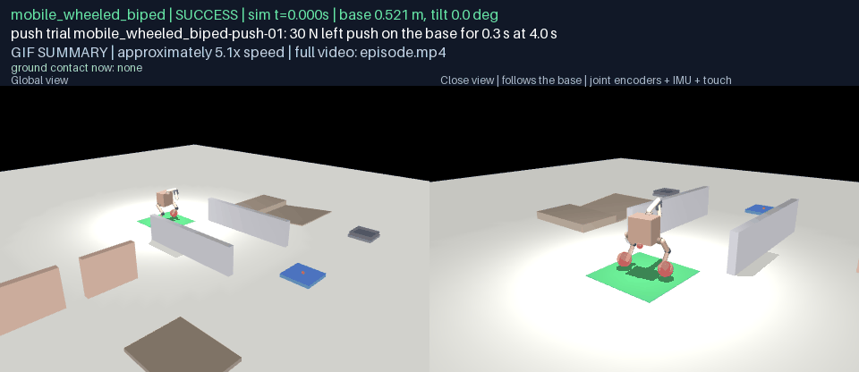

[episode.mp4](g17-d17/mobile_wheeled_biped/recovery-push/media/episode.mp4) · [frames map](g17-d17/mobile_wheeled_biped/recovery-push/media/frames.json)

**patch recovery: a slick patch (friction 0.15) across the corridor at x = 1.5 m, met on the way out and on the way back** — SUCCESS; 363 frames at 12 fps, real-time playback, the navigator's phase, the disturbance window, the base height and tilt, and the floor contacts on every frame.

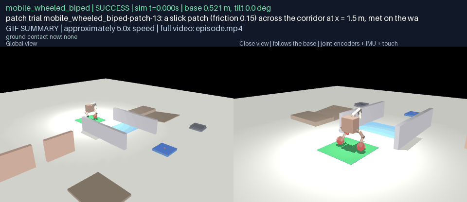

[episode.mp4](g17-d17/mobile_wheeled_biped/recovery-patch/media/episode.mp4) · [frames map](g17-d17/mobile_wheeled_biped/recovery-patch/media/frames.json)

**support recovery: the left wheel's drive cut by the controller for 0.15 s at 4.0 s** — SUCCESS; 351 frames at 12 fps, real-time playback, the navigator's phase, the disturbance window, the base height and tilt, and the floor contacts on every frame.

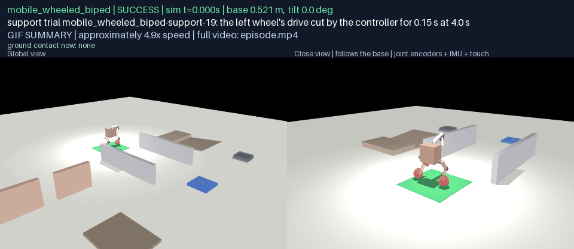

[episode.mp4](g17-d17/mobile_wheeled_biped/recovery-support/media/episode.mp4) · [frames map](g17-d17/mobile_wheeled_biped/recovery-support/media/frames.json)

**FAILURE (push): 80 N fore push on the base for 0.3 s at 4.0 s; fell at 5.9 s** — FELL (fell at 5.9 s); 84 frames at 12 fps, real-time playback, the navigator's phase, the disturbance window, the base height and tilt, and the floor contacts on every frame.

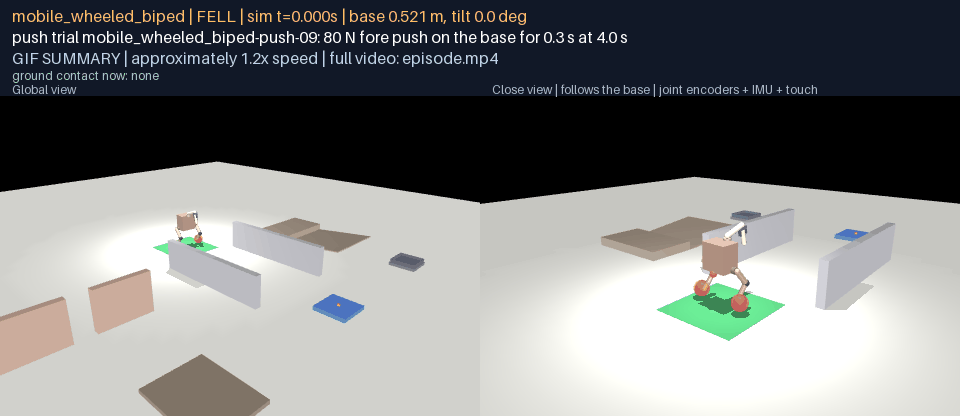

[episode.mp4](g17-d17/mobile_wheeled_biped/failure/media/episode.mp4) · [frames map](g17-d17/mobile_wheeled_biped/failure/media/frames.json)

### mobile_octopus

**travel: start -> station -> start (crawls (tripod))** — SUCCESS; 1684 frames at 12 fps, real-time playback, the navigator's phase, the disturbance window, the base height and tilt, and the floor contacts on every frame.

[episode.mp4](g17-d17/mobile_octopus/travel/media/episode.mp4) · [frames map](g17-d17/mobile_octopus/travel/media/frames.json)

**push recovery: 100 N left push on the base for 0.3 s at 8.0 s** — SUCCESS; 1708 frames at 12 fps, real-time playback, the navigator's phase, the disturbance window, the base height and tilt, and the floor contacts on every frame.

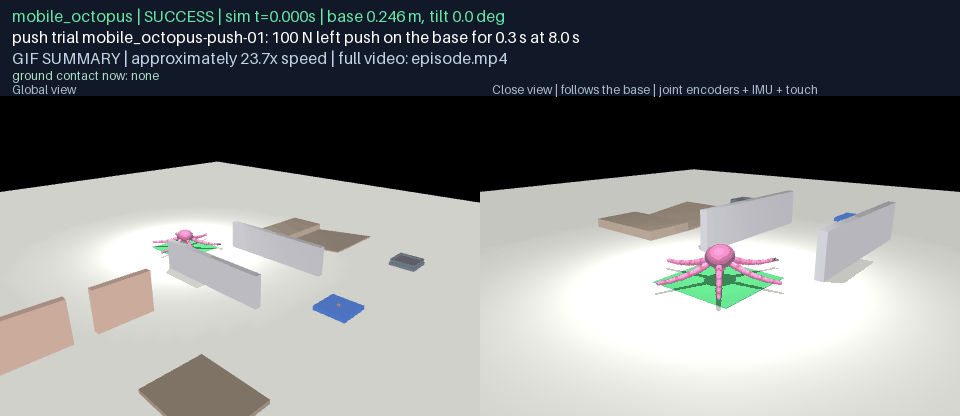

[episode.mp4](g17-d17/mobile_octopus/recovery-push/media/episode.mp4) · [frames map](g17-d17/mobile_octopus/recovery-push/media/frames.json)

**patch recovery: a slick patch (friction 0.15) across the corridor at x = 1.5 m, met on the way out and on the way back** — SUCCESS; 1844 frames at 12 fps, real-time playback, the navigator's phase, the disturbance window, the base height and tilt, and the floor contacts on every frame.

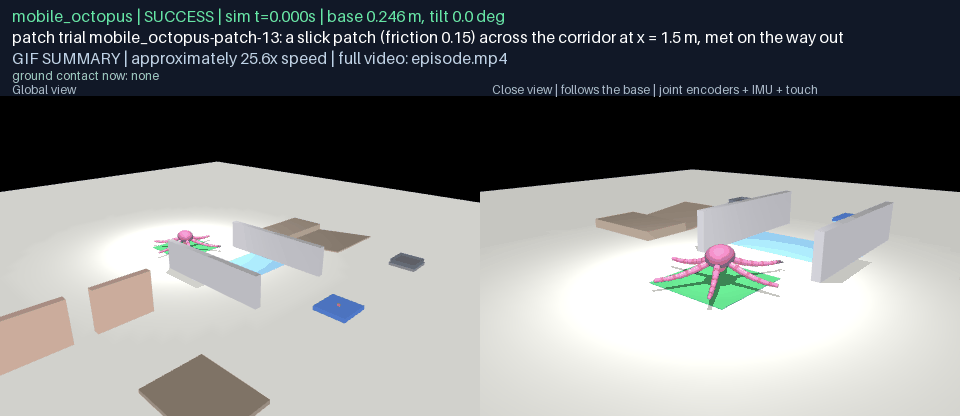

[episode.mp4](g17-d17/mobile_octopus/recovery-patch/media/episode.mp4) · [frames map](g17-d17/mobile_octopus/recovery-patch/media/frames.json)

**support recovery: tentacle_0's servos fought by a 4 N m external torque at 3 Hz for 1.5 s at 8.0 s** — SUCCESS; 1683 frames at 12 fps, real-time playback, the navigator's phase, the disturbance window, the base height and tilt, and the floor contacts on every frame.

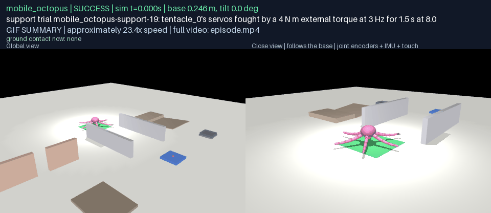

[episode.mp4](g17-d17/mobile_octopus/recovery-support/media/episode.mp4) · [frames map](g17-d17/mobile_octopus/recovery-support/media/frames.json)

**FAILURE (push): 300 N left push on the base for 0.3 s at 8.0 s; fell at 8.3 s** — FELL (fell at 8.3 s); 113 frames at 12 fps, real-time playback, the navigator's phase, the disturbance window, the base height and tilt, and the floor contacts on every frame.

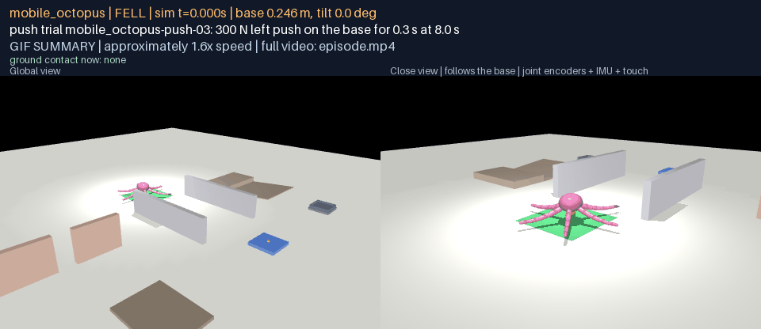

[episode.mp4](g17-d17/mobile_octopus/failure/media/episode.mp4) · [frames map](g17-d17/mobile_octopus/failure/media/frames.json)

## Verification

`python docs/results/verify_g17.py` recomputes every claim from the committed files: the protocol hashes to its registration and the course and bodies to what it names; each body's trial record holds exactly the registered trials, run under that registration; the outcome rule is re-applied to every row and must give the recorded verdict; every summary count and every number above is recomputed from the rows; every row's provenance is analytic and hand-authored with no root write and no artificial support; every failure is sealed; every D17 clip's source is a sealed row and its media bundle hashes whole. With `--replay`, every sealed run behind a D17 clip is replayed on native physics and must agree exactly, and its recorded user input is non-zero exactly when the trial declared a push or a fought limb. The sealed bundles live locally under `any-robot/results/g17-locomotion/` and `any-robot/results/g17-before-after/`; the trial records, summaries, media bundles and frame maps are committed.

## Limits

The failures above are the honest boundary of these controllers, and the clips in D17 show one of each body's. The navigator has no obstacle awareness: a wheel drive cut for half a second spins the biped while it balances and can leave it against a corridor wall, where a turn in place is blocked and the trial times out (three of its support trials ended so, one of them reaching the station only at 72 s). The biped cannot brake from a forward push before the station platform, whose 6 cm step its 8 cm wheels cannot climb, and its balance needs traction: the slickest patch on the approach, met again while accelerating out of the turn, can take it down. The dog's trot has no slip detection: on the slickest patch its feet slide and it can mark time until the cap. Support disturbances at the top of each ladder (a leg or a tentacle fought hard, a wheel drive cut for half a second) are meant to find the edge and sometimes do. None of this is hidden by the numbers: every failure is a sealed, replayable record.

