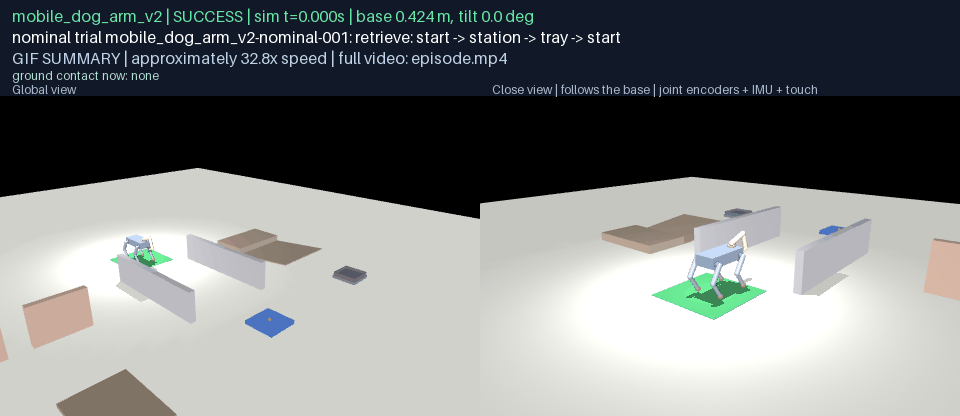
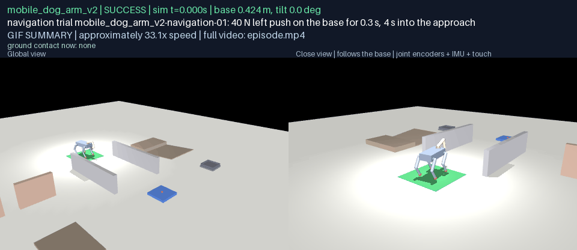
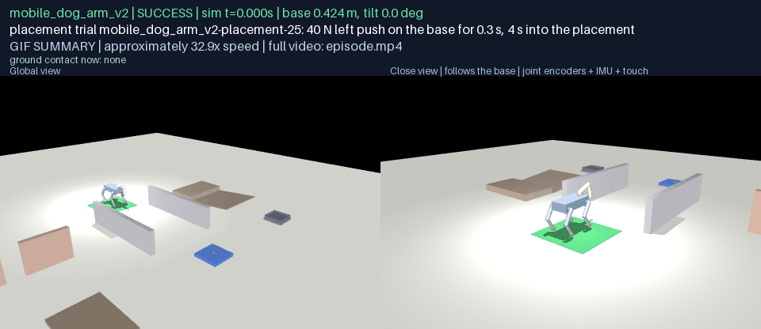
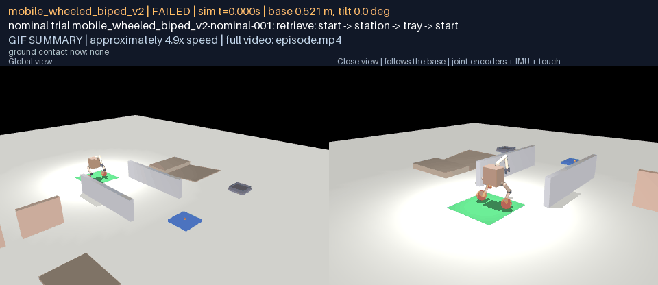
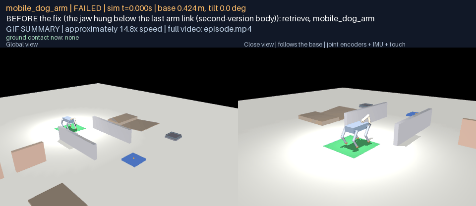
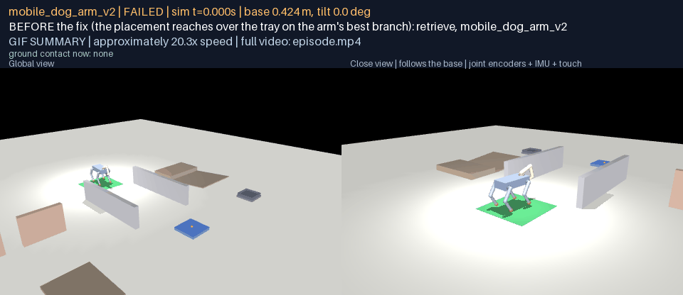
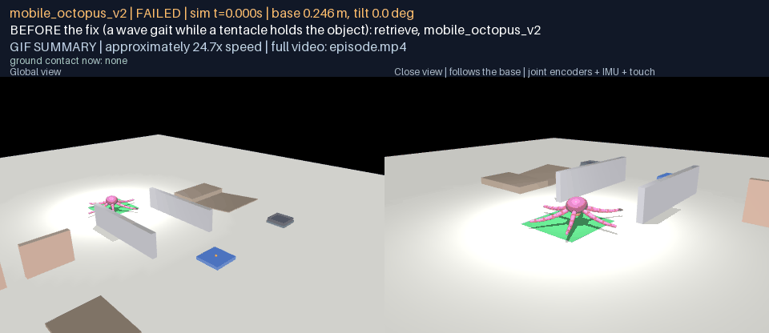

# G18 — Combine locomotion with manipulation

**Status:** A01–A04 assessed, with the shortfalls named below; D18 delivered. One retrieve contract (approach → stabilise → acquire → carry → place → return) drove all three bodies through the frozen course without the language planner, with an explicit resource schedule per phase and the holding limb out of the drive. Nominal: dog-plus-arm (v2 jaw) 100/100, wheeled biped (v2 jaw) 0/100, octopus (v2 pincer) 0/100 of 100 (target ≥ 80). Disturbed: dog-plus-arm (v2 jaw) 29/30, wheeled biped (v2 jaw) 0/30, octopus (v2 pincer) 0/30 of 30 (target ≥ 24). Every trial recorded on physics; every failure explicit, the first failure of each stage sealed and replayable. Three corrections to the G16 bodies were found and made as second versions beside the first (the dog's and the biped's jaws, the octopus's pincer); the first versions are untouched. No API or model calls. Verify with `python docs/results/verify_g18.py --replay`.

## What this goal asked

Execute approach object → stabilize → acquire → move while holding → place → return with the same root contract on the three bodies; at least 80 of 100 nominal full-task successes per body in the fixed world, with object control during base motion and correct support-resource allocation verified; 30 disturbances per body over navigation, carrying and placement with at least 24 recoveries and true completions and every other trial explicitly failed; shared limbs and support contacts validated: a limb used to hold an object cannot be assumed available for stance without a verified combined controller. D18: uninterrupted retrieve-and-deliver on dog, wheels and articulated tentacles, with carrying perturbations.

## What was built

**One contract, three bodies.** `rigby_general.mobility.retrieve` runs the course's retrieve goal as six phases for every body: approach (the G17 navigator to a run-up point, then to a stand-off point on the fixture's axis at the body's grasp radius, then facing the object), stabilise (the walker lies down in its parked stance to reach, the roller and the crawler reach from their working stances, two seconds still), acquire (the jaw comes up, over and straight down on the object in closed-loop steps that cancel the servos' sag and stop when the wrist meets it; the pincer comes at it from the side at its own height with its fingers open around it; the jaw closes, the object is lifted and tucked, the walker rises), carry (the navigator again, the holding limb out of the drive, the hold checked every step), place (over the tray on the arm's best branch, down inside the rim, release, up), return (the navigator to the start pad). Success is one rule: the cube at rest inside the tray's rim, the base within 45 cm of the start, stable for two seconds, no fall. What differs per body is read from its declaration and measured reach: which limb manipulates, where it stands, whether it lies down.

**Resource schedule and invariant.** Each phase attempt records the support set and the holding limb. A limb holding the object is excluded from the drive for as long as it holds: the octopus crawls on five tentacles, and because a tripod with one tentacle missing stands on two in one of its phases, it crawls a wave (one tentacle lifted at a time) while holding. The invariant that a holding limb's links bear no ground contact is checked from the recorded contacts at every step; a violation is counted and reported, not hidden.

**Recorded, disturbed, replayable.** The root is placed once and never written again; the object is never written; its pose is read from the simulator's state in place of perception (the mobile bodies carry no camera). A push is a force on the base, an object disturbance a force on the held cube, a support disturbance a limb fought by an external joint torque or a wheel drive cut by the controller; all recorded as user input and replayed exactly. Every row keeps the phases with their timing, attempts, support set and holding limb, the hold events, the invariant checks, the object's slip while carried, falls and collisions, energy, distance, latency, the time against the cap, the actuation and support logs.

**Three corrections to the bodies, as second versions.** G18 found that the first-version jaws could not take a 30 mm cube: the wrist capsule of the dog's and the biped's arms ran between the fingers (the palm sat 3 cm below the last link's origin, inside its capsule), so a jaw closed on the cube's top few millimetres and lost it on the lift; and the octopus's pincer hinges had a range of −0.05 to 0.9 rad with the positive sense closing, so the open fingers parted 2.8–3.3 cm around the 3.0 cm cube, and a cube pinched at two points by round fingers pivoted freely out. `mobile_dog_arm_v2`, `mobile_wheeled_biped_v2` and `mobile_octopus_v2` hang the jaw below the last link, open the pincer to −0.9 rad and give its finger pads torsional friction; they rebuild byte for byte from the builder beside the first versions, which G16 validated and G17 drove and which do not change. The biped's second version still cannot reach the station's cube from any pose it can hold (its arm mount stands 0.89 m up when balancing and its wheels stand a third of a metre ahead of the torso when parked): the G16 reach rule looked at height alone, and this goal records the correction.

**A registered protocol.** `g18-retrieve-v1` (registration `ba2c91aa8d68`, course `244af80bd16b`) fixes 100 nominal seeds per body (jitter 10 cm, 10°) and 30 disturbances on their own seeds: 10 during navigation (8 pushes on the base and 2 support disturbances), 14 while carrying (8 pushes, 4 forces on the held object, 2 support disturbances with the object in hand), 6 during placement (4 pushes and 2 forces on the object as it is set down). Caps: dog 360 s, biped 200 s, octopus 800 s. The campaign refuses a protocol, course or body that no longer hashes to the registration.

## Results

### Nominal retrieves

| Body | Trials | Completed | Falls | Cube in tray | Hold lost | Recovered after a loss | Retries used | Invariant violations | Mean duration of successes / cap | Max object slip while held | Latency p99 (max) | Target |
|---|---|---|---|---|---|---|---|---|---|---|---|---|
| mobile_dog_arm_v2 | 100 | **100** | 0 | 100 | 0 | 0 | 1 | 0 | 196.8 s / 360 s | 4.2 cm | 0.231 ms | ≥ 80: met |
| mobile_wheeled_biped_v2 | 100 | **0** | 0 | 0 | 0 | 0 | 100 | 0 | 0.0 s / 200 s | 0.0 cm | 0.277 ms | ≥ 80: NOT met |
| mobile_octopus_v2 | 100 | **0** | 0 | 0 | 100 | 0 | 100 | 286 | 0.0 s / 800 s | 64.1 cm | 0.645 ms | ≥ 80: NOT met |

Where the trials that did not complete got to:

- mobile_dog_arm_v2: last phase reached {"return": 100}; failure reasons {"approach": 1}
- mobile_wheeled_biped_v2: last phase reached {"acquire": 100}; failure reasons {"acquire": 130}
- mobile_octopus_v2: last phase reached {"acquire": 96, "approach": 2, "carry": 2}; failure reasons {"carry": 4, "re-acquire": 124, "recovery after carry": 2}

### Disturbed retrieves, by stage

| Body | Stage | Trials | Recovered and completed | Falls | Hold lost | Recovered after a loss | Invariant violations | Target |
|---|---|---|---|---|---|---|---|---|
| mobile_dog_arm_v2 | navigation | 10 | **9** | 1 | 0 | 0 | 0 | |
| mobile_dog_arm_v2 | carrying | 14 | **14** | 0 | 0 | 0 | 0 | |
| mobile_dog_arm_v2 | placement | 6 | **6** | 0 | 0 | 0 | 0 | |
| mobile_dog_arm_v2 | **all** | 30 | **29** | | | | | ≥ 24: met |
| mobile_wheeled_biped_v2 | navigation | 10 | **0** | 0 | 0 | 0 | 0 | |
| mobile_wheeled_biped_v2 | carrying | 14 | **0** | 0 | 0 | 0 | 0 | |
| mobile_wheeled_biped_v2 | placement | 6 | **0** | 0 | 0 | 0 | 0 | |
| mobile_wheeled_biped_v2 | **all** | 30 | **0** | | | | | ≥ 24: NOT met |
| mobile_octopus_v2 | navigation | 10 | **0** | 0 | 10 | 0 | 15 | |
| mobile_octopus_v2 | carrying | 14 | **0** | 1 | 13 | 0 | 31 | |
| mobile_octopus_v2 | placement | 6 | **0** | 0 | 6 | 0 | 127 | |
| mobile_octopus_v2 | **all** | 30 | **0** | | | | | ≥ 24: NOT met |

A recovery is the contract's own: a hold lost during the carry sends the body back to the object where it lies (approach, stabilise, acquire again); a placement that leaves the cube outside the rim does the same; the retry budget is two. Every trial that did not complete is explicitly failed with its reason; the first failure of each stage and the first two successes are sealed and replayable (a crawler's sealed trial takes three quarters of a gigabyte, and the campaign stops sealing when the disk holding the local bundles reaches its floor; the rows say so).

### Every failure

**mobile_dog_arm_v2** — 1 of 130 trials failed, 1 of them sealed and replayable.

| Trial | Stage | Disturbance | Last phase | Reason |
|---|---|---|---|---|
| mobile_dog_arm_v2-navigation-02 | navigation | 70 N left push on the base for 0.3 s, 4 s into the approach | approach | approach: fell at 6.6 s |

**mobile_wheeled_biped_v2** — 130 of 130 trials failed, 130 of them sealed and replayable. The first 40 are listed; the rest are in the trial record.

| Trial | Stage | Disturbance | Last phase | Reason |
|---|---|---|---|---|
| mobile_wheeled_biped_v2-nominal-001 | nominal | none | acquire | acquire: object out of reach: pre-grasp residual 11.8 cm |
| mobile_wheeled_biped_v2-nominal-002 | nominal | none | acquire | acquire: object out of reach: pre-grasp residual 11.8 cm |
| mobile_wheeled_biped_v2-nominal-003 | nominal | none | acquire | acquire: object out of reach: pre-grasp residual 11.8 cm |
| mobile_wheeled_biped_v2-nominal-004 | nominal | none | acquire | acquire: object out of reach: pre-grasp residual 11.8 cm |
| mobile_wheeled_biped_v2-nominal-005 | nominal | none | acquire | acquire: object out of reach: pre-grasp residual 11.8 cm |
| mobile_wheeled_biped_v2-nominal-006 | nominal | none | acquire | acquire: object out of reach: pre-grasp residual 11.8 cm |
| mobile_wheeled_biped_v2-nominal-007 | nominal | none | acquire | acquire: object out of reach: pre-grasp residual 11.8 cm |
| mobile_wheeled_biped_v2-nominal-008 | nominal | none | acquire | acquire: object out of reach: pre-grasp residual 11.8 cm |
| mobile_wheeled_biped_v2-nominal-009 | nominal | none | acquire | acquire: object out of reach: pre-grasp residual 11.8 cm |
| mobile_wheeled_biped_v2-nominal-010 | nominal | none | acquire | acquire: object out of reach: pre-grasp residual 11.8 cm |
| mobile_wheeled_biped_v2-nominal-011 | nominal | none | acquire | acquire: object out of reach: pre-grasp residual 11.8 cm |
| mobile_wheeled_biped_v2-nominal-012 | nominal | none | acquire | acquire: object out of reach: pre-grasp residual 11.8 cm |
| mobile_wheeled_biped_v2-nominal-013 | nominal | none | acquire | acquire: object out of reach: pre-grasp residual 11.8 cm |
| mobile_wheeled_biped_v2-nominal-014 | nominal | none | acquire | acquire: object out of reach: pre-grasp residual 11.8 cm |
| mobile_wheeled_biped_v2-nominal-015 | nominal | none | acquire | acquire: object out of reach: pre-grasp residual 11.8 cm |
| mobile_wheeled_biped_v2-nominal-016 | nominal | none | acquire | acquire: object out of reach: pre-grasp residual 11.8 cm |
| mobile_wheeled_biped_v2-nominal-017 | nominal | none | acquire | acquire: object out of reach: pre-grasp residual 11.8 cm |
| mobile_wheeled_biped_v2-nominal-018 | nominal | none | acquire | acquire: object out of reach: pre-grasp residual 11.8 cm |
| mobile_wheeled_biped_v2-nominal-019 | nominal | none | acquire | acquire: object out of reach: pre-grasp residual 11.8 cm |
| mobile_wheeled_biped_v2-nominal-020 | nominal | none | acquire | acquire: object out of reach: pre-grasp residual 11.8 cm |
| mobile_wheeled_biped_v2-nominal-021 | nominal | none | acquire | acquire: object out of reach: pre-grasp residual 11.8 cm |
| mobile_wheeled_biped_v2-nominal-022 | nominal | none | acquire | acquire: object out of reach: pre-grasp residual 11.8 cm |
| mobile_wheeled_biped_v2-nominal-023 | nominal | none | acquire | acquire: object out of reach: pre-grasp residual 11.8 cm |
| mobile_wheeled_biped_v2-nominal-024 | nominal | none | acquire | acquire: object out of reach: pre-grasp residual 11.8 cm |
| mobile_wheeled_biped_v2-nominal-025 | nominal | none | acquire | acquire: object out of reach: pre-grasp residual 11.8 cm |
| mobile_wheeled_biped_v2-nominal-026 | nominal | none | acquire | acquire: object out of reach: pre-grasp residual 11.8 cm |
| mobile_wheeled_biped_v2-nominal-027 | nominal | none | acquire | acquire: object out of reach: pre-grasp residual 11.8 cm |
| mobile_wheeled_biped_v2-nominal-028 | nominal | none | acquire | acquire: object out of reach: pre-grasp residual 11.8 cm |
| mobile_wheeled_biped_v2-nominal-029 | nominal | none | acquire | acquire: object out of reach: pre-grasp residual 11.8 cm |
| mobile_wheeled_biped_v2-nominal-030 | nominal | none | acquire | acquire: object out of reach: pre-grasp residual 11.8 cm |
| mobile_wheeled_biped_v2-nominal-031 | nominal | none | acquire | acquire: object out of reach: pre-grasp residual 11.8 cm |
| mobile_wheeled_biped_v2-nominal-032 | nominal | none | acquire | acquire: object out of reach: pre-grasp residual 11.8 cm |
| mobile_wheeled_biped_v2-nominal-033 | nominal | none | acquire | acquire: object out of reach: pre-grasp residual 11.8 cm |
| mobile_wheeled_biped_v2-nominal-034 | nominal | none | acquire | acquire: object out of reach: pre-grasp residual 11.8 cm |
| mobile_wheeled_biped_v2-nominal-035 | nominal | none | acquire | acquire: object out of reach: pre-grasp residual 11.8 cm |
| mobile_wheeled_biped_v2-nominal-036 | nominal | none | acquire | acquire: object out of reach: pre-grasp residual 11.8 cm |
| mobile_wheeled_biped_v2-nominal-037 | nominal | none | acquire | acquire: object out of reach: pre-grasp residual 11.8 cm |
| mobile_wheeled_biped_v2-nominal-038 | nominal | none | acquire | acquire: object out of reach: pre-grasp residual 11.8 cm |
| mobile_wheeled_biped_v2-nominal-039 | nominal | none | acquire | acquire: object out of reach: pre-grasp residual 11.8 cm |
| mobile_wheeled_biped_v2-nominal-040 | nominal | none | acquire | acquire: object out of reach: pre-grasp residual 11.8 cm |

**mobile_octopus_v2** — 130 of 130 trials failed, 4 of them sealed and replayable. The first 40 are listed; the rest are in the trial record.

| Trial | Stage | Disturbance | Last phase | Reason |
|---|---|---|---|---|
| mobile_octopus_v2-nominal-001 | nominal | none | acquire | re-acquire: grasp miss 4.7 cm across, 1.0 cm up; the object moved 0.0 cm |
| mobile_octopus_v2-nominal-002 | nominal | none | acquire | re-acquire: grasp miss 0.1 cm across, -0.1 cm up; the object moved 4.6 cm |
| mobile_octopus_v2-nominal-003 | nominal | none | acquire | re-acquire: object out of reach: pre-grasp residual 35.4 cm |
| mobile_octopus_v2-nominal-004 | nominal | none | acquire | re-acquire: fingers did not both close on the object ((False, False)) |
| mobile_octopus_v2-nominal-005 | nominal | none | acquire | re-acquire: object out of reach: pre-grasp residual 36.8 cm |
| mobile_octopus_v2-nominal-006 | nominal | none | acquire | re-acquire: object out of reach: pre-grasp residual 38.1 cm |
| mobile_octopus_v2-nominal-007 | nominal | none | acquire | re-acquire: object out of reach: pre-grasp residual 4.2 cm |
| mobile_octopus_v2-nominal-008 | nominal | none | acquire | re-acquire: grasp miss 7.4 cm across, -2.4 cm up; the object moved 0.0 cm |
| mobile_octopus_v2-nominal-009 | nominal | none | acquire | re-acquire: the object did not come up with the jaw |
| mobile_octopus_v2-nominal-010 | nominal | none | acquire | re-acquire: fingers did not both close on the object ((False, False)) |
| mobile_octopus_v2-nominal-011 | nominal | none | acquire | re-acquire: object out of reach: pre-grasp residual 37.2 cm |
| mobile_octopus_v2-nominal-012 | nominal | none | acquire | re-acquire: object out of reach: pre-grasp residual 5.0 cm |
| mobile_octopus_v2-nominal-013 | nominal | none | acquire | re-acquire: object out of reach: pre-grasp residual 3.3 cm |
| mobile_octopus_v2-nominal-014 | nominal | none | acquire | re-acquire: object out of reach: pre-grasp residual 4.2 cm |
| mobile_octopus_v2-nominal-015 | nominal | none | acquire | re-acquire: fingers did not both close on the object ((True, False)) |
| mobile_octopus_v2-nominal-016 | nominal | none | acquire | re-acquire: grasp miss 7.4 cm across, -1.8 cm up; the object moved 0.0 cm |
| mobile_octopus_v2-nominal-017 | nominal | none | carry | carry: hold lost at 676.2 s |
| mobile_octopus_v2-nominal-018 | nominal | none | acquire | re-acquire: grasp miss 1.9 cm across, -1.9 cm up; the object moved 1.4 cm |
| mobile_octopus_v2-nominal-019 | nominal | none | acquire | re-acquire: object out of reach: pre-grasp residual 31.6 cm |
| mobile_octopus_v2-nominal-020 | nominal | none | acquire | re-acquire: object out of reach: pre-grasp residual 5.0 cm |
| mobile_octopus_v2-nominal-021 | nominal | none | acquire | re-acquire: object out of reach: pre-grasp residual 42.0 cm |
| mobile_octopus_v2-nominal-022 | nominal | none | acquire | re-acquire: grasp miss 7.2 cm across, -2.2 cm up; the object moved 0.0 cm |
| mobile_octopus_v2-nominal-023 | nominal | none | acquire | re-acquire: grasp miss 1.8 cm across, 1.5 cm up; the object moved 1.1 cm |
| mobile_octopus_v2-nominal-024 | nominal | none | acquire | re-acquire: grasp miss 2.1 cm across, -2.0 cm up; the object moved 0.9 cm |
| mobile_octopus_v2-nominal-025 | nominal | none | acquire | re-acquire: object out of reach: pre-grasp residual 35.0 cm |
| mobile_octopus_v2-nominal-026 | nominal | none | acquire | re-acquire: fingers did not both close on the object ((False, False)) |
| mobile_octopus_v2-nominal-027 | nominal | none | approach | recovery after carry: phase budget |
| mobile_octopus_v2-nominal-028 | nominal | none | acquire | re-acquire: the object was lost while tucking |
| mobile_octopus_v2-nominal-029 | nominal | none | acquire | re-acquire: object out of reach: pre-grasp residual 41.2 cm |
| mobile_octopus_v2-nominal-030 | nominal | none | acquire | re-acquire: object out of reach: pre-grasp residual 8.5 cm |
| mobile_octopus_v2-nominal-031 | nominal | none | acquire | re-acquire: grasp miss 3.3 cm across, 0.6 cm up; the object moved 5.9 cm |
| mobile_octopus_v2-nominal-032 | nominal | none | acquire | re-acquire: object out of reach: pre-grasp residual 3.9 cm |
| mobile_octopus_v2-nominal-033 | nominal | none | acquire | re-acquire: object out of reach: pre-grasp residual 41.0 cm |
| mobile_octopus_v2-nominal-034 | nominal | none | acquire | re-acquire: fingers did not both close on the object ((True, False)) |
| mobile_octopus_v2-nominal-035 | nominal | none | acquire | re-acquire: object out of reach: pre-grasp residual 40.9 cm |
| mobile_octopus_v2-nominal-036 | nominal | none | acquire | re-acquire: object out of reach: pre-grasp residual 34.5 cm |
| mobile_octopus_v2-nominal-037 | nominal | none | acquire | re-acquire: grasp miss 2.3 cm across, -2.2 cm up; the object moved 0.1 cm |
| mobile_octopus_v2-nominal-038 | nominal | none | acquire | re-acquire: grasp miss 8.2 cm across, -1.1 cm up; the object moved 0.0 cm |
| mobile_octopus_v2-nominal-039 | nominal | none | acquire | re-acquire: the object was lost while tucking |
| mobile_octopus_v2-nominal-040 | nominal | none | acquire | re-acquire: object out of reach: pre-grasp residual 20.1 cm |

### Resource schedule, provenance and the logs

| Body | Manipulator | Reaches from | Support while holding | Controller | Root writes | Object writes | Artificial support |
|---|---|---|---|---|---|---|---|
| mobile_dog_arm_v2 | arm | parked | 4 members (the holding limb's excluded) | DogTrot | none after placement | none | none |
| mobile_wheeled_biped_v2 | arm | its working stance | — members (the holding limb's excluded) | WheeledBalance | none after placement | none | none |
| mobile_octopus_v2 | tentacle_0 | its working stance | 27 members (the holding limb's excluded) | OctopusCrawl | none after placement | none | none |

Provenance on every row: analytic, hand-authored: tripod crawl of six segmented tentacles, position servos on every joint; manipulation: numerical reach on the declared grasp site, position servos; analytic, hand-authored: trot gait over an analytic leg IK, position servos; manipulation: numerical reach on the declared grasp site, position servos; analytic, hand-authored: wheeled inverted-pendulum balance (pitch regulator about a speed-commanding lean) through velocity servos on the wheels, legs held; manipulation: numerical reach on the declared grasp site, position servos.

## D18

### mobile_dog_arm_v2

**retrieve and deliver: start -> station -> tray -> start (dog (v2 jaw))** — SUCCESS; phases completed: acquire, approach, carry, place, return, stabilize; 2360 frames at 12 fps, real-time playback, every phase attempt with its support set and holding limb, the hold events and the disturbance window in the banner.

[episode.mp4](g18-d18/mobile_dog_arm_v2/retrieve/media/episode.mp4) · [frames map](g18-d18/mobile_dog_arm_v2/retrieve/media/frames.json)

**navigation disturbance, recovered: 40 N left push on the base for 0.3 s, 4 s into the approach** — SUCCESS; phases completed: acquire, approach, carry, place, return, stabilize; 2380 frames at 12 fps, real-time playback, every phase attempt with its support set and holding limb, the hold events and the disturbance window in the banner.

[episode.mp4](g18-d18/mobile_dog_arm_v2/recovery-navigation/media/episode.mp4) · [frames map](g18-d18/mobile_dog_arm_v2/recovery-navigation/media/frames.json)

**carrying disturbance, recovered: 40 N left push on the base for 0.3 s, 6 s into the carry** — SUCCESS; phases completed: acquire, approach, carry, place, return, stabilize; 2370 frames at 12 fps, real-time playback, every phase attempt with its support set and holding limb, the hold events and the disturbance window in the banner.

[episode.mp4](g18-d18/mobile_dog_arm_v2/recovery-carrying/media/episode.mp4) · [frames map](g18-d18/mobile_dog_arm_v2/recovery-carrying/media/frames.json)

**placement disturbance, recovered: 40 N left push on the base for 0.3 s, 4 s into the placement** — SUCCESS; phases completed: acquire, approach, carry, place, return, stabilize; 2369 frames at 12 fps, real-time playback, every phase attempt with its support set and holding limb, the hold events and the disturbance window in the banner.

[episode.mp4](g18-d18/mobile_dog_arm_v2/recovery-placement/media/episode.mp4) · [frames map](g18-d18/mobile_dog_arm_v2/recovery-placement/media/frames.json)

**FAILURE (navigation): 70 N left push on the base for 0.3 s, 4 s into the approach; approach: fell at 6.6 s** — FELL (approach: fell at 6.6 s); phases completed: none; 81 frames at 12 fps, real-time playback, every phase attempt with its support set and holding limb, the hold events and the disturbance window in the banner.

[episode.mp4](g18-d18/mobile_dog_arm_v2/failure/media/episode.mp4) · [frames map](g18-d18/mobile_dog_arm_v2/failure/media/frames.json)

### mobile_wheeled_biped_v2

**FAILURE (nominal): nominal; acquire: object out of reach: pre-grasp residual 11.8 cm** — FAILED (acquire: object out of reach: pre-grasp residual 11.8 cm); phases completed: approach, stabilize; 350 frames at 12 fps, real-time playback, every phase attempt with its support set and holding limb, the hold events and the disturbance window in the banner.

[episode.mp4](g18-d18/mobile_wheeled_biped_v2/failure/media/episode.mp4) · [frames map](g18-d18/mobile_wheeled_biped_v2/failure/media/frames.json)

### mobile_octopus_v2

**FAILURE (nominal): nominal; re-acquire: grasp miss 4.7 cm across, 1.0 cm up; the object moved 0.0 cm** — FAILED (re-acquire: grasp miss 4.7 cm across, 1.0 cm up; the object moved 0.0 cm); phases completed: acquire, approach, stabilize; 7823 frames at 12 fps, real-time playback, every phase attempt with its support set and holding limb, the hold events and the disturbance window in the banner.

[episode.mp4](g18-d18/mobile_octopus_v2/failure/media/episode.mp4) · [frames map](g18-d18/mobile_octopus_v2/failure/media/frames.json)

## Before and after each fix, on identical physics

Each pair runs the same course, seed and controller twice, once as it was and once as committed; both runs are sealed and rendered in full with the side named in the banner. Two pairs are body corrections (the first-version body against the second on the same seed), two are controller fixes switched off and on.

| Pair | Seed | What was wrong | The fix | Before | After |
|---|---|---|---|---|---|
| dog-jaw | 1 | the first version's wrist capsule ran between the fingers: the jaw closed on the cube's top few millimetres and lost it on the lift | the jaw hung below the last arm link (second-version body) | FAILED (acquire: grasp miss 0.1 cm across, -3.2 cm up; the object moved 0.9 cm); phases: approach, stabilize | **completed**; phases: acquire, approach, carry, place, return, stabilize |
| dog-place-branch | 2 | a straight-line move from the carry pose kept the arm folded back over the torso and brought the wrist down on the tray's rim | the placement reaches over the tray on the arm's best branch | FAILED (place: tray out of reach: residual 15.2 cm); phases: acquire, approach, carry, stabilize | **completed**; phases: acquire, approach, carry, place, return, stabilize |
| octopus-pincer | 1 | the first version's open fingers parted less than the cube, so the pincer could not close on it | pincer hinges that open to -0.9 rad and finger pads with torsional friction (second-version body) | FAILED (acquire: grasp miss 8.5 cm across, -0.6 cm up; the object moved 0.0 cm); phases: approach, stabilize | FAILED (re-acquire: grasp miss 4.7 cm across, 1.0 cm up; the object moved 0.0 cm); phases: acquire, approach, stabilize |
| octopus-wave-gait | 1 | the tripod with a tentacle held out stood on two tentacles in one of its phases, and the mantle's rocking shook the object out | a wave gait while a tentacle holds the object | FAILED (carry: hold lost at 148.1 s); phases: acquire, approach, stabilize | FAILED (carry: hold lost at 146.8 s); phases: acquire, approach, stabilize |

**dog-jaw — before the fix** (mobile_dog_arm, seed 1): FAILED (acquire: grasp miss 0.1 cm across, -3.2 cm up; the object moved 0.9 cm); phases: approach, stabilize; 1062 frames at 12 fps, real-time playback.

[episode.mp4](g18-before-after/dog-jaw/before/media/episode.mp4) · [frames map](g18-before-after/dog-jaw/before/media/frames.json)

**dog-jaw — after the fix** (mobile_dog_arm_v2, seed 1): **completed**; phases: acquire, approach, carry, place, return, stabilize; 2360 frames at 12 fps, real-time playback.

[episode.mp4](g18-before-after/dog-jaw/after/media/episode.mp4) · [frames map](g18-before-after/dog-jaw/after/media/frames.json)

**dog-place-branch — before the fix** (mobile_dog_arm_v2, seed 2): FAILED (place: tray out of reach: residual 15.2 cm); phases: acquire, approach, carry, stabilize; 1462 frames at 12 fps, real-time playback.

[episode.mp4](g18-before-after/dog-place-branch/before/media/episode.mp4) · [frames map](g18-before-after/dog-place-branch/before/media/frames.json)

**dog-place-branch — after the fix** (mobile_dog_arm_v2, seed 2): **completed**; phases: acquire, approach, carry, place, return, stabilize; 2352 frames at 12 fps, real-time playback.

[episode.mp4](g18-before-after/dog-place-branch/after/media/episode.mp4) · [frames map](g18-before-after/dog-place-branch/after/media/frames.json)

**octopus-pincer — before the fix** (mobile_octopus, seed 1): FAILED (acquire: grasp miss 8.5 cm across, -0.6 cm up; the object moved 0.0 cm); phases: approach, stabilize; 2010 frames at 12 fps, real-time playback.

[episode.mp4](g18-before-after/octopus-pincer/before/media/episode.mp4) · [frames map](g18-before-after/octopus-pincer/before/media/frames.json)

**octopus-pincer — after the fix** (mobile_octopus_v2, seed 1): FAILED (re-acquire: grasp miss 4.7 cm across, 1.0 cm up; the object moved 0.0 cm); phases: acquire, approach, stabilize; 7823 frames at 12 fps, real-time playback.

[episode.mp4](g18-before-after/octopus-pincer/after/media/episode.mp4) · [frames map](g18-before-after/octopus-pincer/after/media/frames.json)

**octopus-wave-gait — before the fix** (mobile_octopus_v2, seed 1, no going back for a lost hold: the pair shows the carry, not the recovery): FAILED (carry: hold lost at 148.1 s); phases: acquire, approach, stabilize; 1779 frames at 12 fps, real-time playback.

[episode.mp4](g18-before-after/octopus-wave-gait/before/media/episode.mp4) · [frames map](g18-before-after/octopus-wave-gait/before/media/frames.json)

**octopus-wave-gait — after the fix** (mobile_octopus_v2, seed 1, no going back for a lost hold: the pair shows the carry, not the recovery): FAILED (carry: hold lost at 146.8 s); phases: acquire, approach, stabilize; 1763 frames at 12 fps, real-time playback.

[episode.mp4](g18-before-after/octopus-wave-gait/after/media/episode.mp4) · [frames map](g18-before-after/octopus-wave-gait/after/media/frames.json)

## Verification

`python docs/results/verify_g18.py` recomputes every claim from the committed files: the protocol hashes to its registration and the course and bodies to what it names; the three second-version bodies rebuild byte for byte from the builder with their corrections in place and the first versions unchanged; each body's trial record holds exactly the registered trials, run under that registration; the outcome rule is re-applied to every row; every summary count is recomputed; every phase's support set excludes the holding limb's members and the holding limb is out of the drive; every row names no root write, no object write and no artificial support; every failure is explicit, the first failure of each stage is sealed and an unsealed failure says why; every before/after pair's two runs are sealed and their media hash whole; every D18 clip's source is a sealed row and its media bundle hashes whole. With `--replay`, every sealed run behind a D18 clip is replayed on native physics and must agree exactly.

## Limits

The biped cannot retrieve at all with this geometry: its trials end at acquire with the object out of reach, explicitly, every time. The octopus acquires the cube in 130 of its 130 trials and loses it in 129: the pinch between two round finger pads on a tentacle that rides a crawling mantle works loose 17–27 s into the carry (median 25 s), the cube lands on the floor beside the station, and the recovery cannot take it from there (the pincer comes at an object from the side at its own height, and a cube on the floor under the mantle is out of its reach, so the re-acquire ends explicitly); the wave gait it crawls while holding is slow and does not change when the cube is lost (the wave-gait pair below loses it within 1.3 s of the tripod on identical physics): the pinch, not the gait, is what fails. The invariant check caught the crawler's holding tentacle on the ground: in 9 of its carries the segment nearest the mantle (t0_seg_0) touched the floor for 459 steps in all (0.9 s of simulation), so the octopus's combined controller is not a verified one; the walker's holds without a violation in 130 trials. The dog lies down to reach and its trot has no gait for the ramp, so it returns by the flat route; a hard push in the first seconds of the approach can still put it down. The object's pose comes from the simulator's state, not a sensor. Every one of these is visible in the trial records and the clips.

